报告

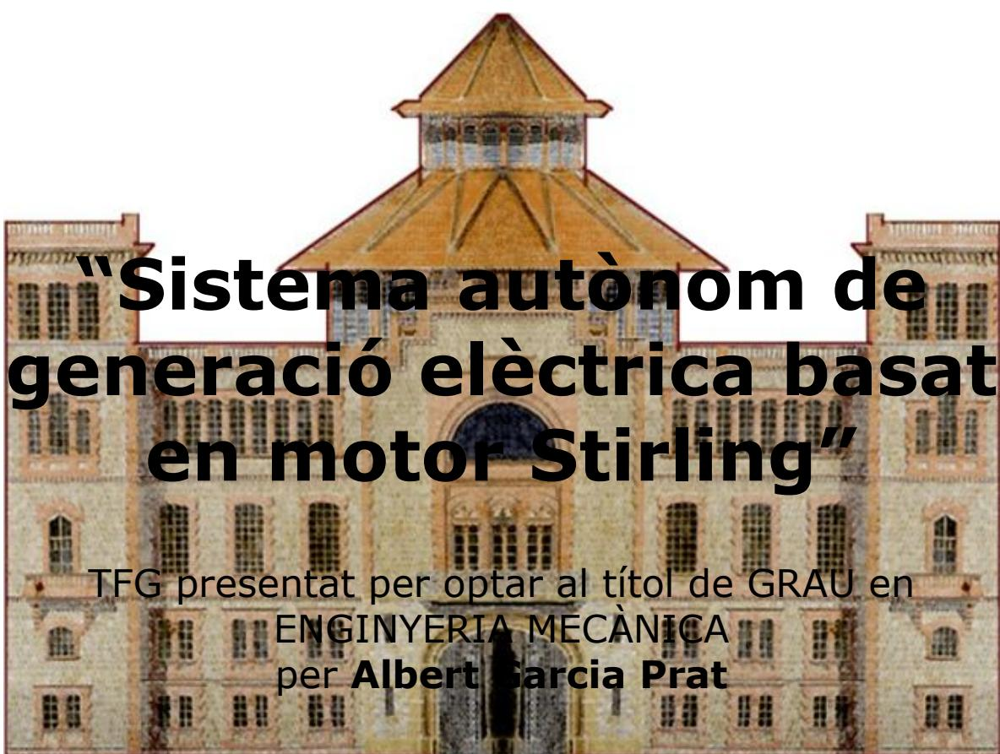

巴塞罗那,2013 年 6 月 10 日

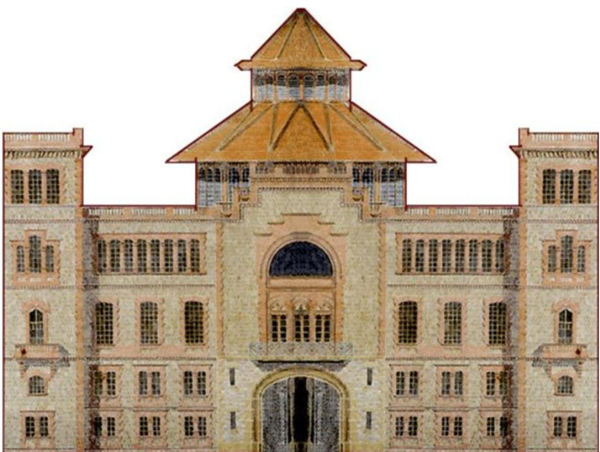

# 报告目录

第1章:引言..   
第2章:Dymola.. 5   
2.1. 建模. 6   
2.2. 仿真. . .8   
第3章:斯特林发动机 11   
3.1. 斯特林发动机的构型类型. .. 11   
3.1.1. Alpha 构型:. 11   
3.1.2. Beta 构型:. .12   
3.1.3. Gamma 构型: 12   
3.2. 热力循环. 13   
3.3. 工作原理. . .14   
3.4. 模型. 16   
3.4.1. 机械模型. .16   
3.4.2. 热力学模型. 27   
3.4.3. 在热力学模型中引入回热器. ..55   
第4章:主要设计参数... ..61   
第5章:未来改进. ..71   
5.1. 总传热系数的确定....... 71   
5.2. 冷却系统与加热系统的确定....... 75   
5.3. 用户/程序交互的便利化.. .75   
第6章:结论.. .76   
第7章:参考文献. .77

# 摘要

本文介绍了一项研究,借助该研究,感兴趣的人员可以通过仿真来设计和研究斯特林发动机,以便获得足够的信息来决定是否着手建造真实原型。该工具基于 Dymola 软件开发,由于系统中涉及的方程分析是相同的,因此这些方程也可以在其他环境中进行编程。

# 西班牙语摘要

本文介绍了一项研究,通过该研究,感兴趣的人员可以借助仿真来设计和研究斯特林发动机,以便获得足够的信息来决定是否继续进行真实原型的建造。该工具基于 Dymola 软件开发,由于系统中涉及的方程分析是相同的,因此这些方程也可以在任何其他环境中进行编程。

# 英文摘要

本文介绍了一项研究,感兴趣的人员可以借助仿真来设计和研究斯特林发动机,从而获得足够的信息以决定是否继续建造真实原型。该工具基于 Dymola 软件开发,由于系统中涉及的方程分析是相同的,因此这些方程也可以在任何其他环境中进行编程。

"基于斯特林发动机的自主发电系统"

"我感谢能够就自己选定的课题完成毕业设计的机会,感谢加泰罗尼亚理工大学为其实施所提供的条件,以及导师给予的指导、支持与帮助。

同时感谢家人和朋友在研究过程中充满期待与挫折的时刻给予我的支持"。

# 第1章 引言

在本毕业设计中,目标是研究基于斯特林发动机的发电系统的构建。

为了实现该系统的构建,将在一个名为 Dymola 的计算仿真软件中对其进行研究。该软件通过应用数值方法来求解系统方程,从而保证其结果具有较高的可靠性。使用该软件使我们能够开展比迄今所用方法更加广泛和精确的研究。在完成发动机工作过程的编程之后,我们将以其中一项已知研究所获得的结果为起点,将其作为开始用 Dymola 进行仿真的参考。

斯特林发动机可以利用大量的热源工作,我们最初将不研究这些热源,而将研究重点放在利用上述软件进行发动机本身的设计与构建上,因为一旦完成了一台高效率发动机的设计,它就可以与几乎所有可用的热源相耦合。

需要预先掌握关于 Dymola 的使用与编程的知识,以及发动机的热力学和机械工作原理。

目前,斯特林发动机的研究尚未得到充分发展,因为我们已十分适应传统的发动机和燃料,尽管如今已开始出现使用可再生能源和节约能源的趋势。其主要研究目标是应用于偏远孤立地区的小型发电站。如果其研究进展顺利,其应用可能会有市场。

电力……基于斯特林发动机"

# 第2章 DYMOLA

Dymola 是由瑞典公司 Dassault Systèmes AB 开发的软件,是用于复杂系统建模与仿真的完整工具。它使我们能够对系统的动态行为以及系统之间的相互作用进行仿真,涵盖机械、电气、热力学、控制系统等多个工程领域。

Dymola 基于开放的 Modelica 语言,这意味着用户拥有上述各个工程领域的模型库,可以对其进行修改或利用,以创建自己要研究的新系统。接下来,我们将描述用于创建这些模型的建模环境,以及用于研究这些模型的仿真环境。

为了充分发挥 Dymola 的全部潜力,还需要安装一个编译器,例如 C++、Visual Studio,可以是 2008 版或 2010 版,这两个版本都可以在 Microsoft Windows 的网页上免费获取。这将使 Dymola 能够执行 3D 可视化层面的仿真,并对系统应用数学求解。

这些仿真将在加泰罗尼亚理工大学提供的一台计算机上安装的教育许可版 Dymola 中运行,该计算机为我们提供了比普通计算机更强大的仿真资源,因为其性能或技术特性更高。

**这台名为 PC186 的机器的特性如下:**

PC186 SGI-H2106,其主板配备四个 CPU(AMD OPTERON 6140),每个 CPU 有 8 个核心。总共配备 64 GB 内存。目前有一个 1 TB 的主硬盘(采用 RAID 1,出于安全考虑与一个具有相同特性的硬盘互为镜像),以及两个 2 TB 的副硬盘,总存储容量达 5 TB。

安装了 Ubuntu 11.04 版本的 Linux 系统。

与 AMD Opteron 6140 相关的 CPU
<table><tr><td rowspan=1 colspan=8>与 AMD Opteron 6140 相关的 CPU</td></tr><tr><td rowspan=1 colspan=1>型号</td><td rowspan=1 colspan=1>核心/线程</td><td rowspan=1 colspan=1>频率</td><td rowspan=1 colspan=1>L3 缓存</td><td rowspan=1 colspan=1>多处理器</td><td rowspan=1 colspan=1>TDP</td><td rowspan=1 colspan=1>特性</td><td rowspan=1 colspan=1>价格</td></tr><tr><td rowspan=1 colspan=1>Opteron 6140</td><td rowspan=1 colspan=1>8/ 8</td><td rowspan=1 colspan=1>2.6 GHz</td><td rowspan=1 colspan=1>12 MB</td><td rowspan=1 colspan=1>4</td><td rowspan=1 colspan=1>115 瓦</td><td rowspan=1 colspan=1></td><td rowspan=1 colspan=1>$989</td></tr></table>

图 1 PC186 的 CPU 特性。

## 2.1. 建模。

除了通过 Dymola 进行建模之外，Dymola 还可以与其他模型创建程序（如 Simulink 或 CAD 设计程序）相链接，并导出我们希望应用到我们模型中的模型或设计。

Dymola 拥有一个非常动态的建模环境，它允许通过多种途径创建、修改和交互模型。为了更容易地理解这些途径，我们将建模环境分为六个部分。

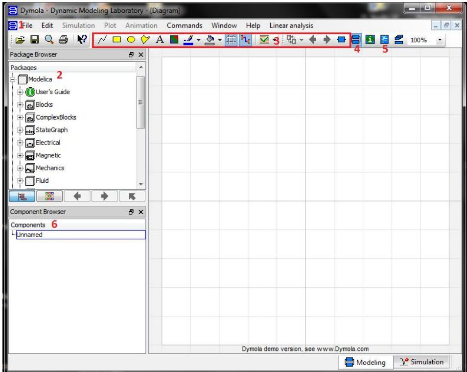  
图 2 Dymola 建模环境。

基于斯特林发动机的电力

**1. 文件 (File)。**

除了可以对文件进行基本操作（如保存、复制等）之外，如果我们转到 File->New->，可以选择要创建哪个文件或系统组件：模型或复杂系统¹、系统连接器、系统函数、模型库或组件库等。

**2. 库 (Packages, Modelica)**

在这里我们可以找到 Dymola 已创建的、涉及多个工程领域的组件和模型库。用户可以将其用于创建自己的系统，或修改现有的库以使其适应自身需求。

**3. 设计区域**

顾名思义，这里是我们可以为正在创建的组件或模型赋予图形化外观的地方。通过组合位于设计区域图标旁的工具栏中的元素，我们可以为文件或复杂系统赋予一个图像，帮助以直观的方式识别其可能的功能。

**4. 交互区域**

我们将程序的这一部分称为交互区域，因为在这里我们可以直观地添加系统的组件（变量、函数、连接器等）或复杂系统的组件（模型、初始条件、连接器等），并创建它们之间的连接。

**5. 代码区域。**

该软件部分以 Modelica 语言收集了在设计和交互区域中对正在创建的组件或模型所做的所有操作。它还允许以手动方式（即通过输入代码）添加组件或模型的特性，这些特性有助于更好地描述其行为，例如变量、方程、连接、初始条件等。

为了能够很好地理解本报告中所解释的概念，需要正确定义以下概念：

参数：Dymola 在仿真期间将其解释为常量的变量，因此 Dymola 会知道该变量关于时间的导数为零。

变量：顾名思义，它指的是一个会根据系统的情况或演变而改变大小的值。需要向 Dymola 指定其关于时间的导数是什么，以便 Dymola 能够逐步确定其新的数值。

初始条件：我们可以对随时间变化的变量定义的一种特性，用于向 Dymola 提供该变量初始状态的信息，以便我们和 Dymola 都能判断系统的演变是否正确。这些初始条件就是我们看到的定义在变量旁的 "start="。此外，我们还可以向 Dymola 指定：我们为其定义了初始条件的变量在初始时刻是必须达到该值，还是该值仅仅是一个指示性的量，表示系统启动时该变量应当取值的大小。这可以通过将初始条件标记为确定（=True）或指示性（=Inherited）来实现。

**6. 组件 (Unnamed)。**

在这里我们可以快速、有条理地访问和查看复杂系统的模型，以及构成它的每个模型的组件。

建模部分中有一个尚未提及但非常有用的工具，即信息图标（我们可以查阅它以查看所选组件功能的描述，以及其变量的定义和相应单位。这在理解稍后我们将看到的、被复用的机械模型组件方面给了我们很大帮助。

## 2.2. 仿真。

软件的这部分也支持从其他程序导出到建模部分的模型，因此不仅可以运行动画 CAD，还可以运行并非仅在 Dymola 中制作的 CAD 动画。该环境还为我们提供了将系统结果（或者，如果我们愿意，将我们感兴趣研究的变量）导出到其他数据处理或数据解读程序的可能性。

Dymola 的仿真环境提供了多种可视化系统演变结果的方式，并提供了多种用于求解这些系统的数值方法。为了理解如何进行所需的可视化、如何选择要应用的数值方法以及系统的研究时间，我们将仿真环境分为六个部分。

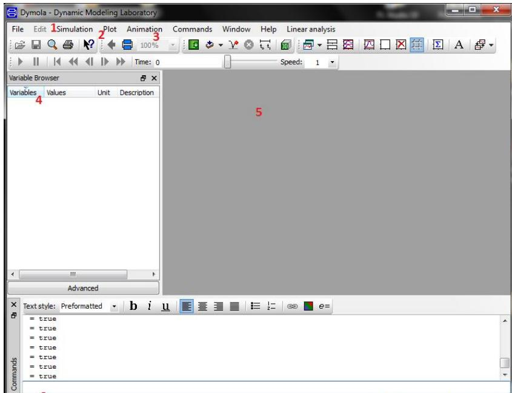  
图 3 Dymola 仿真环境。

• 仿真菜单 (Simulation)。

在该菜单内部，我们可以找到多种应用于系统及其读取的功能选项，但我们将重点关注其中与我们相关的两个：

a) 仿真 (Simulate)：对系统进行仿真并根据 Dymola 默认检测到的数值方法求解系统（如果我们没有指定使用其他方法的话）的功能。

b) 设置 (Setup)：该功能将打开一个子菜单，我们可以在其中做出如下选择：用于求解系统的数值方法（Simulate->Setup->General->Integration->Algorithm-> Dymola 可以应用的方法列表）、函数研究的时间区间（Simulate->Setup->General->Simulation interval-> 其中可以找到起始时间 (start time) 和结束时间 (stop time)），或要求 Dymola 向我们发送有关仿真错误消息的信息，以确定仿真失败的原因（Simulate->Setup->Debug-> 多种信息选项）。

**• 图形菜单 (Plot)**

顾名思义，该菜单使我们能够将想要研究的系统变量的解绘制成图形。该

菜单为我们提供了一系列用于操作图形的资源，以便我们能够以更详细的方式进行研究。

**• 动画菜单 (Animation)。**

这是 Dymola 为我们提供的另一种解的表现形式。这种表现包括模型的三维可视化，它既可以由 Dymola 本身制作，也可以由与 Dymola 兼容的某个 CAD 设计程序（例如 Solidworks）制作。这种表现的目的是帮助用户更好地理解系统的功能，并检查系统是否确实正确地执行了其功能。

**• 变量**

仿真环境中的一个区域，在这里我们可以找到系统中涉及的所有组件或模型，并从中选择想要在图形中表示的变量，或想要查看其动画的模型（如果该动画已被设计和编程）。此外，我们可以直接从这里修改定义为参数的变量的值，而无需返回建模环境，然后重新仿真以观察系统中的变化。

**• 表现区域**

在这里将打开我们希望 Dymola 为我们展现的可视化窗口。默认情况下，Dymola 总是为我们打开一个图形表现窗口，但通过访问上述任一表现菜单并选择 new window（新窗口），我们可以根据需要打开任意多个新的表现区域。

**• 消息区域**

在这个区域中，Dymola 实时向我们显示并告知仿真的情况，以及在仿真过程中发现的可能的一般性错误。随后，我们可以使用前面提到的 Debug 功能来识别错误的来源。

基于斯特林发动机的电力

# 第3章 斯特林发动机

斯特林发动机由罗伯特·斯特林于1816年发明，是一种热机，其工作原理是利用工作流体因所受温度变化而产生的体积变化。这些温度变化是通过活塞和置换器在一个封闭气缸内使流体在热区与冷区之间移动而对流体施加的。

## 3.1. 斯特林发动机的配置类型。

斯特林发动机有三种不同的配置类型，具有不同的机械设计：

### 3.1.1. Alpha（阿尔法）配置：

$$
C o n f i g u r a c i \acute { o } A I f a :
$$

由两个气缸组成，二者相位相差 90º 并通过一条管道连接，其中一个气缸内设有置换器，对其施加加热；另一个气缸内设有动力活塞，对其施加冷却。为了改善冷却效果，可以在动力活塞的气缸上设计散热片。

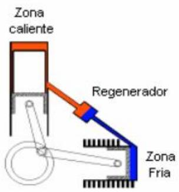  
图 4 阿尔法配置的斯特林发动机。

### 3.1.2. Beta（贝塔）配置：

在这种配置中，置换器和动力活塞共用一个气缸，这使其制造变得困难，因为其加工必须精确。空气的通过是通过在置换器与气缸之间留出间隙来实现的。

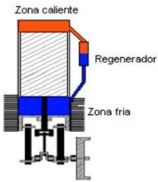  
图 5 贝塔配置的斯特林发动机。

### 3.1.3. Gamma（伽马）配置：

这种配置与贝塔配置非常相似，因为活塞的布置方式完全相同，但它们位于两个分开的气缸中。由于这种配置构造更简单，因此它提供的功率更低，因为存在更多的死容积。

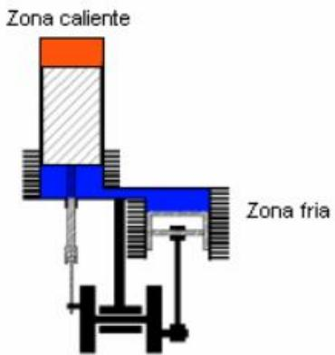  
图 4 伽马配置的斯特林发动机。

## 3.2. 热力循环。

斯特林发动机遵循的热力循环是斯特林循环。在理论上，该循环接近于卡诺最大效率，这使其成为热机中的最佳选择。尽管理论上该发动机能获得高效率，但需要指出的是，它不适合用作汽车发动机，因为其功率较低，而这些高效率是在低转速下实现的。

该循环由 4 个阶段组成，两个等容过程（一个定容加热和一个定容冷却）和两个等温过程（一个定温压缩和一个定温膨胀）。

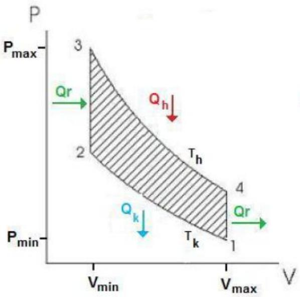  
图 5 斯特林循环。

1-2 气体在较低温度下等温压缩，向冷源放出热量。

2-3 由回热器提供的定容加热，引起压力升高。

3-4 处于最高温度的气体等温膨胀，此时气体从热源吸收热量。

4-1 定容冷却，使流体温度降低至最低温度。

## 3.3. 工作原理。

在第一个位置，动力活塞刚将力传递到轴上，因为此时循环中的压力最大。为了降低该压力，我们需要促使置换器朝其上止点运动，从而将空气推向系统的冷区，实现压力的降低。飞轮（惯性轮）将帮助我们使动力活塞重新向下运动。上止点 (PMS)

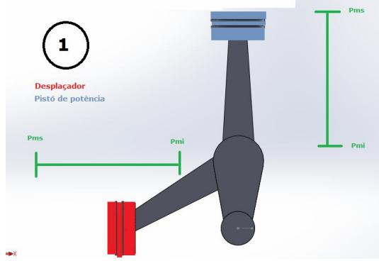  
图 6 系统压力开始降低。

在第二个位置，我们观察到置换器已到达其最高点，所有空气都移向冷区，从而通过气体的冷却降低了系统压力。

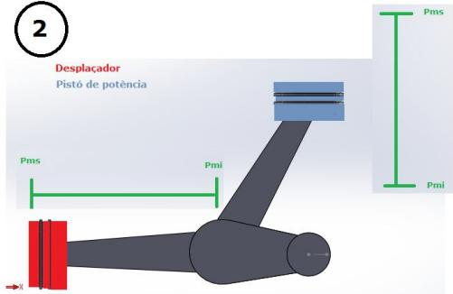  
图 7 空气的最大冷却。

在第三个位置，活塞已到达其下止点，置换器开始朝下止点下降，再次将空气引入系统的加热区。

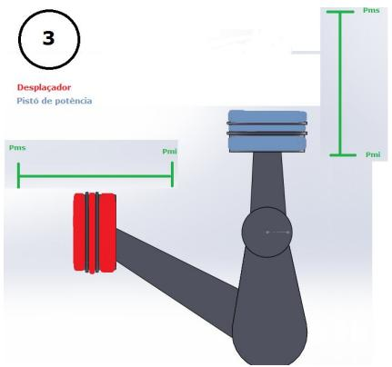  
图 8 气体开始加热。

最后，在第四个位置，所有气体都处于热区，气体再次被带到其最大压力。当压力再次升高时，与外界之间的压差将使动力活塞上升并将力传递给系统。

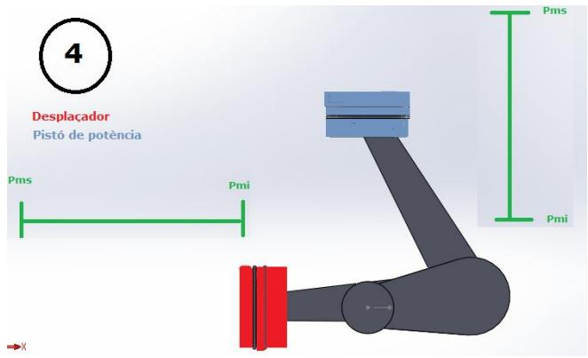  
图 9 空气的最大加热。

由于在现实中无法获得理想的传热值，且运动过程还受到其他因素的影响（这些因素在理论中未被考虑，例如摩擦热损失等），因此会损失功率和效率，从而使循环呈现出椭圆形。

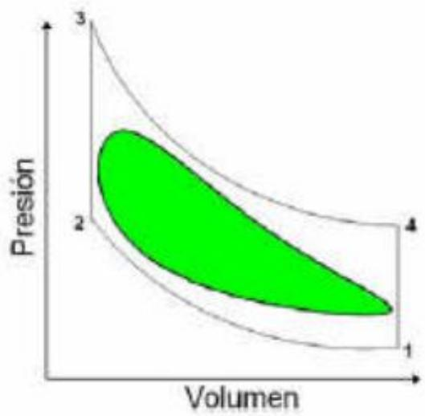  
图 10 实际斯特林循环。

## 3.4. 模型。

现在我们已经理解了发动机的工作原理，并且熟悉了该程序，可以开始着手在 Dymola 中进行其设计或实现。为了简化系统的创建与说明，我们将其划分为两个更简单的模型或子系统，分别称为：机械模型和热力学模型。

### 3.4.1. 机械模型。

顾名思义，它是负责描述系统机械部分的模型。在对该系统进行建模时，我们并未创建任何新的组件或模型，而是复用了 Dymola 中现有库的模型和组件（确切地说是 Modelica->Mechanics 中的那些）。

机械模型的功能是将热能转化为机械能，随后我们再将其转化为电能。

机械模型主要由四个组件构成：压缩活塞、膨胀活塞（或置换器）、曲轴以及气缸（或外壳）。

**• 压缩活塞。**

它是负责承受气缸内部压力的元件，该压力转化为作用在活塞上的力，进而推动整个系统运动。它位于发动机的冷端。其组成元件如下：

  
图 11 活塞的装配。

基于斯特林发动机的发电

a) 活塞头：它是活塞中最重、截面最大的部分。其上设有活塞环和活塞销。活塞环用于密封活塞与气缸之间的腔室。活塞销是使我们能够将活塞头与连杆连接起来的元件。

  
图 12 活塞头。

b) 连杆：将活塞头与曲柄销（曲拐）连接起来的元件，它将活塞头的直线运动传递给曲轴，因此该元件必须能够承受压缩和弯曲应力。设计连杆时的一个重要因素是，其长度必须为曲柄所描述的旋转直径的两倍。

  
图 13 连杆。

c) 轴承：一种连接元件，通过滚动体来减小轴与连接在其上的零件之间的摩擦。它起到支撑作用，并便于两者之间的相对运动。它们位于活塞销—连杆之间以及连杆—曲轴之间。

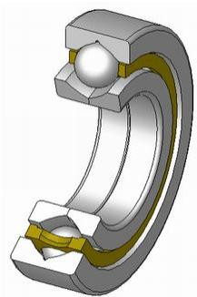  
图 14 轴承的剖视图。

**• 膨胀活塞（或置换器）。**

它是机械模型中负责将空气从一个区域移动到另一个区域的元件。由于压缩活塞将运动传递给曲轴，曲轴又将该运动相应地传递给置换器。这一运动与压缩运动具有相同的周期，但相位差为 90°，正如 β 型发动机的技术规格所规定的那样。

构成置换器的组件与动力活塞的组件相同。

**• 曲轴**

发动机中连接两个活塞的部分。它承受压缩活塞传来的爆发力，并将其转化为旋转运动。该旋转运动又以直线运动的形式传递给置换器，从而使两个活塞的位置相互关联。

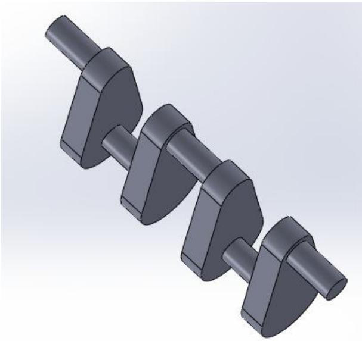  
图 15 斯特林发动机的曲轴。

**• 气缸。**

我们将气缸定义为发动机的外壳或保护元件，它负责保护发动机免受外部影响，最终确定发动机的几何形状，并将外部的热量传递给内部气体。

一旦确定了发动机的各个部分，我们就能理解整个系统的相互作用。

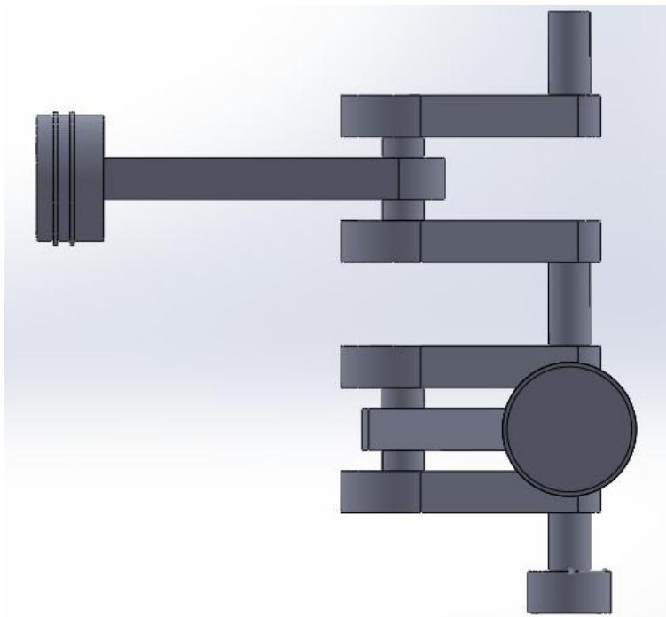  
图 16 机械配置的俯视图。

  
图 17 机械配置的侧视图。

机械模型的工作原理分析：

压力所产生的力使压缩活塞头产生直线运动，从下止点 (PMI) 运动到上止点 (PMS)，这一运动在曲轴上转化为圆周运动。

  
图 18 斯特林发动机动力活塞运动示意图

活塞头所受的力为：

$$
F = P 2 ^ { * } A 2
$$

其中：

P2= 活塞区域的压力。

A2= 压缩活塞面积。

通过对作用力进行分析，我们看到作用在压缩活塞头上的力可以描述为该力本身与压缩活塞头纵轴及其连杆之间夹角的乘积：

基于斯特林发动机的发电

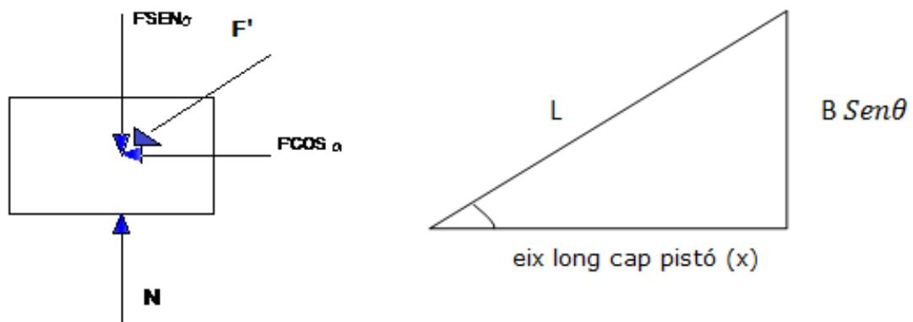  
图 19 分析截面的细节。

应用三角学，我们发现可以根据连杆和曲柄的长度来描述活塞头的纵轴：

$$
\begin{array} { c } { { x = \sqrt { l ^ { \wedge } 2 - B ^ { \wedge } 2 ^ { * } s e n ^ { \wedge } 2 \theta } } } \\ { { { } } } \\ { { x = l ^ { * } \cos \alpha } } \end{array}
$$

最后，我们知道传递到轴上的扭矩等于其所受的力与距离的乘积，因此传递到曲轴的扭矩为：

$$
T = P 2 ^ { * } A 2 ^ { * } \frac { B } { \sqrt { l ^ { \setminus } 2 - B ^ { \setminus } 2 ^ { * } s e n ^ { \setminus } 2 { \theta } } } { * ( \frac { B ^ { * } s e n ^ { \setminus } 2 { \theta } } { 2 } + s e n { \theta } ^ { * } \sqrt { l ^ { \setminus } 2 - B ^ { \setminus } 2 ^ { * } s e n ^ { \setminus } 2 { \theta } } ) }
$$

根据气缸和活塞的几何形状，设定上止点 PMS 和下止点 PMI。结合上述公式，我们就可以根据作用力描述压缩活塞的新位置，并根据压缩活塞的位置描述置换器的新位置。

在 Dymola 中实现机械模型。

Dymola 包含一个库，其中有发动机建模的示例，我们可以从中复用组件以纳入我们的斯特林发动机中。这样就避免了必须重新编写描述这些机械部件的工作和相互作用的变量、方程、连接器及其他元素。

如果我们进入 Modelica->Mechanics->MultiBody->Examples->Loops->EngineV6，我们会找到一个 V6 发动机，从中我们可以取用其中一个已经建好的活塞模型，并进行少量修改，使其适配我们发动机的动力活塞和置换器。

从库中的 V6 活塞出发，我们确定需要研究和调整的部分。

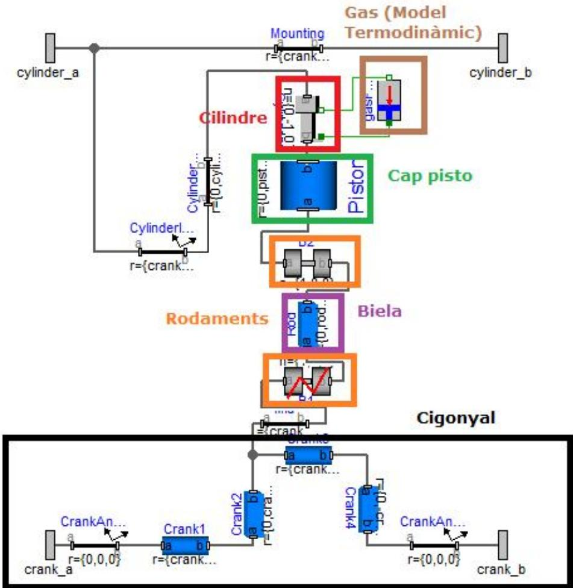  
图 20 Dymola 中建模的活塞组件。

在所有上述部分中，我们只需要修改气体部分，就能将 V6 的活塞调整为我们所需的活塞。对于动力活塞，需要用斯特林发动机相应的热力学模型来替换 V6 发动机的热力学模型。对于置换器，需要删除该模型，因为它不承受任何由压力产生的力，而只是将气体体积从一个区域移动到另一个区域（由置换器引起的体积运动，我们将在 3.4.2 节中描述的热力学模型内定义）。

我们取 V6 活塞当前所带的气体模型，将其复制到一个我们称为 ModelConnectors_Forces 的新模型中。在该模型中，我们将删除所有现有代码，并引入一个新的输入（Modelica->Blocks->Interfaces->Real Input），该输入将是斯特林循环所提供的力，我们将其等同于该气体所输出的力。我们这样做是为了利用气体模型中已经编写好的、可与机械模型其余组件相连接的连接器。


```matlab
model ModelConnectors Forces
import SI = Modelica.SIunits;
extends Modelica.Mechanics.Translational.Interfaces.PartialCompliant;
Modelica.Blocks.Interfaces.RealInput f_mt
a ;
equation
f = f_mt;
△ a ;
end ModelConnectors Forces;
```  
图 21 Model\_Connectors\_Forces 的代码。

**其中：**

f\_mt = 热力学模型传递给机械模型的输入力。

f = 机械模型中功率活塞上的合力。

在得到 ModelConnectors\_Forces 之后，我们就可以去创建 ModelMecanic\_Stirling。我们在新模型的交互区域中复制两个 V6 活塞，并进行上述修改。将功率活塞中当前的气体模型替换为所创建的 ModelConnectors\_Forces，并删除置换器中的气体模型。目前，为了能够进行一次仿真并验证新的机械系统能够运动，我们将斯特林热力学模型将要提供的力的输入，等效为一个正弦力的输入。这可以通过将一个正弦函数 (Modelica->Blocks->Sources->Sine) 连接到我们所创建的输入上来实现。这样，(临时的) ModelMecanic\_Stirling 就如下所示。

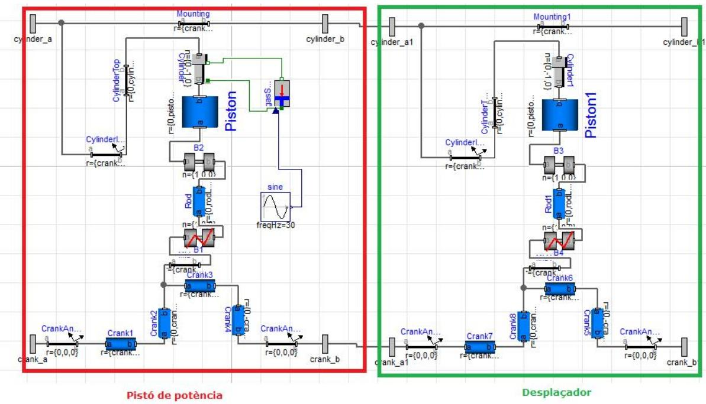  
图 22 临时 Model\_Mecànic 的交互区域视图。

还需要进行的一个小改动是，将活塞的朝向调整到所需朝向(一个活塞与另一个活塞之间相差 90º 的相位)。这可以通过将置换器气缸的倾斜参数值相对于所选定的功率活塞朝向改为 90º 来实现。我们可以通过进入 ModelMecanic\_Stirling 的代码来进行这一改动。我们将 CylinderInclination 的值调整为所需角度，然后将 CylinderInclination1 调整为 CylinderInclination+90º 的角度。

model ModelMecanic Stirling   
import SI = Modelica.SIunits;   
parameter Boolean animation=true "= true, 激活 3D 动画";   
parameter SI.Length cylinderTopPosition=0.42   
"从曲轴轴线到功率活塞气缸末端的长度";   
parameter SI.Length pistonLength=0.1   
"功率活塞头部的长度";   
parameter SI.Length rodLength=0.2 "连杆长度";   
parameter SI.Length crankLength=0.2 "曲轴在 x 方向上的长度";   
parameter SI.Length crankPinOffset=0.1 "曲柄销距中心轴线的偏移";   
parameter SI.Length crankPinLength=0.1 "曲柄销距中心轴线的偏移";   
parameter SI.Angle cylinderInclination=0   
"功率活塞气缸的倾斜角度";   
parameter SI.Angle crankAngleOffset=-90   
"功率活塞曲柄臂的倾斜角度";   
parameter SI.Length cylinderLength=cylinderTopPosition - (pistonLength +   
rodLength - crankPinOffset)   
"功率活塞气缸中的最大长度";   
parameter SI.Length cylinderTopPosition1=0.42   
"从曲轴轴线到置换器气缸末端的长度";   
parameter SI.Length pistonLength1=0.1 "置换器头部的长度";   
parameter SI.Length rodLength1=0.2 "连杆长度";   
parameter SI.Length crankLength1=0.2   
"曲轴在 x 方向上的长度";   
parameter SI.Length crankPinOffset1=0.1   
"曲柄销距中心轴线的偏移";   
parameter SI.Length crankPinLength1=0.1   
"曲柄销距中心轴线的偏移";   
parameter SI.Angle cylinderInclination1=90   
"置换器气缸的倾斜角度";   
parameter SI.Angle crankAngleOffset1=-90   
"置换器曲柄臂的倾斜角度";   
parameter SI.Length cylinderLength1=cylinderTopPosition1 - (pistonLength1 +   
rodLength1 - crankPinOffset1)   
"置换器气缸中的最大长度";  
图 23 临时 Model\_Mecànic 的代码。

在得到 ModelMecanic\_Stirling 之后，我们可以对其进行测试以验证其功能。我们创建一个新的 ModelMecanic\_Test，并将刚创建的机械模型、世界 (Modelica->Mechanics->MultiBody->World)、一个轴承 (Modelica->Mechanics->MultiBody->Joints->Revolute) 以及曲轴上的一个惯性飞轮 (Modelica->Mechanics->Rotational->Components->Inertia) 加入其中。世界将为我们提供系统的重力和参考轴，用于协调运动；而轴承将允许曲轴旋转，惯性飞轮则将稳定曲轴的旋转。

我们按如下方式进行连接：

  
图 24 ModelMecànic\_Test 的交互区域。

当我们对机械模型进行仿真时，可以通过动画和图形直观地验证，在正弦力的作用下(我们为其给定一万二千的振幅和三十赫兹的频率)，活塞之间以 90º 的相位差运动。使我们能够在图形中看到这一运动的变量是 Cilindre\_pistó\_potencia 中的 "s" 和 Cilindre\_Desplaçador 中的 "s"，它们分别对应于功率活塞和置换器的相对位置。所谓相对位置，我们理解为可用体积的长度，即同一区域中气缸体积与运动活塞体积之差。

我们将得到以下结果：  
  
图 27 活塞相对位置图。

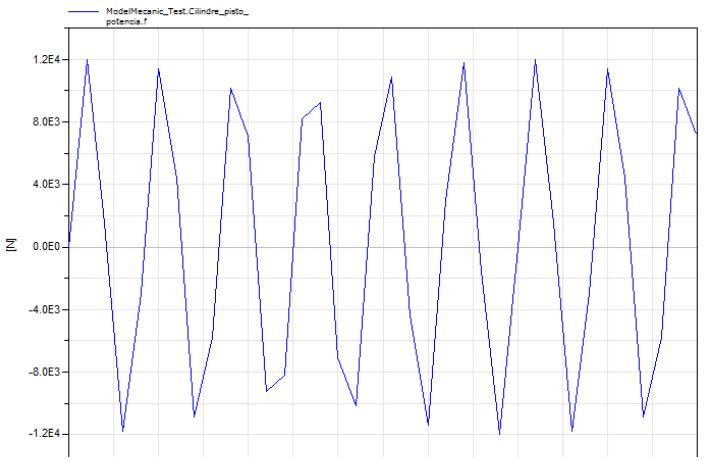  
图 28 施加在功率活塞上的力。

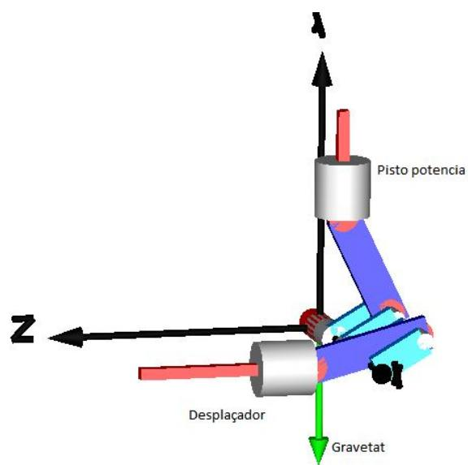  
图 29 机械模型的 3D 动画。

热力学模型是发动机最重要的部分，因为它将为我们提供力以及工作温度。这一部分是从零开始建模的，因为 Dymola 中没有任何与气体所遵循的斯特林循环相类似的模型。

为了实现这一模型，区分了两个部分。第一部分仅对质量运动进行建模，在恒定温度下，根据置换器的运动将在每个区域提供的体积来进行。第二部分则将根据每个区域中的可用体积，对相应区域质量的加热和冷却进行建模。

**• 第一部分，质量运动：**

从前面机械模型的构建出发，我们知道需要将该机械模型中活塞的位置与热模型中的活塞位置联系起来，后者将给出每个区域中的可用体积并返回一个合力。因此，我们需要一个第一个模型，我们将其命名为 ModelConnector\_Posicions\_Force，它将把这些位置的输入与热力学模型关联起来，并将该模型的力输出到机械模型。

  
图 30 ModelConnectors\_Posicions\_Forces 的代码。

其中：

u = 功率活塞相对位置的输入。

u1 = 置换器相对位置的输入。

fo = 热力学模型所提供的力的输出。

在将模型的输入和输出关联起来之后，我们继续通过创建一个名为 ModelVolums 的新模型来对体积的运动进行建模。观察机械模型研究所得的图形，我们可以看到这些位置描述的是彼此相差 90º 相位的正弦运动，其中置换器处于其最大位置，而功率活塞处于其最大位置的一半。由于目前我们分别研究这些模型，我们将把这些位置的输入设定为一个常数，乘以时间，再将其转换为正弦曲线，并将其中一条相对于另一条移相 90º(π/2)。

这些运动描述如下：

  
图 31 ModelVolums 位置输入的代码。


对正弦函数的值加 1，使其全部为正，并将两个输入的值除以 10，以将数值的幅度调整到一个更符合实际的值。因此，一旦我们知道如何描述这些相对位置，并观察机械模型的初始几何结构，就能知道我们有哪些常量参数，以及这些参数在两个模型之间是如何相互关联的。

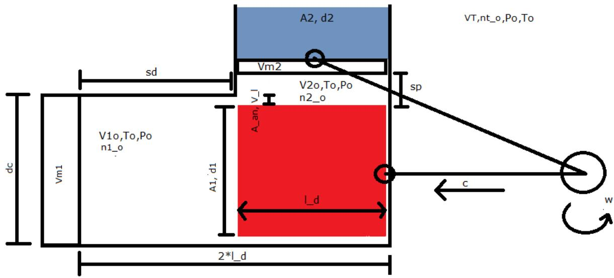  
图 32 模型配置示意图。

这样，我们还可以设定一些初始条件，以帮助启动热力学模型的仿真，并判断该模型是否正确拟合其应当实现的期望函数。这些初始条件包括系统初始的压力和温度，它们在系统中处处相等；各区域的初始体积，它们取决于我们已经知道的初始相对位置（因为我们在机械模型中设定了它们），这些体积之和即为系统的总体积；以及各区域及整个系统中的摩尔数，由于工质为空气，我们可以通过理想气体方程求得这些摩尔数。显然，还需要包含该理想气体的某些参数。

**根据上图我们可以定义：**

几何参数：

model ModelVolums\_Only  
extends ModelConnectors Posicions Forces;  
//交换位置输入与力输出的子模型"  
import SI = Modelica.SIunits;  
//系统研究中数值恒定的参数。  
parameter .Real d1 "置换器直径";  
parameter .Real 1 d "置换器长度";  
parameter .Real d2 "动力活塞直径";  
parameter .Real dc "气缸直径";  
constant .Real pi=3.141592 "圆周率常量";  
parameter .Real A1=pi\*d1^2/4 "置换器上表面面积";  
parameter .Real A2=pi\*d2^2/4 "动力活塞上表面面积";  
parameter .Real V\_l=A\_an\*l\_d "气缸侧面的体积";  
parameter SI.Volume VT=V1o+V2o+V\_1 "系统总体积";  
parameter .Real A an=pi\*(dc^2-d1^2)/4  
"区域 1 与气缸之间可用的环形面积";  
parameter .Real Vm1 "置换器中的死容积";  
parameter .Real Vm2 "动力活塞中的死容积";

**几何参数与初始条件：**

parameter SI.ThermodynamicTemperature To = 293.15  
"系统初始温度（环境温度）";  
parameter SI.Pressure Po = 100000 "系统初始压力";  
parameter .Real n1 o=(Po\*V1o)/(R\*To)  
"初始时位于区域 1（置换器）的摩尔数";  
parameter .Real n2 o=(Po\*V2o)/(R\*To)  
"初始时位于区域 2（动力活塞）的摩尔数";  
parameter .Real nt o=(Po\*VT)/(R\*To)  
"初始时系统中总的摩尔数";  
parameter .Real V1o= Vm1 + A1\*(1+sin(3.1514/2))/10;  
parameter .Real V2o = Vm2 + A2\*(1/10) - A1\*(1+sin(3.1514/2))/10 + 2\*1 d\*A1  
"动力活塞初始体积";

理想气体参数：  
parameter .Real M=29 "内部物质（空气）的分子量";  
parameter .Real R=8314.472 "理想气体常数";  
parameter .Real cv=717 "定容比热";  
parameter .Real mu=1.33e-5 "内部气体（空气）的运动黏度";

为了最终确定其余（非常量的、参与该研究的）变量，我们分析系统的不同区域（即控制体积）。

  
图 33 热区示意图。

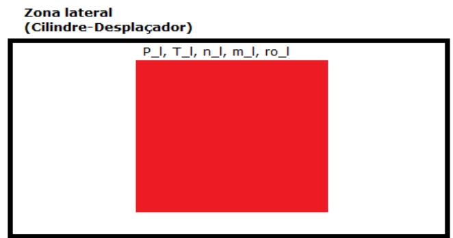  
图 34 侧部区域示意图。

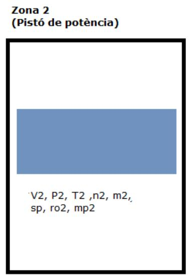  
图 35 冷区示意图。

.Real nt(start=nt\_o) "系统中的总摩尔数";  
.Real V1 "置换器中的体积";  
.Real V2 "动力活塞中的体积";  
.Real P1(start=Po) "置换器中的压力";  
.Real P2(start=Po) "动力活塞中的压力";  
.Real n2(start=n2 o) "动力活塞中的摩尔数";  
.Real n1(start=n1\_o) "置换器中的摩尔数";  
.Real n\_1(start=nt\_o-n1\_o-n2\_o) "侧部的摩尔数";  
.Real m2 "动力活塞中的质量";  
.Real m\_1 "侧部的质量";  
.Real m1 " 置换器中的质量";  
.Real mt "系统总质量";  
.Real T1(start=To) "置换器中气体（空气）的温度";  
.Real T2(start=To) "动力活塞中气体（空气）的温度";  
.Real T 1(start=To) "系统侧部气体（空气）的温度";  
.Real sp "动力活塞的相对位置";  
.Real sd "置换器的相对位置";  
.Real ro1 "区域 1（置换器）中气体（空气）的相对密度";  
.Real ro2  
"区域 2（动力活塞）中气体（空气）的相对密度";  
.Real A 1 "气缸中可用的侧部面积";  
.Real P\_1 "系统侧部的压力";  
.Real c "活塞的速度";  
.Real mp2 "区域 2 中接收能量交换的质量";  
.Real mp1 "区域 1 中接收能量交换的质量";  
.Real Rp "理想气体常数（质量单位）";  
.Real ro\_1 "侧部区域中气体（空气）的相对密度";

其中，在整个系统中我们将有一个总摩尔数（nt），它对应一个总质量（mt）。需要指出的是，变量 Rp 和 A\_l 本不必在此定义，因为它们是系统研究中的常量参数，本可以在前一小节中定义。

接下来，我们将描述支配该系统以及在其研究（或运行）过程中变量演化的方程。

**equation**

//位置输入。

$$
{ \begin{array} { l } { \displaystyle { \mathfrak { s d } } = { \frac { 1 + \sin { \left( { \mathrm { u l } } \cdot { \mathrm { t i m e } } + { \frac { 3 . 1 5 1 4 } { 2 } } \right) } } { 1 0 } } } \\ { \displaystyle { \mathfrak { s p } } = { \frac { 1 + \sin { \left( { \mathrm { u l } } \cdot { \mathrm { t i m e } } \right) } } { 1 0 } } } \end{array} }
$$

//各区域中的可用体积，取决于相应区域活塞的位置。

$$
\mathrm { W 1 } = \mathrm { V i n 1 } + \mathrm { A 1 } - \mathrm { s d }
$$

$$
\mathrm { V 2 } = \mathrm { V a } 2 + \mathrm { A } 2 \cdot \mathrm { s p } - \mathrm { A } 1 \cdot \mathrm { s d } + 2 l a \cdot \mathrm { A } 1
$$

//计算可用的侧部面积。

$$
\sqrt { 2 } 1 = \pi \cdot [ - 1 ] { 1 } - 1 =
$$

//将理想气体常数的单位由摩尔转换为质量。

$$
E _ { \mathrm { F } } = { \frac { R } { M } }
$$

//计算系统各区域中的相对密度。

$$
\bf { r o l } = \frac { P l } { R p \cdot T i }
$$

$$
\mathrm { f o z = \frac { P 2 } { R p \cdot I 2 } }
$$

$$
\mathrm { { f } } \bar { \mathbf { u } } _ { i } = \frac { P _ { i } } { \mathbb { R } \mathbf { p } \cdot \bar { T } _ { i } }
$$

//理想气体方程应用于两个区域。

$$
\mathbb { V } 1 - \mathbb { P } 1 = \pmb { \mathrm { n } } \mathbb { 1 } - \mathbb { P } - \mathbb { T } 1
$$

$$
\mathbb { V } _ { 2 } ^ { 2 } - \mathbb { P } _ { 2 } ^ { 2 } = { \bf { \sigma } } _ { 1 2 } - \mathbb { P } _ { 2 } ^ { * } - \mathbb { T } _ { 2 } ^ { 2 }
$$

//计算侧部区域的压力。

$$
\begin{array} { r } { P _ { l } = { \frac { \mathbb { P } 1 + \mathbb { P } 2 } { 2 } } } \end{array}
$$

基于斯特林发动机的电力"

//根据各区域各自的摩尔数计算系统各区域中的质量。

$$
M \cdot \mathbf { n } 2 = \mathbf { m } 2
$$

$$
M \cdot \mathbf { n } 1 = \mathbf { m } 1
$$

$$
M \cdot n _ { i } = m _ { i }
$$

//计算系统的总质量。

至此，方程的推导并不复杂，但接下来我们更详细地分析连续性方程，该方程将描述每个区域中质量的运动。这些方程针对两个区域进行描述，而 Dymola 与前面那些关联系统全部质量的方程类似，据此推导出剩余（区域）质量的演化。各区域的质量因活塞的运动而变化；每个区域中的活塞可以有两种运动：上行（从下止点 Pmi 到上止点 Pms）或下行（反之），并且在每个活塞上同时或相反地发生，因为两个活塞通过曲轴相连并错开 90°。决定每个活塞运动方向是上行还是下行的量是速度值（c）。这些质量从区域 1 转移到区域 2，途中经过侧部区域。


证明：

连续性方程；

$$
\frac { \mathrm { d } \mathrm { m } } { \mathrm { d t } } = m e - m s ;
$$

质量流量：

$$
m = c ^ { * } A ^ { * } r o ;
$$

若 c<0

对于区域 1，有 me=mq1 且 ms=0；

$$
\frac { \mathrm { d } { \mathrm { m } } 1 } { \mathrm { d t } } = m e = m q 1 ;
$$

  
图 36 下降过程中热区的质量运动。

如我们在图像中所见，进入的质量流量 (mq1) 来自侧面，因此其结果为：

$$
m q 1 = c ^ { * } A \_ a n ^ { * } r o \_ l ;
$$

对于区域 2，有 me=0 且 ms=mq2；

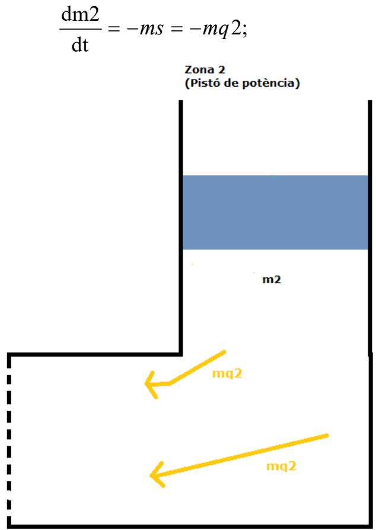  
图 37 上升过程中冷区的质量运动。

如我们在图像中所见，流出的质量流量 (mq2) 来自区域 2 本身，因此其结果为：

$$
m q 2 = c ^ { * } A \_ a n ^ { * } r o 2 ;
$$

"基于斯特林发动机的自主发电

系统"

若 c>0

对于区域 1，有 $\scriptstyle \cdot > \ m e = 0 \ i \ m s = \ m q 1$

$$
\frac { \mathrm { d } { \mathrm { m } } { \mathrm { 1 } } } { \mathrm { d t } } = - m s = - m q { \mathrm { 1 } } ;
$$

区域 1（置换器）  
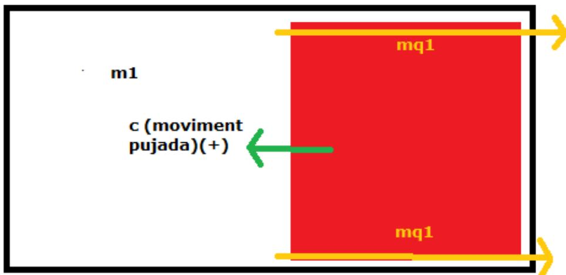  
图 38 上升过程中热区的质量运动。

如我们在图像中所见，流出的质量流量 (mq1) 来自区域 1 本身，因此其结果为：

$$
m q 1 = c ^ { * } A \_ a n ^ { * } r o 1 ;
$$

对于区域 2，有 $\scriptstyle \cdot > { \mathrm { ~ m e = m q } } 2 { \mathrm { ~ i ~ } } \ m s = 0$

$$
\frac { \mathrm { d } { \mathrm { m } } 2 } { \mathrm { d t } } { \mathrm { = } } m e = m q 2 ;
$$

  
图 39 下降过程中冷区的质量运动。

如我们在图像中所见，进入的质量流量 (mq1) 来自侧面，因此其结果为：

$$
m q 2 = c ^ { * } A \_ a n ^ { * } r o \_ l ;
$$

在 Dymola 中我们将其编写为：

//连续性方程。
//我们根据系统的运动来描述各质量流量。
if c<0 then
mp1=c\*A\_an\*ro\_1;
mp2=c\*A\_an\*ro2;
else
mp1=c\*A\_an\*ro1;
mp2=c\*A\_an\*ro\_1;
end if;

一旦我们知道了各流量将如何变化，就可以写出它们随时间的演化：

$$
\begin{array} { l } { { \exists \in \mathbb { r } \left( \mathrm { m } \mathbb { 1 } \right) = - \mathrm { m } \mathbb { E } ^ { 1 } \bar { r } } } \\ { { \mathrm { d } \in \mathbb { r } \left( \mathrm { m } \mathbb { 1 } \right) = \mathrm { m } \mathbb { E } \mathbb { 1 } - \mathrm { m } \mathbb { E } \bar { z } \bar { r } } } \end{array}
$$

各符号是根据速度来设定的。我们来检验它们是否正确。

$$
\frac { \mathrm { d } { \mathrm { m } } { \mathrm { 1 } } } { \mathrm { d t } } { = } - m q { \mathrm { l } } ;
$$

{ 若 c<0（-）→ = +mq1 = 区域 1 正在充入（质量）。

{ 若 c>0（+）→ = -mq1 = 区域 1 正在排空。

$$
\frac { \mathrm { d } { \mathrm { m } } \mathrm { ~ l } } { \mathrm { d t } } { = } m q 1 - m q 2 ;
$$

{ 若 c<0（-）→ = -mq1

{ 若 c<0（-）→ = +mq2 = 侧面区域正在充入质量 2，并朝区域 1 移动。

{ 若 c>0（+）→ = +mq1

{ 若 c>0（+）→ = -mq2 = 侧面区域正在充入质量 1，并朝区域 2 移动。

当想要研究作用于一个系统上的力时，需要建立动量方程，因为作用于系统上的力会引起动量的变化。

在该方程中，一方面有作用于流体上的外力之和，另一方面有动量的变化量。

$$
\sum F = { \frac { d e r ( m c ) } { d t } } ;
$$

作用于侧面流体上的力有：

\- 压力力，既作用于入口也作用于出口。此处采用相对压力，在本例中，由于入口与出口面积相等，所关注的正是压差。

\- 由于黏性而产生的流体与壁面之间的摩擦力。

\- 流体自身的重力，在此情况下不予考虑，因为运动是水平的，而重力影响的是竖直运动。

于是系统中作用的各力按如下方式关联：

$$
\sum F = - ( P 1 - P 2 ) ^ { * } A _ { - } a n - A _ { - } l ^ { * } \mu ^ { * } ( \frac { \frac { d e r ( s d ) } { d t } } { \frac { ( d c - d 1 ) } { 2 } } ) ;
$$

动量变化项可表示为：

$$
\frac { d e r ( m c ) } { d t } = c \ast \frac { d e r ( m ) } { d t } + m \ast \frac { d e r ( c ) } { d t } ;
$$

也可以应用雷诺输运定理，于是得到：

$$
\frac { d \big ( m c \big ) } { d t } = \frac { \hat { o } } { \hat { o } t } \int _ { v } \rho c d V + \int _ { s } c \cdot c \rho d S
$$

$$
\frac { d \left( m c \right) } { d t } = \frac { \hat { \sigma } \left( m c \right) } { \hat { \sigma } t } + \dot { m } _ { s } c _ { s } - \dot { m } _ { e } c _ { e }
$$

$$
\frac { d ( m c ) } { d t } = \frac { \hat { o } ( m c ) } { \hat { o } t } + c _ { s } A _ { s } \rho _ { l a t } c _ { s } - c _ { e } A _ { e } \rho _ { 1 } c _ { e } \qquad 0 = \frac { \hat { o } m } { \hat { o } t } + \dot { m } _ { s } - \dot { m } _ { e }
$$

将第一个表达式既视为时间的函数，同时也视为位置的函数，我们可以写为：

$$
{ \frac { { \hat { \sigma } } ( m c ) } { { \hat { \sigma } } t } } = c { \frac { { \hat { \sigma } } m } { { \hat { \sigma } } t } } + m { \frac { { \hat { \sigma } } c } { { \hat { \sigma } } t } }
$$

可以给出最终表达式

$$
\frac { d \big ( m c \big ) } { d t } = c \frac { \hat { \sigma } m } { \hat { \sigma } t } + m \frac { \hat { \sigma } c } { \hat { \sigma } t } + c _ { s } A _ { s } \rho _ { l a t } c _ { s } - c _ { e } A _ { e } \rho _ { 1 } c _ { e }
$$

加入系统的各力后得到：

$$
\sum F = c \frac {  { \partial } m } {  { \partial } t } + m \frac {  { \partial } c } {  { \partial } t } + c _ { s } A _ { s } \rho _ { { l a t } } c _ { s } - c _ { e } A _ { e } \rho _ { 1 } c _ { e }
$$

在程序中，为简化起见，未对该表达式的最后两项进行建模。

$$
- ( P 1 - P 2 ) ^ { * } { \cal A } _ { - } a n - { \cal A } _ { - } l ^ { * } \mu ^ { * } ( \frac { \frac { d e r ( s d ) } { d t } } { \frac { ( d c - d 1 ) } { 2 } } ) = c ^ { * } \frac { d e r ( m ) } { d t } + m ^ { * } \frac { d e r ( c ) } { d t } ;
$$

基于斯特林发动机的自主发电系统"

在 Dymola 中编程为：

$$
/ / ( \mathbb { P } 1 . \mathbb { P } 2 ) ^ { * } \mathbb { A } \underset { = } { \Vec { \mathbf { a } } } \mathbb { n } \mathbb { - } \mathbb { A } \_ { - } \left| ^ { * } \mathbb { n } \mathrm { u } ^ { * } ( \mathrm { d e r } ( \{ \mathrm { s d } \} / ( ( \mathrm { d c - d l } ) / 2 ) ) ) = \mathbb { c } ^ { * } \mathrm { d e r } ( \{ \mathrm { n } \} \rvert ) + \mathrm { m } \_ { - } \left| ^ { * } \mathrm { d e r } ( \{ \mathrm { c } \} ; \mathrm { n } \right) \right| ^ { * } ,
$$

$$
\left| \mathbb { P } 1 - \mathbb { P } 2 \right| \mathcal { A } _ { \sf 3 / 1 } - \mathcal { A } _ { l } - \mu \left| \frac { \mathrm { ~ d ~ s d ~ } } { \mathrm { ~ d ~ } t } \right| = m _ { l } - \frac { \mathrm { ~ d ~ } c } { \mathrm { ~ d ~ } t }
$$

//由于没有加热，各温度保持恒定。

$$
\frac { \mathrm { ~ d ~ T ~ 1 ~ } } { \mathrm { ~ d ~ } t } = 0
$$

$$
\frac { \mathrm { ~ d ~ T ~ Z ~ } } { \mathrm { ~ d ~ } t } = 0
$$

$$
\frac { \mathrm { d } T _ { l } } { \mathrm { d } t } = 0
$$

而作用在动力活塞上的力 $\textsf { e s }$ 该区域的压力减去大气压力，再乘以所作用在其上的面积。

$$
\begin{array} { r l } & { \mathrm { / / F o r g e ~ g u s e ~ \underline { { \Sigma } } e g e ~ \in \mathbb { Z } ^ \nu ~ \ p i . e t o ~ \underline { { \Sigma } } e g e ~ \underline { { \Sigma } } e g e t e ~ f i n c i . e . } } \\ & { \mathrm { ~ \underline { { \Sigma } } ~ = ~ \Gamma ( \mathbb { E } / \hat { z } - \mathbb { E } o ) \mapsto \hat { \underline { { \Sigma } } } e ~ \hat { z } ~ ; } } \end{array}
$$

$$

一旦我们定义好了整个 ModelVolums,便开始对其进行测试。我们创建一个名为 ModelVolums\_Test 的新模型,其中只需添加一个相当于相对位置值的常量以及我们刚刚建模的 ModelVolums。

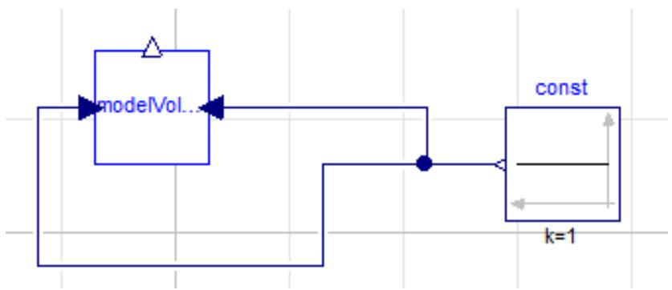  
图 40 ModelVolums\_Test 的交互区域

在仿真之前,我们必须输入以下值,并将以下初始条件 (P1、n1、n2、nt) 设为固定值。

```matlab
model ModelVolums Test
Modelica.Blocks.Sources.Constant const(k=1)
a ;
ModelVolums
modelVolums (
d1= 0.15,
1_d=0.1,
d2= 0.12,
dc=0.18,
P1 (fixed=true),
n1 (fixed=true),
n2 (fixed=true),
nt (fixed=true))
a ;
equation
connect(const.y, modelVolums_Bo.u1) a;
connect(const.y, modelVolums_Bo.u) a;
a;
end ModelVolums_Test_Only;
```

**图 41. 带有参数和初始条件的 ModelVolums\_Test 代码。**

通过该测试,我们可以从图形上验证体积如何随位置变化、质量如何随这些体积变化,以及模型输出一个合力。

电力,基于斯特林发动机"


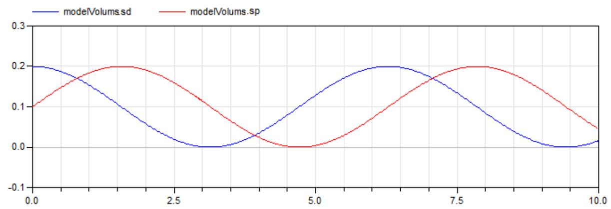  
图 42 体积随位置的变化。


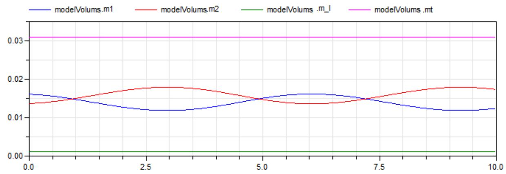  
图 43 质量随可用体积的变化。

  
图 44 施加在功率活塞上的力。

**• 第二部分,加热:**

现在我们在 ModelVolums 中加入系统的加热和冷却。我们重新分析系统,加入这些新过程,以查看有哪些新的参数和变量。

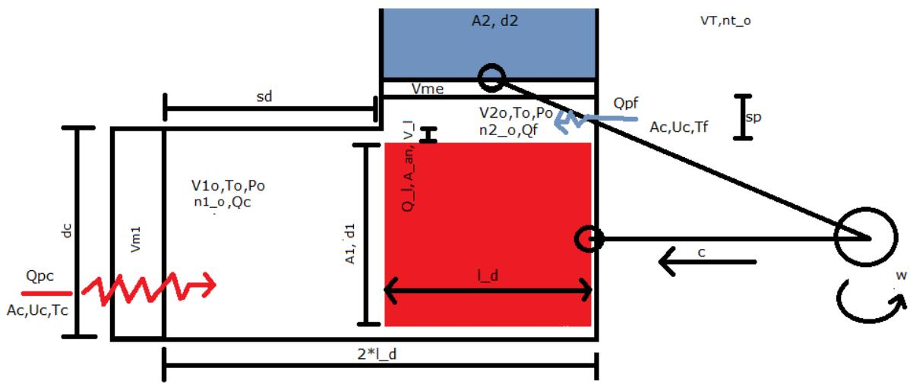  
图 45 参与系统的加热和冷却。

观察该图,我们可以看到有两个新参数和九个新变量要加入 ModelVolums,但放在一个新模型中,我们称之为 ModelTermodinamic。

我们按如下方式对它们进行编程:

parameter .Real Uc
"总传热系数(热区或区域 1)";
parameter .Real Uf "总传热系数(冷区或区域 2)";
.Real Ac "置换器中的传热面积";
.Real Af "功率活塞中的传热面积";
.Real Qc( start=n1 o\*M\*cv\*To)
"置换器中交换的热量(加热)";
.Real Qf( start=n2 o\*M\*cv\*To)
"功率活塞中交换的热量(冷却)";
.Real Q 1( start=(nt o-n1 o-n2 o)\*M\*cv\*To)
"侧壁中交换的热量";
.Real Qpc "用于加热区域 1 壁面的热量";
.Real Qpf "用于冷却区域 2 壁面的热量";

需要说明的是,Ac 和 Af 也可以定义为参数,因为它们是常量。每个区域的热量需要初始条件,因为它们处于初始温度并具有初始质量。最后我们看到,这里列出了十一个新变量中的九个,还缺少加热和冷却温度;这些被建模为新 ModelTermodinàmic 的输入,以便后续能够根据系统中采用的加热和冷却类型对其进行调整。

由于有了两个新的输入,我们还需要将 ModelConnectors\_Posicions\_Forces 替换为一个包含这些输入的新模型,我们称之为 ModelConnectors\_Posicions\_Temperatures\_Forces。

partial model ModelConnectors\_Posicions\_Temperatures\_Forces
Modelica.Blocks.Interfaces.RealInput u
"功率活塞在气缸中的位置"
a;
Modelica.Blocks.Interfaces.RealInput u1
"置换器在气缸中的位置"
a ;
Modelica.Blocks.Interfaces.RealOutput fo
"气体传递给功率活塞的力"
Modelica.Blocks.Interfaces.RealInput u2
"置换器的加热温度"
Modelica.Blocks.Interfaces.RealInput u3
"功率活塞的冷却温度"
a ;
Modelica.SIunits.Force f "所传递力的单位(牛顿)";
equation
fo = f;
a ;
end ModelConnectors\_Posicions\_Temperatures\_Forces;

图 46 ModelConnectors\_Posicions\_Temperatures\_Forces 的代码。

一旦定义好了新的变量和输入,我们便开始编写描述系统加热和冷却以及各区域能量交换演变的方程。关于 ModelVolums 的方程,需要删除温度导数为零的部分,并引入以下内容。

从以下出发:

传热(壁面):

$$
Q = U ^ { * } A ^ { * } \Delta T ;
$$

传热(质量):

$$
Q = m ^ { * } c \nu ^ { * } T ;
$$

对于区域 1,有:

```javascript
//Transferència de calor entre 1'entorn exeterior i 1'interior de la zona 1.
Opc = Uc*Ac* (Tc-T1) ;
Ac = A1;
//Calor absorvit per la massa en la zona 1.
Qc = m1*cv*T1;
```

对于区域 2,有:

```javascript
//Transferència de calor entre 1'entorn exeterior i 1'interior de la zona 2.
Qpf = - Uf*Af*(T2-Tf); //Signe negatiu ja que la calor surt del sistema.
Af = A2;
//Calor absorvit per la massa en la zona 2.
Qf = m2*cv*T2;
```

对于侧壁区域,有:

```javascript
//Calor absorvit per la massa lateral.
Q_1 = m_1*cv*T_1;
```

其中,每个区域热量的演变取决于通过壁面进入或离开的热量以及在其中流动的质量(我们已知这些质量随活塞运动而变化)。我们来看一下系统中各区域热量的这种演变。

电力,基于斯特林发动机"

从以下出发:

$$
\frac { \mathrm { d } \mathrm { Q } } { \mathrm { d t } } { = } Q e - \mathcal { Q } s ;
$$

对于区域 1:

$$
\mathsf { S i } \mathsf { c } < 0 \mathsf { t e n i m } \to \mathsf { Q e } \mathsf { = } \mathsf { Q p c } + \mathsf { m q 1 } ^ { \ast } \mathsf { c v } ^ { \ast } \mathsf { T \_ l } \mid \mathsf { i } \mathrm { \ Q s } = 0
$$

$$
\frac { \mathrm { d } \mathrm { Q c } } { \mathrm { d t } } = Q e ;
$$

  
图 47 置换器下降期间区域 1 的热量变化。

其中,考虑到速度的符号,并已知 mq1 来自侧壁区域,最终得到:

$$
\frac { \mathrm { d } \mathrm { Q c } } { \mathrm { d t } } = Q e = Q p c - m p { \ a } ^ { * } c \nu ^ { * } T \_ l ;
$$

如果 $\mathtt { C } { > } 0$,我们有 $\scriptstyle - > \mathrm { Q e } = \mathrm { Q p c ~ i } \mathrm { Q } s = \mathsf { m q 1 } ^ { * } \mathrm { c v } ^ { * } \mathsf { T 1 }$

$$
\frac { \mathrm { d } \mathrm { Q c } } { \mathrm { d t } } = Q e - Q s ;
$$

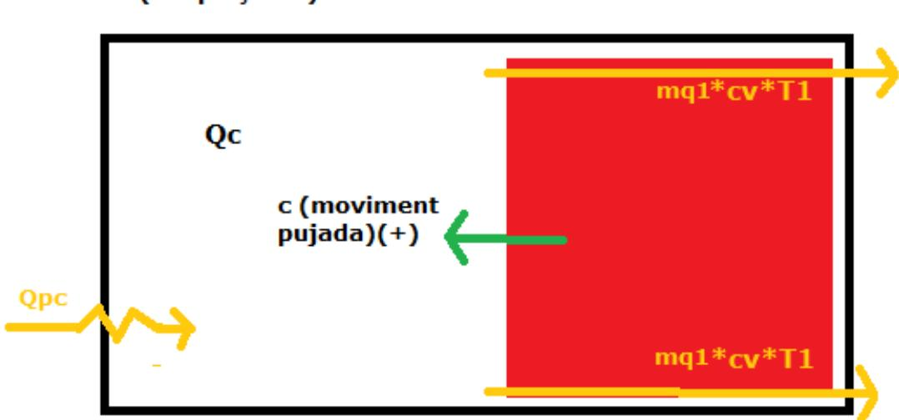  
图 48 置换器上升期间区域 1 的热量变化。

其中,考虑到速度的符号,并已知 mq1 来自区域 1,最终得到:

$$
\frac { \mathrm { d } \mathrm { Q c } } { \mathrm { d t } } = Q e - Q s = Q p c - m q 1 ^ { \ast } c \nu ^ { \ast } T 1 ;
$$

所有这些在 Dymola 中的编程方式如下:

//区域 1 的热量随系统运动的变化。
if c<0 then
der(Qc)=Qpc-mp1\*cv\*T\_1;
else
der(Qc)=Qpc-mp1\*cv\*T1;
end if;

对于区域 2:

$$
\mathsf { S i } \mathsf { c } < 0 \mathsf { t e n i m } \to \mathsf { Q e } = 0 \mathsf { i } \mathsf { Q } \mathsf { s } = \mathsf { Q p f } + \mathsf { m q } 2 ^ { * } \mathsf { c v } ^ { * } \mathsf { T } _ { - } \mathsf { I }
$$

$$
\frac { \mathrm { d Q f } } { \mathrm { d t } } = - Q s ;
$$

"自主发电


基于斯特林发动机的发电

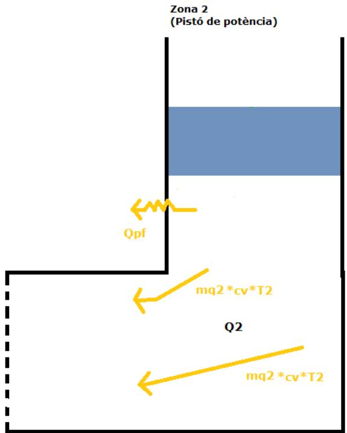  
图 49 活塞上升期间区域 2 中热量的变化。

其中考虑速度的符号、通过壁面的传热符号，并已知 mq2 来自区域 $2 .$，最终我们得到：

$$
\frac { \mathrm { d Q f } } { \mathrm { d t } } = - Q s = Q p f + m q 2 ^ { * } c \nu ^ { * } T 2 ;
$$

若 c>0，我们有 $\ b { \Sigma } > \mathrm { Q e } = \boldsymbol { \Pi } \ b { \mathrm { q } } \ b { 2 } ^ { * } \ b { \mathrm { C V } } ^ { * } \ b { \mathrm { T } } \_ { \mathrm { l } } \mathrm { ~ i ~ } \ b { \mathrm { Q } } \ b { \mathrm { s } } = \ b { \mathrm { Q p f } }$

$$
\frac { \mathrm { d } { \mathrm { Q f } } } { \mathrm { d t } } = Q e - Q s ;
$$

  
图 50 活塞下降期间区域 2 中热量的变化。

其中考虑速度的符号、通过壁面的传热符号，并已知 mq2 来自侧区，最终我们得到：

$$
\frac { \mathrm { d } \mathrm { Q f } } { \mathrm { d t } } { = } Q e - Q s = Q p f + m q 2 ^ { * } c \nu ^ { * } T \_ l ;
$$

在 Dymola 中编程如下：

```c
//Variació del calor en la zona 2 en funció del moviment del sistema.
if c<0 then
der(Qf)=Qpf+mp2*cv*T2;
else
der(Qf)=Qpf+mp2*cv*T_1;
end if;
```

对于侧区：

$$
\mathrm { S i ~ c < 0 ~ t e n i m ~  ~ Q e = m q 2 ^ { * } c v ^ { * } T 2 ~ i ~ Q s = \ m q 1 ^ { * } c v ^ { * } T \_ l }
$$

$$
\frac { \mathrm { d } \mathrm { Q } \mathrm { ~ l ~ } } { \mathrm { d t } } = { Q } e - { Q } s ;
$$

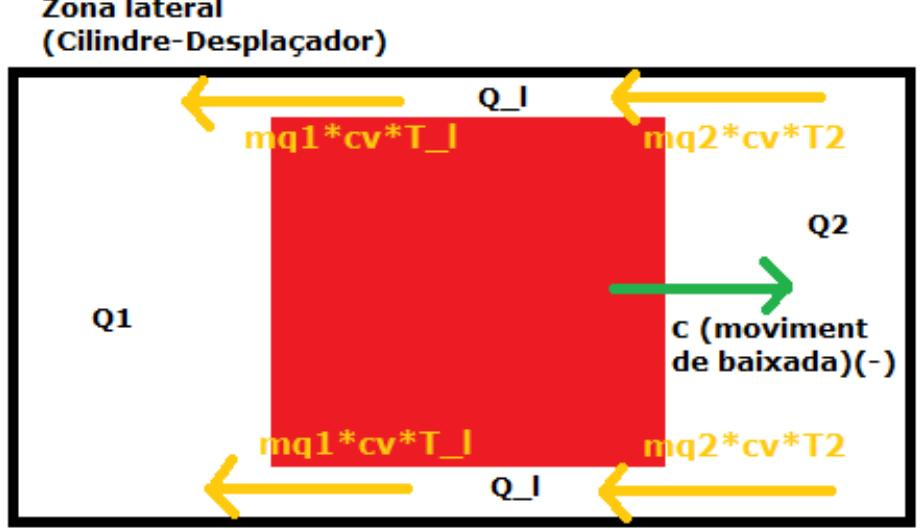  
图 51 置换器下降期间侧区中热量的变化。

其中考虑速度的负号，我们得到：

$$
\frac { \mathrm { d } \mathrm { Q } \_ { } } { \mathrm { d t } } = Q e - Q s = - m q 2 ^ { * } c { \nu } ^ { * } T 2 + m q 1 ^ { * } c { \nu } ^ { * } T \_ l ;
$$

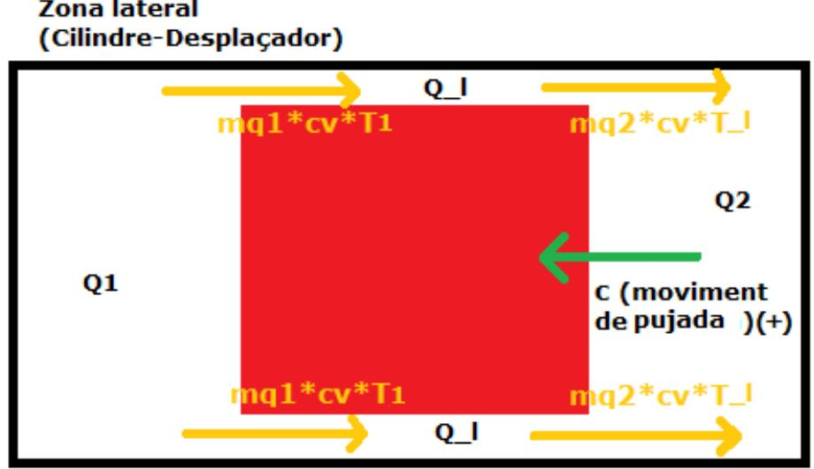  
图 52 置换器上升期间侧区中热量的变化。

再次考虑所选取的符号约定，我们有：

$$
\frac { \mathrm { d } \mathrm { Q } \_ } { \mathrm { d t } } = Q e - Q s = - m q 2 ^ { * } c \nu ^ { * } T \_ l + m q 1 ^ { * } c \nu ^ { * } T 1 ;
$$

得到在 Dymola 中的编程：

//Variació del calor en la zona lateral en funció del moviment del sistema   
if c<0 then   
der(0 1)=-mp2\*cv\*T2+mp1\*cv\*T 1;   
else   
der(Q\_1)=-mp2\*cv\*T\_1+mp1\*cv\*T1;   
end if;

现在我们已经定义了整个热力学模型，可以验证系统各区域之间存在能量交换。为此需要创建一个新模型，我们将其命名为 ModelTermodinamic_Test，除了要测试的 ModelTermodinamic 本身之外，还要添加充当加热系统和冷却系统等效物的模型，它们将分别给出加热温度和冷却温度。

给出热端温度的模型是一个斜坡信号 (Modelica->Blocks->Sources->Ramp)，它从环境温度开始 (offset=293.73)，并在十秒内相对于该温度升高两百摄氏度 (height=200; duration=10)。冷却温度将等效为一个始终给出环境温度的常量。

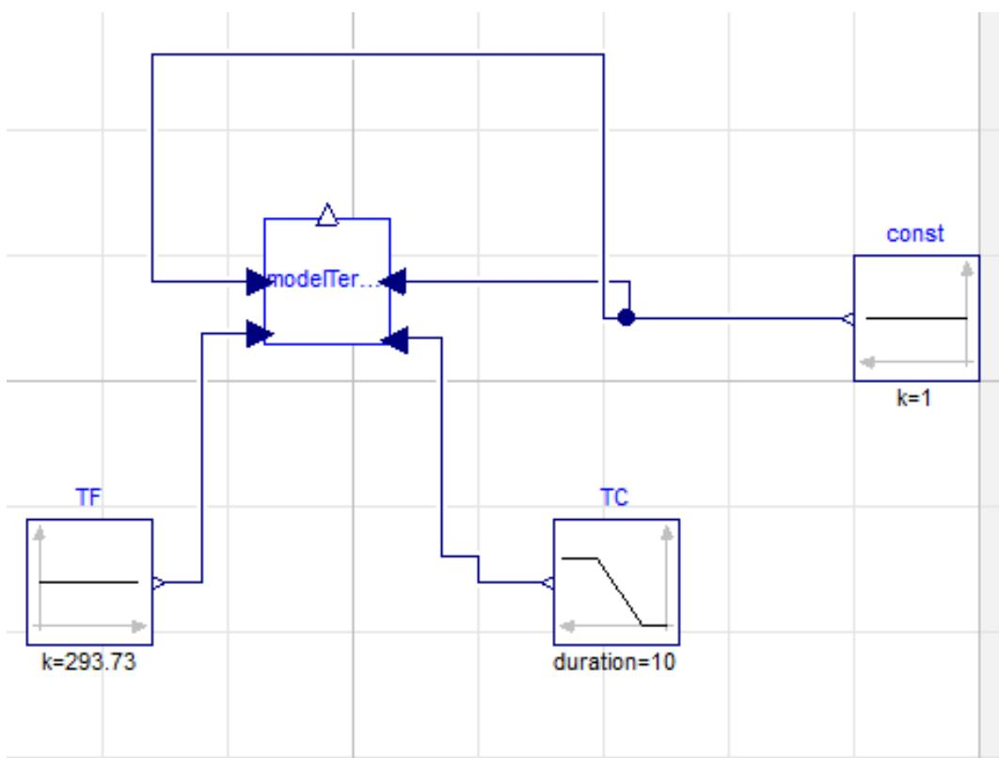  
图 53 ModelTermodinamic_Test 的交互区域。

在仿真之前，需要调整以下数值和初始条件。

```matlab
model ModelTermodinamic_Test
Modelica.Blocks.Sources.Ramp TC( duration=10,
offset=293.73,
height=200)
a ;
Modelica.Blocks.Sources.Constant TF(k=293.73)
a;
Modelica.Blocks.Sources.Constant const(k=1)
a ;
ModelTermodinamic_ Only modelTermodinamic_Only(
d1=0.15,
1_d=0.1,
d2=0.12,
dc=0.18,
P1 (fixed=true),
nt(fixed=true),
n1(fixed=true),
n2 (fixed=true),
Uc=10,
Uf=100)
a ;
equation
a ;
end ModelTermodinamic
```

图 54 带参数和初始条件的 ModelTermodinamic_Test 代码。我们可以通过图形观察到，在系统仿真期间，系统各区域的温度和热量如何随着质量从一个区域向另一个区域的运动而变化。

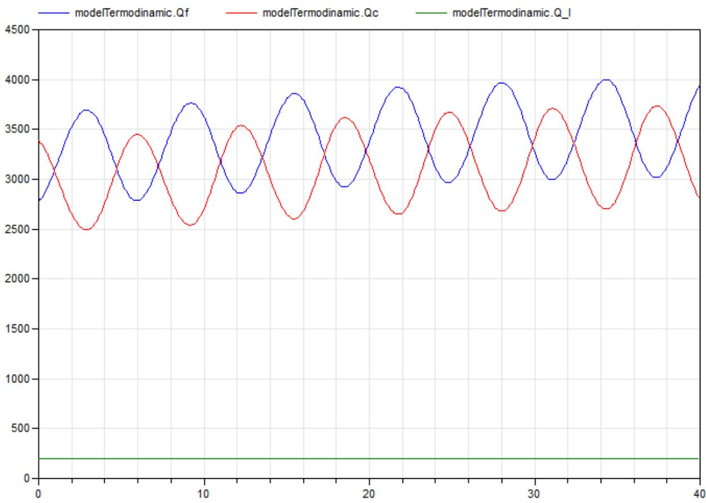  
图 55 系统中热量的变化。

Albert Garcia Prat  
  
图 56 系统壁面中热量的变化。

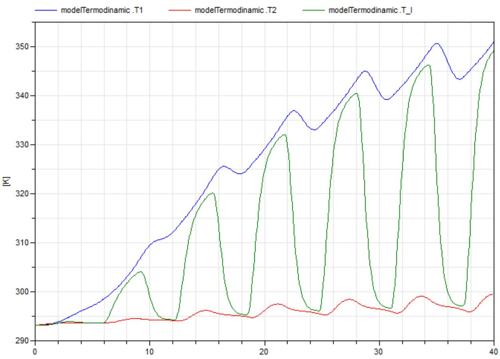  
图 57 系统温度的变化。

现在我们已经有了参与我们系统的两大模型，可以将它们耦合起来，以观察整个系统（即斯特林发动机）如何工作，并进而确定主要参数，以设计出能够输出所需机械功率以及后续电功率的发动机。

为了耦合这两个模型，我们创建一个新模型，命名为 Motor_Stirling，其中复制我们之前建立的 ModelMecanic，并做几处修改：

• 第一处修改：删除正弦函数，并在其位置连接 ModelTermodinamic。

• 第二处修改：在每个气缸上放置一个位置传感器 (Modelica->Mechanics->Translational->Sensors->PositionSensor)，它将给出功率活塞或置换器相对于其各自气缸的 "s" 即相对位置。这些传感器从气缸的连接器连接到 ModelTermodinamic 的相应输入端（功率活塞的位置连接到输入端 "u"，而置换器的位置连接到输入端 "u1"）。

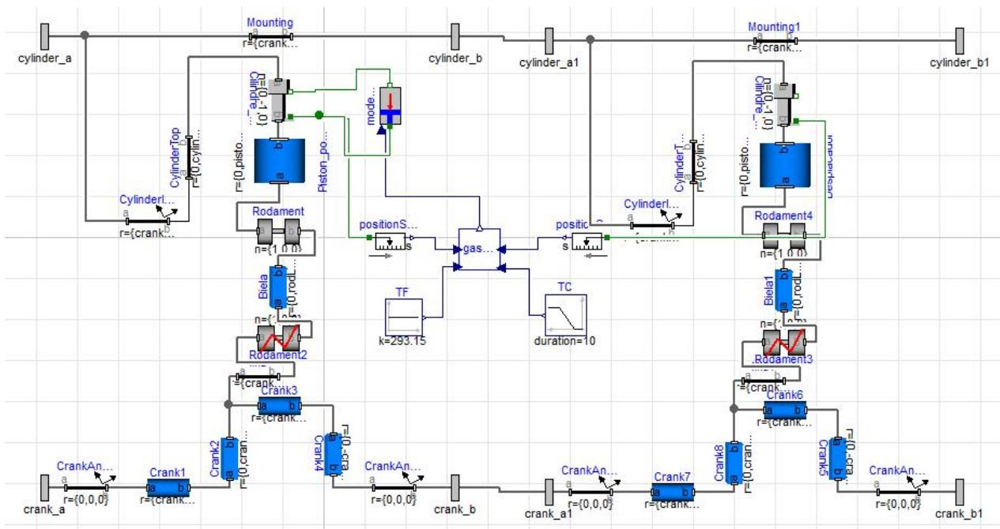  
图 58 所创建的 Motor_Stirling 的交互区域。

一旦我们完成了最终建模的 Motor_Stirling，就可以创建用于测试它的模型，其中除了包含我们为机械模型已经提到的相同资源（世界、轴承和惯性飞轮）之外，还需要添加一些额外组件以帮助发动机初始启动。我们来看看还需要添加哪些组件以及如何连接它们。

该启动系统由一个加速度源 (Modelica->Mechanics->Rotational->Sources->Accelerate) 组成，它被送入一个离合器，并通过一个斜坡信号 (Modelica->Blocks->Sources->Ramp) 激活；该斜坡信号在仿真开始三十秒后激活，以便系统充分加热，持续时间为十秒。离合器 (Modelica->Mechanics->Rotational->Components->Clutch) 从仿真一开始就与曲轴接合，负责在其持续的十秒内传递加速度，之后通过单位阶跃信号 (Modelica->Blocks->Sources->Step) 的作用与曲轴脱离，该阶跃信号将使其从激活状态变为停用状态（从值为 1 的 offset 变为相对于 offset 为 -1 的高度，在四十秒时等于零）。

为了能够测量该发动机正在输出的功率，我们在测试中添加一个功率传感器 (Modelica->Mechanics->Rotational->Sensors->PowerSensor)，它将测量输送到曲轴的功率与施加给曲轴的一个摩擦元件 (Modelica->Mechanics->Rotational->Components->Damper) 之间的合成功率。该摩擦元件的位置是固定的 (Modelica->Mechanics->Rotational->Components->Fixed)。为了获得良好的功率，规定该摩擦的值约为曲轴最大速度的百分之六十。

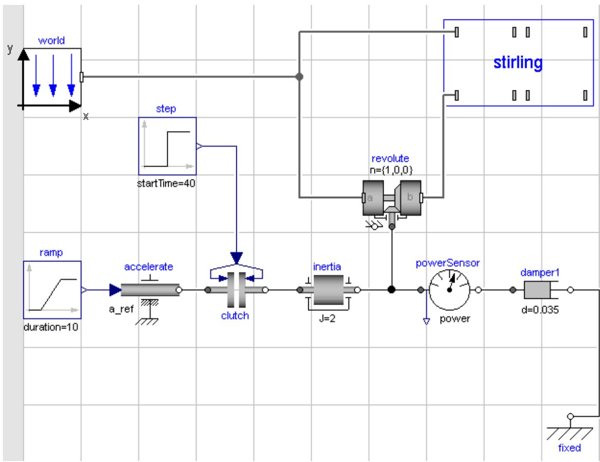  
图 59 用于测试 Motor_Stirling 的组件示例。


### 3.4.3. 将回热器纳入热力学模型。

回热器对热力循环而言是一个非常重要的部件，因为它负责吸收并向流体释放热量，从而补偿发动机中损失的一部分热量。这种补偿使得流体在每个循环中需要吸收的热量更少，从而使各循环完成的时间缩短，发动机的功率和转速得以提高。

为了充分发挥回热器的作用，我们必须牢记它在运行中两个十分重要的特性。

第一个是储存热能的能力，这一能力在体积上以流体的密度与定压比热容的乘积（ρ×Cp）来衡量，该能力值越大，回热器吸收的热量就越多。

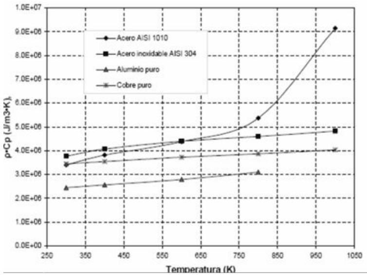  
图 60 不同材料的体积热容量。

第二个是热扩散，它衡量材料传导热能的能力相对于其储存能量的能力。为使回热器获得良好性能，我们希望该参数较小。12F-04

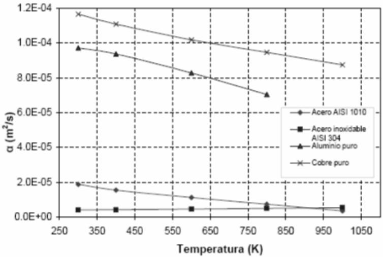  
图 61 不同材料的体积热扩散率。

下面我们将描述其工作原理及相应的编程实现。

将回热器视为位于置换器侧面的一个新系统。

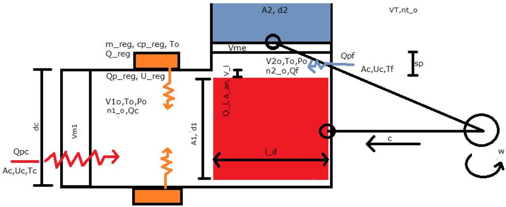

图 62 将回热器纳入系统。

我们注意到有新的变量需要纳入热力学模型。

parameter .Real m\_reg = 0.001 "回热器质量";   
parameter .Real cp\_reg = 890 "回热器比热容";   
parameter .Real U\_reg= 150 "回热器的尺寸系数   
(L-A-K) ";   
.Real T\_reg(start=To) "回热器温度";   
.Real Q\_reg( start=m\_reg\*cp\_reg\*To) "回热器中蓄积的热量";   
.Real Qp\_reg "回热器中的热量";

由以下出发：

热传递（壁面）：

$$
Q = U ^ { * } A ^ { * } \Delta T ;
$$

热传递（质量）：

$$
Q = m ^ { * } c \nu ^ { * } T ;
$$

//回热器与置换器壁面之间的热传递。   
Qp\_reg= U\_reg\*(T\_reg-T\_1);

//回热器吸收的热量。   
Q\_reg = m\_reg\*cp\_reg\*(T\_reg) ;

其中回热器的热量仅因壁面的热传递而变化。

//回热器中热量的变化。   
der(Q\_reg)=-Qp\_reg;

符号取决于 T\_I 是否大于回热器的温度。我们验证一下：

{ 若 T\_I<T\_reg (+) -> = +Qp\_reg = 它向侧面区域释放热量，因此损失热量，导数变为负值。

{ 若 T\_I>T\_reg (-) -> = -Qp\_reg = 它从侧面区域吸收热量，因此导数为正值。

分析回热器影响下侧面区域的热传递。

$$
\frac { \mathrm { d } \mathrm { Q } \mathrm { ~ l ~ } } { \mathrm { d t } } = { Q } e - { Q } s ;
$$

$$
\mathrm { S i ~ c < 0 ~ t e n i m ~  ~ Q e = m q ^ { 2 * } c v ^ { * } T 2 ~ + ~ Q p \_ r e g ~ i ~ Q s = m q 1 ^ { * } c v ^ { * } T \_ l ~ }
$$

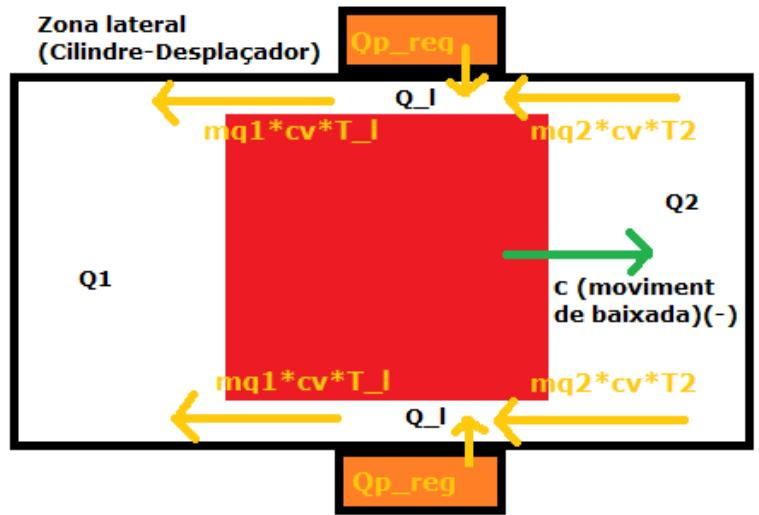  
图 63 置换器下降期间，带再生时侧面区域热量的变化。

其中考虑到速度为负号，且 T\_l 来自冷却区，其温度将低于回热器的温度。

$$
\frac { \mathrm { d } \mathrm { Q } _ { \_ } } { \mathrm { d t } } = Q e - Q s = - m q 2 ^ { * } c \nu ^ { * } T 2 + m q 1 ^ { * } c \nu ^ { * } T \_ l + Q p \_ r e g ;
$$

$$
\mathrm { S i ~ c < 0 ~ t e n i m ~ - > ~ Q e = \ m q 1 ^ { * } c v ^ { * } T 1 ~ i ~ Q s = \ m q 2 ^ { * } c v ^ { * } T \_ l + \ Q p \_ r e g }
$$

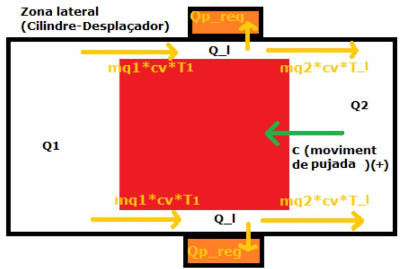  
图 64 置换器下降期间，带再生时侧面区域热量的变化。

再次考虑速度为负号，且 T\_I 来自加热区，其温度将高于回热器的温度。

$$
\frac { \mathrm { d } \mathrm { Q } _ { \_ } } { \mathrm { d t } } = Q e - Q s = - m q 2 ^ { * } c \nu ^ { * } T _ { \_ } l + m q 1 ^ { * } c \nu ^ { * } T 1 + Q p _ { \_ } r e g ;
$$

在 Dymola 中的编程如下：

//侧面区域热量的变化与系统运动的关系。   
//配备回热器的系统。   
if c<0 then   
der(Q\_1)=-mp2\*cv\*T2+mp1\*cv\*T\_1+Qp\_reg;   
else   
der(Q\_1)=-mp2\*cv\*T\_1+mp1\*cv\*T1+Qp\_reg;   
end if;

我们通过与无回热器的斯特林发动机的数值进行比较，观察回热器对循环中某些重要参数的影响。  
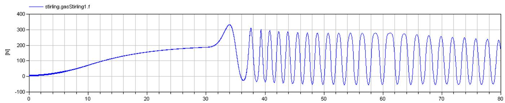

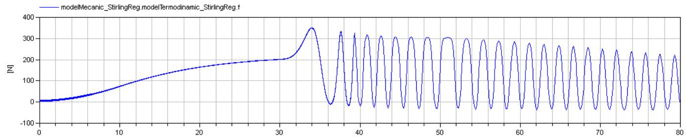  
图 65 各系统动力活塞上的力。

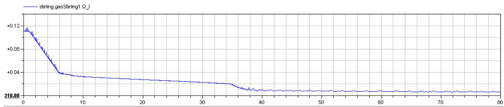

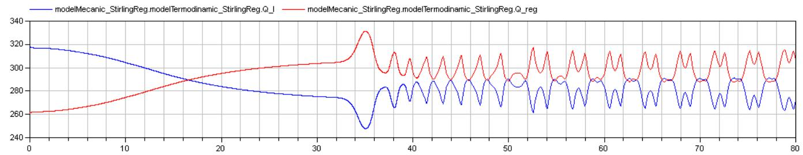  
图 66 所分析各发动机侧面区域热量的变化。

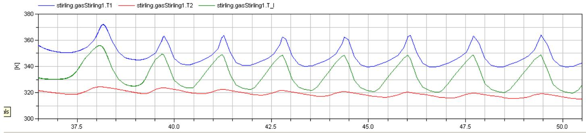

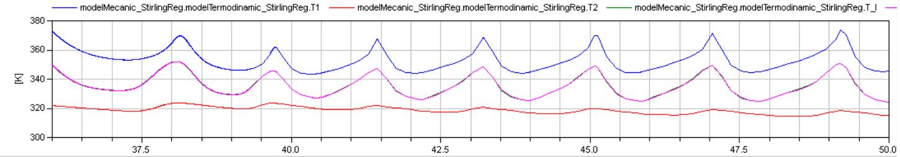  
图 67 所研究发动机不同区域温度的变化。

# 第4章 主要设计参数

斯特林发动机的主要设计参数有四个：热区与冷区之间的温度比、这两个区域之间的体积比、机构的相位差角以及发动机内部死容积之比。

在我们这种情况下，由于所选择发动机的构型，相位差角只能是 90º。

$$
t a u = \frac { \mathrm { T f } } { \mathrm { T c } } ; \qquad K p = \frac { \mathrm { V P } } { \mathrm { V D } } ; \qquad &  a l p = 9 0 ^ { \circ } ; \qquad K s = \frac { \mathrm { V S m i } } { \mathrm { V D } } ;
$$

其中：

Tf = 冷区温度 (ºK)。

Tc = 热区温度 (ºK)。

VP = 功率活塞体积 (m^3)。

alp = 活塞之间的相位差 (º)。

VSmi = 区域 i 的死容积 (m^3)。

VD = 置换器体积 (m^3)。

这些参数的最优值会随着在每种情况下所选发动机的设计而变化，因此并不存在它们的一个理想组合。它们所能让我们做到的，是根据我们希望获得的功率值以及系统中具有的温度，得到一组具有指导意义的值，作为我们发动机设计值的依据。借助下面这些关联各参数之间影响的图形，我们可以了解这些值可能波动的范围。

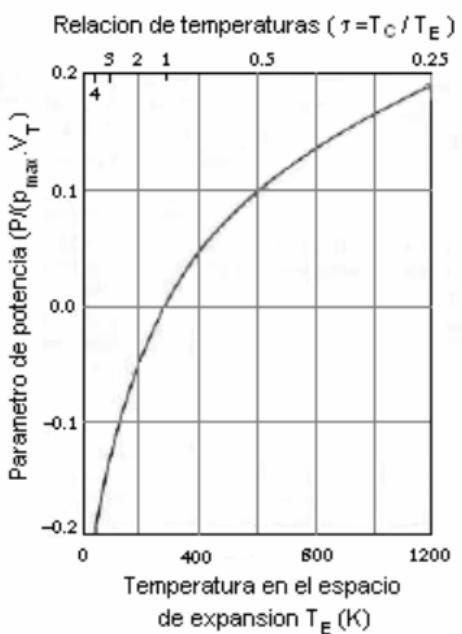  
图 68 tau 对功率的影响(其中 $K p = 0 . 8 ,$ X=1 且 $a / p = 9 0 )$

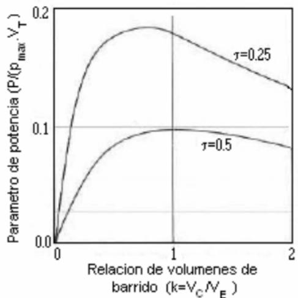  
图 69 Kp 对功率的影响(其中 $t a u { = } O . 2 5 ,$ X=1 且 alp=90)。

基于斯特林发动机的发电

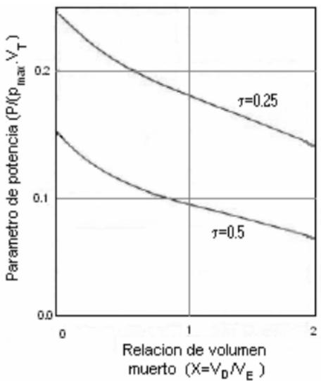  
图 70 X 对功率的影响(其中 Kp=0.8，tau=0.25 且 alp=90)。

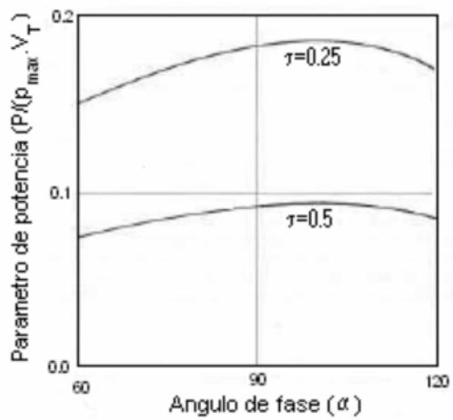  
图 71 alp 对功率的影响(其中 $K p = 0 . 8 ,$ X=1 且 tau=0.25)。

为了能够以更高效的方式研究这些值，我们编写了一段 MATLAB 小程序，其中按照 Schmidt 理论（该理论将上述参数关联在一个方程式中）计算每个循环向轴输出的净功率。随后，借助这些设计参数并已知系统的几何关系（根据所选择的构型，我们具有的最大和最小体积是多少），我们就能求出系统中被吸收和排出的热量。

Schmidt 理论方程：

$$
P S c h m i d t = \pi ^ { * } ( 1 - t a u ) ^ { * } p \operatorname* { m a x } ^ { * } V D ^ { * } { \frac { \mathrm { K p } ^ { * } \mathrm { s e n } ( \mathrm { a l p } ) } { \mathrm { Y } + { \sqrt { \mathrm { Y } ^ { 2 } - X ^ { 2 } } } } } * { \sqrt { \frac { Y - X } { Y + X } } } ;
$$

$$
X = \sqrt { ( 1 - t a u ) ^ { 2 } - 2 ^ { * } ( 1 - t a u ) ^ { * } K p ^ { * } \cos ( a l p ) + K p ^ { 2 } } ;
$$

$$
Y = 1 + t a u + \frac { 4 ^ { * } K s ^ { * } t a u } { 1 + t a u } + K p ;
$$

$$
p \operatorname* { m a x } = p m ^ { * } { \sqrt { \frac { Y + X } { Y - X } } } ;
$$

$$
P i = F ^ { * } P s c h m i d t \ ^ { * } f ;
$$

其中：

PSchmidt = 每个循环的扭矩 $( \mathsf { N } ^ { * } \mathsf { m } )$

Pmax = 循环过程中达到的最大压力 (N/m^2)。

Pm = 循环过程中的平均压力。

F = 设计修正参数(无量纲)(0.1 = 设计差；   
0.8 = 设计极佳)。

f = 频率 (Hz)。

已知根据所选构型(90º)，循环中我们将具有的最大和最小体积可近似为：

$$
V m a = V D + ( 0 . 5 ^ { * } V P ) ;
$$

$$
V m i = 0 . 5 ^ { * } V P ;
$$

一旦我们知道这些体积以及所选的工作温度，就可以求出循环中被吸收和排出的热量(每单位质量)及其效率。

$$
Q a b s = x ^ { * } C \nu ^ { * } ( T h - T l ) + R ^ { * } T h ^ { * } \log ( V \operatorname* { m a x } / V \operatorname* { m i n } ) ;
$$

$$
Q e x t r = x ^ { * } C \nu ^ { * } ( T l - T h ) + R ^ { * } T l ^ { * } \log ( V \operatorname* { m i n } / V \operatorname* { m a x } ) ;
$$

$$
\eta = \frac { ( T h - T l ) ^ { * } R ^ { * } \log ( V \operatorname* { m a x } / V \operatorname* { m i n } ) } { Q a b s } ;
$$

最后，实际功率为：

$$
\mathrm { P r } e a l = P i ^ { * } \eta ;
$$

我们来看它在 MATLAB 中的编程实现：

```matlab
sDefinim la funció on primer trobem els valors que volem que aquesta funció
%ens retorni i despres el nom de la funció.
function [Qabs, Qext, Ks, rnd, Preal, DP, DD, VSmi, VD, VP, LD, LP, Vma, Vmi]= PreStirling
%Paràmetres d'entrada amb lesseves respectives unitats unitats.
disp ('VP (m^3), f (Hz), Th (°K), T1 (°K), Pmit (PA) ') ;
VP=input('introdueix el valor del volum del pistó de potència VP= ');
f=input('introdueix el valor de la freqüència f=');
Th=input('introdueix el valor de la temperatura escalfament Th=');
Tl=input('introdueix el valor de la temperatura de refredament Tl=');
Pmit=input('introdueix el valor de la pressió mitja durant el cicle Pmit=')
Kp=input('introdueix el valor de la relació de compressió (VD/VP) Kp=');
F=input('introdueix el valor del factor de correcció del disseny F=');
%Definim les constants del gas que intervenen en el càlcul.
R2 = 287; %Constant gasos ideals (especific per 1'aire).
Cv = 717; %Calor especific a volum constant de 1'aire
sDefinim les constants geometriques que participen en el càlcul.
alp = 90; %Fixe per configuració.
emi = 0.01; sSuposem que el espessor del volum mort és de 1cm.
%Si incoporem un regenerador al càlcul 1'eficiència d'aquest es recull en
%el paràmetre x (si la regeneració es perfecte x=0 si no tenim regeneració
%x=1) .
x=1;
%A partir de el volum que volem que tingui el pistó de potència i de la
%relació de compressió elegida (observant la gràfica podem trobar quin
%valor de Kp ens dona millor rendiment)comença a calcular les demes
%geometries del motor
VD = VP*Kp;
%De VP = AP* LP i sabent que per un rendiment màxim la LP=2DP ->
%VP= (pi*DP^2/4) *2DP trèiem que -> DP=3√(2VP/pi) amb MATLAB donem a x1
%el valor de dintre de l’arrel 3 i despres utilitzem el comando
%nthroot(x,n) per fer l’arrel tercera n=3 del valor x=x1. Fent el mateix
%anàlisis trobem el DD i LD.
x1 = (VP*2)/pi;
x2 = (VD*2)/pi;
DP = nthroot (x1,3);
DD = nthroot (x2,3);
LP = 2*DP;
```

```matlab
LD = 2*DD;
AD = pi* (DD^2)/4;
AP = pi* (DP^2)/4;
VSmi = AD*emin;
tau = T1/Th;
Ks = VSmi/VD;
sApliquem les equacions de Schmitd (S'han calculat les
%equacions a trams per simplificar la seva codificació)
Y = 1+Kt+(4*Ks*Kt/(1+tau))+Kp;
iii = (1-Kt) ^2-2* (1−tau) *Kp*cos (alp) +Kp^2;
X = sqrt(iii);
i = (Y+X) / (Y–X) ;
Pmax2 = Pmit*sqrt (i) ;
ii = (Y−X) / (Y+X) ;
ix = Y^2-X^2;
PSchmit = pi* (1-tau) *Pmax2*VD* (Kp*sin (alp)/ (Y+sqrt (ix))) *sqrt (ii) ;
%La potència resultant entregada al eix és:
Pi = PSchmit *F*f;
%Un cop tenim els volums del sistema i segons les temperatures de treball
%elegides podem calcular la calor absorbida i extreta en el cicle (per unitat de massa).
Qabs = x*Cv* (Th-T1) +R2*Th*1og (Vma/Vmi);
Qext = x*Cv* (T1−Th) +R2*T1*1og (Vmi/Vma) ;
rnd = ((Th−T1) *R2*1og (Vma/Vmi))/ (x*Cv* (Th−T1) +R2*Th*1og (Vma/Vmi)) ;
```

我们观察一下，为了对发动机设计进行预研而执行该代码会是怎样的。

Command Window   
①New to MATLAB? Watch this Video, see Demos, or read Getting Started.   
>> [Qabs, Qext, Ks, rnd, Preal, DP, DD, VSmi, VD, VP, LD, LP, Vma, Vmi] = PreStirling   
VP(m^3),f(Hz),Th(°K),Tl(°K),Pmit(PA)   
introdueix el valor del volum del pistó de potència Vp= 0.003   
introdueix el valor de la fregüència f=1   
introdueix el valor de la temperatura escalfament Th=520   
introdueix el valor de la temperatura de refredament Tl=293.73   
introdueix el valor de la pressió mitja durant el cicle Pmit=1e+05   
introdueix el valor de la relació de compressió (VD/VP) Kp=1.3   
introdueix el valor del factor de correcció del disseny F=0.35  

图72 Matlab 命令窗口。

首先调用函数，然后逐步输入其要求的值。

基于斯特林电机的电力"

我们得到以下结果。

<table><tr><td>工作区 (Workspace)</td><td>+1 □ 7 X</td></tr><tr><td>陶 韻 田</td><td>M 选择 (Select)</td></tr><tr><td>名称 (Name)</td><td>值 (Value)</td></tr><tr><td>DD DP</td><td>0.1354 0.1241</td></tr><tr><td>Ks</td><td>0.0369</td></tr><tr><td>LD</td><td>0.2708</td></tr><tr><td>LP</td><td>0.2481</td></tr><tr><td>Preal</td><td>9.4633</td></tr><tr><td>Qabs</td><td>3.5340e+05</td></tr><tr><td>Qext</td><td>-2.7022e+05</td></tr><tr><td>VD</td><td>0.0039</td></tr><tr><td>VP</td><td>0.0030</td></tr><tr><td>VSmi</td><td>1.4401e-04</td></tr><tr><td>Vma</td><td>0.0054</td></tr><tr><td>Vmi</td><td>0.0015</td></tr><tr><td></td><td></td></tr><tr><td>rnd</td><td>0.2354</td></tr></table>

图73 PreStirling 函数的结果。

如果所得结果满足我们对发动机在效率、吸收与释放的热量、死容积之比等方面的要求，我们就提取所需的设计参数并输入到 Dymola 中，以对其进行更精确的效率分析。我们将取用的数据为：DD、DP、VSmi、LD 和 LP。

我们将这些值输入 Dymola：访问 Motor_Stirling 的代码部分，并在其交互区域中双击 ModelTermodinàmic。需要说明的是，为了满足初始条件 (CI)，必须将气缸的最大位置增加与活塞长度相对于默认值增加的相同量；否则就必须把初始条件 (CI) 改为新的值。

parameter SI.Length pistonLength=0.25   
"Longitud del cap del pistó de potència";   
parameter SI.Length pistonLengthl=0.28 "Longitud del cap del desplaçador";   
Modelica.Mechanics.MultiBody.Parts.BodyCylinder Piston\_ potencia(   
diameter=0.125,   
Modelica.Mechanics.MultiBody.Parts.BodyCylinder Desplacador(   
diameter=0.14,  
图71 在 Dymola 中输入长度与直径。

<table><tr><td rowspan="2">Vm1</td><td>0.00015</td><td rowspan="2">置换器中的死容积</td></tr><tr><td></td></tr><tr><td>Vm2</td><td>0.00015</td><td>功率活塞中的死容积</td></tr></table>

图72 在 Dymola 中输入死容积。

需要说明的是，在 Dymola 中我们还必须输入气缸直径，该直径大约应为置换器直径的 1.03 倍。

  
图74 在 Dymola 中输入气缸直径。

我们在 Motor_Stirling 的交互区域中调整温度：

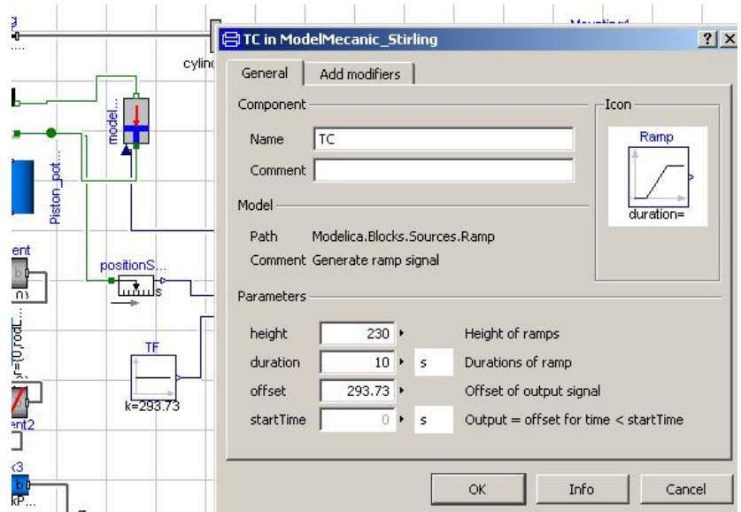  
图75 在 Dymola 中输入工作温度。

现在我们可以进行仿真以比较结果了。需要记住的是，在 Matlab 中我们计算的是单位质量和每循环的热量，以及每循环的功率，因此必须将 Dymola 中的热量和功率转换为这些单位（将热量除以质量与循环频率的乘积，并将功率除以循环频率）。

我们观察在 Dymola 中得到的结果：  
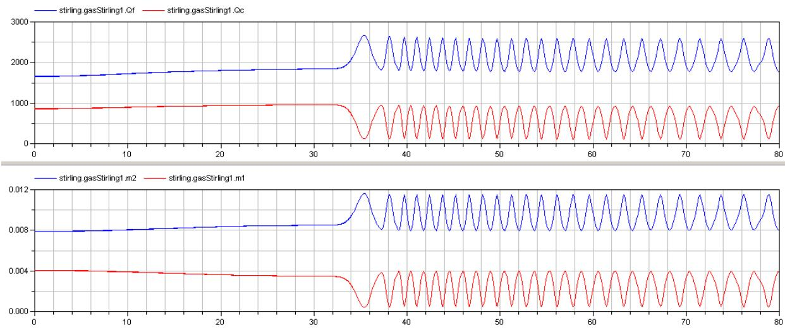  
图76 系统的热量与质量。

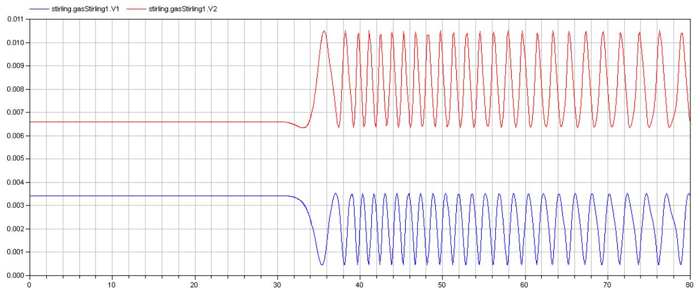  
图77 系统的容积。

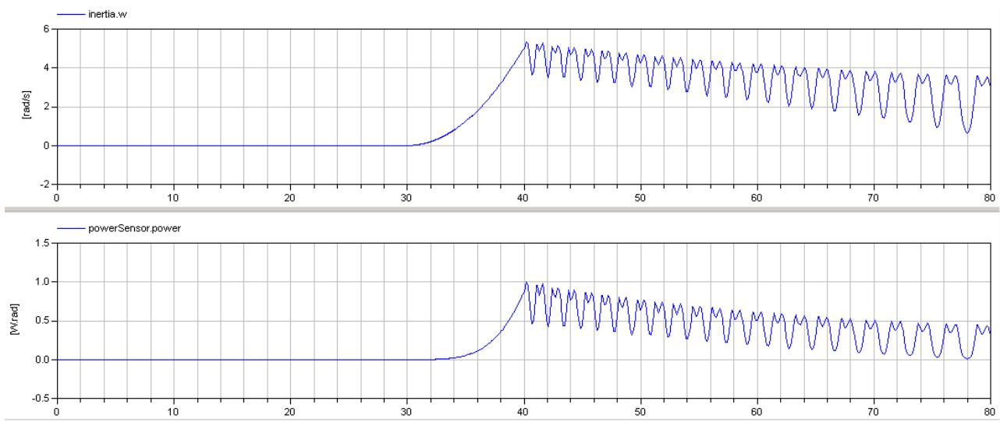  
图78 系统的转速及其产生的功率。  
计算时取图中结果的平均值。

表1 Matlab 分析与 Dymola 分析的结果对比。
<table><tr><td rowspan=1 colspan=1></td><td rowspan=1 colspan=1>Matlab</td><td rowspan=1 colspan=1>Dymola</td></tr><tr><td rowspan=1 colspan=1>参数</td><td rowspan=1 colspan=1>■</td><td rowspan=1 colspan=1>–</td></tr><tr><td rowspan=1 colspan=1>DD</td><td rowspan=1 colspan=1>0,135</td><td rowspan=1 colspan=1>0,14</td></tr><tr><td rowspan=1 colspan=1>DP</td><td rowspan=1 colspan=1>0,125</td><td rowspan=1 colspan=1>0,125</td></tr><tr><td rowspan=1 colspan=1>Vsmi</td><td rowspan=1 colspan=1>1,40E-05</td><td rowspan=1 colspan=1>1,50E-04</td></tr><tr><td rowspan=1 colspan=1>LD</td><td rowspan=1 colspan=1>0,27</td><td rowspan=1 colspan=1>0,28</td></tr><tr><td rowspan=1 colspan=1>LP</td><td rowspan=1 colspan=1>0,25</td><td rowspan=1 colspan=1>0,25</td></tr><tr><td rowspan=1 colspan=1>f</td><td rowspan=1 colspan=1>1</td><td rowspan=1 colspan=1>0,36605637</td></tr><tr><td rowspan=1 colspan=1>平均值</td><td rowspan=1 colspan=1></td><td rowspan=1 colspan=1></td></tr><tr><td rowspan=1 colspan=1>m1p</td><td rowspan=1 colspan=1>-</td><td rowspan=1 colspan=1>0,002</td></tr><tr><td rowspan=1 colspan=1>m2p</td><td rowspan=1 colspan=1>-</td><td rowspan=1 colspan=1>0,01</td></tr><tr><td rowspan=1 colspan=1>wp</td><td rowspan=1 colspan=1>-</td><td rowspan=1 colspan=1>2,3</td></tr><tr><td rowspan=1 colspan=1>Pp</td><td rowspan=1 colspan=1>-</td><td rowspan=1 colspan=1>0,5</td></tr><tr><td rowspan=1 colspan=1>Qcp</td><td rowspan=1 colspan=1>-</td><td rowspan=1 colspan=1>560</td></tr><tr><td rowspan=1 colspan=1>Qfp</td><td rowspan=1 colspan=1>-</td><td rowspan=1 colspan=1>2200</td></tr><tr><td rowspan=1 colspan=1>结果</td><td rowspan=1 colspan=1></td><td rowspan=1 colspan=1></td></tr><tr><td rowspan=1 colspan=1>VD</td><td rowspan=1 colspan=1>0,0039</td><td rowspan=1 colspan=1>0,0035</td></tr><tr><td rowspan=1 colspan=1>VP</td><td rowspan=1 colspan=1>0,003</td><td rowspan=1 colspan=1>0,0035</td></tr><tr><td rowspan=1 colspan=1>Vma</td><td rowspan=1 colspan=1>0,0054</td><td rowspan=1 colspan=1>0,005</td></tr><tr><td rowspan=1 colspan=1>Vmi</td><td rowspan=1 colspan=1>0,0015</td><td rowspan=1 colspan=1>0,002</td></tr><tr><td rowspan=1 colspan=1>Preal</td><td rowspan=1 colspan=1>9,46</td><td rowspan=1 colspan=1>1,36590985</td></tr><tr><td rowspan=1 colspan=1>Qabs</td><td rowspan=1 colspan=1>3,53E+05</td><td rowspan=1 colspan=1>7,65E+05</td></tr><tr><td rowspan=1 colspan=1>Qext</td><td rowspan=1 colspan=1>2,70E+05</td><td rowspan=1 colspan=1>6,01E+05</td></tr></table>

我们看到，各次研究之间的结果虽有变化，但并不夸张。Dymola 给出的结果更贴近现实。我们可以多次进行这项研究，直到找到满足预期要求的发动机设计值；但为了找到这些值，并确保能够构建一个具有良好运行保证的样机，建议先对未来改进进行建模，因为这些改进将为我们提供更贴近现实的仿真。

# 第5章 未来的改进

## 5.1. 全局传热系数的确定。

根据我们发动机的几何参数来确定这些系数，将使我们获得更接近实际的仿真结果，同时也能对发动机的设计作出更具体的描述。

下面给出了热区和冷区的分析，以便了解哪些元件以及它们如何参与这些参数的确定。

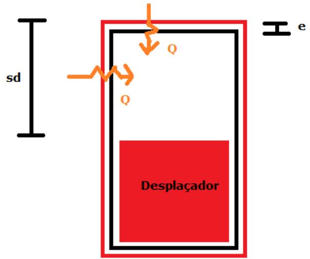  
图 79 区域1热分析。

分析加热区时，我们观察到将存在一个外部对流、两处传导（一处通过气缸盖，另一处通过其侧面），以及一个与系统流体之间的内部对流。总等效热阻可计算为各传导热阻的并联之和，该结果再与两个对流热阻串联相加，其中需要确定各区域（内部和外部）的对流系数。

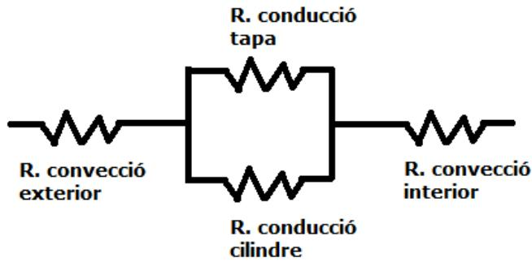  
图 80 热阻的等效电路。

基于：

$$
U = { \frac { 1 } { R T e q } }
$$

且根据前文所述，我们知道：

$$
R T e q = R c o n v . e x t + ( \frac { 1 } { R c o n d . t a p a } + \frac { 1 } { R . c o n d . c i l i n d } ) + R c o n v . \operatorname * { i n t }
$$

其中：

$$
R c o n v . e x t = \frac { 1 } { h e ^ { * } 2 \pi ^ { * } r ^ { * } s p }
$$

$$
R c o n d . t a p a = \frac { e } { k m a t ^ { * } A t a p }
$$

$$
R c o n \nu . \operatorname* { i n t } = \frac { 1 } { h i ^ { * } 2 \pi ^ { * } r ^ { * } s p }
$$

$$
R c o n d . c i l i n d = \frac { \ln ( \frac { r e x t } { r _ { \mathrm { i n t } } } ) } { 2 \pi ^ { * } k m a t ^ { * } s p }
$$

其中：

he = 外壁的对流系数。

hi = 内壁的对流系数。

kmat = 材料的导热系数。

基于斯特林发动机的电气

rext = 气缸外半径。

rint = 气缸内半径。

e = 厚度。

sp = 可用于传热的长度。

冷区：

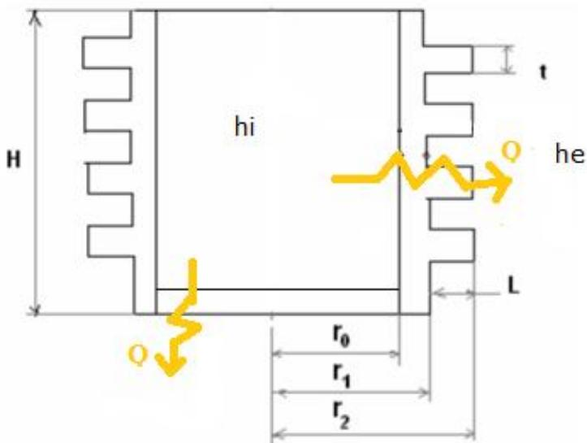  
图 81 区域2热分析。

在开始冷区分析之前，需要说明的是，这一分析是为了确定一种带翅片冷却系统的全局传热系数，因为翅片通过促进冷却来优化设计。因此，如果要对该部分进行建模，建议采用这种设计。

观察冷却区，我们看到将存在两个外部对流（一个通过翅片，另一个通过无翅片的基体）、两处传导（一处通过气缸盖，另一处通过其侧面），以及一个与系统流体之间的内部对流。总等效热阻可计算为各传导热阻的并联之和，该结果再与三个对流热阻串联相加，其中需要确定各区域（内部和外部）的对流系数。

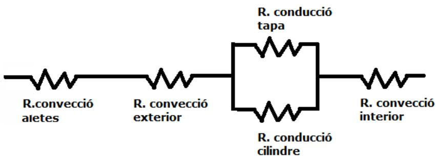  
图 82 热阻的等效电路。

Albert Garcia Prat

基于：

$$
U = { \frac { 1 } { R T e q } }
$$

且根据前文所述，我们知道：

$$
R T e q = R c o n v . e x t + R . c o n v . a l e t e s ( \frac { 1 } { R c o n d . t a p a } + \frac { 1 } { R . c o n d . c i l i n d } ) + R c o n v . \operatorname { i n t }
$$

其中：

$$
R c o n v . e x t = \frac { 1 } { h e ^ { * } ( 2 \pi ^ { * } r 1 - N ^ { * } t ) ^ { * } H } R c o n d . t a p a = \frac { e } { k m a t ^ { * } A t a p }
$$

$$
R c o n \nu . \operatorname { i n t } = \frac { 1 } { h i ^ { * } 2 r o ^ { * } \pi ^ { * } H }
$$

$$
R c o n d . c i l i n d = \frac { \ln ( \frac { r 1 } { r o } ) } { 2 \pi ^ { * } k m a t ^ { * } H }
$$

$$
R c o n \nu . a l e t e s = \frac { 1 } { N ^ { * } \eta f ^ { * } h e ^ { * } A f }
$$

其中：

he = 外壁的对流系数。

hi = 内壁的对流系数。

kmat = 材料的导热系数。

r0 = 气缸内半径。

r1 = 翅片初始外半径。

r2 = 翅片末端外半径。

t = 翅片厚度。

H = 气缸长度。

ηf = 翅片效率。

N = 翅片数量。

## 5.2. 冷却系统与加热系统的确定。

由于斯特林发动机可以借助大量的热源和冷源工作，因此这些热源和冷源尚未进行尺寸设计；但如果时间允许，可以对其进行建模并与现有模型协调，以便更真实地描述其运行。此外，我们还可以进行能量研究，甚至创建控制系统来优化这些热交换过程，从而进一步提高系统的效率。

一些可能的热源包括：地热、颗粒锅炉、抛物面太阳能聚光器等。

一些可能的冷却系统包括：空气的自然对流或强制对流，以及水的强制对流或自然对流。

## 5.3. 促进用户与程序之间的交互。

由于发动机的机械模型并非百分之百由我们建模，这使得该模型对用户而言并不具备简便的交互方式。此外，我们发动机活塞的一些重要几何数值也不易于修改，因为它们是为在 V6 发动机中使用而编程的。如果有时间，值得对该模型的某些参数进行重构，以便于修改这些对斯特林发动机而言确实重要的参数；而目前，要对这些参数进行精确修改，还需要具备编程知识以及对机械模型本身的了解。

# 第6章 结论

在实现最初提出的目标——研究基于斯特林发动机的自主发电系统的构建——的过程中，所取得的成果如下。

• 已深入理解发动机的机械与热力学工作原理。

• 已掌握使用 Dymola 工具的编程知识。

• 已通过利用现有模型和构建新模型，在 Dymola 中实现了发动机的完整建模。

• 已用 Matlab 软件完成了对已知斯特林发动机其中一项预研究的设计。

若遵循"未来改进"部分中的建议，将能建模出一台效率更高、更贴近实际运行的发动机。此外，还能促进用户与程序之间的交互，使本备忘录中所介绍的这一模型能够被更多人使用。

就我个人而言，我非常积极地评价这份毕业设计的完成，它让我更接近数值方法领域，并巩固了许多先前已掌握的知识。

# 第7章 参考文献

Revilla Vázquez, Maurici. Sistema de generación d'energia basado en un motor stirling aprovechando energías renovables. PFC, Universitat Politècnica de Catalunya, 2009.

Asensio Bueno, David. Evolución del rendimiento de un motor de combustión interna. Aplicación a pistones. PFC, Universitat Politècnica de Catalunya, 2010.

Moldenhauer, Stefan, and Thess, André. Modelica based simulation model of a Pulse Tube Engine. Ilmenau University of Technology (Germany). http://www.sft.asso.fr (accessed March 2013).

Beltrán Chacón, R. ; Velázquez Limón, N; Sauceda Carvajal, D. "Análisis y diseño de un sistema de generación eléctrica termosolar con concentrador de disco parabólico y motor Stirling de 2.7 kW enfriado por aire". Ingeniería. Investigación y Tecnología, vol XIII, núm.1, 2012, pp.43-53. Universidad Nacional Autónoma de México. Distrito Federal, México. http://www.redalyc.org/src/inicio/ArtPdfRed.jsp?iCve=40423210005 (accessed February 2013)

Agüero Zamora, Víctor. Diseño y construcción de un motor Stirling para la generación de energía eléctrica. PFC. Universidad Nacional de Ingeniería. Facultad de Ingeniería Mecánica. Lima, 2006. http://cybertesis.uni.edu.pe/uni/2006/aquero zv/pdf/aquero zv.pdf (accessed December 2012).

Shell and Tube Water Oil Cooler. Olaer SWO. http://www.olaer.fr (accessed March 2013)

Bachmann, Bernhard. Modelica Tutorial for Beginners. Exercises with Dymola. University of Applied Sciences. Bielefeld (Germany). http://www.isa.uma.es/C15/SeminarioModellica/Document%20Library/Ejercicios modelica.pdf (accessed March 2013).

Ramos González, J.C. Fórmulas, Tablas y Figuras de transferencia de calor. Tecnum. Universidad de Navarra. Escuela de Ingenieros. 2010. http://www.unav.es/adi/UserFiles/File/80980099/Formulas1011.pdf (accessed March 2013).

Moran, M.J. and Shapiro, H. Fundamentos de Termodinàmica Técnica. Editorial Reverté. Barcelona. 2005.

Dymola. Dynamic Modeling Laboratory. Getting started with Dymola. Chapter 2 from "Dymola User Manual Volume 1. Dessault Systèmes AB. Ideon Science Park. Lund, Sweden, 2011 http://www.3ds.com/fileadmin/PRODUCTS/CATIA/DYMOLA/PDF/Getting-Started.pdf (accessed March 2013)

Benejam Bagur, J.L. Aprofitament de l'energia solar mitjançant motor Stirling. Memòria. Escola Politècnica Superior d'Enginyeria de Vilanova i la Geltrú. Universitat Politècnica de Catalunya. 2013.

Gual Esteve, Jordi. Disseny d'un captador solar de temperatura, amb motor Stirling i disc parabòlic. PFC. Escola Tècnica Superior d'Enginyeries Industrial i Aeronàutica de Terrassa. Universitat Politècnica de Catalunya. 2010.

Motor de combustión interna. PDF http://80.32.206.136/Tecnologia LCP/Documentos/MOTOR%20DE%20COMBUSTION%20INTERNA.pdf (accessed March 2013)

Navarrete, R. Ignacio. Diseño de un motor Stirling para generación eléctrica con fuentes geotérmicas. Memoria. Facultad de Ciencias Físicas y Matemáticas. Departamento de Ingenieria Mecánica. Universidad de Chile. Santiago de Chile, 2008.

Losada San José, J. Análisis de un sistema de disco parabólico con motor Stirling. PFC. Escuela Técnica Superior. Universidad Carlos III. Madrid, 2009.

Sánchez, J.; Román, R.; Frederik, R. Modelación un Motor Stirling tipo gama para bajas entalpías. IV Conferencia Latino Americana de Energia Solar y XVII Simposio Peruano de Energia Solar. Cusco, noviembre 2010.

Maier, C.; Gil, A. Aguilera, R.; Shuang, L., YU, X. Stirling Engine. University of Gävle. Sweden, 2007.

Concepción Sánchez, Sergio. El motor Stirling y su implantación en buques mercantes. Facultat Nàutica de Barcelona. Universitat Politècnica de Catalunya. Barcelona, 2010.

Organ, Allan. Stirling Cycle Machine Analysis. University Ohio, 2010 http://www.ohio.edu/mechanical/stirling/me422.html (accessed February 2013)

Franco García, Angel. Curso interactivo de Física en Internet. http://www.sc.ehu.es/sbweb/fisica//estadistica/termodinamica/stirling/stirling.html
