# 毕业设计


巴塞罗那，2014年6月11日

项目导师：Joan Grau Barceló 流体力学系 (MF) 加泰罗尼亚理工大学 (UPC)

# 总目录

# 正文目录

正文目录 ...   
图目录.....   
表目录....   
摘要 ...   
摘要(加泰罗尼亚语)...   
摘要(英语) ..   
致谢 ...   
第1章 选题依据、目标与范围.......   
1.1. 选题依据 .   
1.2. 目标..   
1.2.1. 总体目标 ...   
1.2.2. 具体目标 .....   
1.3. 范围.....   
第2章 引言....   
第3章 Dymola....   
3.1. 建模 ..   
3.2. 仿真 ...   
第4章 斯特林发动机 ..   
4.1. 总体描述....   
4.2. 结构形式 ...   
4.2.1. Alpha 型结构...   
4.2.2. Beta 型结构 ..   
4.2.3. Gamma 型结构...   
4.3. 热力循环...   
4.4. 工作原理 ...   
第5章 斯特林发动机的建模   
5.1. 前期状态 .   
5.1.1. 机械模型..   
5.1.2. 热力学模型 .   
5.2. 模型验证 ..   
5.2.1. 仿真启动.   
5.2.2. 惯性与温度仿真..   
5.2.3. 启动系统与温度仿真 .   
5.2.4. 力的修改.   
5.2.5. 强制启动系统 ..   
5.3. 样机的开发 .   
5.3.1. 双缸机 ..   
5.3.2. 四缸机 ...   
第6章 结论   
第7章 后续改进.   
第8章 参考文献..   
8.1. 参考文献引用.   
8.2. 参考资料..   
8.3. 图片来源.

# 预算目录

预算目录 ...   
第1章 预算   
第2章 参考文献..   
2.1. 参考资料...

# 附录目录

附录目录...   
第1章 附录 A. Albert García 的毕业设计摘要 ...   
1.1. 附录 A.1. 机械模型 ..   
1.2. 附录 A.2. 热力学模型 .   
第2章 附录 B. 结果 ...   
2.1. 附录 B.1. 第 5.2 节模型验证的仿真汇总表   
. .   
2.2. 附录 B.2. 第 5.2 节模型验证的图表 ...

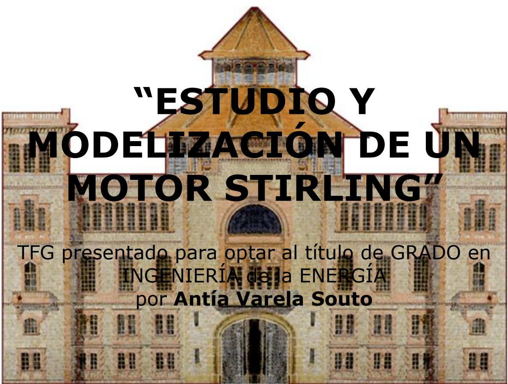  
巴塞罗那，2014年6月11日

导师：Joan Grau Barceló 流体力学系 (MF) 加泰罗尼亚理工大学 (UPC)

# 正文目录

正文目录   
图目录.   
表目录.   
摘要   
摘要(加泰罗尼亚语).   
摘要(英语) .8   
致谢.. 9   
第1章 选题依据、目标与范围.... 11   
1.1. 选题依据 .11   
1.2. 目标.. 11   
1.2.1. 总体目标 . 11   
1.2.2. 具体目标 12   
1.3. 范围. 12   
第2章 引言.. 13   
第3章 Dymola .... .15   
3.1. 建模 .16   
3.2. 仿真 .. .18   
第4章 斯特林发动机 21   
4.1. 总体描述. .21   
4.2. 结构形式 .. .23   
4.2.1. Alpha 型结构.. .23   
4.2.2. Beta 型结构 .23   
4.2.3. Gamma 型结构. .24   
4.3. 热力循环.. .25   
4.4. 工作原理 . .26   
第5章 斯特林发动机的建模 ... .31   
5.1. 前期状态 .. .31   
5.1.1. 机械模型. .31   
5.1.2. 热力学模型 .34   
5.2. 模型验证. .40   
5.2.1. 仿真启动. .40   
5.2.2. 惯性与温度仿真.. 40   
5.2.3. 启动系统与温度仿真. ..42   
5.2.4. 力的修改 .. 45   
5.2.5. 强制启动系统 . 45   
5.3. 样机的开发. 59   
5.3.1. 双缸机. .59   
5.3.2. 四缸机. ..70   
第6章 结论 81   
第7章 后续改进. 83   
第8章 参考文献.. 85   
8.1. 参考文献引用 . ..85   
8.2. 参考资料.. .85   
8.3. 图片来源.. ..87

# 图目录

图 1. 带斯特林发动机的太阳能集热器 [1].. 14   
图 2. PC186 的 CPU 特性. .16   
图 3. Dymola 的建模环境. .16   
图 4. Dymola 的仿真环境. .19   
图 5. Alpha 型斯特林发动机 [2]. .23   
图 6. Beta 型斯特林发动机 [2]. .. ..24   
图 7. Gamma 型斯特林发动机 [2]. .24   
图 8. 斯特林循环 [3]. .25   
图 9. 系统压力开始下降. . ..26   
图 10. 空气的最大冷却. .27   
图 11. 气体开始加热. .27   
图 12. 空气的最大加热. .28   
图 13. 实际斯特林循环 [4]. .. .29   
图 14. 在 Dymola 中建模的活塞组件. ..32   
图 15. ModelMecanic_Test 的交互区域. ..33   
图 16. 机械模型的 3D 动画. .33   
图 17. 系统压力开始降低. . ..35   
图 18. 空气的最大冷却. ..35   
图 19. 气体开始加热. .36   
图 20. 空气的最大加热. ..36   
图 21. ModelVolums_Test 的交互区域. .37   
图 22. ModelTermodinamic_Test 的交互区域.. .38   
图 23. Motor_Stirling 的交互区域. ..39   
图 24. Motor_Stirling 测试的组件. ..39   
图 25. 仿真案例 4：角速度. ..41   
图 26. 仿真案例 8：角速度. .42   
图 27. 仿真案例 12：角速度. .43   
图 28. 案例 8 与案例 10 对比：角速度. .43   
图 29. 案例 8(上)与案例 10(下)对比：温度..44   
图 30. 案例 8(上)与案例 10(下)对比：热传递   
. .44   
图 31. 热力学模型代码中合力方程的修改   
. ..45   
图 32. 仿真案例 16：角速度. ..46   
图 33. 仿真案例 16：压力. ...47   
图 34. 仿真案例 16：力. ..47   
图 35. 仿真案例 24：角速度. ..48   
图 36. 仿真案例 25：角速度. ...49   
图 37. 仿真案例 27：角速度. ...50   
图 38. 仿真案例 29：角速度. ...50   
图 39. 仿真案例 34：角速度. ...51   
图 40. 仿真案例 42：角速度. ...52   
图 41. 仿真案例 42：温度. ..52   
图 42. 仿真案例 43：角速度. ...53   
图 43. 仿真案例 43：温度. ...54   
图 44. 仿真案例 44：角速度. ..55   
图 45. 仿真案例 44：温度. ..55   
图 46. ModelMecanic_Stirling 中传热系数的修改   
. .56   
图 47. 仿真案例 45：角速度. ..56   
图 48. 仿真案例 45：温度. ..57   
图 49. 仿真案例 47：角速度. ..58   
图 50. 仿真案例 47：温度. ...58   
图 51. 双缸机在斯特林发动机交互区域中的连接   
. 59   
图 52. 发动机 1 中动力活塞与置换器之间相位差的编程   
. .60   
图 53. 发动机 2 各气缸之间以及发动机 1 与 2 之间相位差的编程   
. ..61   
图 54. 双缸机的 3D 显示. ..61   
图 55. ModelMecanic_Stirling 交互区域中动力活塞气缸的定位   
. .62   
图 56. 动力气缸位置初始化的修改.62   
图 57. 仿真案例 48：角速度. .63   
图 58. 仿真案例 48：温度. ..64   
图 59. 仿真案例 49：角速度. ..65   
图 60. 仿真案例 49：温度. .65   
图 61. 单缸机(蓝)与双缸机(红)对比：角速度   
. .66   
图 62. 单缸机与双缸机对比：温度.   

..66   
图 63. 双块机在斯特林发动机交互区域中与位于发动机块外部的温度热源的连接。   
..67   
图 64. d=0.01 时 2 块机的功率。 . ... 68   
图 65. 仿真案例 50：产生的功率。 ...68   
图 66. 仿真案例 51：产生的功率。 ..69   
图 67. 仿真案例 52：产生的功率。 ... 69   
图 68. 仿真案例 53：产生的功率。.. ... 69   
图 69. 仿真案例 54：产生的功率。 ..70   
图 70. 四块机在斯特林发动机交互区域中的连接。 ... ..71   
图 71. 发动机 1 的功率活塞与置换器之间相位差的编程。 .72   
图 72. 发动机 2 气缸之间以及发动机 1 与 2 之间相位差的编程。 .72   
图 73. 发动机 3 气缸之间以及发动机 2 与 3 之间相位差的编程。.. ..73   
图 74. 发动机 4 气缸之间以及发动机 3 与 4 之间相位差的编程。.. ...74   
图 75. 4 块机的三维可视化。 ...74   
图 76. 仿真案例 55：角速度。 ...76   
图 77. 仿真案例 55：产生的功率。 ...76   
图 78. 仿真案例 56：角速度。 ...77   
图 79. 仿真案例 56：产生的功率。 ...77   
图 80. 仿真案例 57：角速度。 .. ...77   
图 81. 仿真案例 57：产生的功率。.. ...78   
图 82. 仿真案例 58：角速度。 ...78   
图 83. 仿真案例 58：产生的功率。 ...79   
图 84. 4 块机的功率特性曲线。 .......79

# 表格目录

表 1. 修改热源温度的仿真。 .40   
表 2. 修改惯性飞轮的仿真。 .41   
表 3. 由启动电机引起的机器运行仿真。 .42   
表 4. 修改温度斜坡和力的仿真。.......45   
表 5. 无强制启动系统的仿真。 .46   
表 6.（续）无强制启动系统的仿真。 ... 46   
表 7. 修改强制启动系统的仿真。 .48   
表 8. 修改加速斜坡的仿真。 .49   
表 9. 增加加热时间并修改加速斜坡的仿真。 .51   
表 10. 增加仿真时间并提高加速斜坡高度的仿真。 .52   
表 11. 提高热源温度的仿真。 ..53   
表 12.（续）提高热源温度的仿真。 .53   
表 13. 增大惯性矩的仿真。 ..54   
表 14.（续）增大惯性矩的仿真。 ...... 54   
表 15. 修改传热系数的仿真。 56   
表 16. 增加仿真时间并修改传热系数的仿真。 .57   
表 17. 在设定条件下对 2 块机的仿真。 .63   
表 18. 增加仿真时间的 2 块机仿真。 .64   
表 19.（续）增加仿真时间的 2 块机仿真。 ..64   
表 20. 改变 Damper（阻尼器）的 2 块机仿真。 ....... 68   
表 21. 改变 Damper（阻尼器）的 4 块机仿真。 ......75   
表 22.（续）改变 Damper（阻尼器）的 4 块机仿真。 .75   
表 23.（续）改变 Damper（阻尼器）的 4 块机仿真。 75

# 摘要

本项目旨在设计一个斯特林发动机虚拟实验室，以便通过 Dymola 软件优化其尺寸设计。其任务是：从发动机中发生的基本过程出发再现发动机的行为，以动态方式仿真其各个元件的行为。该工具的设计目标是使对斯特林发动机感兴趣的人能够在开发真实样机之前，对机器进行前期研究。

本研究以另一位学生先前的工作为出发点，该学生成功开发了一个斯特林发动机的半功能模型。当前的目标是扩展其工作，以获得一个具有适当热力系统的完全功能模型，从而能够对变量进行敏感性分析。另一方面，参数分析将能够改进机器的基本特性以提高其效率。本项目的长期目标是建造一台功率为 500 W 的斯特林发动机真实样机。

# 摘要

本项目旨在利用 Dymola 软件设计一个斯特林发动机的虚拟实验室，从而优化其尺寸设计。任务是依据发动机中发生的基本过程来重现其行为，动态仿真其各元件的运行特性。该工具的设计目的是让对斯特林发动机感兴趣的人员能够在开发实际原型之前，先行开展对该机器的初步研究。

本研究以另一位学生先前的工作为起点，该学生成功开发出一个半功能性的斯特林发动机模型。当前目标是扩展其工作，得到一个具备合适热力系统、完全可用的模型，从而能够对各变量进行敏感性分析。另一方面，参数化分析将有助于改进该机器的基本特性，以提高其效率。本项目的长期目标是建造一台功率为 500 W 的斯特林发动机实际原型。

# 摘要

目前我正在开展名为《斯特林发动机的研究与建模》的毕业论文项目。本项目旨在利用 Dymola 设计一个斯特林发动机的虚拟实验室，用于其尺寸的优化设计。其目的是从发动机中发生的基本过程出发，通过在 Dymola 中动态仿真其各元件的行为来模拟发动机的运行。该工具的设计旨在让任何对斯特林发动机感兴趣的人都能够在制造实际原型之前，先对机器的行为进行初步研究。

本项目的起点是另一位学生先前的工作，他成功开发出一个半功能性的斯特林发动机模型。我的目标是扩展其工作，得到一个具备合适热力系统、完全可用的模型，以便进一步对各变量进行敏感性分析。因此，开展全面的参数化分析将有助于改进发动机的基本特性，从而提升其性能。值得一提的是，本项目的长期目标是建造一台功率为 500 W 的斯特林发动机实际原型。

# 致谢

首先，感谢我的家人和朋友，在我求学的整个过程中，无论是充满憧憬还是遭遇挫折的时刻，他们都给予了我无条件的支持与陪伴。

同时，感谢我的导师 Joan Grau，让我参与一个具有实际应用和可持续发展意义的项目，这一点始终激励着我，并坚定了我对自己专业方向的选择。在整个研究过程中，他一直为我指引方向，与我分享他的经验，并日复一日地激励我实现目标。

最后，感谢 EUETIB 为完成本毕业设计所提供的各种工作条件与资源。

# 第1章 论证、目标与范围

## 1.1. 论证

如今，关于斯特林发动机及其潜在应用的研究尚不够深入，因为数十年来传统发动机和燃料已占据了主导地位。此外，目前尚未得到一款体积足够小且功率足够大的发动机，能够在汽车等众多应用中替代其他技术。然而，使用可再生能源和实施节能措施的趋势已开始显现。在这一领域，斯特林发动机作为一项可持续的技术替代方案崭露头角，目前已开始主要应用于为偏远地区供能的小型太阳能热发电站中。

如果这项技术在未来几年得到更多重视，它就有望在发电或车辆动力等多个领域成为具有竞争力的替代方案。

## 1.2. 目标

### 1.2.1. 总体目标

本毕业设计的总体目标在于，利用 Dymola 软件设计一个斯特林发动机的虚拟实验室，以优化其尺寸设计。目的是从一个半功能性的发动机模型出发，得到一个完全可用的原型，其功率特性足以与当前其他技术相竞争。

1.2.2. 具体目标

• 理解发动机的机械与热力学工作原理。

• 掌握使用 Dymola 工具进行编程和仿真的知识。

• 研究发动机在先前状态下的建模情况，并对其进行评估，查找导致其无法正常工作的错误。

• 开展全面的仿真过程，以获得一个可用的机器模型。

• 设计一款更稳定、发电功率更高的发动机原型。

为后续项目中对机器进行进一步改进奠定基础，例如对机器运行影响最大的变量进行参数化分析。

## 1.3. 范围

本项目首先对斯特林发动机的历史背景进行介绍，从其发明直至当今，并提及多年来其各种不同的应用。

接下来的一章描述了 Dymola 软件的功能，分为建模和仿真两个部分，其中解释了用户交互区域的各个不同部分。

第三章对斯特林发动机进行了总体描述，并分析了其不同的配置。另一方面，描述了热力循环，并逐阶段解释了发动机的工作原理。

下一章是本项目的主体和发展部分。在该章中，首先分析斯特林发动机模型此前的状态，研究其最重要的特性。随后，描述了为获得斯特林发动机的功能模型而进行的仿真过程，借助最重要结果的表格和图形加以说明。最后，分析了获得该机器功能样机的过程。为此，解释了所研究的各个不同样机的制作以及所进行的仿真。对结果进行分析，并最终确定最可行的样机。

接下来给出了项目完成后得出的结论以及提出的未来改进。

最后汇集了项目执行过程中所引用和查阅的参考文献。

本毕业设计的时长为四个月，因此没有足够的时间完全实现总体目标。然而，所有具体目标都得以实现，并为未来项目确立了指导方针，这些项目最终将研制出功率为 500 W 的斯特林发动机真实样机。

# 第2章 引言

19 世纪初，工业革命开始崭露头角。已经历了若干年发展的蒸汽机，构成了这一历史阶段的象征。然而，这些机器体积庞大、价格昂贵且效率低下。此外，它们还很危险，因为锅炉在达到高压时经常发生爆炸，导致附近人员死亡或严重烧伤。之所以如此，是因为这些机器是用熟铁而非钢材制造的。另一方面，当时尚未开发出供小型工业使用、构造简单且造价低廉的发动机。

这些弊端促使英国牧师 Robert Stirling 于 1816 年提出了一种基于截然不同原理工作的新型发动机的构想，即所谓的“热空气发动机”。这种机器装有一个节热器（如今称为回热器），这是一种用于提高热效率的装置。一个重要的区别在于，该发动机不会因蒸汽而爆炸，因为其工作介质是大气压下的空气，这使它成为一种安全得多的机器。

这种发动机最初的用途是作为小型机器、工具和水泵的动力源。瑞典发明家 John Ericsson 设计并建造了一艘由斯特林发动机驱动的船，并为一种由该机器驱动的水泵获得了专利。然而，蒸汽机的改进、内燃机随后的发展以及多年后电力网络的普及，使得热空气发动机在多年间被遗忘。

20 世纪 60 年代，人们重新对这种机器产生了兴趣。Philips 公司开发了一种便携式发电机，其制冷系统可产生供家庭使用的热水。随后，由于 70 年代初的能源危机，人们开始研究新的能源以及替代传统发动机的发动机。一些汽车公司开发了基于斯特林发动机的车辆，其能源效率远高于传统车辆。然而，石油短缺结束后，所取得的所有创新都被搁置一旁。

如今，人们利用斯特林循环机器通过太阳能聚光器来发电，因为在太阳能热电站所采用的所有技术中，这些发动机将太阳热能转化为电能的效率最高。

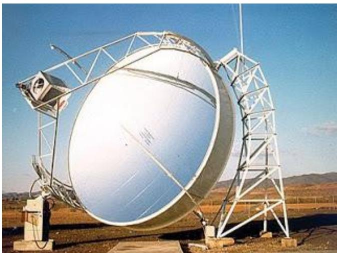  
图 1. 带斯特林发动机的太阳能集热器 [1]。

另一方面，这种发动机近来被用于潜艇的建造，因为它噪声极低且续航能力强。此外，受气候变化推动，各大汽车制造商正在研究和评估在混合动力汽车中安装斯特林发动机的可能性。

最后，可以得出结论：在寻求更高效、更环保的替代发动机方面，斯特林发动机是一项强有力的选择。因此，未来拥有众多采用该技术的车辆和能源获取系统也就不足为奇了。

# 第3章 DYMOLA

Dymola 是由瑞典公司 Dassault Systèmes AB 开发的软件，是用于复杂系统建模与仿真的完整工具。它能够仿真系统的动态行为以及系统之间在机械、电气、热力学、控制系统等各个工程领域中的相互作用。

Dymola 基于开放的 Modelica 语言，即用户拥有前述各个工程领域中的模型库，可以对它们进行修改或利用它们来创建新的研究系统。下面将描述用于创建这些模型的建模环境，以及用于研究它们的仿真环境。

为了发挥 Dymola 的全部潜力，必须安装一个编译器，例如 C++ Visual Studio，包括 2008 版和 2010 版，这两个版本都可以在 Microsoft Windows 的网页上免费获取。该编译器将使 Dymola 能够在 3D 可视化层面执行仿真，并对系统应用数学求解。

这些仿真将在 Universitat Politècnica de Catalunya 提供的一台计算机上安装的教育许可版 Dymola 中进行，该计算机为我们提供的仿真资源优于普通计算机所提供的资源，因为它的性能或技术特性更高。

这台名为 PC186 的机器的特性如下：

PC186 SGI-H2106，其主板配备四个 CPU（AMD OPTERON 6140），每个 CPU 有 8 个内核（cores）。总共配备 64 GB 的 RAM。目前有一个 1 TB 的主磁盘（采用 RAID 1，出于安全考虑与一个特性相同的磁盘互为镜像）和两个 2 TB 的辅助磁盘，总存储容量为 5 TB。

已安装 Linux Ubuntu 11.04 版本。

<table><tr><td rowspan=1 colspan=8>CPUs, related to AMD Opteron 6140</td></tr><tr><td rowspan=1 colspan=1>型号</td><td rowspan=1 colspan=1>内核/线程</td><td rowspan=1 colspan=1>频率</td><td rowspan=1 colspan=1>L3 缓存</td><td rowspan=1 colspan=1>多处理器</td><td rowspan=1 colspan=1>TDP</td><td rowspan=1 colspan=1>特性</td><td rowspan=1 colspan=1>价格</td></tr><tr><td rowspan=1 colspan=1>Opteron 6140</td><td rowspan=1 colspan=1>8/8</td><td rowspan=1 colspan=1>2.6 GHz</td><td rowspan=1 colspan=1>12 MB</td><td rowspan=1 colspan=1>4</td><td rowspan=1 colspan=1>115 Watt</td><td rowspan=1 colspan=1></td><td rowspan=1 colspan=1>$989</td></tr></table>

图 2. PC186 的 CPU 特性。

## 3.1. 建模

除了通过 Dymola 进行建模之外，该软件还支持与其他模型创建程序（如 Simulink 或 CAD 设计程序）进行通信。这样，Dymola 允许导出想要实现到所研究模型中的模型或设计。

Dymola 具有一个非常灵活的建模环境，允许通过不同途径创建、修改模型并使模型之间进行交互。为了便于理解这些途径，将把建模区域划分为六个部分。

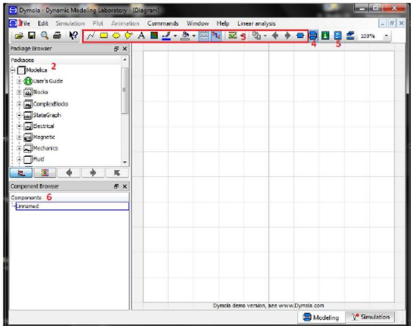  
图 3. Dymola 的建模环境。

**1. 文件 (File)：**

除了能够对文件执行保存、复制等基本操作外，如果访问 File->New，就可以选择想要创建的文件或系统组件：模型或复杂系统¹、系统的连接器、系统的函数、模型或组件库等。

**2. 库包 (Modelica)：**

这里存放着 Dymola 已创建的、涵盖各个工程领域的组件和模型库。用户可以利用它们来创建自己的系统，或者修改现有的组件和模型以使其适应自己的需求。

**3. 设计区域**

顾名思义，这里是可以为正在创建的组件或模型赋予图形化形式的地方。通过组合位于设计区域图标旁边的任务栏元素，可以为文件或复杂系统提供一个图像，以便从视觉上帮助识别其功能。

**4. 交互区域**

交互区域指的是程序中可以添加系统组件（变量、函数、连接器等）或复杂系统组件（模型、初始条件、连接器等）并在它们之间建立连接的部分。

**5. 代码区域**

软件中以 Modelica 语言收录在设计区域和交互区域中对正在创建的组件或模型所执行的全部操作的部分。它还允许以手动方式，即通过输入代码，添加有助于更好地描述组件或模型行为的特性，例如变量、方程、连接、初始条件等。

为了正确理解本文中阐述的概念，有必要正确定义以下关键词：

参数：Dymola 在仿真期间将其解释为常量的变量，因此程序已经知道该变量对时间的导数为零。

变量：顾名思义，指的是其大小会根据系统的状况或演变而改变的值。必须向 Dymola 指定其对时间的导数如何，以便它能够逐步定义变量的新大小。

初始条件：定义在随时间变化的变量上的一种特性，从而向 Dymola 提供该变量初始时如何处于该状态的信息，这样无论是软件用户还是 Dymola 本身，都可以判断系统的演变是否正确。这些初始条件在变量旁边定义为“start=”。此外，可以向 Dymola 指定：被定义了初始条件的变量在初始时必须达到该值，或者该条件仅仅是系统启动时该变量本应取值的参考大小。这一指定是通过将初始条件标记为确定的（=True）或参考性的（=Inherited）来实现的。

$$
6 . \underbrace { \mathsf { C o m p o n e n t e s } ( \overbrace { \cdots } \underbrace { \mathsf { U n n a m e d } } _ { \begin{array} { c } { \scriptstyle { \mathsf { L } } } \end{array} } ) } _ { \begin{array} { c } { \scriptstyle { \mathsf { C o m p o n e n t e s } } ( \overbrace { \cdots } \underbrace { \mathsf { U n n a m e d } } _ { \begin{array} { c } { \scriptstyle { \mathsf { L } } } \end{array} } ) } \end{array} } .
$$

在这一部分中，可以快速、有条理地访问和查看复杂系统的模型，以及构成该系统的每个模型的组件。

在建模部分中还有一项未提及但非常有用的工具，即信息图标 ()，可以查阅它以查看所选组件功能的说明，以及其变量的定义和相应的单位。该工具在理解被复用的机械模型的组件时提供了很大的帮助，这些组件将在后文中进行分析。

## 3.2. 仿真

与建模部分相同，该软件中的仿真也支持建模部分中从其他程序导出的模型，因而能够执行并非仅在 Dymola 中完成的 CAD 动画。该环境还提供将系统结果，或者（如用户希望）该系统中所要研究变量的结果，导出到其他数据处理或解读程序的可能性。

Dymola 的仿真环境提供了多种方式来可视化系统演化结果，以及多种用于求解这些结果的数值方法。为了理解如何实现所需的可视化，以及如何选择要应用的数值方法，还有系统的研究时间，将把仿真环境划分为六个部分。

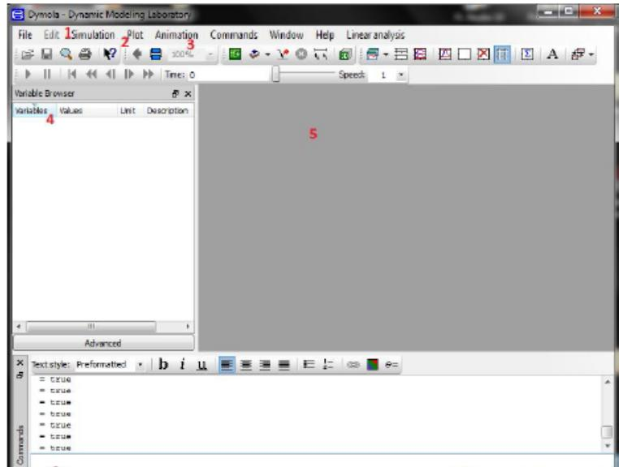  
图 4. Dymola 的仿真环境。

• 仿真菜单 (Simulation):

在此菜单内部可以找到多种应用于系统的功能选项以及各种类型的读数。然而，将仅分析对本项目有意义的内容，即两项：

a) Simulate $( { \bf \nabla } \mathbf { \mathcal { Y } } )$ ：负责对系统进行仿真，并通过 Dymola 默认检测到的数值方法求解系统的功能，前提是未指定其采用其他方法。

b) Setup $( \overleftrightarrow { \mathbf { t } _ { 0 } \mathbf { t } _ { 1 } } )$ ：该功能将打开一个子菜单，可在其中进行如下类型的选择：求解系统所用的数值方法（Simulate->Setup->General->Integration->Algorithm-> Dymola 可应用的方法列表）、函数的研究时间区间（Simulate->Setup->General->Simulation interval-> 其中列有起始时间 start time 和终止时间 stop time），或指定 Dymola 向用户发送有关仿真错误消息的信息，以识别该故障的原因（Simulate->Setup->Debug->多种信息选项）。

图形菜单 (Plot)：

顾名思义，此菜单允许绘制所要研究的系统变量的解。另一方面，它提供一系列用于操作图形的资源，以便能够以更详细的方式进行研究。

• 动画菜单 (Simulation)：

动画是 Dymola 提供的另一种解表示形式。该表示形式由模型的三维可视化组成，既可以用 Dymola 本身完成，也可以用与 Dymola 兼容的其他 CAD 设计程序（例如 Solidworks）完成。这种表示形式的目的是帮助用户更好地理解系统的功能，以及验证其是否确实正确地执行了自身功能。

变量 (Variables)：

仿真环境中的一块区域，其中包含参与系统的所有组件或模型，可以从中选择要在图形中表示的变量，或要获取其动画的模型（如果该动画已设计和编程）。此外，可以直接从此菜单修改被定义为参数的变量值，而无需返回建模环境，从而重新仿真以观察系统中的变化。

• 表示区域 ()：

在此区域中将打开 Dymola 所表示的可视化窗口。默认情况下，Dymola 总是生成一个图形表示窗口，但通过访问上述任意菜单并选择 new window，可以根据需要打开任意数量的表示空间。

• 消息区域 (Advanced)：

在该空间中，Dymola 实时显示和报告仿真情况，以及仿真期间发现的可能的一般性错误。随后，可以通过上述 Debug 功能识别错误的来源。

# 第4章 斯特林发动机

## 4.1. 总体描述

斯特林发动机是一种基于斯特林循环的外燃机。该发动机由 Robert Stirling 于 1816 年首次研制，通过温差产生能量。工作流体通常是空气、氢气或氦气，在一端被加热，在另一端被冷却，从而分别使气体膨胀或压缩。此外，这种膨胀和压缩推动发动机气缸内的两个活塞，这两个活塞耦合到一个传动机构，该机构产生净功率输出。所述功率输出是由于加热过程（膨胀）在比冷却过程（压缩）更高的工作压力下发生。

该机器在封闭的再生循环中运行，能量传递通过换热器气缸的壁面进行。当工作流体在活塞作用下运动时引起的体积变化必须彼此异相，才能产生能量。

该发动机具有两个功能截然不同的活塞：置换器和功率活塞。置换器是这样一个活塞，它与工作腔内部相适配，在其与气缸壁之间留出一小段距离（称为环隙），从而使工作流体能够从热区流到冷区，交替地被加热和冷却。功率活塞负责将工作流体所储存的压力转换为净力。由于功率活塞和置换器彼此异相运动，斯特林发动机需要一个常规的传动系统。

此类发动机因工作流体与热区和冷区之间巨大的温差而损失效率。当流体绕过置换器流动时，它会逐渐吸收热量，从而以高于所需的温度到达冷区。在相反的情况下也会发生这种情况，即当流体在返回路径上绕过置换器运动时，到达热区时比所需温度更低。

这一问题可以通过回热器（或称节约器，Robert Stirling 如此称呼它）来解决，它是为提高机器效率而开发的。该设计原本是一团位于环形空间中的钢丝，当工作流体从中穿过时，它吸收多余的能量。

回热器是一种内部换热器，其功能是在循环的等容过程中吸收和释放热量。该系统既减少了必须由外部热源提供给气体的热量，也减少了冷却系统必须排出的被浪费的热量。因此，燃料消耗得以降低，工作循环的整体效率得以提高。

小型发动机通常不装回热器，而是在置换器与气缸之间留有几十分之一毫米的间隙，以便空气通过。大型发动机则包含一个外部回热器，空气在从冷区到热区及反向的路径上必须经过该回热器。

此类发动机所具有的优势在于其高效率、可采用的多种外部热源、极低的噪声以及低排放。此外，还存在一系列可以引入斯特林发动机的潜在技术：

带抛物面碟和斯特林发动机的太阳能热发电系统

• 混合动力电动汽车和斯特林发动机

• 微型斯特林发动机


• 节能装置或废热再生装置 (waste heat regeneration)

• 自动启动的电子制冷装置

• 自由活塞斯特林发动机冰箱 (FPSC)

• 氢燃料斯特林发动机

## 4.2. 结构配置

本节将根据现有的不同机械设计，简要介绍斯特林发动机所具有的各种结构配置。

### 4.2.1. Alpha 型结构


Alpha 型结构由两个气缸组成，一个冷缸、一个热缸。两个活塞通过一根曲轴连接，但它们的运动相位相差 90 度。这意味着当一个活塞处于上止点或下止点时，另一个活塞则处于行程的中间位置。

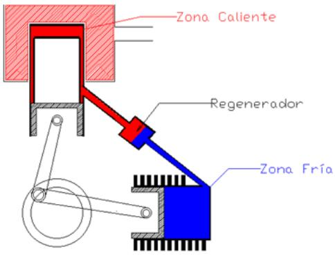  
图 5. Alpha 型结构斯特林发动机 [2]。

### 4.2.2. Beta 型结构

最初的斯特林发动机采用的是 Beta 型结构。它由一个气缸组成，一端为热端、另一端为冷端。气缸内部装有置换器，其作用是将空气在冷区和热区之间来回输送。动力活塞与置换器同轴布置。通过一个特殊的曲轴，活塞与置换器的运动相位相差 90 度，从而保证发动机正常运转。

从热力学角度看，它是效率最高的发动机，但其制造复杂，因为活塞必须配有两根连杆，并要允许驱动置换器的连杆穿过。

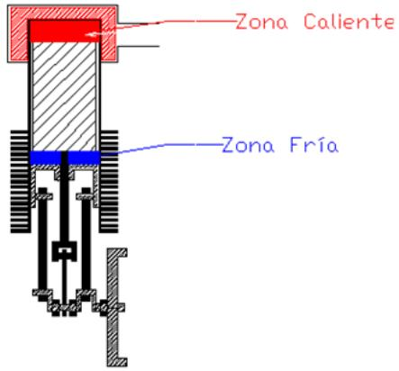  
图 6. Beta 型结构斯特林发动机 [2]。

### 4.2.3. Gamma 型结构

这类发动机源自 Beta 型结构，但制造更为简单。它由两个相互分离的气缸组成，其中一个气缸内装有置换器，另一个气缸内装有动力活塞。这两个气缸通过曲轴实现 90 度的相位差。

从热力学角度看，它的效率低于 Beta 型，因为做功膨胀完全是在较低温度下进行的，并且存在更多的死容积。

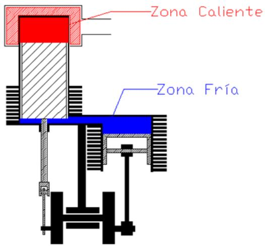  
图 7. Gamma 型结构斯特林发动机 [2]。

## 4.3. 热力循环

斯特林发动机遵循一种被称为斯特林循环的热力循环，理论上该循环能够达到理论上的最大效率，即所谓的卡诺效率。这使得斯特林发动机成为效率最高的热机。

尽管理论上这种发动机能达到很高的效率，但需要指出的是，它不适合用作汽车发动机，因为其功率较低，而且所达到的高效率是在低转速下取得的。另一方面，循环效率对外界温度较为敏感，因此发动机在寒冷气候下比在炎热气候下效率更高。

该循环由 4 个阶段组成：两个等容过程（一次等容加热和一次等容冷却）以及两个等温过程（一次等温压缩和一次等温膨胀）。

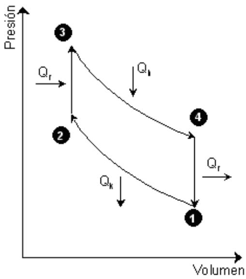  
图 8. 斯特林循环 [3]。

1-2：气体在较低温度下的等温压缩，向冷源放出热量。

2-3：由回热器引起的等容加热，从而导致压力升高。

3-4：气体在最高温度下的等温膨胀，在此过程中气体从热源吸收热量。

4-1：等容冷却，使流体的温度降至最低温度。

卡诺循环的效率可以表示为如下形式，其中 ${ \sf T } _ { 1 }$ 是过程从中吸收热量的热源温度 $\textsf { Y T } _ { 2 }$ 是冷却工作流体的冷源温度。

$$
\begin{array} { r } { \eta = 1 - \frac { T _ { 2 } } { T _ { 2 } } } \end{array}\tag{1}
$$

## 4.4. 工作原理

下面将结合机器的说明示意图，介绍发动机在活塞不同位置状态下的工作过程。

在第一个状态下，由于循环压力达到最大，动力活塞刚刚向轴输出作用力。为了降低这一压力，需要驱动置换器向上止点运动，从而将空气推向系统的冷区，实现压力的降低。惯性飞轮将有助于动力活塞的下行运动。

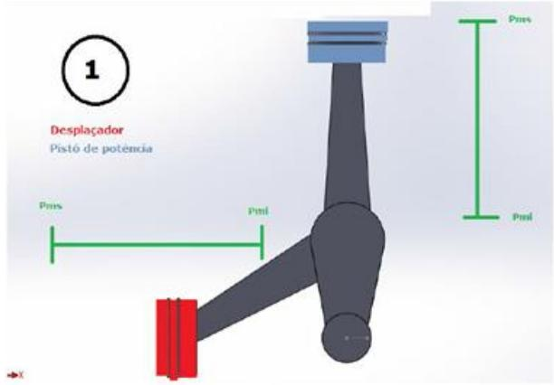  
图 9. 系统压力开始下降。

在发动机的第二个状态下，可以看到置换器已到达其最高点，将全部空气推向冷区，并借助气体的冷却实现了系统压力的降低。

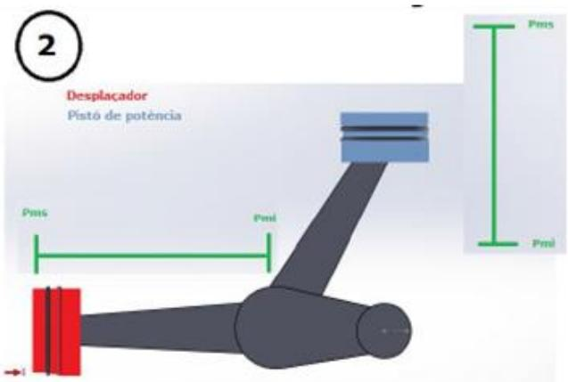  
图 10. 空气的最大冷却。

在机器的第三个状态下，动力活塞已到达下止点，置换器开始向下止点下降，重新将空气引入系统的加热区。

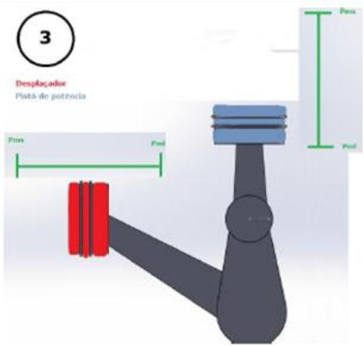  
图 11. 气体开始加热。

最后，运动的最后一个阶段是将全部气体推向发动机的热区，使压力升高到最大值。流体压力与机器外部压力之间的压差将使动力活塞上升，从而向系统输出作用力。

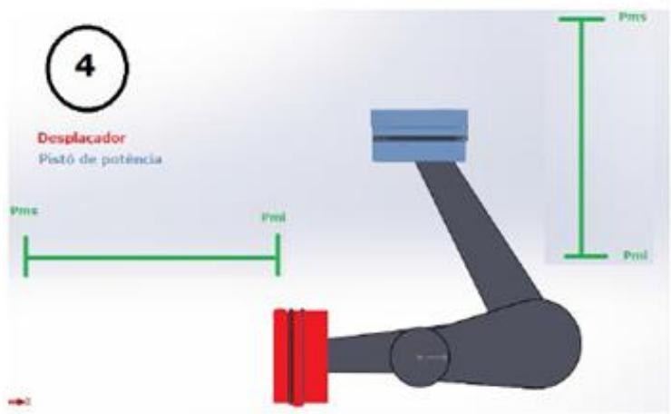  
图 12. 空气的最大加热。

下图表示的是实际斯特林循环。可以观察到，在 2-3 和 4-1 过程中有做功，而在理想循环中这部分功为零。

实际斯特林循环效率低下的最主要原因之一是回热器。加入该部件会增加工作流体流动时的摩擦。为了使实际循环能够接近卡诺循环，回热器必须达到发动机热源的温度。

实际斯特林循环效率低下的另一个最主要原因是，并非所有工作流体都参与循环，而是存在死容积。所谓死容积是指不参与活塞行程扫掠的那部分容积。已有研究表明，系统中死容积所占百分比与循环所做功的减少量之间呈线性关系。因此，如果发动机具有 20% 的死容积，其输出功率将是无死容积时所获功率的 80%。在现代发动机中，死容积始终存在，这是由于加入了内部换热器、自由空间、输送管道和回热器，而这些部件对于改善实际系统的换热是必不可少的。

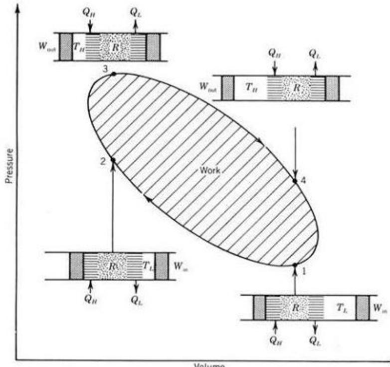  
图 13. 实际斯特林循环 [4]。

# 第5章 斯特林发动机的建模

## 5.1. 先前状态

在分析了程序及斯特林发动机的运行之后，接下来研究该机器在 Dymola 软件中所完成的设计与实现。所要研究的系统可以划分为两个更为简单的模型或子系统：机械模型和热力模型。

由于所要分析的发动机实现此前已由另一位工程师开发完成，因此本部分将是对最重要方面的一个总结，并可结合附录 A 中的文档加以补充，该文档来自工程师 Albert García Prat 的毕业设计（trabajo final de carrera）报告（García Prat 2013）。

### 5.1.1. 机械模型

顾名思义，该模型负责描述系统的机械部分。其功能是将热能转化为机械能，随后再由机械能获得电能。

为实现该系统的建模，并未创建任何新组件，而是复用了 Dymola 现有库（来自 Modelica->Mechanics 库）中的模型和组件。

机械模型主要由四个组件构成：压缩活塞、膨胀活塞（即置换器）、曲轴以及气缸（即壳体）。在上述指定的附录中收录了对每个组件的详细描述，并说明了构成它们的各个部件。此外还附有各部件以及整套元件相互作用的说明性图片。

对机械模型运行的分析也将收录在本工作的附录中。

下面将说明机械模型在 Dymola 软件中的实现。如前所述，该模型并未创建任何新组件，而是采用了 Dymola 库中已有的一个模型。这样就避免了必须对变量、方程、连接器以及描述机械部件之间运行与相互作用的其余元素进行编程。

如果进入 Modelica->Mechanics->MultiBody->Examples->Loops->EngineV6，可以找到一个 V6 发动机，其中某个活塞的模型可以加以利用。对该模型施加少量改动，即可使其适配斯特林发动机的功率活塞和置换器。

在下图中出现了库中的 V6 活塞，图中突出显示了将在机械模型中进行研究和调整的部件。

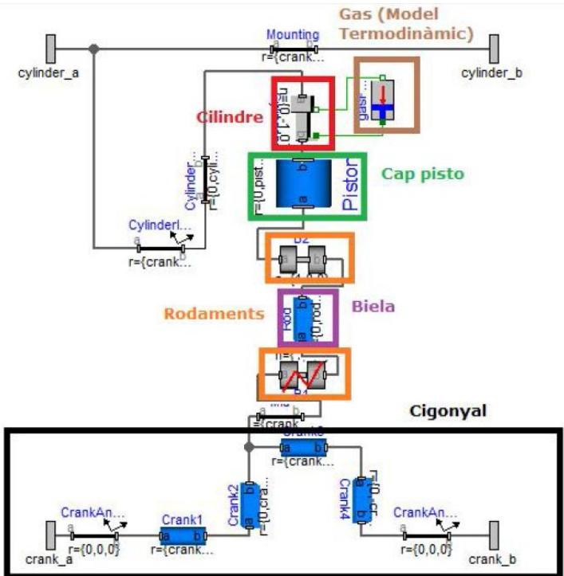  
图 14. 在 Dymola 中建模的活塞组件。

在上图中标出的所有部件中，只需修改气体即可将 V6 的活塞调整为斯特林发动机的活塞。对于功率活塞的情况，必须将 V6 发动机的热力模型替换为斯特林发动机相应的热力模型。至于置换器，则必须删除 V6 的模型，因为该活塞不承受任何由压力产生的力，而只是将体积从一个区域移动到另一个区域。

对 V6 活塞模型所施加的修改，以及机械模型（ModelMecanic\_Stirling）的创建，均可查阅附录中相应的部分。

机械模型创建完成后，其中已包含活塞之间 $90 \textdegree$ 的相位差，将为其耦合一系列组件，以便能够进行仿真以验证其运行。这些组件是：

• 世界（Modelica->Mechanics->MultiBody->World）

• 一个轴承（Modelica->Mechanics->MultiBody->Joints->Revolute）

• 一个惯性飞轮（Modelica->Mechanics->Rotational->Components->Intertia）

世界提供系统的重力和参考轴，它们协调着运动。轴承使曲轴能够旋转，惯性飞轮则稳定这一旋转。

上述组件按如下方式连接：

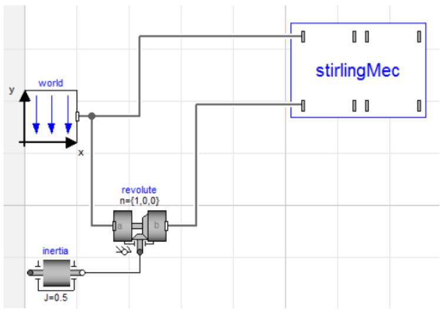  
图 15. ModelMecanic\_Test 的交互区域。

下图中显示了 Dymola 生成的三维动画。

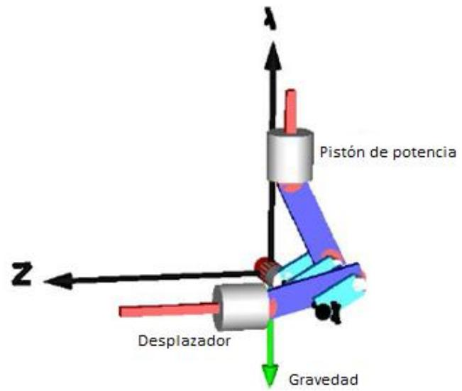  
图 16. 机械模型的三维动画。

### 5.1.2. 热力模型

热力模型是发动机最重要的部分，因为它负责提供力和工作温度，以使发动机正常运行。在这种情况下，Dymola 的库中没有任何类似于气体所遵循的斯特林循环的模型，因此必须从头开始建模。

在软件中实现该模型时区分了两个主要部分。第一部分根据置换器的运动在恒温下每个区域所产生的体积，对质量的运动进行了建模。第二部分则根据每个区域中可用的体积，对各区域质量的加热和冷却进行建模。

**a) 第一部分：**

从上述机械模型的构建出发，将把该机械模型所拥有的活塞位置与热力模型的活塞位置关联起来，从而提供每个区域中可用的体积，并返回一个合力。

将创建第一个模型，名为 ModelConnector\_Posicions\_Force，在该模型中，这些位置在热力模型中的输入与该模型向机械模型输出的力之间建立关联。该模型的具体编程收录在附录中。

一旦模型的输入和输出关联完成，就将对体积的运动进行建模，创建一个名为 ModelVolums 的新模型。在该模型中将指定活塞的运动、发动机的恒定参数，以及一个模型与另一个模型之间如何相互关联。

另一方面，还将定义一些初始条件，以帮助启动热力模型的仿真，并识别该仿真是否正确调整到了它必须执行的目标函数。这些初始条件是：系统的初始压力和温度；每个区域的初始体积，它们取决于初始相对位置，其总和即为系统的总体积；每个区域的摩尔数以及系统的总摩尔数，它们可通过理想气体方程求得，因为工作气体是空气。

该模型的创建，以及几何参数、初始条件和理想气体参数的编程，均可查阅附录。

下面展示在 Dymola 中建模的斯特林发动机根据功率活塞和置换活塞的不同位置所呈现的配置。在以下示意图中表示了参与该机器仿真的所有变量。

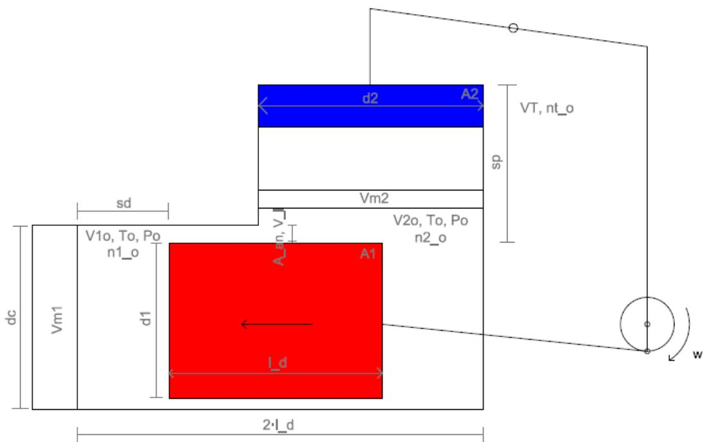

图 17. 系统压力开始下降。  
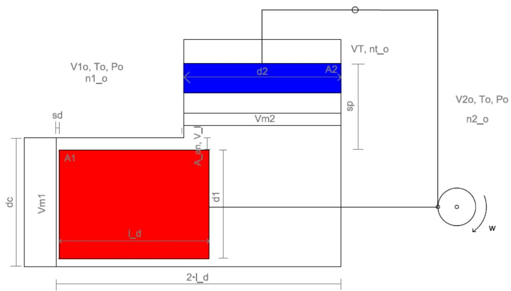  
图 18. 空气最大程度冷却。

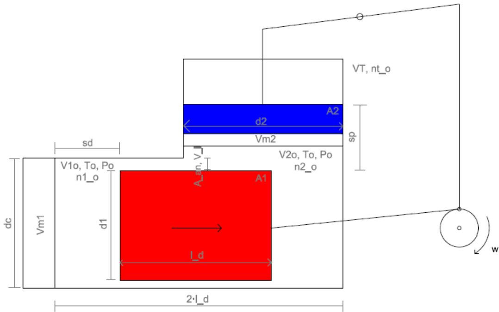

图 19. 气体开始加热。  
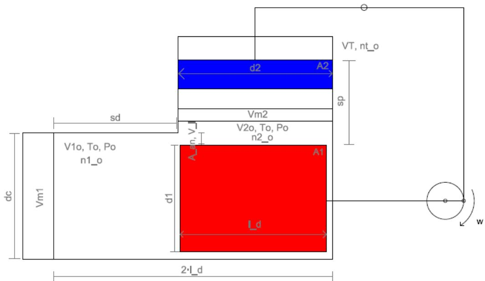  
图 20. 空气最大程度加热。

控制系统运行的方程，以及系统在研究或运行期间变量的演变，均在本工作的附录中进行了描述。同时还将详细描述描述各区域质量运动的连续性方程，以及动量方程，用以描述作用于系统上的力。


一旦定义好 ModelVolums 之后，将对其进行测试，创建一个名为 ModelVolums\_Test 的新模型。该模型的框图如下图所示：

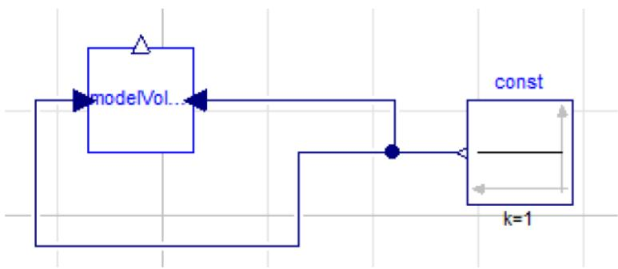  
图 21. ModelVolums\_Test 的交互区域。

附录中收录了为使上述模型运行而需输入的参数和初始条件所对应的代码。此外，还给出了相应的图表，用于展示体积如何随位置变化、质量如何随这些体积变化，以及该模型输出的合力。

**b) 第二部分：**

在这一部分中，将为 ModelVolums 添加系统的加热与冷却过程。将重新研究该系统，加入新的过程，以查看生成了哪些参数和变量。

将创建一个新模型 ModelTermodinamic，它以 ModelVolums 为基础，并添加两个新参数和九个新变量。由于新增了两个输入，必须用一个包含这些输入的新模型来替代 ModelConnectors\_Posicions\_Forces，该新模型将命名为 ModelConnectors\_Posicions\_Temperatures\_Forces。

ModelTermodinamic 和 ModelConnectors\_Posicions\_Temperatures\_Forces 的程序代码可在附录中查阅。

接下来将建立用于描述系统加热与冷却过程，以及各区域能量交换演变的方程。获得这些方程并将其在 Dymola 中实现的步骤收录在附录中。

一旦定义好热力学模型，将创建一个名为 ModelTermodinamic\_Test 的模型，用于检验系统各区域中产生的能量交换。在该模型中，除了已有的热力学模型外，还将添加分别提供加热温度和冷却温度的模型。

提供热源温度的模型是一个斜坡信号源 (Modelica->Blocks->Sources->Ramp)，它从环境温度 (offset=293.73 K) 开始，并按照指定的高度 (height) 递增。冷却温度则相当于一个常数，等于环境温度。

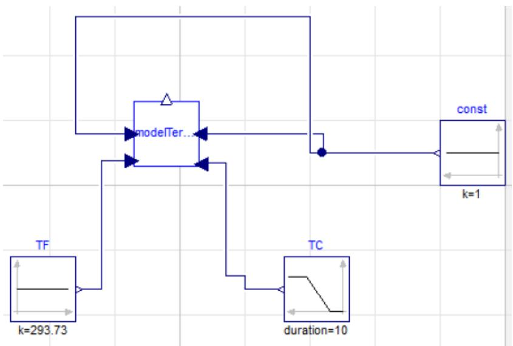  
图 22. ModelTermodinamic\_Test 的交互区域。

附录中规定了在对上述模型进行仿真之前必须实现的参数和初始条件。此外，还给出了系统各区域的温度及传热图，这些量在系统仿真过程中会随质量从一个区域到另一个区域的运动而变化。

一旦实现了系统中涉及的两个大型模型，接下来将它们耦合在一起，以观察整个系统——斯特林发动机——如何工作。新模型将命名为 Motor\_Stirling，其中将建立之前实现的 ModelMecanic，并对其做两项修改：

• 第一项修改：删除正弦函数，改为连接 ModelTermodinamic。

第二项修改：在每个气缸中放置一个位置传感器 (Modelica->Mechanics->Translational->Sensors->PositionSensor)，它将给出功率活塞或置换器相对于其各自气缸的 "s" 或相对位置。这些传感器从气缸的连接器连接到 ModelTermodinamic 的相应输入。

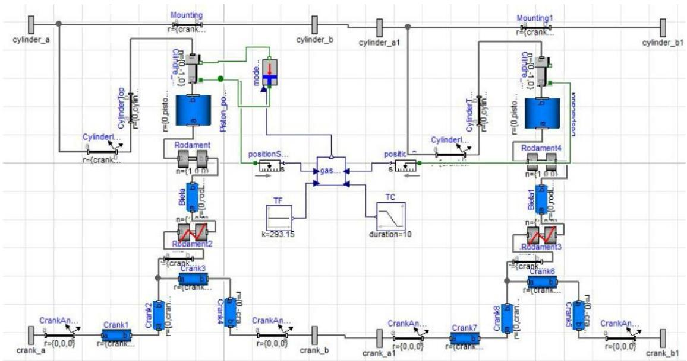  
图 23. Motor\_Stirling 的交互区域。

一旦创建了发动机模型，就对其进行测试，包括机械模型测试中所使用的相同资源（世界、轴承和惯性飞轮），并添加其他一些组件以帮助发动机初始启动。

另一方面，为了能够确定发动机输出的功率，将添加一个传感器来测量曲轴上产生的功率，同时还对其施加摩擦。为了获得合适的功率，规定摩擦的值约为曲轴最大速度的百分之六十。

强制启动系统的组件以及功率传感器和摩擦的程序代码在本报告的附录中有所描述。

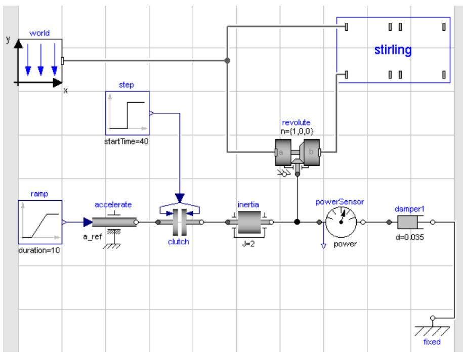  
图 24. Motor\_Stirling 测试所用的组件。

## 5.2. 模型验证

### 5.2.1. 仿真的开始


在开始对斯特林发动机的实现进行修改之前，有必要分析初始模型的运行情况，以试图找出所存在问题的根源。

要执行的第一步是仔细研究机械模型和热力学模型，以检测代码实现中可能存在的错误。

5.2.2.

### 5.2.2. 惯性与温度仿真

需要说明的是,本节仅给出最重要仿真的图形,而全部图形均收录于附录的 B.2 节中。

**a) 温度仿真**

在研究了 Albert 所设计发动机的机械模型与热力学模型之后,接下来通过三维可视化来分析该机器的运行情况。经过上述仿真可以验证,发动机在运行一段时间后停止,甚至开始朝相反方向运动,这表明存在一个必须解决的问题。

为尝试改善发动机的运行,引入的第一处修改是提高热源温度(Tc),使更多能量进入发动机。另一方面,也降低冷源温度以增大温差。冷源的初始值取环境温度(T = 293.15 K)。

为此,进入定义温度的斜坡函数,在不修改 offset(偏移量)的情况下改变该函数的高度(height)。初始时,高度值取 230,转动惯量(J)取 2 kg/m²。

表 1. 修改热源温度所进行的仿真。
<table><tr><td rowspan="2">仿真工况</td><td colspan="2">温度斜坡</td><td rowspan="2">能否运行(是/否)</td></tr><tr><td>Offset(K)</td><td>Height(K)</td></tr><tr><td>1</td><td>293,15</td><td>240</td><td>否</td></tr><tr><td>2</td><td>293,15</td><td>250</td><td>否</td></tr><tr><td>3</td><td>250</td><td>260</td><td>否</td></tr><tr><td>4</td><td>250</td><td>280</td><td>否</td></tr></table>

前两次仿真中,提高热源温度,同时冷源保持在环境温度。后两次仿真继续提高热源温度,同时将冷源温度降至 250 K。

  
图 25. 仿真工况 4:角速度。

由上图可以看出仿真工况 4,它与前 3 个工况一样反映出:尽管进行了上述温度修改,发动机仍无法运行。因此,在完成这些仿真后可以得出结论:增大热源与冷源之间的温差不足以保证发动机良好运行。因此,重新将冷源设为环境温度。

**a) 惯性仿真**

下一处修改是增大转动惯量(J),这一想法源于如下思考:也许最初设定的 2 $\mathsf { k g } / \mathsf { m } ^ { 2 }$ 的转动惯量不足以确保启动电机带动斯特林发动机启动。这一决定还基于对角速度图形的分析,从中可以观察到机器转动得非常缓慢。

表 2. 修改惯性飞轮所进行的仿真。
<table><tr><td>仿真工况</td><td>仿真时间(秒)</td><td>温度斜坡高度</td><td>转动惯量(kg/m²)</td><td>能否运行(是/否)</td></tr><tr><td>5</td><td>80</td><td>(K) 240</td><td>5</td><td>是</td></tr><tr><td>6</td><td>80</td><td>240</td><td>4</td><td>是</td></tr><tr><td>7</td><td>80</td><td>240</td><td>3</td><td>是</td></tr><tr><td>8</td><td>200</td><td>240</td><td>3</td><td>否</td></tr></table>

在第一次仿真中,大幅度增大转动惯量以分析发动机的行为。实验之后验证机器在所设定的时间内能够运行,因此只要它继续运行,就逐步减小该转动惯量值。

最终将该值设定为 $\mathsf { J } { = } 3 ~ \mathsf { k g } / \mathsf { m } ^ { 2 }$,并仿真 200 秒,以检验其行为能否持续超过 80 秒,还是相反,发动机会再次停止。仿真后可以观察到,发动机在 150 秒后失稳,但并未完全停止。

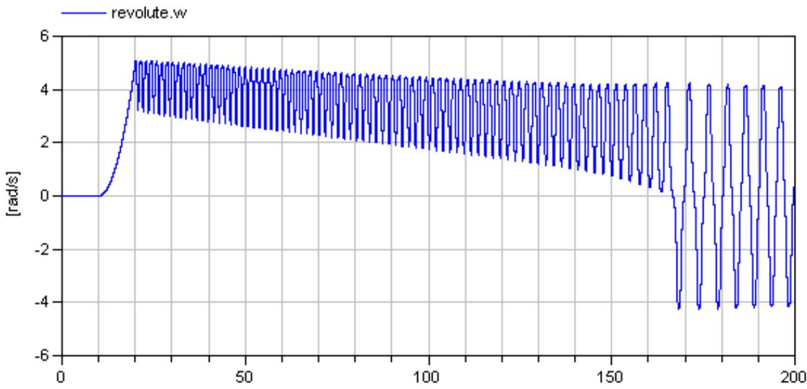  
图 26. 仿真工况 8:角速度。

### 5.2.3. 启动系统与温度仿真

**a) 由启动电机引起的运行仿真**

为了检验启动惯性对机器运动所起的作用,接下来仅由启动系统提供的惯性来仿真发动机的运行。因此,将两个热源温度设为相等,$T _ { \mathrm { c } } = \mathsf { T } _ { \mathsf { F } } ,$ 并开始逐步增加仿真时间,目的是检验惯性对发动机的作用能持续多长时间。

表 3. 机器因启动电机而运行的仿真。
<table><tr><td>仿真工况</td><td>仿真时间(秒)</td><td>转动惯量(kg/m²)</td><td>能否运行(是/否)</td></tr><tr><td>9</td><td>80</td><td>3</td><td>是</td></tr><tr><td>10</td><td>200</td><td>3</td><td>是</td></tr><tr><td>11</td><td>400</td><td>3</td><td>是</td></tr><tr><td>12</td><td>600</td><td>3</td><td>否</td></tr></table>

从上表可以推断出,发动机的启动惯性足以使其至少运行 400 秒。在最后一个工况中,发动机一直运行到 440 秒,此时完全停止。在下图中,通过分析发动机的角速度可以看到上述行为。

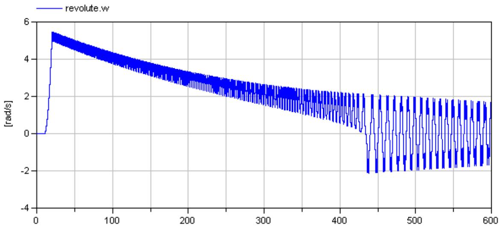  
图 27. 仿真工况 $n ^ { o } 1 2 .$ :角速度。

b) 启动电机运行与温度变化的比较

接下来决定比较热源间温差为 240 度时发动机的行为,与仅由启动电机引起的行为。所得结果见下图。在第一幅图中,蓝色对应仿真工况 8,红色对应仿真工况 10。

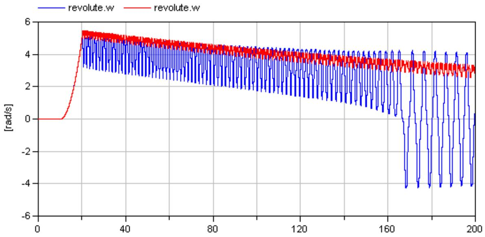  
图 28. 工况 $\boldsymbol { n ^ { o } 8 }$ 与 $n ^ { o } 1 0 .$ 的比较:角速度。

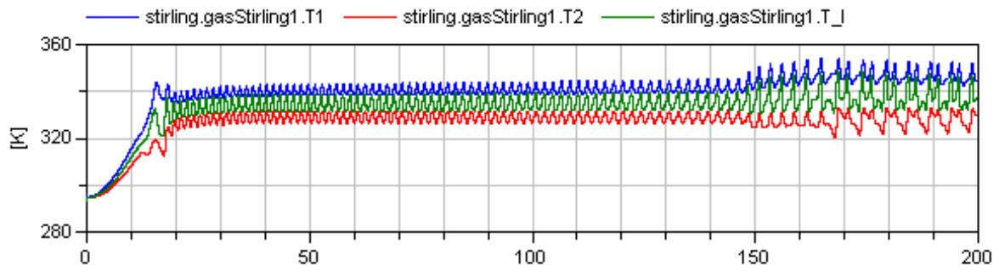

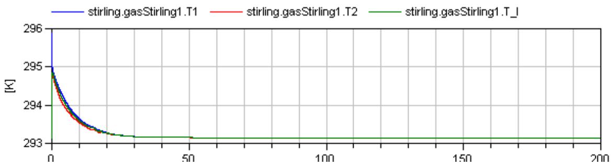

图 29. 工况 8(上)与 10(下)的比较:温度。  
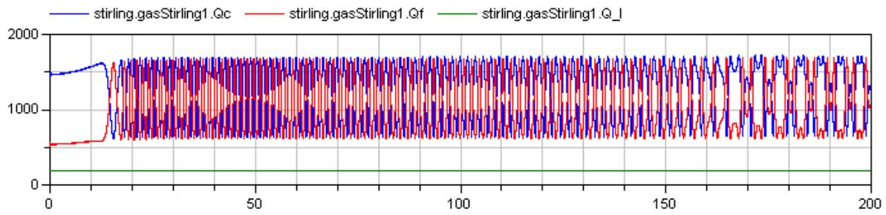

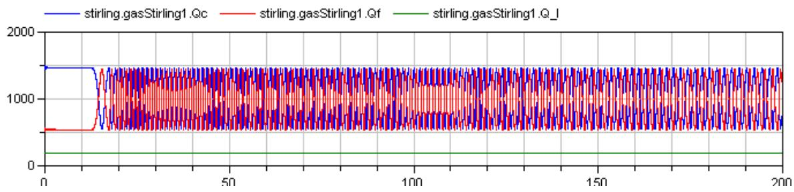  
图 30. 工况 8(上)与 10(下)的比较:传热。

可以观察到,所产生的传热几乎完全源于流体在热区与冷区之间存在的压力差。此外,由于惯性飞轮的转动惯量 $( \mathsf { J } { = } 3 \mathsf { k g } / \mathsf { m } ^ { 2 } )$ 在启动时给予发动机的加速,使得发动机无需温度变化即可运行近 500 秒。因此可以得出结论:在这种情况下,热源间温差的影响几乎可以忽略不计,而且发动机存在一个问题,因为没有强制启动的帮助它就无法运行。

### 5.2.4. 力的修正

在仔细分析机器当前的行为后,可以得出结论:从热力学系统传递到机械系统的力可能符号有误,即该力不是以正值进入机械系统,而是以负值到达。因此,为了检验发动机在负力情况下是否运行得更好,需要进入热力学系统的代码区,修改合力方程,引入一个负号。

$$
\begin{array} { r l } & { \mathrm { / / { F o r } \varsigma a ~ \varsigma _ { G } \circ \varsigma _ { L } \circ \varsigma _ { C } \circ \varsigma _ { P } \circ 1 ~ \varsigma _ { L } \circ \varsigma _ { C } \circ \varsigma _ { C } \circ \varsigma _ { P } \circ \varsigma _ { C } \circ \varsigma _ { C } \circ \varsigma _ { C } } } ,  \\ &  \mathrm { ~ \ \ } \mathrm { ~ \ } \mathrm { ~ \ \ } \mathrm { ~ \ } \mathrm { ~ \ \ } \mathrm { ~ \ } \mathrm { ~ \ \ } \mathrm { ~ \ } \mathrm { ~ \ \ } \mathrm { ~ \ } \mathrm { ~ \ \ } \mathrm { ~ \ } \mathrm { ~ \ \ } \mathrm { ~ \ \ } \mathrm { ~ \ } \mathrm { ~ \ \ } \mathrm { ~ \ \ } \mathrm { ~ \ \ } \mathrm { ~ \ \ } \mathrm { ~ \ \ } \mathrm { ~ \ \ } \mathrm { ~ \ \ } \mathrm { ~ \ \ } \mathrm { ~ \ \ } \mathrm { ~ \ \ } \mathrm { ~ \ \ } \mathrm { ~ \ \ } \mathrm { ~ \ \ } \mathrm { ~ \ \ } \mathrm { ~ \ \ } \mathrm { ~ \ \ } \mathrm { ~ \ \ } \mathrm { ~ \ \ } \mathrm { ~ \ \ } \mathrm { ~ \ \ } \mathrm { ~ \ \ } \mathrm { ~ \ \ } \mathrm { ~ \ \ } \mathrm { ~ \ \ } \mathrm { ~ \ \ } \mathrm { ~ \ \ } \mathrm { ~ \ \ } \mathrm { ~ \ \ } \mathrm { ~ \ \ } \mathrm { ~ \ \ } \mathrm { ~ \ \ } \mathrm { ~ \ \ } \mathrm { ~ \ \ } \mathrm { ~ \ \ } \mathrm { ~ \ \ } \mathrm { ~ \ \ } \mathrm { ~ \ \ } \mathrm { ~ \ \ } \mathrm { ~ \ \ } \mathrm { ~ \ \ } \mathrm { ~ \ \ } \mathrm { ~ \ \ } \mathrm { ~ \ \ } \mathrm { ~ \ \ } \mathrm { ~ \ \ } \mathrm { ~ \ \ } \mathrm { ~ \ \ } \mathrm { ~ \ \ } \mathrm { ~ \ \ } \mathrm { ~ \ \ } \mathrm { ~ \ \ } \mathrm { ~ \ \ } \mathrm { ~ \ \ } \mathrm { ~ \ \ } \mathrm { ~ \ \ } \mathrm { ~ \ \ } \mathrm { ~ \ \ } \mathrm { ~ \ \ } \mathrm { ~ \ \ } \mathrm { ~ \ \ } \mathrm  ~  \end{array}
$$

图 31. 在热力学模型代码中修改合力方程。

下面将比较以下三种情况下的合成压力、从热力学系统到达机械系统的力以及动力活塞的位置(sp):

表 4. 修改温度斜坡和力的仿真。
<table><tr><td>仿真案例</td><td>仿真时间</td><td>温度斜坡高度</td><td>转动惯量</td><td>力</td><td>图形颜色</td></tr><tr><td>13</td><td>(秒) 80</td><td>(K) 0</td><td>(kg/m²) 3</td><td>f</td><td>红色</td></tr><tr><td>14</td><td>80</td><td>240</td><td>3</td><td>f</td><td>蓝色</td></tr><tr><td>15</td><td>80</td><td>240</td><td>3</td><td>-f</td><td>绿色</td></tr></table>

### 5.2.5. 强制启动系统

仿真的目标是分析启动系统使发动机运转所需的最小角速度(ω),同时考虑加速斜坡的高度和持续时间组合。

另一方面,还需要研究发动机的预热,即热区温度 $( \mathsf { T } _ { \mathsf { c } } )$ 提供的使发动机正常运行所需的温度。

这样,将确定加热时间、加速斜坡高度和持续时间的最优组合。

接下来的仿真将以实现前几段中确定的目标为目的。

**a) 无强制启动的系统分析**

下一步是在施加力修正且没有启动电机辅助的情况下仿真系统,以检验机器是否能在没有强制启动辅助的情况下自行运动。

要消除启动电机的影响,需要进入 Step(它激活制动加速的离合器),并将其设置为不是在 20 秒时启动(这意味着在 20 秒时给电机一个加速度),而是在 0 秒时激活(这意味着 Step 在第 0 秒激活离合器,因此加速度不起作用)。

表 5. 无强制启动系统的仿真。
<table><tr><td>仿真案例</td><td>仿真时间(秒)</td><td>加热时间(秒)</td><td>温度斜坡高度(K)</td></tr><tr><td>16</td><td>80</td><td>20</td><td>240</td></tr></table>

表 6.(续)无强制启动系统的仿真。
<table><tr><td rowspan="2">仿真案例</td><td colspan="2">温度 Step</td><td rowspan="2">转动惯量(kg/m²)</td><td rowspan="2">是否运转(是/否)</td></tr><tr><td></td><td>启动时间(秒)</td></tr><tr><td>16</td><td></td><td>0</td><td>3</td><td>否</td></tr></table>

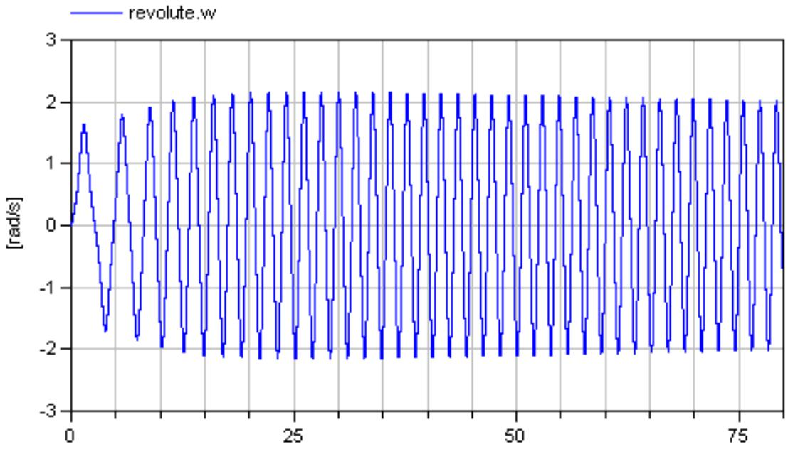  
图 32. 仿真案例 $n ^ { o } 1 6 \cdot$ 角速度。

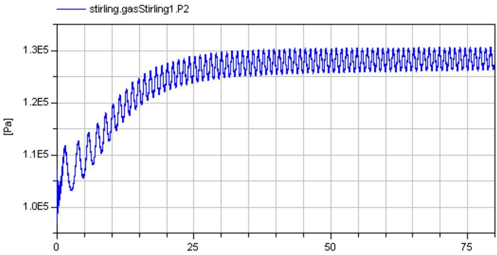  
图 33. 仿真案例 16:压力。

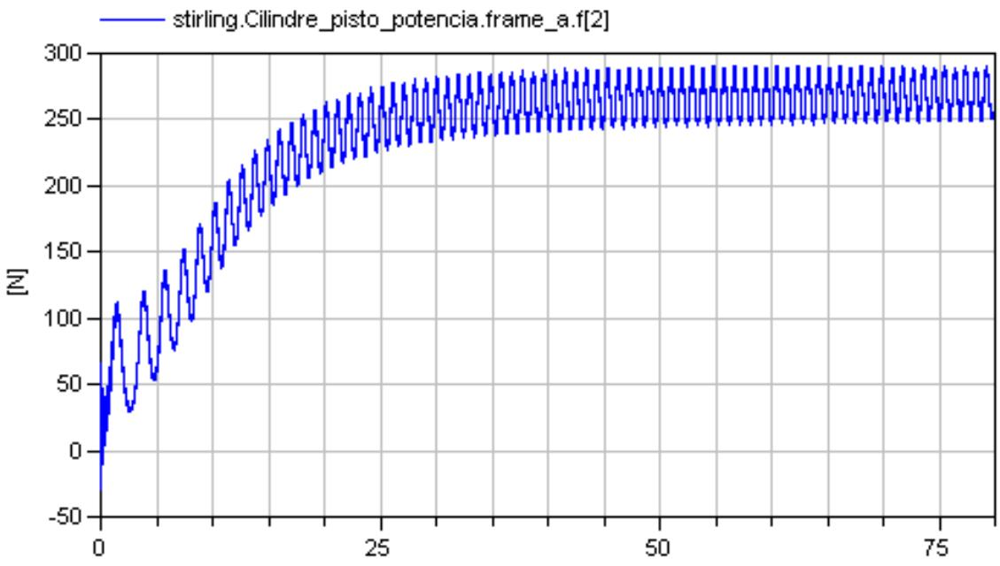  
图 34. 仿真案例 $n ^ { o } 1 6 \cdot$ 力。

从绘制的图形可以看出,发动机无法正常运行,而是在未完成一整圈的情况下左右振荡。这意味着气缸内压力不断累积,作用在动力活塞上的力不断增大,但仍不足以使发动机运动。

因此可以推断,没有强制启动系统发动机就无法工作,但可以尝试减小该系统的作用,在不过度的情况下给机器必要的推动。

**b) 修改强制启动的系统分析**

下面将进行一系列仿真,以确定所研究机器的最优启动系统配置。

所有展示的仿真均在 80 秒的仿真时间内进行,温度源温差为 240 度,转动惯量为 $3 ~ \mathsf { k g } / \mathsf { m } ^ { 2 }$

表 7. 修改强制启动系统的仿真。
<table><tr><td>仿真案例</td><td>加热时间(秒)</td><td>加速持续时间(秒)</td><td>是否运转(是/否)</td></tr><tr><td>17</td><td>10</td><td>10</td><td>否</td></tr><tr><td>18</td><td>12</td><td>10</td><td>否</td></tr><tr><td>19</td><td>14</td><td>10</td><td>否</td></tr><tr><td>20</td><td>16</td><td>10</td><td>否</td></tr><tr><td>21</td><td>20</td><td>1</td><td>否</td></tr><tr><td>22</td><td>20</td><td>4</td><td>否</td></tr><tr><td>23</td><td>18</td><td>4</td><td>否</td></tr><tr><td>24</td><td>18</td><td>6</td><td>是</td></tr><tr><td>25</td><td>30</td><td>6</td><td>是</td></tr><tr><td>26</td><td>30</td><td>4</td><td>否</td></tr></table>

加热时间通过设置启动加速的斜坡的 Start Time 来编程确定。该加速的持续时间由控制制动加速离合器的 Step 的 Start Time 决定。

如上表所示,发动机唯一能运转的仿真只有第 24 号和第 25 号。两者的共同点是加速斜坡的持续时间均为 6 秒。然而,这一加速时间过长,因此在下一节中将尝试缩短启动电机的工作时间。

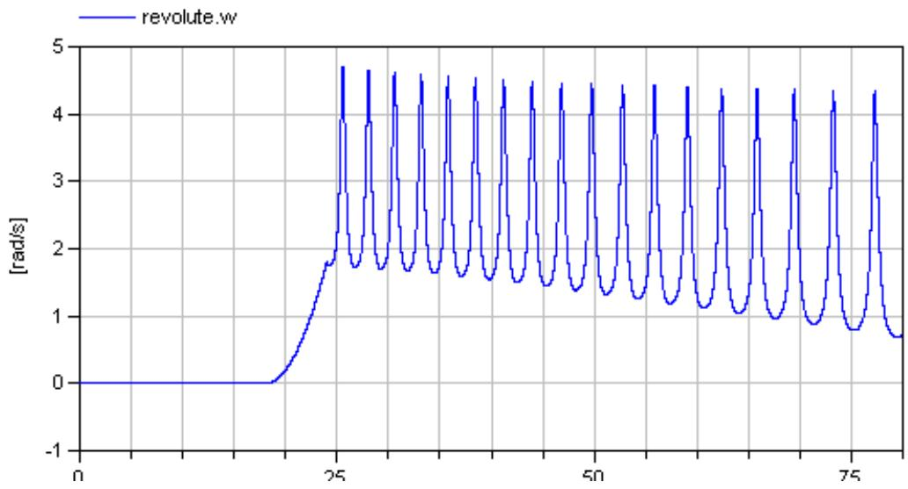  
图 35. 仿真案例 24:角速度。

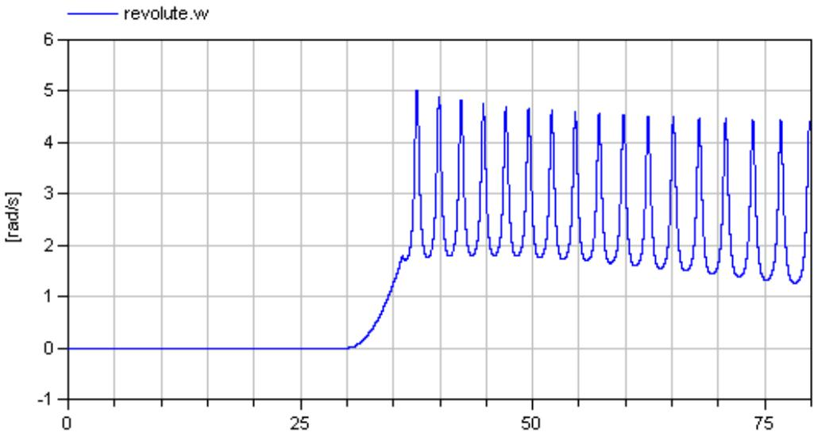  
图 36. 仿真案例 25:角速度。


**c) 通过修改加速斜坡对系统进行分析**

目标是向发动机提供足以使其启动的加速度，但其持续时间不应过长。因此，将尝试把加速斜坡的高度与持续时间结合起来，使发动机能够启动，即随着斜坡高度的增加，其持续时间相应缩短。

较为合适的做法是获得一个加速度持续时间不超过 2 或 3 秒的强制启动系统。接下来将进行多次仿真，以得到合适的组合。所有仿真均以发动机加热 20 秒为出发点。

下表列出了所设定的组合：

表 8. 修改加速斜坡的仿真。
<table><tr><td rowspan="2">仿真案例</td><td rowspan="2">加热时间(秒)</td><td colspan="2">加速斜坡</td><td rowspan="2">是否运行(是/否)</td></tr><tr><td>持续时间(秒)</td><td>高度</td></tr><tr><td>27</td><td>20</td><td>10</td><td>1</td><td>是</td></tr><tr><td>28</td><td>20</td><td>5</td><td>2</td><td>是</td></tr><tr><td>29</td><td>20</td><td>3</td><td>5</td><td>否</td></tr><tr><td>30</td><td>20</td><td>4</td><td>5</td><td>是</td></tr><tr><td>31</td><td>20</td><td>1</td><td>10</td><td>否</td></tr></table>

根据所完成的仿真可以指出，发动机仅在 27、28 和 30 号仿真中启动，这些仿真的加速度持续时间较长。

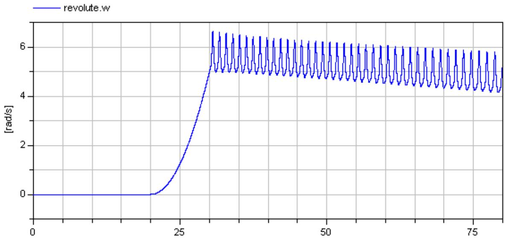  
图 37. 27 号仿真案例:角速度。

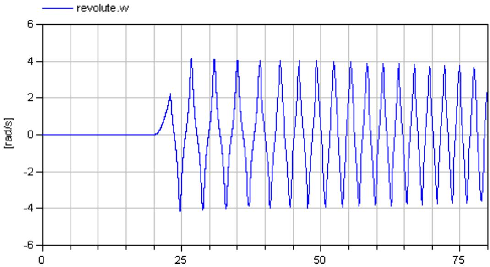  
图 38. 29 号仿真案例:角速度。

如前所述，目标是缩短该持续时间，因此将进行新的试验，增加发动机的加热时间，以检验该温升是否足以使机器在更短的加速度下正常运行。

d) 通过增加加热时间并修改加速斜坡对系统进行分析

下面给出的是将加热时间从 20 秒增加到 30、40 和 60 秒后所进行的仿真。所有这些仿真都呈现了加速斜坡高度与持续时间的不同组合。

表 9. 增加加热时间并修改加速斜坡的仿真。
<table><tr><td rowspan="2">仿真案例</td><td rowspan="2">加热时间(秒)</td><td colspan="2">加速斜坡</td><td rowspan="2">是否运行(是/否)</td></tr><tr><td>持续时间(秒)</td><td>高度</td></tr><tr><td>32</td><td>40</td><td>1</td><td>10</td><td>否</td></tr><tr><td>33</td><td>40</td><td>2</td><td>10</td><td>否</td></tr><tr><td>34</td><td>40</td><td>3</td><td>10</td><td>是</td></tr><tr><td>35</td><td>50</td><td>1</td><td>10</td><td>否</td></tr><tr><td>36</td><td>50</td><td>2</td><td>10</td><td>否</td></tr><tr><td>37</td><td>50</td><td>3</td><td>10</td><td>是</td></tr><tr><td>38</td><td>60</td><td>1</td><td>12</td><td>否</td></tr><tr><td>39</td><td>60</td><td>2</td><td>12</td><td>否</td></tr></table>

上表显示，无论机器的加热时间或加速斜坡的高度如何，只有加速度持续时间为 3 秒的组合才有利于发动机运行。下图给出了 34 号仿真案例，即发动机能够运行的两个案例之一。

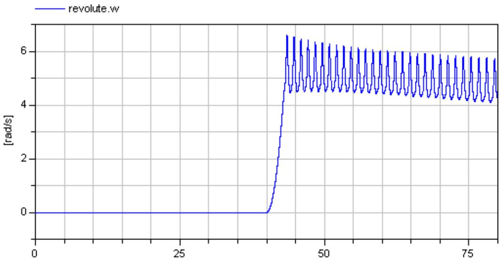  
图 39. 34 号仿真案例:角速度。

为尝试缩短加速度的持续时间，将通过增加仿真时间、加热时间并修改加速斜坡来进行试验。

e) 通过增加加速斜坡高度和仿真时间对系统进行分析

经过上述试验后，决定将加速斜坡的高度增加到 15，仿真时间增加到 200 秒，并将机器的预热时间设定为 100 秒。这一修改旨在获得足够大的热源与冷源之间的温差，使发动机能够在有利于机器启动的加速度下运行 200 秒。

表 10. 增加仿真时间和加速斜坡高度的仿真。
<table><tr><td rowspan="2">仿真案例</td><td rowspan="2">仿真时间(秒)</td><td rowspan="2">加热时间</td><td colspan="2">加速斜坡</td><td rowspan="2">是否运行(是/否)</td></tr><tr><td>持续时间(秒)</td><td>高度</td></tr><tr><td>40</td><td>200</td><td>(秒) 100</td><td>1</td><td>15</td><td>否</td></tr><tr><td>41</td><td>200</td><td>100</td><td>2</td><td>15</td><td>否</td></tr><tr><td>42</td><td>200</td><td>100</td><td>3</td><td>15</td><td>是</td></tr></table>

完成上述仿真后确定，机器至少需要三秒的加速度、且高度为 15 时，才能完成第一圈转动。发动机在这些规格下的运行情况可在下图中观察到：

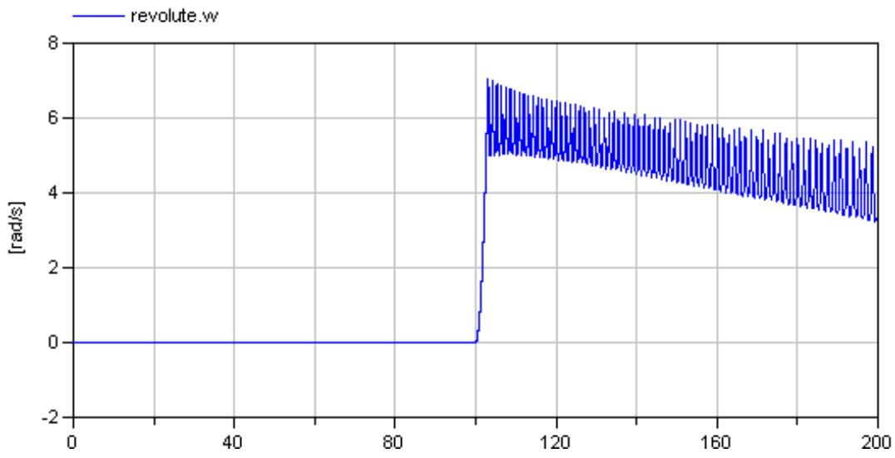  
图 40. 仿真案例 $n ^ { o _ { 4 2 } }$ :角速度。

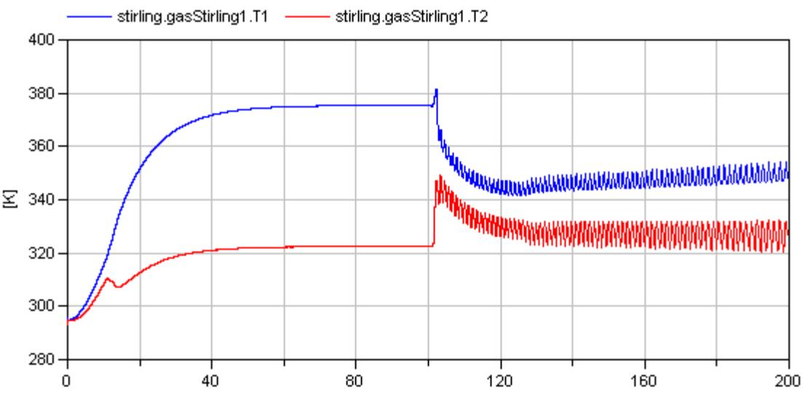  
图 41. 仿真案例 $n ^ { o _ { 4 2 } } .$ :温度。

由于在热源处获得的温度不够高，因此将提高温度 Step 的高度，以使热源与冷源之间的温差更大。这一修改基于以下验证：在一个正在运行的斯特林发动机模型样机中，热源的温度远高于通过 Dymola 仿真所得到的温度。

**f) 通过提高热源温度对系统进行分析**

将温度 Step 的高度设定为 500，加热时间确定为 30 秒，加速斜坡的高度为 15、持续时间为 3 秒。

表 11. 提高热源温度的仿真。
<table><tr><td>仿真案例</td><td>时间</td><td>仿真时间(秒) 加热时间(秒)</td><td>温度斜坡高度(K)</td></tr><tr><td>43</td><td>80</td><td>30</td><td>500</td></tr></table>

表 12. (续) 提高热源温度的仿真。
<table><tr><td rowspan="2">仿真案例</td><td colspan="2">加速斜坡</td><td rowspan="2">是否运行(是/否)</td></tr><tr><td>持续时间(秒)</td><td>高度</td></tr><tr><td>43</td><td>3</td><td>15</td><td>是</td></tr></table>

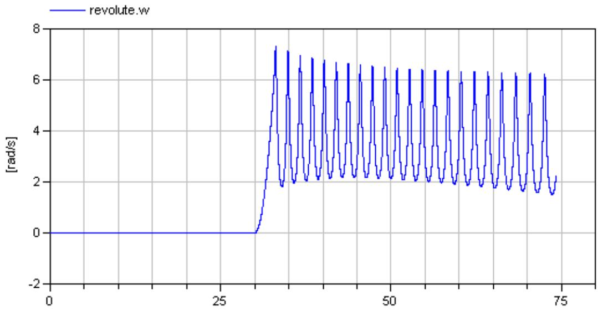  
图 42. 43 号仿真案例:角速度。

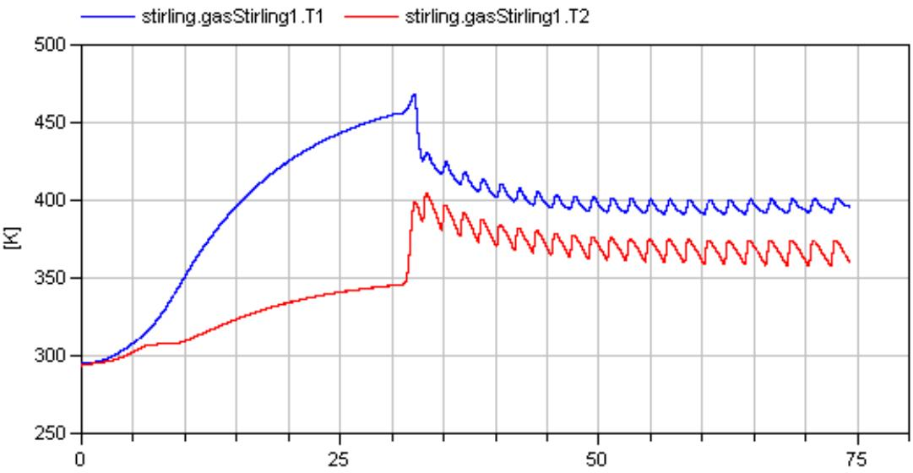  
图 43. 43 号仿真案例:温度。

上述仿真运行正常，但角速度振荡很大，且并非逐步增加，而是逐渐衰减。因此，为消除该振荡，将增大发动机的转动惯量 (J)。

**g) 增大转动惯量 (J)**

将转动惯量设定为 J=5，并对系统运行进行仿真。试验后验证，角速度的振荡确实显著减小。

表 13. 增大转动惯量的仿真。
<table><tr><td>仿真案例</td><td>仿真时间(秒)</td><td>加热时间(秒)</td><td>温度斜坡高度(K)</td></tr><tr><td>44</td><td>80</td><td>30</td><td>500</td></tr></table>

Tabla 14. (Continuación) Simulación aumentando el momento de inercia.
<table><tr><td rowspan="2">仿真工况</td><td colspan="2">加速斜坡</td><td rowspan="2">转动惯量  $( \log / \mathbf { m } ^ { 2 } )$ </td><td rowspan="2">运行(是/否)</td></tr><tr><td>持续时间(秒)</td><td>高度</td></tr><tr><td>44</td><td>3</td><td>15</td><td>5</td><td>是</td></tr></table>

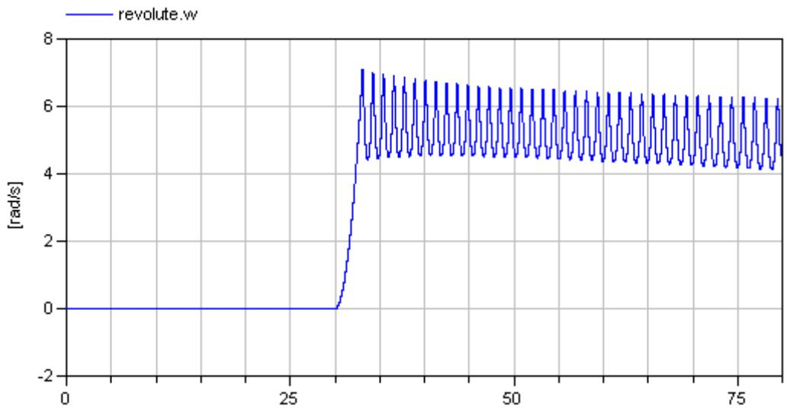  
图44. 仿真工况第44例:角速度。

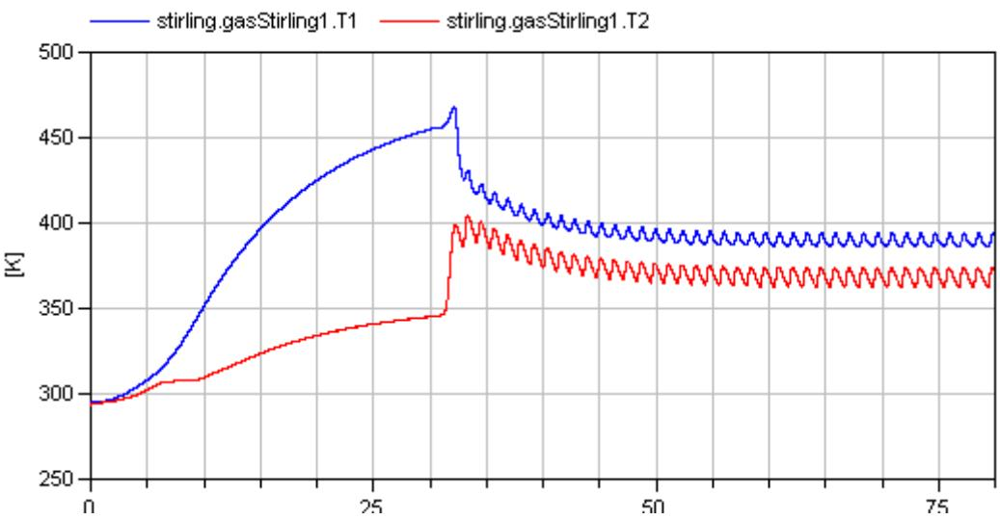  
图45. 仿真工况第44例:温度。

然而,尽管在仿真的最初时刻热源的温度较高,但随着时间的推移它会逐渐下降,这导致了机器性能的退化。因此,决定通过增大传热系数 $\mathsf { U } _ { \mathsf { C } } \ \mathsf { y } \ \mathsf { U } _ { \mathsf { F } }$ 来改善系统的冷却效果以及热源的传热。

**h) 增大传热系数**

最初,各系数的取值为 $\mathsf { U } _ { \mathsf { C } } = 1 0 \ \mathsf { y } \ \mathsf { U } _ { \mathsf { F } } = 1 0 0$。进行了第一次试验,将这些值增大到 $\mathsf { U } _ { \mathsf { C } } = 1 0 0 \ \mathsf { y } \ \mathsf { U } _ { \mathsf { F } } = 1 0 0 0$。下图中展示了代码中实现这些系数修改的区域。

```matlab
animation=false) a;
Modelica.Mechanics.MultiBody.Interfaces.Frame_a
cylinder_al
a;
Modelica.Mechanics.MultiBody.Interfaces.Frane_a
cylinder_bl
a;
Modelica.Mechanics.MultiBody.Interfaces.Frame_a
crank_al
a;
Modelica.Mechanics.MultiBody.Interfaces.Frame_a
crank_b1
a;
Modelica.Mechanics.Translational.Sensors.PositionSensor positionSensor
a;
Modelica.Mechanics.Translational.Sensors.PositionSensor positionSensorl
a;
Modelica.Blocks.Sources.Constant TF(k=293.15)
a;
Modelica.Blocks.Sources.Ramp TC( duration=10,
offset=293.15,
height=500)
a;
ModelTermodinamic_Stirling
gasStirlingl(
Pl(fixed=true),
nt(fixed=true),
nl(fixed=true),
n2(fixed=true),
Uc=1000,
Uf=1000L
d2=Piston_potencia.diameter,
dl=Desplacador.diameter,
1_d=Desplacador.length,
dc=0.18,
Vm1=0.002,
Vm2=0.0015) a;
ModelConnectors_Forces modelConnectors_Forces a;
```  
图46. 在 ModelMecanic\_Stirling 中修改传热系数。

Tabla 15. Simulaciones modificando los coeficientes de transferencia de calor.
<table><tr><td rowspan="2">仿真工况</td><td colspan="2">加速斜坡</td><td rowspan="2">转动惯量(kg/m²)</td><td colspan="2">传热系数</td><td rowspan="2">运行(是/否)</td></tr><tr><td>持续时间(秒)</td><td>高度</td><td>Uc</td><td>UF</td></tr><tr><td>45</td><td>3</td><td>15</td><td>5</td><td>100</td><td>1000</td><td>是</td></tr><tr><td>46</td><td>3</td><td>15</td><td>5</td><td>1000</td><td>1000</td><td>否</td></tr></table>

  
图47. 仿真工况第45例:角速度。

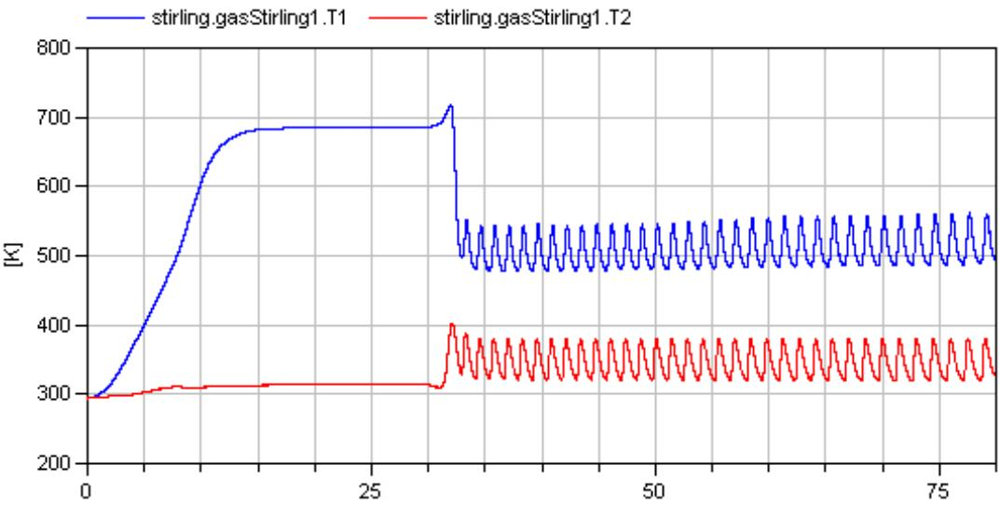  
图48. 仿真工况 $n ^ { o } 4 5 \cdot$ 温度。

由于验证其能够运行,决定将 $\mathsf { U } _ { \mathsf { C } }$ 的值增大到 1000。仿真后观察到这一修改是无效的,因为机器无法运行。

i) 在修改传热系数的情况下增大仿真时间

目的是检验发动机能否在更长时间内正常运行,因此将仿真区间增大到 300 秒,同时将热系数的组合保持为 $\mathsf { U } _ { \mathtt { C } } = 1 0 0 \ \mathsf { y } \ \mathsf { U } _ { \mathtt { F } } = 1 0 0 0$。

Tabla 16. Simulación aumentando el tiempo de simulación y modificando los coeficientes de transferencia de calor.
<table><tr><td>仿真工况</td><td>仿真时间(秒)</td><td>加热时间(秒)</td><td colspan="2">传热系数</td><td>运行(是/否)</td></tr><tr><td>47</td><td>300</td><td>30</td><td> ${ \bf u } _ { \mathsf { c } }$  100</td><td> $\theta _ { F }$  1000</td><td>是</td></tr></table>

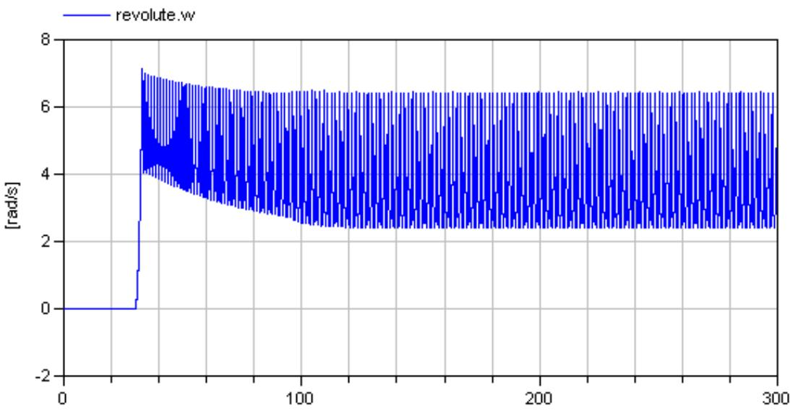  
图49. 仿真工况第47例:角速度。

  
图50. 仿真工况第47例:温度。

经验证,角速度几乎保持恒定,由此确定当前模型具备使发动机正常运行的特征。然而,这一模型并不适合用于构成具有实际应用的机器,因为其角速度非常低且存在振荡。

因此,决定不再修改这台机器,而是着手创建一个由两个模块或四个模块组成的原型,其中每个模块本身就是一台斯特林发动机,该原型将提供连续运行。这样,就能够表征出一台机器,它虽非最优,却是一台可以正常工作的机器。

## 5.3. 原型的开发

在上一节中，通过在 Dymola 中进行的一系列仿真，确定了斯特林发动机模型正常运行所应具备的特性。

接下来将介绍为斯特林发动机所研究的各种原型。这些原型基于模块（block）的连接，每个模块内部包含一个带有动力活塞和置换器的发动机。所创建的机器将由两个和四个模块组成。

### 5.3.1. 双模块机器

该机器由两个相位差为 180° 的发动机连接而成。

首先，进入斯特林发动机的交互区域，选中名为 stirling 的模块，随后将其复制并粘贴到同一屏幕中。新创建的模块将命名为 stirling1。从现在起，本论文中将 stirling 称为模块 1（或发动机 1），将 stirling1 称为模块 2（或发动机 2）。

接下来，直接连接两个模块，并确定应在何处设置模块之间 180° 的相位差，以及构成每个模块的各气缸之间 90° 的相位差。

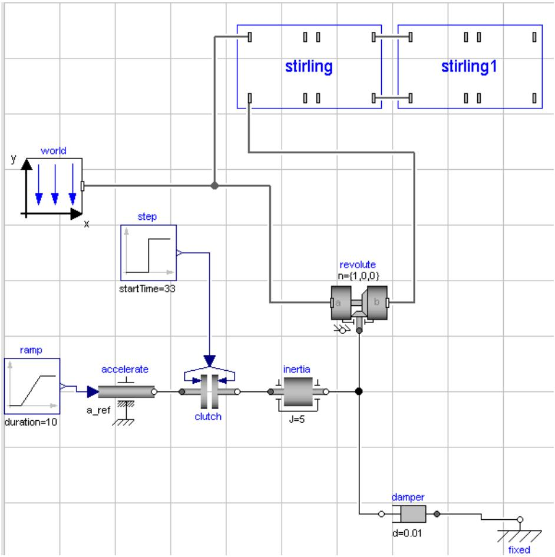  
图 51. 在斯特林发动机交互区域中连接双模块机器。

如果双击发动机 1 的模块，会打开一个窗口，可以在其中设置动力活塞与置换器之间的相位差。所修改的参数如下：

• 动力活塞：cylinderInclination = 0 deg

• 置换器：cylinderInclination1 = 90 deg

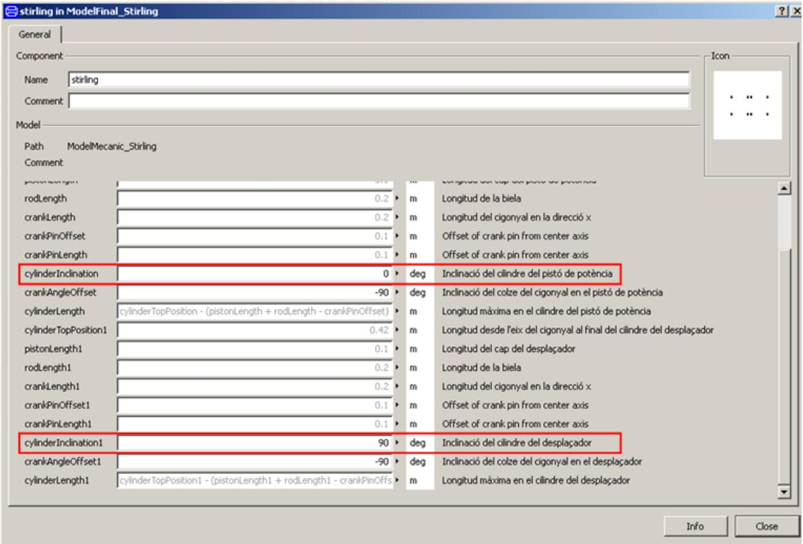  
图 52. 发动机 1 动力活塞与置换器之间相位差的设置。

对于发动机 2，操作过程类似。进入 stirling1 模块，设置气缸之间的相位差以及一个模块与另一个模块之间 180° 的相位差。需要修改的参数如下：

• 动力活塞：cylinderInclination = 180 deg

• 置换器：cylinderInclination1 = 270 deg

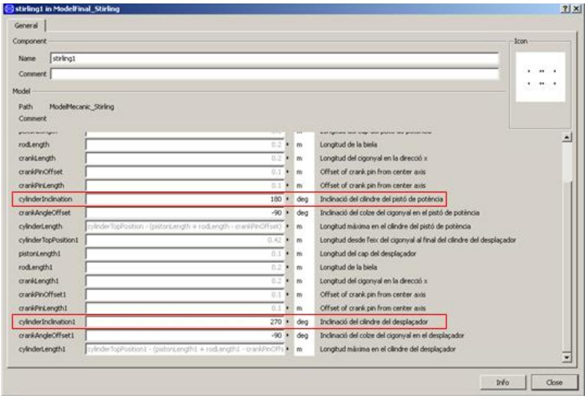  
图 53. 发动机 2 各气缸之间以及发动机 1 与发动机 2 之间相位差的设置。

下图显示了 Dymola 为双模块机器原型生成的三维动画。

  
图 54. 双模块机器的三维可视化。

连接好两个模块并设置好相应的相位差之后，开始用 Dymola 进行仿真。在第一次仿真尝试中，Dymola 通过一条消息提示存在一个多余的标量条件。该多余的标量条件是发动机 1 和发动机 2 动力活塞气缸的位置初始化。

下图显示了在所实现的斯特林发动机机械模型中动力活塞气缸的位置。

  
图 55. 动力活塞气缸在 ModelMecanic\_Stirling 交互区域中的位置。

最初，发动机 1 和发动机 2 的动力活塞被设置为初始位置 0.09 m。为了使双模块原型能够工作，两个模块的动力活塞都必须初始化为 0 m。

接下来介绍对该条件的修改，即打开发动机 1 和发动机 2 动力气缸的窗口，取消位置初始化选项 s.start。从图中可以看出，该复选框没有任何勾选标记。

  
图 56. 动力气缸位置初始化的修改。

完成上述修改的设置后，采用上一节所确定的条件对机器进行仿真，这些条件汇总于下表中：

表 177. 在既定条件下对双模块机器的仿真。
<table><tr><td>仿真工况</td><td>模块数</td><td>仿真时间 (seg)</td><td>加热时间 (seg)</td><td>温度斜坡高度 (K)</td></tr><tr><td>48</td><td>2</td><td>80</td><td>30</td><td>500</td></tr></table>

表 18. （续）在既定条件下对双模块机器的仿真。
<table><tr><td rowspan="2">仿真工况</td><td colspan="2">加速度斜坡</td><td rowspan="2">转动惯量 (kg/m²)</td><td colspan="2">传热系数</td><td rowspan="2">是否工作 (是/否)</td></tr><tr><td>持续时间</td><td>高度</td><td>Uc</td><td>UF</td></tr><tr><td>48</td><td>(seg) 3</td><td>15</td><td>5</td><td>100</td><td>1000</td><td>是</td></tr></table>

  
图 57. 仿真工况 48 号：角速度。

下图显示了两个发动机热源和冷源的温度。

• 发动机 1：$\mathsf { A z u l } = \mathsf { T } _ { \mathsf { C } } , \mathsf { R o j } 0 = \mathsf { T } _ { \mathsf { F } }$

• 发动机 2：$\mathsf { V e r d e } \mathrm { = } \mathsf { T } _ { \mathsf { C } } ,$ 品红 = TF

  
图 58. 仿真工况 48 号：温度。

接下来进行的仿真包括修改仿真时间，以观察该机器能否在 300 秒内正常工作。

表 18. 增大仿真时间的双模块机器仿真。
<table><tr><td>仿真工况</td><td>模块数</td><td>仿真时间 (seg)</td><td>加热时间 (seg)</td><td>温度斜坡高度 (K)</td></tr><tr><td>49</td><td>2</td><td>300</td><td>30</td><td>500</td></tr></table>

表 19. （续）增大仿真时间的双模块机器仿真。
<table><tr><td rowspan="2">仿真工况</td><td colspan="2">加速度斜坡</td><td rowspan="2">转动惯量 (kg/m²)</td><td colspan="2">传热系数</td><td rowspan="2">是否工作 (是/否)</td></tr><tr><td>持续时间</td><td>高度</td><td>Uc</td><td>UF</td></tr><tr><td>49</td><td>(seg) 3</td><td>15</td><td>5</td><td>100</td><td>1000</td><td>是</td></tr></table>

  
图 59. 仿真工况 49 号：角速度。

  
图 60. 仿真工况 49 号：温度。

从以上图表可以看出，双模块斯特林发动机在 300 秒内正常工作。

接下来，将在相同条件下对单模块机器和双模块机器所进行的仿真进行比较，以便分析双模块发动机所带来的改进。

  
图 61. 单模块机器（蓝色）与双模块机器（红色）的比较：角速度。

上图显示，双模块机器的角速度远比单模块发动机稳定，振荡也更少。此外，两个发动机的速度平均值一致。

因此，事实证明，创建双模块斯特林发动机是一项显著的改进，因为它使系统获得了更高的稳定性。

下图比较了单模块机器与双模块机器的热源温度：

单模块机器：$\mathsf { A z u l } = \mathsf { T } _ { \mathsf { C } } , \mathsf { R o j } 0 = \mathsf { T } _ { \mathsf { F } }$


• 2 块机器:

$$
\begin{array} { r l } { \circ } & { { } M o t o r \ 1 : \ { \mathsf { V e r d e } } = { \mathsf { T } } _ { \mathsf { C } } , { \mathsf { F u c c i a } } = { \mathsf { T } } _ { \mathsf { F } } } \end{array}
$$

$$
\begin{array} { r l } { \circ } & { { } M o t o r \ 2 \colon \mathsf { N e g r o } = \mathsf { T } _ { \mathsf { C } } , \mathsf { A } \mathsf { z } \mathsf { u } | \ \mathsf { x } = \mathsf { T } _ { \mathsf { F } } } \end{array}
$$

  
图 62. 1 块机器与 2 块机器的比较:温度。

带一个块的发动机其热源温度的振荡幅度远大于带两个块的发动机。然而,带 1 个块的发动机能达到更高的热源温度。

至于冷源温度,两台机器呈现出相似的振荡以及相近的平均温度值。

对模型施加的下一项修改是:将温度源 $T _ { \mathsf { C } } \mathsf {  ~ y ~ T _ { F } ~ }$ 设置在发动机各块之外。

接下来删除发动机内部各块中的热源,并将它们放置到全局交互区域中。

随后在每个发动机块内部为 $T _ { \mathsf { C } } \ \mathsf { y } \ \mathsf { T } _ { \mathsf { F } }$ 创建两个连接器 (connector)。为此,必须从热力学模型中温度入口点引出一条连接线,并点击鼠标右键,选择 Create connector(创建连接器)。这样就在全局交互区域中生成了两个三角形的连接器。这些连接器必须连接到温度块 $T _ { \mathsf { C } } ~ \mathsf { y } ~ \mathsf { T } _ { \mathsf { F } } ,$ 之后便得到了一个功能与前述情况完全相同的模型,但它能够以更加简便、实用的方式修改热源温度。

  
图 63. 两块的机器在 Stirling 发动机交互区域中的连接,热源位于发动机各块之外。

如前所述,本项目的目标是获得一个 Stirling 发动机的功能模型,使其产生足以在现实生活中使用的合适功率。因此,了解当前所建模型产生的功率是很有意义的。为此,将分析在 Damper(阻尼器)组件中获得的功率,该组件对发动机轴施加摩擦。Damper 的当前值为 ${ \mathsf { d } } { = } 0 . 0 1$

  
图 64. 2 块机器在 d=0.01 时的功率。

从上图可以验证,所获得的功率非常低,约为 0.2 W。由于该功率并非期望值,接下来将逐步增大 Damper 的值并分析所产生的功率。

表 20. 2 块机器在不同 Damper 值下的仿真。
<table><tr><td>仿真案例</td><td>块数</td><td>仿真时间</td><td>Damper</td><td>产生的功率 LossPower (W)</td><td>工作 (是/否)</td></tr><tr><td>50</td><td>2</td><td>(秒) 300</td><td>0.1</td><td>1.5</td><td>是</td></tr><tr><td>51</td><td>2</td><td>300</td><td>0.5</td><td>5</td><td>是</td></tr><tr><td>52</td><td>2</td><td>300</td><td>1</td><td>0</td><td>否</td></tr><tr><td>53</td><td>2</td><td>300</td><td>0.6</td><td>5.2</td><td>是</td></tr><tr><td>54</td><td>2</td><td>300</td><td>0.8</td><td>7</td><td>是</td></tr></table>

  
图 65. 仿真案例 50:产生的功率。


图 66. 仿真案例 51:产生的功率。  
  
图 67. 仿真案例 52:产生的功率。

  
图 68. 仿真案例 53:产生的功率。

  
图 69. 仿真案例 54:产生的功率。

在上表中记录了每个案例下机器产生的功率。当 Damper 值为 0.8 时,可获得 7W 的平均功率。然而,可以观察到所产生的功率并非恒定,且所得数值不足以使 Stirling 发动机在现实生活中具备竞争力。

另一方面,发动机的转速非常低,约为每秒一转。如果 2 块机器能够转得更快,就没有必要配置一台新的 4 块机器。然而,由于 2 块机器速度缓慢,决定创建一个 4 块发动机模型,以获得更合适的功率。

有鉴于此,决定开始用 4 块发动机进行仿真,目标是获得更连续的运行状态,并使其类似于车辆发动机(四冲程发动机)。

### 5.3.2. 四块式机器

沿用创建两块式机器模型时所用的步骤，将为四块式发动机创建一个新模型。该模型将把温度热源设定在发动机块的外部。此外，还需要设定各个块之间存在的相位差。

  
图 70. 四块式机器在斯特林发动机交互区域中的连接。

接下来将设定各台发动机气缸之间的相位差，以及各块之间存在的相位差。

发动机 1 修改的参数为：

• 动力活塞：cylinderInclination = 0 deg

• 置换器：cylinderInclination1 = 90 deg

  
图 71. 发动机 1 的动力活塞与置换器之间相位差的设定。

发动机 2 修改的参数为：

• 动力活塞：cylinderInclination = 90 deg

• 置换器：cylinderInclination1 = 180 deg

  
图 72. 发动机 2 的气缸之间以及发动机 1 与 2 之间相位差的设定。

发动机 3 修改的参数为：

• 动力活塞：cylinderInclination = 180 deg

• 置换器：cylinderInclination1 = 270 deg

  
图 73. 发动机 3 的气缸之间以及发动机 2 与 3 之间相位差的设定。

发动机 4 修改的参数为：

• 动力活塞：cylinderInclination = 270 deg

•置换器：cylinderInclination1 = 360 deg

  
图 74. 发动机 4 的气缸之间以及发动机 3 与 4 之间相位差的设定。

在下图中可以观察到 Dymola 生成的动画中 4 块式机器原型的 3D 可视化。

  
图 75. 4 块式机器的 3D 可视化。

接下来将进行一系列仿真，改变 Damper（阻尼器）的值，并分析所得的角速度和产生的功率。在这些仿真之后，将尝试刻画 4 块式机器的功率特性曲线。

表 21. 改变 Damper 的 4 块式机器仿真。
<table><tr><td>仿真工况</td><td>块数</td><td>仿真时间</td><td>加热时间</td><td>温度斜坡高度</td></tr><tr><td>55</td><td>4</td><td>(seg) 80</td><td>(seg) 30</td><td>(K) 500</td></tr><tr><td>56</td><td>4</td><td>300</td><td>30</td><td>500</td></tr><tr><td>57</td><td>4</td><td>80</td><td>30</td><td>500</td></tr></table>

表 22. （续）改变 Damper 的 4 块式机器仿真。
<table><tr><td rowspan="2">仿真工况</td><td colspan="2">加速斜坡</td><td rowspan="2">转动惯量  $( \log / \mathbf { m } ^ { 2 } )$ </td><td colspan="2">传热系数</td></tr><tr><td>持续时间 (seg)</td><td>高度</td><td> $\mathbf { u } _ { \mathsf { c } }$ </td><td> $\theta _ { F }$ </td></tr><tr><td>55</td><td>3</td><td>15</td><td>5</td><td>100</td><td>1000</td></tr><tr><td>56</td><td>3</td><td>15</td><td>5</td><td>100</td><td>1000</td></tr><tr><td>57</td><td>3</td><td>15</td><td>5</td><td>100</td><td>1000</td></tr></table>

表 23. （续）改变 Damper 的 4 块式机器仿真。
<table><tr><td>仿真工况</td><td>Damper</td><td>产生的功率 LossPower (W)</td><td>角速度 (rad/s)</td><td>正常运行 (是/否)</td></tr><tr><td>55</td><td>0.5</td><td>3,8</td><td>2,8</td><td>是</td></tr><tr><td>56</td><td>1.0</td><td>5,6</td><td>2,4</td><td>是</td></tr><tr><td>57</td><td>1.5</td><td>7,2</td><td>2,2</td><td>是</td></tr><tr><td>58</td><td>2.0</td><td>8,2</td><td>2,0</td><td>是</td></tr></table>

下图分别表示上述每一次仿真的角速度和产生的功率。

  
图 76. 仿真工况 55：角速度。

  
图 77. 仿真工况 55：产生的功率。

  
图 78. 仿真工况 56：角速度。

  
图 79. 仿真工况 56：产生的功率。

  
图 80. 仿真工况 57：角速度。

  
图 81. 仿真工况 57：产生的功率。

  
图 82. 仿真工况 58：角速度。

  
图 83. 仿真工况 58：产生的功率。

为了更深入地定义正在设计的这台机器，将尝试绘制该模型产生的功率的近似特性曲线。

  
图 84. 4 块式机器的功率特性曲线。

正如所绘制的特性曲线所示，4 块式机器能够承受更大的阻尼器，并提供比 2 块式机器更大的功率；后者在阻尼器为 1 时已无法正常运行。

特性曲线能够很好地展示机器整体的概况，因此在后续研究中将对不同的阻尼器值进行扫描，并获得若干个平均角速度和平均功率点，从而能够确定一条更加可靠得多的特性曲线。

# 第6章 结论

在为完成研究和建模斯特林发动机这一目标而开展的过程中，取得了以下成果：

• 已深入理解发动机的机械与热力工作原理。

• 已掌握使用 Dymola 工具进行编程和仿真的相关知识。

• 已研究发动机在初始状态下的整体建模。

• 已对该建模进行评估，找出妨碍其正常运行的各种错误。

• 已开展全面的仿真过程，最终获得了一个可正常运行的机器模型。

• 已研究获得更稳定、机械功率输出更大的发动机样机的多种可能性。

本项目最初从斯特林发动机的一个半功能性模型出发，经过修正与优化，最终获得了一个以 4 个模块为特征的发动机模型。

除了开发出具有更优技术特性的功能性发动机样机之外，还为机器的后续改进奠定了基础。

然而，在当前模型中，优化步骤的可行性并不高。应当改进编程，以便能够开展有效的参数化研究。

尽管偶尔会遇到挫折和问题，但本项目的完成令人十分满意，因为它使我获得了关于物理系统仿真以及各种数值计算方法使用方面的知识。我学会了在以往未曾接触过的新环境中解决问题，并巩固了此前学到的许多其他知识。此外，本项目还使我得以近距离了解斯特林发动机技术，而该技术在可再生能源领域的应用一直是激励我继续工作的动力。

# 第7章 后续改进

模型中可实施的改进之一（已在结论一章中提及）是在编程层面对模型进行优化，从而方便设计区域的交互，以便能够开展有效的参数化研究。该研究旨在确定一台在功率和转速方面具有更优性能的机器的特性。

另一方面，在交互区域创建一个表格也很有意义，该表格用于汇集对发动机运行影响最大的参数。该表格将是唯一可以修改参数的位置，修改后的参数会自动应用到模型的所有层级。

另一个长期目标是利用参数化研究所得数值建模一台发动机样机，使其具有更高的效率，且运行特性更贴近斯特林发动机的真实情况。

# 第8章 参考文献

## 8.1. 引用文献

García Prat, Albert. Sistema autònom de generació elèctrica basat en motor Stirling. EUETIB, Universitat Politècnica de Catalunya, 2013.

## 8.2. 参考资料

Bachmann, Bernhard. Modelica Tutorial for Beginners. Exercises with Dymola. University of Applied Sciences. Bielefeld(Germany). http://www.isa.uma.es/C15/SeminarioModel (最后访问：2014年2月3日)。

Brill, Anna. Optimization of Stirling Engine Power Output Through Variation of Choke Point Diameter and Expansion Space Volume. http://www.scientiareview.org/pdfs/168.pdf (最后访问：2014年2月7日)。

Desarrollos de motores Stirling. http://mstirling.wordpress.com/category/aplicaciones/ (最后访问：2014年5月20日)。

Dulin, Josua, Matthew Hove 和 Jonathan D. Lilley. Stirling Engine - Bringing Electricity to Remote Locations. Faculty of the Mechanical Engineering Department. California Polytechnic State University, San Luis Obispo, June 2013.

Dymola. Dynamic Modeling Laboratory. Getting started with Dymola. Chapter 2. 2011. http://www.3ds.com/fileadmin/PRODUCTS/CATIA/DYMOLA/PDF/Getting- (最后访问：2014年2月3日)。

Electropedia. The Stirling Engine. http://www.mpoweruk.com/stirling\_engine.htm (最后访问：2014年2月13日)。

He, Mike 和 Seth Sanders. Design of a 2.5kW Low Temperature Stirling Engine for Distributed Solar Thermal Generation. University of California - Berkeley, Berkeley, CA, 94720, USA. http://power.eecs.berkeley.edu/publications/he\_design\_stirling\_engine.pdf (最后访问：2014年2月10日)。

Jiménez Abete, Aitziber. Testing and optimizacion of the performance of a Stirling engine. http://academica-e.unavarra.es/handle/2454/7466 (最后访问：2014年3月9日)。

Modelica. Modelica - A Unified Object-Oriented Language for Physical System Modeling. Tutorial. https://www.modelica.org/documents/ModelicaTutorial14.pdf (最后访问：2014年3月3日)。

Moran, M.J. 和 H. Shapiro. Fundamentos de la Termodinámica Técnica. Barcelona: Reverté, 2005.

Morash, Alex, Andrew McMurray, Bryan Neary, Kristian Richards, Dominic Groulx 和 Angus MacPherson. Team 04 Stirling. http://poisson.me.dal.ca/\~dp\_08\_04/Theory.html (最后访问：2014年5月21日)。

Normani, Franco. Stirling Engine Manual. 2013. http://www.real-world-physicsproblems.com/support-files/stirling\_manual\_sample.pdf (最后访问：2014年2月8日)。

Revilla Vázquez, Maurici. Sistema de generación de energía basado en un motor Stirling aprovechando energías renovables. PFC. Universitat Politècnica de Catalunya, 2009.

Snyman, H., T.M. Harms 和 J.M. Strauss. "Design analysis methods for Stirling engines." Journal of Energy in Southern Africa, August, 2008: Vol. 19, No. 3.

Stirling Engines Mechanical Configurations. http://www.ohio.edu/mechanical/stirling/engines/engines.html (最后访问：2014年3月8日)。

Tarawneh, M., F. Al-Ghathian, M.A. Nawafleh 和 N. Al-Kloub. "Numerical Simulation and Performance Evaluation of Stirling Engine Cycle." Jordan

Journal of Mechanical and Industrial Engineering, 2010: Volume 4, Number 5.

Tecmotor. Página web sobre motores Stirling. http://tecmotor.wordpress.com/ (最后访问：2014年5月20日)。

University, Ohio. Stirling Cycle Machine Analysis. http://www.ohio.edu/mechanical/stirling/me422.html (最后访问：2014年3月5日)。

Walsh, Dr. John. Basic principles of operation and applications of the Stirling engine from its invention in 1816 to its modern uses. 2012. http://etta.ie/engineering/Ic/special\_topics/Etta\_Special\_Topic\_2012.pdf (最后访问：2014年2月8日)。

## 8.3. 图片参考文献

[1] Ruiz Gutiérrez, José Manuel. VENTANA DE LA CIENCIA. http://ventanadelaciencia.blogspot.com.es/2007/12/el-motor-stirling-enaplicaciones-de.html (最后访问时间: 2014年5月22日).

[2] Stirling 循环发动机. http://personales.able.es/jgros/tipos.htm (最后访问时间: 2014年4月12日).

[3] Tecmotor. 关于 Stirling 发动机的网页。
http://tecmotor.wordpress.com/ (最后访问时间: 2014年5月20日).

[4] Morash, Alex, Andrew McMurray, Bryan Neary, Kristian Richards, Dominic Groulx, y Angus. MacPherson. Team 04 Stirling. http://poisson.me.dal.ca/\~dp\_08\_04/Theory.html (最后访问时间: 2014年5月21日).

第二卷 预算

# 毕业设计

  
巴塞罗那, 2014年6月11日

项目指导教师: Joan Grau Barceló 流体力学系 (MF) 加泰罗尼亚理工大学 (UPC)

# 总目录

# 正文目录

正文目录 ...
图目录......
表目录....
摘要(西班牙语) ...
摘要(加泰罗尼亚语)...
摘要(英语) ..
致谢 ...
第1章 依据、目标与范围......
1.1. 依据 .
1.2. 目标..
1.2.1. 总体目标 ....
1.2.2. 具体目标 .....
1.3. 范围.....
第2章 引言...
第3章 Dymola....
3.1. 建模 ..
3.2. 仿真 ...
第4章 Stirling 发动机 ..
4.1. 概述....
4.2. 结构配置 ...
4.2.1. Alpha 结构...
4.2.2. Beta 结构 ..
4.2.3. Gamma 结构....
4.3. 热力循环...
4.4. 工作原理 ...
第5章 Stirling 发动机的建模
5.1. 前期状态 .
5.1.1. 力学模型..
5.1.2. 热力学模型 .
5.2. 模型验证..
5.2.1. 仿真的开始.
5.2.2. 惯性与温度仿真..
5.2.3. 启动系统与温度仿真 .
5.2.4. 力的调整
5.2.5. 强制启动系统 .
5.3. 样机开发 .
5.3.1. 双缸机..
5.3.2. 四缸机 ...
第6章 结论
第7章 未来改进.
第8章 参考文献..
8.1. 参考文献引用.
8.2. 参考书目..
8.3. 图片参考文献.

# 预算目录

预算目录 ...
第1章 预算
第2章 参考文献..
2.1. 参考书目....

# 附录目录

附录目录...
第1章 附录 A. Albert García 毕业设计摘要 ...
1.1. 附录 A.1. 力学模型 ..
1.2. 附录 A.2. 热力学模型 .
第2章 附录 B. 结果 ...
2.1. 附录 B.1. 第 5.2 节仿真总表 模型验证
 .   
2.2. 附录 B.2. 第 5.2 节图表 模型验证. ...

  
巴塞罗那, 2014年6月11日

指导教师: Joan Grau Barceló 流体力学系 (MF) 加泰罗尼亚理工大学 (UPC)

# 预算目录

预算目录 .....
第1章 预算 ... 3
第2章 参考文献 ... 7
2.1. 参考书目....

# 第1章 预算

下面给出本项目的经济预算,其分为工程工作与计算机资源两个部分。上述资源按 6 个月计价,即本毕业设计开发所经历的时长。

表 1. 经济预算。
<table><tr><td>描述</td><td>数量</td><td>单价</td><td>合计 (€)</td></tr><tr><td>工程工作</td><td></td><td></td><td></td></tr><tr><td>人力成本</td><td></td><td></td><td></td></tr><tr><td>项目引入与前期研究</td><td>120,00 h</td><td>27,00 €/h</td><td>3.240,00</td></tr><tr><td>仿真工具的开发</td><td>300,00 h</td><td>27,00 €/h</td><td>8.100,00</td></tr><tr><td>检查与验证</td><td>30,00 h</td><td>27,00 €/h</td><td>810,00</td></tr><tr><td>文档编写</td><td>150,00 h</td><td>27,00 €/h</td><td>4.050,00</td></tr><tr><td>小计</td><td></td><td></td><td>16.200,00</td></tr><tr><td>计算机资源</td><td></td><td></td><td></td></tr><tr><td>(按 6 个月计价)</td><td></td><td></td><td></td></tr><tr><td>笔记本电脑 Toshiba Satellite A660-1EM</td><td>0,2</td><td>736,86</td><td>147,40</td></tr><tr><td>无线鼠标 SWEEX MI421</td><td>0,2</td><td>12,00</td><td>2,40</td></tr><tr><td>PC186 SGI-H2106 机器</td><td>0,1</td><td>1.500,00</td><td>150,00</td></tr><tr><td>Dymola® 许可证</td><td>0,5</td><td>800,00</td><td>400,00</td></tr><tr><td>C++ Visual Studio 专业版 2010 许可证</td><td>0,25</td><td>550,00</td><td>137,50</td></tr><tr><td>Microsoft Office® 2007 许可证</td><td>0,5</td><td>158,00</td><td>79,00</td></tr><tr><td>AutoCAD® 2012 许可证</td><td>0,1</td><td>2.370,00</td><td>237,00</td></tr><tr><td>小计</td><td></td><td></td><td>1.153,30</td></tr><tr><td></td><td>毛总额</td><td></td><td>17.353,30</td></tr><tr><td></td><td>增值税 (I.V.A.)</td><td>21%</td><td>3.644,20</td></tr><tr><td></td><td></td><td></td><td></td></tr><tr><td></td><td>预算总计</td><td>€</td><td>20.997,50</td></tr></table>

根据上表所列明细,材料执行预算为壹万柒仟叁佰伍拾叁欧元叁拾欧分(17.353,30 欧元)。

因此,合同执行预算(含 21% 增值税)为贰万零玖佰玖拾柒欧元伍拾欧分(20.997,50 欧元)。

巴塞罗那, 2014年6月

项目作者:

Antía Varela Souto

# 第2章 参考文献

## 2.1. 参考书目

Microsoft. C++ Visual Studio Professional 2010 许可证。http://social.msdn.microsoft.com/Forums/es-ES/75f14fb0-78d7-44b5-8101- beb4eb8a4f58/precio-del-visual-studio-2010-y-su-licencia?forum=vsgenerales (最后访问时间：2014年6月2日)。

tuexpertoIT. AutoCAD 2012 许可证。http://www.tuexpertoit.com/2011/03/22/autocad-2012-nueva-version-delprograma-de-autodesk-para-el-diseno-grafico/ (最后访问时间：2014年6月2日)。

TWENGA. Microsoft Office 2007 许可证。http://www.twenga.es/microsoft-officeversion-2007.html (最后访问时间：2014年6月2日)。

第III卷 附录

# 毕业设计

  
巴塞罗那，2014年6月11日

项目导师：Joan Grau Barceló 流体力学系 (MF) 加泰罗尼亚理工大学 (UPC)

# 总目录

# 正文目录

正文目录 ...   
插图目录....   
表格目录.....   
摘要（西班牙语） ...   
摘要（加泰罗尼亚语）...   
摘要（英语） ..   
致谢...   
第1章 依据、目标与范围......   
1.1. 依据 .   
1.2. 目标..   
1.2.1. 总体目标 ....   
1.2.2. 具体目标 .....   
1.3. 范围.....   
第2章 引言....   
第3章 Dymola .....   
3.1. 建模 ..   
3.2. 仿真 ...   
第4章 斯特林发动机 ..   
4.1. 总体描述...   
4.2. 构型 ...   
4.2.1. Alpha构型...   
4.2.2. Beta构型 ..   
4.2.3. Gamma构型....   
4.3. 热力循环...   
4.4. 工作原理 ...   
第5章 斯特林发动机建模   
5.1. 前期状态 .   
5.1.1. 机械模型..   
5.1.2. 热力学模型 .   
5.2. 模型验证 ..   
5.2.1. 仿真的启动.   
5.2.2. 惯性与温度仿真..   
5.2.3. 启动系统与温度仿真 .   
5.2.4. 力的修改   
5.2.5. 强制启动系统 ..   
5.3. 原型开发 .   
5.3.1. 双缸机组..   
5.3.2. 四缸机组 ...   
第6章 结论   
第7章 未来改进.   
第8章 参考文献..   
8.1. 参考文献.   
8.2. 参考书目..   
8.3. 图片来源.

# 预算目录

预算目录 ...   
第1章 预算   
第2章 参考文献..   
2.1. 参考书目....

# 附录目录

附录目录...   
第1章 附录A. Albert García 毕业设计摘要 ...   
1.1. 附录A.1. 机械模型 ..   
1.2. 附录A.2. 热力学模型 .   
第2章 附录B. 结果 ...   
2.1. 附录B.1. 第5.2节 模型验证的仿真总表. .   
2.2. 附录B.2. 第5.2节 模型验证的图表. ...

附录


巴塞罗那，2014年6月11日

指导教师：Joan Grau Barceló 流体力学系 (MF) 加泰罗尼亚理工大学 (UPC)

# 附录目录

附录目录.   
第1章 附录A. Albert García 毕业设计摘要 3   
1.1. 附录A.1. 机械模型 . ..4   
1.2. 附录A.2. 热力学模型 .5   
第2章 附录B. 结果.. 7   
2.1. 附录B.1. 第5.2节 模型验证的仿真总表. . .7   
2.2. 附录B.2. 第5.2节 模型验证的图表. . ..8

# 第1章 附录A. ALBERT GARCÍA 毕业设计摘要

下文收录了 Albert García 在其毕业设计中完成的斯特林发动机模型实现过程的开发内容。本文档作为第5.1节“前期状态”的补充与说明。

本章分为两部分：机械模型的开发与热力学模型的开发。

1.1. 附录A.1. 机械模型

## 3.4. 模型。

现在我们已经理解了发动机的工作原理并熟悉了该程序，可以着手在 Dymola 中进行其设计或实现。为了简化系统的创建与说明，我们将其划分为两个更简单的模型或子系统，分别称为：机械模型和热力学模型。

### 3.4.1. 机械模型。

顾名思义，它是负责描述系统机械部分的模型。在对该系统进行建模时，没有创建任何新的组件或模型，而是复用了 Dymola 现有库中的模型和组件（确切地说是 Modelica->Mechanics 中的）。

机械模型的功能是将热能转化为机械能，随后我们再将机械能转化为电能。

机械模型主要由四个组件构成：压缩活塞、膨胀活塞（即置换器）、曲轴以及气缸（即机壳）。

**• 压缩活塞。**

它是负责承受气缸内部压力的元件，该压力转化为作用于活塞上的力，从而带动整个系统运动。它位于发动机的冷端。其组成元件如下：

  
插图 11 活塞的装配。

基于斯特林发动机的发电

a) 活塞头部：是活塞中最重、截面最大的部分。其上设有活塞环和活塞销。活塞环用于对活塞与气缸之间的腔室进行密封增压。活塞销是使我们能够将活塞头部与连杆连接起来的元件。

  
插图 12 活塞头部。

b) 连杆：连接活塞头部与曲轴曲柄销（曲拐）的元件，它将活塞头部的直线运动传递给曲轴，因此该元件必须能够承受压缩和弯曲应力。设计连杆时的一个重要因素是：连杆的长度应为曲柄所描述的旋转直径的两倍。

  
插图 13 连杆。

c) 轴承：通过滚动体降低轴与连接于其上的零件之间摩擦的连接元件。它起支撑作用，并便于二者之间的相对运动。它们位于活塞销与连杆之间以及连杆与曲轴之间。

  
插图 14 轴承的剖面视图。

**• 膨胀活塞（置换器）。**

机械模型中负责将空气从一个区域推移到另一个区域的元件。由于压缩活塞驱动曲轴运动，曲轴再将这一运动相应地传递给置换器。该运动的周期与压缩运动相同，但相位差为90°，正如beta型发动机的规格所规定的那样。

构成置换器的组件与功率活塞的组件相同。

**• 曲轴**

连接两个活塞的发动机部件。它承受来自压缩活塞的爆发力，并将其转化为旋转运动。该旋转运动又作为直线运动传递给置换器，从而使一个活塞的位置与另一个活塞的位置相互关联。

  
插图 15 斯特林发动机的曲轴。

**• 气缸。**

我们将气缸定义为发动机的外壳或保护元件，其职责是保护发动机免受外界影响、最终确定发动机的几何形状，并将外部的热量传递给内部气体。

一旦识别出发动机的各个部件，我们就能理解整个系统的相互作用。

  
插图 16 机械构型的俯视图。

  
插图 17 机械构型的侧视图。

机械模型工作原理分析：


由压力施加的力使压缩活塞头产生直线运动，从下止点 (PMI) 到上止点 (PMS)，该运动在曲轴上表现为圆周运动。

  
插图 18 斯特林发动机动力活塞运动的描述

活塞头受到的力为：

$$
F = P 2 ^ { * } A 2
$$

其中：

P2 = 活塞区域的压力。

A2 = 压缩活塞面积。

通过对作用力进行分析，我们可以看到，可以将作用在压缩活塞头上的力描述为该力本身与压缩活塞头纵轴及其连杆之间夹角的乘积：

电气装置，基于斯特林发动机

  
插图 19 分析截面的细节。

应用三角学，我们发现可以用连杆长度和曲轴长度来描述活塞头的纵轴：

$$
\begin{array} { c } { { x = \sqrt { l ^ { \wedge } 2 - B ^ { \wedge } 2 ^ { * } s e n ^ { \wedge } 2 \theta } } } \\ { { { } } } \\ { { x = l ^ { * } \cos \alpha } } \end{array}
$$

最后，由于知道传递到轴上的扭矩是该轴所受的力与距离的乘积，我们得到传递到曲轴的扭矩为：

$$
T = P 2 ^ { * } A 2 ^ { * } \frac { B } { \sqrt { l ^ { \setminus } 2 - B ^ { \setminus } 2 ^ { * } s e n ^ { \setminus } 2 { \theta } } } { * ( \frac { B ^ { * } s e n ^ { \setminus } 2 { \theta } } { 2 } + s e n { \theta } ^ { * } \sqrt { l ^ { \setminus } 2 - B ^ { \setminus } 2 ^ { * } s e n ^ { \setminus } 2 { \theta } } ) }
$$

通过气缸和活塞的几何关系固定一个上止点 (PMS) 和下止点 (PMI)。结合上述公式，我们可以根据作用力描述压缩活塞的新位置，并根据压缩活塞的位置描述置换器的新位置。

该模型由于不受任何压力作用力，而只是将体积从一处移动到另一处（由置换器引起的体积运动，我们将在 3.4.2 节描述的热力学模型中定义）。

我们取活塞 V6 所携带的当前气体模型，并将其复制到一个名为 ModelConnectors_Forces 的新模型中。在此我们将删除所有当前代码，并引入一个新的输入 (Modelica->Blocks->Interfaces->Real Input)，该输入将是斯特林循环为我们提供的力，我们将使其等于该气体所输出的力。我们这样做是为了利用气体模型中已经编写好、用于与机械模型的其余组件相连接的连接器。

```matlab
model ModelConnectors Forces
import SI = Modelica.SIunits;
extends Modelica.Mechanics.Translational.Interfaces.PartialCompliant;
Modelica.Blocks.Interfaces.RealInput f_mt
a ;
equation
f = f_mt;
△ a ;
end ModelConnectors Forces;
```  
插图 21 Model_Connectors_Forces 的代码。

**其中：**

f\_mt = 由热力学模型传递给机械模型的输入力。

f = 机械模型中作用在动力活塞上的合力。

一旦我们有了 ModelConnectors_Forces，就可以继续创建 ModelMecanic_Stirling。我们在新模型的交互区域中复制两个 V6 活塞，并进行前述修改。将动力活塞中当前的气体模型替换为所创建的 ModelConnectors_Forces，并删除置换器中的气体模型。目前，为了能够进行仿真并验证新的机械系统能够运动，我们将由斯特林热力学模型提供给我们的力输入等同于一个正弦力的输入。这通过将一个正弦函数 (Modelica->Blocks->Sources->Sine) 连接到我们所创建的输入来实现。这样，ModelMecanic_Stirling（临时版）如下所示。

  
插图 22 临时机械模型交互区域的视图。

还需要进行的一项小改动是，将活塞的方向调整到所需的方向（一个活塞与另一个活塞之间相差 90° 的相位差）。这通过将置换器气缸倾角参数的值更改为相对于所选动力活塞方向成 90° 来实现。我们可以通过进入 ModelMecanic_Stirling 的代码来进行此更改。我们将 CylinderInclination 的值调整为所需角度，然后将 CylinderInclination1 调整为 CylinderInclination+90° 的角度。

model ModelMecanic Stirling   
import SI = Modelica.SIunits;   
parameter Boolean animation=true "= true, s'activa 1'animació 3D";   
parameter SI.Length cylinderTopPosition=0.42   
"Longitud desde l'eix del cigonyal al final del cilindre del pistó de potència";   
parameter SI.Length pistonLength=0.1   
"Longitud del cap del pistó de potència";   
parameter SI.Length rodLength=0.2 "Longitud de la biela";   
parameter SI.Length crankLength=0.2 "Longitud del cigonyal en la direcció x";   
parameter SI.Length crankPinOffset=0.1 "Offset of crank pin from center axis";   
parameter SI.Length crankPinLength=0.1 "Offset of crank pin from center axis";   
parameter SI.Angle cylinderInclination=0   
"Inclinació del cilindre del pistó de potència";   
parameter SI.Angle crankAngleOffset=-90   
"Inclinació del colze del cigonyal en el pistó de potència";   
parameter SI.Length cylinderLength=cylinderTopPosition - (pistonLength +   
rodLength - crankPinOffset)   
"Longitud màxima en el cilindre del pistó de potència";   
parameter SI.Length cylinderTopPosition1=0.42   
"Longitud desde 1'eix del cigonyal al final del cilindre del desplaçador";   
parameter SI.Length pistonLength1=0.1 "Longitud del cap del desplaçador";   
parameter SI.Length rodLength1=0.2 "Longitud de la biela";   
parameter SI.Length crankLength1=0.2   
"Longitud del cigonyal en la direcció x";   
parameter SI.Length crankPinOffset1=0.1   
"Offset of crank pin from center axis";   
parameter SI.Length crankPinLength1=0.1   
"Offset of crank pin from center axis";   
parameter SI.Angle cylinderInclination1=90   
"Inclinació del cilindre del desplaçador";   
parameter SI.Angle crankAngleOffset1=-90   
"Inclinació del colze del cigonyal en el desplaçador";   
parameter SI.Length cylinderLength1=cylinderTopPosition1 - (pistonLength1 +   
rodLength1 - crankPinOffset1)   
"Longitud màxima en el cilindre del desplaçador";  
插图 23 临时机械模型的代码。

一旦我们有了 ModelMecanic_Stirling，就可以对它进行测试以验证其运行。我们创建一个新的 ModelMecanic_Test，并加入刚创建的机械模型、世界 (Modelica->Mechanics->MultiBody->World)、一个轴承 (Modelica->Mechanics->MultiBody->Joints->Revolute) 以及曲轴上的一个惯性飞轮 (Modelica->Mechanics->Rotational->Components->Inertia)。世界将为我们提供系统的重力和参考轴，用于协调运动，轴承允许曲轴旋转，惯性飞轮则稳定其旋转。

我们按如下方式进行连接：

  
插图 24 ModelMecànic_Test 的交互区域。

当我们对机械模型进行仿真时，可以通过动画和图形直观地验证，在正弦力的作用下（我们给它一万二千的振幅和三十赫兹的频率），两个活塞以 90° 的相位差运动。能够让我们以图形方式看到这一运动的变量是 Cilindre_pistó_potencia 中的 "s" 和 Cilindre_Desplaçador 中的 "s"，它们分别对应动力活塞和置换器的相对位置。所谓相对位置，是指可用体积的长度，即气缸体积与同区域中运动活塞体积之差。

我们将得到以下结果：

  
图 27 活塞相对位置图。

  
图 28 作用在功率活塞上的力。

  
图 29 机械模型的三维动画。

热力学模型是发动机中最重要的部分，因为它将为我们提供力以及工作温度。这部分是从零开始建模的，因为 Dymola 没有任何与气体所遵循的斯特林循环相似的模型。

为实现该模型，区分了两部分。第一部分仅对质量运动进行建模，依据置换器的运动在恒温下赋予每个区域的体积。第二部分将对各区域质量的加热与冷却进行建模，依据每个区域中可用的体积。

**• 第一部分，质量运动：**

从前面机械模型的构建出发，我们知道需要将该模型所具有的活塞位置与热模型中的活塞位置关联起来，热模型将给出每个区域可用的体积并向我们返回一个合力。因此，我们需要第一个模型，将其命名为 ModelConnector\_Posicions\_Force，把热力学模型中这些位置的输入与该模型输出到机械模型的力关联起来。

  
图 30 ModelConnectors\_Posicions\_Forces 的代码。

其中：

u = 功率活塞相对位置的输入。

u1 = 置换器相对位置的输入。

fo = 热力学模型输出的力。

一旦将模型的输入和输出关联起来，我们便开始对体积的运动进行建模，创建一个名为 ModelVolums 的新模型。观察机械模型研究所得到的图，我们看到这些位置描述的是彼此之间相差 90º 的正弦运动，其中置换器处于其最大位置，而功率活塞处于其最大位置的一半。由于目前我们分别研究这些模型，我们将把这些位置的输入调整为常数乘以时间，将其转换为正弦波，并将其中一个相对于另一个移相 90º（π/2）。

这些运动描述如下：

  
图 31 ModelVolums 位置输入的代码。

对正弦值加 1 使其全部为正，并将两个输入的值除以 10，以将数值的幅度调整为更真实的值。因此，一旦我们知道如何描述这些相对位置，并观察机械模型的初始几何形状，我们就能知道有哪些常数参数，以及它们如何在一个模型与另一个模型之间相互关联。

  
图 32 模型配置示意图。

这样我们还可以设定一些初始条件，以帮助启动热力学模型的仿真，并识别它是否正确地调整到其应实现的期望函数。这些初始条件是系统的初始压力和初始温度，在整个系统中是相同的。每个区域的初始体积取决于我们已知的初始相对位置（因为我们在机械模型中已设定），它们的总和将给出系统的总体积。以及每个区域中的摩尔数，以及整个系统中的摩尔数，我们可以根据理想气体方程得出，因为工作气体是空气。显然还需要包含该理想气体的某些参数。

**根据上图，我们可以定义：**

几何参数：

model ModelVolums\_Only  
extends ModelConnectors Posicions Forces;  
//用于交换位置输入与力输出的子模型  
import SI = Modelica.SIunits;  
//系统研究中数值恒定的参数。  
parameter .Real d1 "置换器的直径";  
parameter .Real 1 d "置换器的长度";  
parameter .Real d2 "功率活塞的直径";  
parameter .Real dc "气缸的直径";  
constant .Real pi=3.141592 "圆周率常数";  
parameter .Real A1=pi\*d1^2/4 "置换器上方面积";  
parameter .Real A2=pi\*d2^2/4 "功率活塞上方面积";  
parameter .Real V\_l=A\_an\*l\_d "气缸侧面的体积";  
parameter SI.Volume VT=V1o+V2o+V\_1 "系统的总体积";  
parameter .Real A an=pi\*(dc^2-d1^2)/4  
"区域1与气缸之间可用的环形面积";  
parameter .Real Vm1 "置换器中的死体积";  
parameter .Real Vm2 "功率活塞中的死体积";

**几何参数与初始条件：**

parameter SI.ThermodynamicTemperature To = 293.15  
"系统初始温度（环境温度）";  
parameter SI.Pressure Po = 100000 "系统初始压力";  
parameter .Real n1 o=(Po\*V1o)/(R\*To)  
"初始时位于区域1（置换器）的摩尔数";  
parameter .Real n2 o=(Po\*V2o)/(R\*To)  
"初始时位于区域2（功率活塞）的摩尔数";  
parameter .Real nt o=(Po\*VT)/(R\*To)  
"初始时位于系统中的总摩尔数";  
parameter .Real V1o= Vm1 + A1\*(1+sin(3.1514/2))/10;  
parameter .Real V2o = Vm2 + A2\*(1/10) - A1\*(1+sin(3.1514/2))/10 + 2\*1 d\*A1  
"功率活塞初始体积";

理想气体参数：  
parameter .Real M=29 "内部物质的分子量（空气）";  
parameter .Real R=8314.472 "理想气体常数";  
parameter .Real cv=717 "定容比热";  
parameter .Real mu=1.33e-5 "内部气体的运动粘度（空气）";

为了最终确定其余参与研究的变量（非常数），我们分析系统的不同区域或控制体积。

  
图 33 热区示意图。

  
图 34 侧面区域示意图。

  
图 35 冷区示意图。

.Real nt(start=nt\_o) "系统中的总摩尔数";  
.Real V1 "置换器中的体积";  
.Real V2 "功率活塞中的体积";  
.Real P1(start=Po) "置换器中的压力";  
.Real P2(start=Po) "功率活塞中的压力";  
.Real n2(start=n2 o) "功率活塞中的摩尔数";  
.Real n1(start=n1\_o) "置换器中的摩尔数";  
.Real n\_1(start=nt\_o-n1\_o-n2\_o) "侧面中的摩尔数";  
.Real m2 "功率活塞中的质量";  
.Real m\_1 "侧面中的质量";  
.Real m1 "置换器中的质量";  
.Real mt "系统的总质量";  
.Real T1(start=To) "置换器中气体（空气）的温度";  
.Real T2(start=To) "功率活塞中气体（空气）的温度";  
.Real T 1(start=To) "系统侧面中气体（空气）的温度";  
.Real sp "功率活塞的相对位置";  
.Real sd "置换器的相对位置";  
.Real ro1 "区域1或置换器中气体（空气）的相对密度";  
.Real ro2  
"区域2或功率活塞中气体（空气）的相对密度";  
.Real A 1 "气缸中可用的侧面面积";  
.Real P\_1 "系统侧面中的压力";  
.Real c "活塞的速度";  
.Real mp2 "区域2中接收能量交换的质量";  
.Real mp1 "区域1中接收能量交换的质量";  

.Real Rp "Constant gassos ideals (Unitats de massa)";   
.Real ro\_1 "Densitat relativa del gas (aire) en la zona lateral";

在系统整体中，我们将有一个总摩尔数 (nt)，它给出一个总质量 (mt)。需要指出的是，变量 Rp 和 A\_l 本无需在此处定义，因为它们是系统研究中的常量参数，本可以在前面一节中定义。

接下来我们将描述支配系统的方程，以及在研究或运行该系统过程中各变量的演变。

**equation**

//Entrada de les posicions.

$$
{ \begin{array} { l } { \displaystyle { \mathfrak { s d } } = { \frac { 1 + \sin { \left( { \mathrm { u l } } \cdot { \mathrm { t i m e } } + { \frac { 3 . 1 5 1 4 } { 2 } } \right) } } { 1 0 } } } \\ { \displaystyle { \mathfrak { s p } } = { \frac { 1 + \sin { \left( { \mathrm { u l } } \cdot { \mathrm { t i m e } } \right) } } { 1 0 } } } \end{array} }
$$

//Volums disponibles en les diferentes zones en funció de la posició del pisto de la respectiva zona.

$$
\mathrm { W 1 } = \mathrm { V i n 1 } + \mathrm { A 1 } - \mathrm { s d }
$$

$$
\mathrm { V 2 } = \mathrm { V a } 2 + \mathrm { A } 2 \cdot \mathrm { s p } - \mathrm { A } 1 \cdot \mathrm { s d } + 2 l a \cdot \mathrm { A } 1
$$

//Càlcul de l'area lateral disponible.

$$
\sqrt { 2 } 1 = \pi \cdot [ - 1 ] { 1 } - 1 =
$$

//Canvi unitats de mols a massa de la constant dels gassos ideals.

$$
E _ { \mathrm { F } } = { \frac { R } { M } }
$$

//Càlcul de les densitats relatives en les diferentes zones del sistema.

$$
\bf { r o l } = \frac { P l } { R p \cdot T i }
$$

$$
\mathrm { f o z = \frac { P 2 } { R p \cdot I 2 } }
$$

$$
\mathrm { { f } } \bar { \mathbf { u } } _ { i } = \frac { P _ { i } } { \mathbb { R } \mathbf { p } \cdot \bar { T } _ { i } }
$$

//Equació dels gassos ideals aplicada a les dues zones.

$$
\mathbb { V } 1 - \mathbb { P } 1 = \pmb { \mathrm { n } } \mathbb { 1 } - \mathbb { P } - \mathbb { T } 1
$$

$$
\mathbb { V } _ { 2 } ^ { 2 } - \mathbb { P } _ { 2 } ^ { 2 } = { \bf { \sigma } } _ { 1 2 } - \mathbb { P } _ { 2 } ^ { * } - \mathbb { T } _ { 2 } ^ { 2 }
$$

//Càlcul de la pressio en la zona lateral.

$$
\begin{array} { r } { P _ { l } = { \frac { \mathbb { P } 1 + \mathbb { P } 2 } { 2 } } } \end{array}
$$

……电力（基于斯特林发动机）

//Càlcul del les masses en les diferentes zones del sistema en funció dels mols respectius de cada zona.

$$
M \cdot \mathbf { n } 2 = \mathbf { m } 2
$$

$$
M \cdot \mathbf { n } 1 = \mathbf { m } 1
$$

$$
M \cdot n _ { i } = m _ { i }
$$

//Càlcul de la massa total del sistema.

至此，方程的推导并无复杂之处，但现在我们来更详细地分析连续性方程，该方程将描述各区域中质量的运动。方程针对两个区域进行描述，Dymola 与前面将系统所有质量联系起来的方程相类似，推导出剩余部分的演变。各区域的质量因活塞的运动而变化，每个区域的活塞可有两种运动：上行（从下止点 Pmi 到上止点 Pms）或下行（反之），并且由于两个活塞通过曲轴连接、彼此错开 90°，它们在每个活塞上同时发生或方向相反。决定每个活塞运动方向是上行还是下行的量是速度值 (c)。而这些质量从区域 1 通过侧向区域转移到区域 2。

证明：

连续性方程；

$$
\frac { \mathrm { d } \mathrm { m } } { \mathrm { d t } } = m e - m s ;
$$

质量流量：

$$
m = c ^ { * } A ^ { * } r o ;
$$

若 c<0

对于区域 1，我们有 → me=mq1 且 ms=0；

$$
\frac { \mathrm { d } { \mathrm { m } } 1 } { \mathrm { d t } } = m e = m q 1 ;
$$

  
插图 36 热区中质量在下降过程中的运动。

进入的质量流量 (mq1)，正如我们在图中观察到的，来自侧向区域，因此其结果为：

$$
m q 1 = c ^ { * } A \_ a n ^ { * } r o \_ l ;
$$

对于区域 2，我们有 → me=0 且 ms=mq2；

  
插图 37 冷区中质量在上升过程中的运动。

流出的质量流量 (mq2)，正如我们在图中观察到的，来自区域 2 本身，因此其结果为：

$$
m q 2 = c ^ { * } A \_ a n ^ { * } r o 2 ;
$$

自主发电系统

电力（基于斯特林发动机）

若 c>0

对于区域 1，我们有 $\scriptstyle \cdot > \ m e = 0 \ i \ m s = \ m q 1$

$$
\frac { \mathrm { d } { \mathrm { m } } { \mathrm { 1 } } } { \mathrm { d t } } = - m s = - m q { \mathrm { 1 } } ;
$$

区域 1（置换器）  
  
插图 38 热区中质量在上升过程中的运动。

流出的质量流量 (mq1)，正如我们在图中观察到的，来自区域 1 本身，因此其结果为：

$$
m q 1 = c ^ { * } A \_ a n ^ { * } r o 1 ;
$$

对于区域 2，我们有 $\scriptstyle \cdot > { \mathrm { ~ m e = m q } } 2 { \mathrm { ~ i ~ } } \ m s = 0$

$$
\frac { \mathrm { d } { \mathrm { m } } 2 } { \mathrm { d t } } { \mathrm { = } } m e = m q 2 ;
$$

  
插图 39 冷区中质量在下降过程中的运动。

进入的质量流量 (mq1)，正如我们在图中观察到的，来自侧向区域，因此其结果为：

$$
m q 2 = c ^ { * } A \_ a n ^ { * } r o \_ l ;
$$

在 Dymola 中我们将其写为：

//Equació de la continuitat.   
//Describim els caudals massics en funció del moviment del sistema.   
if c<0 then   
mp1=c\*A\_an\*ro\_1;   
mp2=c\*A\_an\*ro2;   
else   
mp1=c\*A\_an\*ro1;   
mp2=c\*A\_an\*ro\_1;   
end if;

一旦知道了流量如何，我们就可以将其随时间的演变写为：

$$
\begin{array} { l } { { \exists \in \mathbb { r } \left( \mathrm { m } \mathbb { 1 } \right) = - \mathrm { m } \mathbb { E } ^ { 1 } \bar { r } } } \\ { { \mathrm { d } \in \mathbb { r } \left( \mathrm { m } \mathbb { 1 } \right) = \mathrm { m } \mathbb { E } \mathbb { 1 } - \mathrm { m } \mathbb { E } \bar { z } \bar { r } } } \end{array}
$$

符号是根据速度来设定的。我们来验证它们是否正确。

$$
\frac { \mathrm { d } { \mathrm { m } } { \mathrm { 1 } } } { \mathrm { d t } } { = } - m q { \mathrm { l } } ;
$$

{ 若 c<0 (−) → = +mq1 = 区域 1 正在被填充。

{若 c>0 (+) → = −mq1 = 区域 1 正在被排空。

$$
\frac { \mathrm { d } { \mathrm { m } } \mathrm { ~ l } } { \mathrm { d t } } { = } m q 1 - m q 2 ;
$$

{ 若 c<0 (−) → = −mq1

{ 若 c<0 (−) → = +mq2 = 侧向区域正在被质量 2 填充，并向区域 1 前进。

{若 c>0 (+) → = +mq1

{ 若 c>0 (+) → = −mq2 = 侧向区域正在被质量 1 填充，并向区域 2 前进。

当要研究作用在系统上的力时，就要建立动量方程，因为作用在系统上的力会引起动量的变化。

在该方程中，一方面是作用在流体上的外力之和，另一方面是动量的变化

$$
\sum F = { \frac { d e r ( m c ) } { d t } } ;
$$

作用在侧向流体上的力有：

\- 压力力，既在入口也在出口。采用相对压力，在本例中，由于入口和出口面积相等，所关心的正是压力差。

\- 由于黏性引起的流体与壁面之间的摩擦力。

\- 流体自身的重力，本例中不予考虑，因为运动是水平的，而重力影响的是垂直运动。

因此，作用在系统中的力以下列方式关联起来：

$$
\sum F = - ( P 1 - P 2 ) ^ { * } A _ { - } a n - A _ { - } l ^ { * } \mu ^ { * } ( \frac { \frac { d e r ( s d ) } { d t } } { \frac { ( d c - d 1 ) } { 2 } } ) ;

$$

动量变化项可以表示为：

$$
\frac { d e r ( m c ) } { d t } = c \ast \frac { d e r ( m ) } { d t } + m \ast \frac { d e r ( c ) } { d t } ;
$$

也可以应用雷诺输运定理，得到：

$$
\frac { d \big ( m c \big ) } { d t } = \frac { \hat { o } } { \hat { o } t } \int _ { v } \rho c d V + \int _ { s } c \cdot c \rho d S
$$

$$
\frac { d \left( m c \right) } { d t } = \frac { \hat { \sigma } \left( m c \right) } { \hat { \sigma } t } + \dot { m } _ { s } c _ { s } - \dot { m } _ { e } c _ { e }
$$

$$
\frac { d ( m c ) } { d t } = \frac { \hat { o } ( m c ) } { \hat { o } t } + c _ { s } A _ { s } \rho _ { l a t } c _ { s } - c _ { e } A _ { e } \rho _ { 1 } c _ { e } \qquad 0 = \frac { \hat { o } m } { \hat { o } t } + \dot { m } _ { s } - \dot { m } _ { e }
$$

将第一个表达式视为时间同时也视为位置的函数，可以写成：

$$
{ \frac { { \hat { \sigma } } ( m c ) } { { \hat { \sigma } } t } } = c { \frac { { \hat { \sigma } } m } { { \hat { \sigma } } t } } + m { \frac { { \hat { \sigma } } c } { { \hat { \sigma } } t } }
$$

可以给出最终表达式

$$
\frac { d \big ( m c \big ) } { d t } = c \frac { \hat { \sigma } m } { \hat { \sigma } t } + m \frac { \hat { \sigma } c } { \hat { \sigma } t } + c _ { s } A _ { s } \rho _ { l a t } c _ { s } - c _ { e } A _ { e } \rho _ { 1 } c _ { e }
$$

加入系统的力后得到：

$$
\sum F = c \frac {  { \partial } m } {  { \partial } t } + m \frac {  { \partial } c } {  { \partial } t } + c _ { s } A _ { s } \rho _ { { l a t } } c _ { s } - c _ { e } A _ { e } \rho _ { 1 } c _ { e }
$$

在程序中，为了简化，没有对表达式的最后两项进行建模。

$$
- ( P 1 - P 2 ) ^ { * } { \cal A } _ { - } a n - { \cal A } _ { - } l ^ { * } \mu ^ { * } ( \frac { \frac { d e r ( s d ) } { d t } } { \frac { ( d c - d 1 ) } { 2 } } ) = c ^ { * } \frac { d e r ( m ) } { d t } + m ^ { * } \frac { d e r ( c ) } { d t } ;
$$

基于斯特林发动机的发电"

在 Dymola 中编程如下：

$$
/ / ( \mathbb { P } 1 . \mathbb { P } 2 ) ^ { * } \mathbb { A } \underset { = } { \Vec { \mathbf { a } } } \mathbb { n } \mathbb { - } \mathbb { A } \_ { - } \left| ^ { * } \mathbb { n } \mathrm { u } ^ { * } ( \mathrm { d e r } ( \{ \mathrm { s d } \} / ( ( \mathrm { d c - d l } ) / 2 ) ) ) = \mathbb { c } ^ { * } \mathrm { d e r } ( \{ \mathrm { n } \} \rvert ) + \mathrm { m } \_ { - } \left| ^ { * } \mathrm { d e r } ( \{ \mathrm { c } \} ; \mathrm { n } \right) \right| ^ { * } ,
$$

$$
\left| \mathbb { P } 1 - \mathbb { P } 2 \right| \mathcal { A } _ { \sf 3 / 1 } - \mathcal { A } _ { l } - \mu \left| \frac { \mathrm { ~ d ~ s d ~ } } { \mathrm { ~ d ~ } t } \right| = m _ { l } - \frac { \mathrm { ~ d ~ } c } { \mathrm { ~ d ~ } t }
$$

//Al no tenir escalfament les temperatures es mantenen constants.

$$
\frac { \mathrm { ~ d ~ T ~ 1 ~ } } { \mathrm { ~ d ~ } t } = 0
$$

$$
\frac { \mathrm { ~ d ~ T ~ Z ~ } } { \mathrm { ~ d ~ } t } = 0
$$

$$
\frac { \mathrm { d } T _ { l } } { \mathrm { d } t } = 0
$$

而作用在功率活塞上的力 $\textsf { e s }$ 该区域的压力减去大气压，再乘以施加的面积。

$$
\begin{array} { r l } & { \mathrm { / / F o r g e ~ g u s e ~ \underline { { \Sigma } } e g e ~ \in \mathbb { Z } ^ \nu ~ \ p i . e t o ~ \underline { { \Sigma } } e g e ~ \underline { { \Sigma } } e g e t e ~ f i n c i . e . } } \\ & { \mathrm { ~ \underline { { \Sigma } } ~ = ~ \Gamma ( \mathbb { E } / \hat { z } - \mathbb { E } o ) \mapsto \hat { \underline { { \Sigma } } } e ~ \hat { z } ~ ; } } \end{array}
$$

一旦我们完成了整个 ModelVolums 的定义，就着手对其进行测试。我们创建一个名为 ModelVolums\_Test 的新模型，其中只需加入一个用作相对位置值等效的常数，以及我们刚刚建模的 ModelVolums。

  
插图 40 ModelVolums\_Test 的交互区域

在仿真之前，我们必须输入以下数值，并将以下初始条件（P1、n1、n2、nt）设为固定值。

```matlab
model ModelVolums Test
Modelica.Blocks.Sources.Constant const(k=1)
a ;
ModelVolums
modelVolums(
d1= 0.15,
1_d=0.1,
d2= 0.12,
dc=0.18,
P1 (fixed=true),
n1(fixed=true),
n2 (fixed=true),
nt (fixed=true))
a ;
equation
connect(const.y, modelVolums_Bo.u1) a;
connect(const.y, modelVolums_Bo.u) a;
a;
end ModelVolums_Test_Only;
```

**插图 41 带有参数和初始条件的 ModelVolums\_Test 代码。**

通过该测试，我们可以从图形上验证体积如何随位置变化、质量如何随这些体积变化，以及模型向我们给出一个合力。

基于斯特林发动机的发电"  


  
插图 42 体积随位置的变化。


  
插图 43 质量随可用体积的变化。

  
插图 44 施加在功率活塞上的力。

**• 第二部分，加热：**

现在，我们在 ModelVolums 中加入系统的加热和冷却。我们重新分析系统，加入这些新过程，以查看我们有哪些新的参数和变量。

  
插图 45 参与系统的加热和冷却。

观察该图，我们可以看到有两个新参数和九个新变量，我们将把它们加入 ModelVolums，但放在一个新模型中，我们将其命名为 ModelTermodinamic。

我们按如下方式对它们进行编程：

parameter .Real Uc   
"Coeficient global de transferencia (zona calenta o zona 1)";   
parameter .Real Uf "Coeficient global de tranferencia (zona freda o zona 2)";   
.Real Ac "Area transferencia de calor en el desplaçador";   
.Real Af "Area tranferencia de calor en el pistó de potència";   
.Real Qc( start=n1 o\*M\*cv\*To)   
"Calor intercanviada en el desplaçador (escalfament)";   
.Real Qf( start=n2 o\*M\*cv\*To)   
"Calor intercanviada en el pistó de potència (refredament)";   
.Real Q 1( start=(nt o-n1 o-n2 o)\*M\*cv\*To)   
"Calor intercanviada en el lateral";   
.Real Qpc "Calor amb la que s'escalfa la paret de la zona 1";   
.Real Qpf "Calor amb la que es refreda la paret de la zona 2";

需要指出的是，Ac 和 Af 也可以定义为参数，因为它们是常数。各区域的热量需要初始条件，因为它们处于初始温度并具有初始质量。最后，我们看到这里已经包含了新变量中的九个，还缺加热温度和冷却温度；这两者被建模为新的 ModelTermodinamic 的输入，以便之后能够根据系统中实际采用的加热和冷却类型对其进行调整。

由于有了两个新输入，我们还必须用一个纳入这些输入的新模型来替换 ModelConnectors\_Posicions\_Forces，我们将其命名为 ModelConnectors\_Posicions\_Temperatures\_Forces。

partial model ModelConnectors\_Posicions\_Temperatures\_Forces   
Modelica.Blocks.Interfaces.RealInput u   
"Posició del pisto de potència en el cilindre"   
a;   
Modelica.Blocks.Interfaces.RealInput u1   
"Posició del deplaçador en el cilindre"   
a ;   
Modelica.Blocks.Interfaces.RealOutput fo   
"Força entregada per el gas al pisto de potència"   
Modelica.Blocks.Interfaces.RealInput u2   
"Temperatura d'escalfament del desplaçador"   
Modelica.Blocks.Interfaces.RealInput u3   

"Temperatura de refredament del pistó de potència"   
a ;   
Modelica.SIunits.Force f "La unitat de la força entregada (Newtons)";   
equation   
fo = f;   
a ;   
end ModelConnectors\_Posicions\_Temperatures\_Forces;

插图 46 ModelConnectors\_Posicions\_Temperatures\_Forces 的代码。

一旦我们定义好新的变量和输入，便开始编写描述系统加热与冷却以及每个区域能量交换演变的方程。相对于 ModelVolums 的方程，需要删除温度导数等于零的方程，并引入以下方程。

从以下出发：

传热（壁面）：

$$
Q = U ^ { * } A ^ { * } \Delta T ;
$$

传热（质量）：

$$
Q = m ^ { * } c \nu ^ { * } T ;
$$

对于区域 1，我们有：

```javascript
//Transferència de calor entre 1'entorn exeterior i 1'interior de la zona 1.
Opc = Uc*Ac* (Tc-T1) ;
Ac = A1;
//Calor absorvit per la massa en la zona 1.
Qc = m1*cv*T1;
```

对于区域 2，我们有：

```javascript
//Transferència de calor entre 1'entorn exeterior i 1'interior de la zona 2.
Qpf = - Uf*Af*(T2-Tf); //Signe negatiu ja que la calor surt del sistema.
Af = A2;
//Calor absorvit per la massa en la zona 2.
Qf = m2*cv*T2;
```

对于侧面区域，我们有：

```javascript
//Calor absorvit per la massa lateral.
Q_1 = m_1*cv*T_1;
```

其中，每个区域热量的演变取决于通过壁面进入或流出的热量以及在其中循环的质量（我们已经知道这些质量会随着活塞的运动而变化）。我们来看看系统中各个区域的这种热量演变。

基于斯特林发动机的发电"

从以下出发：

$$
\frac { \mathrm { d } \mathrm { Q } } { \mathrm { d t } } { = } Q e - \mathcal { Q } s ;
$$

对于区域 1：

$$
\mathsf { S i } \mathsf { c } < 0 \mathsf { t e n i m } \to \mathsf { Q e } \mathsf { = } \mathsf { Q p c } + \mathsf { m q 1 } ^ { \ast } \mathsf { c v } ^ { \ast } \mathsf { T \_ l } \mid \mathsf { i } \mathrm { \ Q s } = 0
$$

$$
\frac { \mathrm { d } \mathrm { Q c } } { \mathrm { d t } } = Q e ;
$$

  
插图 47 置换器下降过程中区域 1 的热量变化。

其中，考虑到速度的符号，并知道 mq1 来自侧面区域，最终我们得到：

$$
\frac { \mathrm { d } \mathrm { Q c } } { \mathrm { d t } } = Q e = Q p c - m p { \ a } ^ { * } c \nu ^ { * } T \_ l ;
$$

如果 $\mathtt { C } { > } 0$，我们有 $\scriptstyle - > \mathrm { Q e } = \mathrm { Q p c ~ i } \mathrm { Q } s = \mathsf { m q 1 } ^ { * } \mathrm { c v } ^ { * } \mathsf { T 1 }$

$$
\frac { \mathrm { d } \mathrm { Q c } } { \mathrm { d t } } = Q e - Q s ;
$$

  
插图 48 置换器上升过程中区域 1 的热量变化。

其中，考虑到速度的符号，并知道 mq1 来自区域 1，最终我们得到：

$$
\frac { \mathrm { d } \mathrm { Q c } } { \mathrm { d t } } = Q e - Q s = Q p c - m q 1 ^ { \ast } c \nu ^ { \ast } T 1 ;
$$

所有这些在 Dymola 中的编程方式如下：

//Variació del calor en la zona 1 en funció del moviment del sistema.   
if c<0 then   
der(Qc)=Qpc-mp1\*cv\*T\_1;   
else   
der(Qc)=Qpc-mp1\*cv\*T1;   
end if;

对于区域 2：

$$
\mathsf { S i } \mathsf { c } < 0 \mathsf { t e n i m } \to \mathsf { Q e } = 0 \mathsf { i } \mathsf { Q } \mathsf { s } = \mathsf { Q p f } + \mathsf { m q } 2 ^ { * } \mathsf { c v } ^ { * } \mathsf { T } _ { - } \mathsf { I }
$$

$$
\frac { \mathrm { d Q f } } { \mathrm { d t } } = - Q s ;
$$

"自主发电系统

基于斯特林发动机的发电"

  
插图 49 活塞上升过程中区域 2 的热量变化。

其中，考虑到速度的符号、壁面传热的符号，并知道 mq2 来自区域 $2 .$，最终我们得到：

$$
\frac { \mathrm { d Q f } } { \mathrm { d t } } = - Q s = Q p f + m q 2 ^ { * } c \nu ^ { * } T 2 ;
$$

如果 c>0，我们有 $\ b { \Sigma } > \mathrm { Q e } = \boldsymbol { \Pi } \ b { \mathrm { q } } \ b { 2 } ^ { * } \ b { \mathrm { C V } } ^ { * } \ b { \mathrm { T } } \_ { \mathrm { l } } \mathrm { ~ i ~ } \ b { \mathrm { Q } } \ b { \mathrm { s } } = \ b { \mathrm { Q p f } }$

$$
\frac { \mathrm { d } { \mathrm { Q f } } } { \mathrm { d t } } = Q e - Q s ;
$$

  
插图 50 活塞下降过程中区域 2 的热量变化。

其中，考虑到速度的符号、壁面传热的符号，并知道 mq2 来自侧面区域，最终我们得到：

$$
\frac { \mathrm { d } \mathrm { Q f } } { \mathrm { d t } } { = } Q e - Q s = Q p f + m q 2 ^ { * } c \nu ^ { * } T \_ l ;
$$

在 Dymola 中的编程结果为：

```c
//Variació del calor en la zona 2 en funció del moviment del sistema.
if c<0 then
der(Qf)=Qpf+mp2*cv*T2;
else
der(Qf)=Qpf+mp2*cv*T_1;
end if;
```

对于侧面区域：

$$
\mathrm { S i ~ c < 0 ~ t e n i m ~  ~ Q e = m q 2 ^ { * } c v ^ { * } T 2 ~ i ~ Q s = \ m q 1 ^ { * } c v ^ { * } T \_ l }
$$

$$
\frac { \mathrm { d } \mathrm { Q } \mathrm { ~ l ~ } } { \mathrm { d t } } = { Q } e - { Q } s ;
$$

  
插图 51 置换器下降过程中侧面区域的热量变化。

其中，考虑到速度的负号，我们得到：

$$
\frac { \mathrm { d } \mathrm { Q } \_ { } } { \mathrm { d t } } = Q e - Q s = - m q 2 ^ { * } c { \nu } ^ { * } T 2 + m q 1 ^ { * } c { \nu } ^ { * } T \_ l ;
$$

  
插图 52 置换器上升过程中侧面区域的热量变化。

再次考虑所选的符号约定，我们有：

$$
\frac { \mathrm { d } \mathrm { Q } \_ { } } { \mathrm { d t } } = Q e - Q s = - m q 2 ^ { * } c \nu ^ { * } T \_ l + m q 1 ^ { * } c \nu ^ { * } T 1 ;
$$

在 Dymola 中的编程结果为：

//Variació del calor en la zona lateral en funció del moviment del sistema   
if c<0 then   
der(0 1)=-mp2\*cv\*T2+mp1\*cv\*T 1;   
else   
der(Q\_1)=-mp2\*cv\*T\_1+mp1\*cv\*T1;   
end if;

在仿真之前，需要调整以下数值和初始条件。

model ModelTermodinamic\_Test   
Modelica.Blocks.Sources.Ramp TC( duration=10,   
offset=293.73,   
height=200)   
a ;   
Modelica.Blocks.Sources.Constant TF(k=293.73)   
a;   
Modelica.Blocks.Sources.Constant const(k=1)   
a ;   
ModelTermodinamic\_Only modelTermodinamic\_Only(   
d1=0.15,   
1\_d=0.1,   
d2=0.12,   
dc=0.18,   
P1 (fixed=true),   
nt(fixed=true),   
n1(fixed=true),   
n2 (fixed=true),   
Uc=10,   
Uf=100)   
a ;   
equation   
a ;   
end ModelTermodinamic

插图 54 带参数和初始条件的 ModelTermodinamic\_Test 代码。我们可以通过图形观察到，在系统仿真过程中，系统各区域的温度和热量如何随着质量从一个区域移动到另一个区域而变化。

  
插图 55 系统中的热量变化。

Albert Garcia Prat  
  
插图 56 系统壁面中的热量变化。

  
插图 57 系统温度的变化。

该启动系统由一个加速度（Modelica->Mechanics->Rotational->Sources->Accelerate）组成，该加速度传递给一个离合器，并通过一个斜坡（Modelica->Blocks->Sources->Ramp）来激活；该斜坡在仿真开始三十秒后激活，以便系统充分加热，其持续时间为十秒。离合器（Modelica->Mechanics->Rotational->Components->Clutch）从仿真开始时就与曲轴接合，负责在这十秒的持续时间内传递加速度，之后在单位阶跃（Modelica->Blocks->Sources->Step）的作用下与曲轴脱开，该阶跃使其从激活状态变为去激活状态（从偏移值为 1 变为相对于偏移的高度为 -1，而该偏移在四十秒时等于零）。


为了能够测量该发动机所输出的功率，我们将在测试中加入一个功率传感器 (Modelica->Mechanics->Rotationa->Sensors->PowerSensor)，用于测量传递给曲轴的功率与施加在其上的一个摩擦阻尼 (Modelica->Mechanics->Rotational->Components->Damper) 之间的合成功率。该摩擦阻尼的位置是固定的 (Modelica->Mechanics->Rotational->Components-Fixed)。为了获得良好的功率，规定该摩擦阻尼值应约为曲轴最大速度的百分之六十。

  
插图 59 用于 Motor\_Stirling 测试的组件示例。

# 第2章 附录 B. 结果

2.1. 附录 B.1. 第 5.2 节“模型验证”的仿真汇总表。

本节给出一个汇总表，汇总了项目报告第 5.2 章中所做的全部仿真。该表详细列出了每项仿真中所做的所有修改。

表 1. 第 5.2 章的仿真。
<table><tr><td rowspan="2">仿真工况</td><td rowspan="2">仿真时间</td><td rowspan="2">加热时间</td><td colspan="2">温度斜坡</td><td rowspan="2">转动惯量</td><td rowspan="2">力</td><td colspan="2">温度阶跃</td><td rowspan="2">加速度斜坡</td><td colspan="2">传热系数</td><td rowspan="2">是否工作</td></tr><tr><td></td><td></td><td>起始时间 (seg)</td><td>持续时间 (seg)</td><td></td><td>UF</td></tr><tr><td></td><td>(seg)</td><td>(seg)</td><td>偏移量 (K)</td><td>高度 (K)</td><td>惯量 (kg/m²)</td><td></td><td></td><td></td><td>高度</td><td>Uc</td><td></td><td>(是/否)</td></tr><tr><td></td><td>80808080808080</td><td></td><td>293,15</td><td></td><td></td><td></td><td></td><td>101010 0 10 10 10 10 10101010 10 10 10 10 10101010144664 1053411231231212333333</td><td>1111</td><td></td><td>100</td><td></td></tr><tr><td></td><td></td><td></td><td>293,15</td><td>2400</td><td></td><td></td><td></td><td></td><td></td><td></td><td>100</td><td></td></tr><tr><td></td><td></td><td></td><td>250</td><td>260</td><td></td><td></td><td></td><td></td><td></td><td></td><td>100</td><td></td></tr><tr><td></td><td></td><td></td><td>250</td><td>280</td><td></td><td></td><td></td><td></td><td></td><td></td><td>100</td><td></td></tr><tr><td></td><td></td><td></td><td>293,15</td><td>240 240</td><td></td><td></td><td></td><td></td><td></td><td></td><td>100</td><td></td></tr><tr><td></td><td></td><td></td><td></td><td>240</td><td></td><td></td><td></td><td></td><td></td><td></td><td>100 100</td><td></td></tr><tr><td></td><td>200</td><td></td><td></td><td></td><td></td><td></td><td></td><td></td><td></td><td></td><td>100</td><td></td></tr><tr><td></td><td>80</td><td></td><td></td><td>24</td><td></td><td></td><td></td><td></td><td></td><td></td><td>100</td><td></td></tr><tr><td></td><td>200</td><td></td><td></td><td></td><td></td><td></td><td></td><td></td><td></td><td></td><td>100</td><td></td></tr><tr><td></td><td>400</td><td></td><td>293,1</td><td>24</td><td></td><td></td><td></td><td></td><td></td><td></td><td>100</td><td></td></tr><tr><td></td><td></td><td></td><td>293,</td><td></td><td></td><td></td><td></td><td></td><td></td><td></td><td>100</td><td></td></tr><tr><td></td><td></td><td></td><td></td><td></td><td></td><td></td><td></td><td></td><td></td><td></td><td>100</td><td></td></tr><tr><td>123456789 10121314151617 8 1920 212 23 24 25 2627 282930313234 53637 383940414345 4647</td><td></td><td></td><td>司调装</td><td>0</td><td></td><td></td><td></td><td></td><td></td><td></td><td>100</td><td></td></tr><tr><td></td><td></td><td></td><td>293,15</td><td>240</td><td></td><td></td><td></td><td></td><td></td><td></td><td>100</td><td></td></tr><tr><td></td><td></td><td></td><td>293,15</td><td>240</td><td></td><td></td><td></td><td></td><td></td><td></td><td>100</td><td>NNNNOSSSNSSSNOSSSNNNNNNNNSSNSSNOSNNNSNNSNNNNSSSSNOS</td></tr><tr><td></td><td></td><td></td><td></td><td></td><td></td><td></td><td></td><td></td><td></td><td></td><td>100</td><td></td></tr><tr><td></td><td></td><td></td><td></td><td>240</td><td></td><td></td><td></td><td></td><td></td><td></td><td>100</td><td></td></tr><tr><td></td><td></td><td></td><td>293</td><td>240</td><td></td><td></td><td></td><td></td><td></td><td></td><td>100</td><td></td></tr><tr><td></td><td></td><td></td><td></td><td>240</td><td></td><td></td><td></td><td></td><td></td><td></td><td>100</td><td></td></tr><tr><td></td><td></td><td></td><td></td><td>240</td><td></td><td></td><td></td><td></td><td></td><td></td><td>100</td><td></td></tr><tr><td></td><td></td><td></td><td></td><td></td><td></td><td></td><td></td><td></td><td></td><td></td><td>100</td><td></td></tr><tr><td></td><td></td><td></td><td>293, 293,</td><td>24</td><td></td><td></td><td></td><td></td><td></td><td></td><td></td><td></td></tr><tr><td></td><td></td><td></td><td></td><td></td><td></td><td></td><td></td><td></td><td></td><td></td><td></td><td></td></tr><tr><td></td><td></td><td></td><td></td><td>24 </td><td></td><td></td><td></td><td></td><td></td><td></td><td></td><td></td></tr><tr><td></td><td></td><td></td><td>92 2</td><td></td><td></td><td></td><td></td><td></td><td></td><td></td><td>100</td><td></td></tr><tr><td></td><td></td><td></td><td></td><td>240 4</td><td></td><td></td><td></td><td></td><td></td><td></td><td>100</td><td></td></tr><tr><td></td><td></td><td></td><td></td><td>24</td><td></td><td></td><td></td><td></td><td></td><td></td><td>100</td><td></td></tr><tr><td></td><td></td><td></td><td></td><td></td><td></td><td></td><td></td><td></td><td></td><td></td><td>100</td><td></td></tr><tr><td></td><td></td><td>000000010000002010214162083002220204000555060600</td><td></td><td>24 </td><td>22225433333333333333333333333333333333333335555</td><td>fffffffffffffffffffffffffffffffffff</td><td>220202002020200202020242621424363430253421414235256160109</td><td></td><td>1111111112551010101010101012125555551515</td><td>01000000000000000000000000000000000000000000 0</td><td>100 100</td><td></td></tr><tr></table>

## 2.2. 附录 B.2. 第 5.2 节图形。模型验证。

本部分汇总了针对斯特林发动机模型进行的各项仿真所生成的全部图形。


  
图 1. 先前状态模型：角速度。


图 2. 先前状态模型：温度。  
  
图 3. 先前状态模型：传热。


图 4. 仿真案例第 1 号：角速度。  


图 5. 仿真案例第 1 号：温度。  
  
图 6. 仿真案例第 1 号：传热。


图 7. 仿真案例 $n ^ { o } 2 .$ ：角速度。  


图 8. 仿真案例 $n ^ { o } 2 .$ ：温度。  
  
图 9. 仿真案例 $n ^ { o } 2 .$ ：传热。


图 10. 仿真案例第 3 号：角速度。  


图 11. 仿真案例第 3 号：温度。  
  
图 12. 仿真案例第 3 号：传热。


图 13. 仿真案例第 4 号：角速度。  


图 14. 仿真案例第 4 号：温度。  
  
图 15. 仿真案例第 4 号：传热。


图 16. 仿真案例第 5 号：角速度。  


图 17. 仿真案例第 5 号：温度。  
  
图 18. 仿真案例第 5 号：传热。


图 19. 仿真案例第 6 号：角速度。  
  
图 20. 仿真案例第 6 号：温度。

  
图 21. 仿真案例第 6 号：传热。


图 22. 仿真案例第 7 号：角速度。  


图 23. 仿真案例第 7 号：温度。  
  
图 24. 仿真案例第 7 号：传热。


图 25. 仿真案例第 8 号：角速度。  
  
图 26. 仿真案例第 8 号：温度。

  
图 27. 仿真案例 $n ^ { o } 8 ;$ 传热。


图 28. 仿真案例第 9 号：角速度。  


图 29. 仿真案例第 9 号：温度。  
  
图 30. 仿真案例第 9 号：传热。


图 31. 仿真案例第 10 号：角速度。  


图 32. 仿真案例第 10 号：温度。  
  
图 33. 仿真案例第 10 号：传热。


图 34. 仿真案例第 11 号：角速度。  


图 35. 仿真案例第 11 号：温度。  
  
图 36. 仿真案例第 11 号：传热。


图 37. 仿真案例 $n ^ { o } 1 2 \cdot$ 角速度。  
  
图 38. 仿真案例 $n ^ { o } 1 2 \cdot$ 温度。

  
图 39. 仿真案例第 12 号：传热。


图 40. 案例 $n ^ { o } 8$（蓝色）$\gamma \ : n ^ { o } \ : 1 0$（红色）的比较：角速度。  


  
图 41. 案例 $n ^ { o } 8$（上方）$\yen 10$（下方）的比较：温度。


  
图 42. 第 8 号（上方）与第 10 号（下方）案例的比较：传热。


图 43. 第 13 号（红色）、第 14 号（蓝色）与第 15 号（绿色）案例的比较：角速度。  
  
图 44. 第 13 号（红色）、第 14 号（蓝色）与第 15 号（绿色）案例的比较：压力。

  
图 45. 第 13 号（红色）、$n ^ { o } 1 4$（蓝色）与第 15 号（绿色）案例的比较：力。


图 46. 仿真案例 $n ^ { o } 1 6 .$ ：角速度。  
  
图 47. 仿真案例 $n ^ { o } 1 6 \cdot$ 压力。


图 48. 仿真案例第 16 号：力。  
  
图 49. 仿真案例第 17 号：角速度。

  
图 50. 仿真案例 $n ^ { o } 1 7 \cdot$ 压力。


图 51. 仿真案例第 17 号：力。  
  
图 52. 仿真案例第 18 号：角速度。

  

图 53. 仿真案例 $n ^ { o } 1 8 .$ 压力。


图 54. 仿真案例 18：力。  


图 55. 仿真案例 19：角速度。  
  
图 56. 仿真案例 19：压力。


图 57. 仿真案例 19：力。  


图 58. 仿真案例 20：角速度。  
  
图 59. 仿真案例 20：压力。


图 60. 仿真案例 20：力。  


图 61. 仿真案例 21：角速度。  
  
图 62. 仿真案例 21：压力。


图 63. 仿真案例 21：力。  


图 64. 仿真案例 22：角速度。  
  
图 65. 仿真案例 22：压力。


图 66. 仿真案例 22：力。  


图 67. 仿真案例 23：角速度。  
  
图 68. 仿真案例 23：压力。

  
图 69. 仿真案例 23：力。


图 70. 仿真案例 24：角速度。  
  
图 71. 仿真案例 $n ^ { o } 2 4 .$ 压力。


图 72. 仿真案例 24：力。  


图 73. 仿真案例 25：角速度。  
  
图 74. 仿真案例 25：压力。


图 75. 仿真案例 25：力。  


图 76. 仿真案例 26：角速度。  
  
图 77. 仿真案例 26：压力。

  
图 78. 仿真案例 26：力。

  
图 79. 仿真案例 27：角速度。

  
图 80. 仿真案例 27：压力。


图 81. 仿真案例 $n ^ { o } 2 7 \div$ 力。  


图 82. 仿真案例 28：角速度。  
  
图 83. 仿真案例 $n ^ { o } 2 8 \div$ 压力。

  
图 84. 仿真案例 28：力。


图 85. 仿真案例 29：角速度。  
  
图 86. 仿真案例 29：压力。

  
图 87. 仿真案例 29：力。


图 88. 仿真案例 30：角速度。  
  
图 89. 仿真案例 30：压力。


图 90. 仿真案例 30：力。  
  
图 91. 仿真案例 31：角速度。

  
图 92. 仿真案例 31：压力。

  
图 93. 仿真案例 31：力。

  
图 94. 仿真案例 32：角速度。

  
图 95. 仿真案例 32：压力。

  
图 96. 仿真案例 32：力。


图 97. 仿真案例 33：角速度。  
  
图 98. 仿真案例 33：压力。


图 99. 仿真案例 33：力。  


图 100. 仿真案例 34：角速度  
  
图 101. 仿真案例 34：压力。

  
图 102. 仿真案例 34：力。


图 103. 仿真案例 35：角速度。  
  
图 104. 仿真案例 35：压力。


图 105. 仿真案例 35：力。  


图 106. 仿真案例 36：角速度。  
  
图 107. 仿真案例 $n ^ { o } 3 6 \cdot$ 压力。

  
图 108. 仿真案例 36：力。


图 109. 仿真案例 37：角速度。  
  
图 110. 仿真案例 37：压力。

  
图 111. 仿真案例 37：力。


图 112. 仿真案例 38：角速度。  
  

图 113. 仿真工况 nº38：压力。


图 114. 仿真工况 nº38：力。  


图 115. 仿真工况 nº39：角速度。  
  
图 116. 仿真工况 nº39：压力。

  
图 117. 仿真工况 nº39：力。


图 118. 仿真工况 $n ^ { o } 4 0 \cdot$ 角速度。  
  
图 119. 仿真工况 $\Pi ^ { o _ { 4 } 0 . }$ ：温度。

  
图 120. 仿真工况 nº41：角速度。


图 121. 仿真工况 nº41：温度。  
  
图 122. 仿真工况 nº42：角速度。

  
图 123. 仿真工况 nº42：温度。


图 124. 仿真工况 nº43：角速度。  
  
图 125. 仿真工况 nº43：温度。

  
图 126. 仿真工况 nº44：角速度。


图 127. 仿真工况 nº44：温度。  
  
图 128. 仿真工况 nº45：角速度。


图 129. 仿真工况 nº45：温度。  


图 130. 仿真工况 nº46：角速度。  
  
图 131. 仿真工况 nº46：温度。


图 132. 仿真工况 $n ^ { o } 4 7 \cdot$ 角速度。  
  
图 133. 仿真工况 $n ^ { o } 4 7 \cdot$ 温度。
