**学校编码：10384**

**学    号：32420211152942**

**硕 士 学  位  论  文**

# **热管微堆热力学及热管失效模型研究**

**Research on Thermodynamics and Failure Models of Heat Pipe Microreactors**

**危坤**

指导教师姓名： 缪惠芳教授

郑剑香高级工程师

专  业 名 称： 能源动力

论文提交日期： 2024年  月

论文答辩日期： 2024年  月

学位授予日期： 2024年  月

**2024  年  月**

**厦门大学学位论文原创性声明**

本人呈交的学位论文是本人在导师指导下,独立完成的研究成果。本人在论文写作中参考其他个人或集体已经发表的研究成果，均在文中以适当方式明确标明，并符合法律规范和《厦门大学研究生学术活动规范（试行）》。

另外，该学位论文为（                            ）课题（组）的研究成果，获得（               ）课题（组）经费或实验室的资助，在（               ）实验室完成。（请在以上括号内填写课题或课题组负责人或实验室名称，未有此项声明内容的，可以不作特别声明。）

本人声明该学位论文不存在剽窃、抄袭等学术不端行为，并愿意承担因学术不端行为所带来的一切后果和法律责任。

声明人  （签名）：

指导教师（签名）：

年   月   日

**厦门大学学位论文著作权使用声明**

本人同意厦门大学根据《中华人民共和国学位条例暂行实施办法》等规定保留和使用此学位论文，并向主管部门或其指定机构送交学位论文（包括纸质版和电子版），允许学位论文进入厦门大学图书馆及其数据库被查阅、借阅。本人同意厦门大学将学位论文加入全国博士、硕士学位论文共建单位数据库进行检索，将学位论文的标题和摘要汇编出版，采用影印、缩印或者其它方式合理复制学位论文。

本学位论文属于：

（     ）1.经厦门大学保密委员会审查核定的涉密学位论文，于　　 年　 月 　日解密，解密后适用上述授权。

（     ）2.不涉密，适用上述授权。

（请在以上相应括号内打“√”或填上相应内容。涉密学位论文应是已经厦门大学保密委员会审定过的学位论文，未经厦门大学保密委员会审定的学位论文均为公开学位论文。此声明栏不填写的，默认为公开学位论文，均适用上述授权。）

声明人（签名）：

年   月   日

# **摘要**

核能作为清洁能源之一除了可以有效推动“双碳目标”的达成外，还具有能量密度大、燃料运输量小以及经济性能好等优点。其中，热管冷却式微型反应堆（热管微堆）更是以其结构精简、体积小和固有安全性高等优点成为近些年来核能和相关领域内学者们的关注焦点。然而在热管微堆进入成熟的商业化量产阶段之前，针对其开展全面的仿真模拟来获得足够的数据支持是十分有必要的，因为这不仅能大幅缩短热管微堆的设计周期还能够大大减少相应的资金和人力投入。但是，目前国内外少有针对整个热管微堆开展的全面建模仿真工作，这使得关于热管微堆公开的系统级仿真数据较少。对此，本文基于Dymola搭建有HMDS(Heat Pipe cooled Microreactor Dynamic Simulation)系统，它对包括热管微堆的堆芯、一回路热管以及二回路斯特林热力学循环在内的子模型分别进行了热力学建模仿真并将各个子模型进行了耦合。其中，堆芯模型包含燃料棒和基体的导热模型；一回路热管模型是基于热阻网络法搭建而成；二回路的斯特林热力学循环则由机械模型以及氦气工质的气体动力学模型耦合而成。在各个子模块依次通过验证后得出的仿真结果表明热管微堆具有良好的单点失效性；热管的热阻对堆芯温度有明显的影响；斯特林热气机两端的热源温度和冷源温度都将影响它的热功率以及热效率；提高斯特林热气机热功率和热效率的关键在于提升热管壁冷凝段外表面的温度以增大与斯特林热气机冷源的温差。

除热力学仿真外，本文还创新性的将热管的热力学模型与失效分析模型在MOOSE平台中进行了开发和耦合，以便实时、高效、全面地分析热管的失效概率；并将其命名为Myrmecia。该耦合模型将HMDS中获得的热管壁蒸发段和冷凝段外表面温度作为热力学子模型的第一类边界条件，之后基于热管的温度、热应力等热力学参数和热管的尺寸、材料等设计参数来对给定热管进行实时的失效概率评估。在上述Myrmecia的各个子模型都通过验证后，研究结果表明增加热管壁厚度会减小热管的传热能力，但能显著降低热管的失效概率。此外，适当提高初始温度有助于减少热管破裂事件的发生概率。在固定热源/冷源温度的前提下，增大热管内径对热管的失效概率几乎没有影响，也能够显著提升单根热管的传热能力，但是会大大减低热管的功率密度。

综上所述，本文基于Dymola开发的HMDS系统将热管微堆的堆芯、一回路以及二回路进行了全面耦合仿真，能够较为全面的模拟热管微堆各个组成部件的热力学运行特征。在此基础上，本文还基于MOOSE开发了Myrmecia程序。它不仅能够准确模拟热管稳态时的热力学性能，还能够较好的完成热管失效概率的预测。这些研究成果可为后续热管微堆的设计和运行，尤其是在安全性能和传热性能设计方面提供一些参考。

**关键词：** 热管微堆；热力学仿真；失效分析；Dymola；MOOSE

# **Abstract**

Nuclear energy, as one of the clean energy sources, can effectively promote the achievement of the "dual carbon goal." In addition to being clean and environmentally friendly, it also possesses advantages such as high energy density, small fuel transportation volume, and good economic performance. Among them, the heat pipe-cooled microreactor (heat pipe microreactor) has attracted attention from scholars and investors in the fields of nuclear energy and thermodynamics due to its advantages of compact structure, small size, and inherent safety. However, before the heat pipe microreactor enters the mature commercial production stage, it is necessary to carry out comprehensive simulation and modeling to obtain sufficient data support, as this can significantly shorten the design cycle of the heat pipe microreactor and reduce the corresponding financial and manpower investment. However, there are currently few modeling and simulation studies focused on the entire heat pipe microreactor domestically and internationally. In this paper, based on Dymola, an HMDS (Heat pipe cooled microreactor dynamic simulation) system is developed. It thermodynamically models and simulates sub-models including the reactor core of the heat pipe microreactor, the primary loop heat pipes, and the secondary loop Stirling thermodynamic cycle. It couples these sub-models to conduct thermodynamic simulations of the entire heat pipe microreactor at a system level. Specifically, the reactor core model includes thermal conduction models of fuel rods and matrix; the primary loop heat pipe model is constructed based on the thermal resistance network method; and the secondary loop Stirling thermodynamic cycle is coupled from mechanical models and gas dynamic models of helium working fluid. Simulation results obtained sequentially through validation of each sub-module indicate that the heat pipe microreactor exhibits single-point failure characteristics; the thermal resistance of the heat pipe significantly affects the core temperature; the temperatures of the heat source and cold source at both ends of the Stirling engine will affect its thermal power and efficiency; and the key to improving the thermal power and efficiency of the Stirling cycle lies in increasing the temperature of the outer surface of the condensation section of the heat pipe.

In addition to thermodynamic simulation, this paper innovatively couples the thermodynamic model of heat pipes with a failure analysis model in the MOOSE platform to analyze the failure probability of heat pipes in real-time, efficiently, and comprehensively. This integrated framework is named Myrmecia. The program utilizes the outer surface temperatures of the evaporator and condenser sections of the heat pipe obtained from HMDS as boundary conditions and couples them with the thermodynamic and failure analysis models in MOOSE. This coupling enables real-time failure probability assessment of a given heat pipe based on thermodynamic parameters such as temperature and thermal stress, as well as design parameters such as dimensions and materials. After validating the aforementioned MOOSE sub-models individually, the research results indicate that increasing the thickness of the heat pipe wall decreases its heat transfer capacity but significantly reduces its failure probability. Moreover, appropriately raising the initial temperature helps decrease the probability of heat pipe rupture events. Under fixed heat source/cold source temperatures, increasing the inner diameter of the heat pipe has almost no effect on its failure probability while significantly enhancing the heat transfer capacity of a single heat pipe; however, it considerably reduces the power density of the heat pipe.

In summary, this paper couples the reactor core, primary loop, and secondary loop of the heat pipe microreactor comprehensively through the HMDS system developed based on Dymola. It is capable of simulating the thermodynamic operating characteristics of various components of the heat pipe microreactor more comprehensively. Furthermore, this paper develops the Myrmecia program based on MOOSE. Not only can it accurately simulate the thermodynamic performance of the heat pipe under steady-state conditions, but it also predicts the failure probability of the heat pipe effectively. These research findings can provide valuable insights for the design and operation of future heat pipe microreactors, particularly in terms of safety and heat transfer performance.

**Keywords:** heat pipe microreactor; thermodynamic simulation; failure analysis; Dymola; MOOSE

# **目录**

- <strong><u>1</u></strong>
- <strong><u>6</u></strong>
- <strong><u>1</u></strong>
    - **1**
    - **3**
    - **4**
- <strong><u>7</u></strong>
    - **7**
    - **9**
        - 9
        - 10
        - 11
    - **16**
        - 16
    - **18**
    - **20**
- <strong><u>21</u></strong>
    - **21**
    - **23**
        - 23
        - 25
        - 26
        - 28
    - **29**
    - **32**
- <strong><u>33</u></strong>
    - **33**
    - **34**
    - **35**
    - **38**
    - **39**
        - 39
        - 42
    - **50**
- <strong><u>51</u></strong>
    - **51**
    - **54**
        - 54
        - 55
    - **72**
    - **74**
        - 74
        - 75
    - **77**
- <strong><u>78</u></strong>
    - **78**
    - **79**
- <strong><u>81</u></strong>
- <strong><u>82</u></strong>
- <strong><u>87</u></strong>

# **第一章 绪论**

## 1.1 **研究背景与意义**

随着近现代工业的发展以及化石燃料的大量开采使用，人民的生活质量也获得了大步提升。但与此同时，一些风险也悄然而生。一方面，全球的平均气温较工业化开始前已经上升了1.2摄氏度，这使得整个地球生态系统都受到严重影响[1]。另一方面，由于现如今人类生产、生活所依赖的石油及煤炭等化石燃料的存储量有限，因此新型可持续发展能源的开发已迫在眉睫。基于上述背景，太阳能、风能以及核能等清洁的新型能源应运而生。其中，核能以其能量密度高、稳定性强以及占地面积小等优点而被世界各国广泛使用[2]。目前，核电占世界总发电量的百分之11左右[3]，全球因此可减少的碳排放量达15亿吨[4]。可以说核电的出现不但削弱了人类对石油等不可再生资源的依赖，而且有力促进了减少碳排放目标的实现[5, 6]。但是，传统核电厂的功率动辄上百兆瓦，这使得它们不仅造价高昂，而且其庞大的体积对选址也有严格要求，这些特点都大大限制了核电的应用场景。因此，如何将反应堆体积缩小以使其应用范围更加广泛一直都是学者们热衷的研究方向[7, 8]。

20世纪60年代开始，核能领域的研究者们便开始陆续探索微型核反应堆 的设计和搭建。直至1965年4月，第一个用于太空探索的微堆系统SNAP 10A成功通过飞行测试[9]。起初，微堆诞生的主要目的是为太空探索等外太空任务提供动力能源以及填补偏远地区、受灾地区等能源供给不足地的能源空缺[10]。相较于传统反应堆，微堆最大的特点除它的功率较小（一般小于30MW）外，其体积也大大缩小，这使得微堆不但能够作为“大型可移动电池”灵活的出现在各种条件严酷的场景进行供能，还可以作为能量源被搭载在各种设备上，如小型舰艇、大型运输车辆、飞行器和空间站等[11, 12]。

20世纪60年代，美国的洛斯阿拉莫斯国家实验室（LANL）首次提出以热管冷却反应堆的设计概念。在微堆还处于概念初创阶段时，热管微堆便以其模块化的设计思想、精简的反应堆结构设计、良好的固有安全性与瞬态响应等特点受到核科学家的关注[13]。此后的十几年，国内学者开始了对热管微堆的初步探索。如袁乃驹教授便于1980年发表论文对热管在核工程领域的应用场景加以讨论[14]。此后又有不少学者对应用于热管微堆中的碱金属热管建模开展了一系列的研究，尤其是在热工水力的建模仿真方面。如Faghri等人针对以Na为工质的多热管进行了实验以及建模仿真以研究稳态启动[15]和瞬态运行下具有多个不均匀热输入的液态金属热管的行为和性能[16]。但随着冷战的结束以及美苏两国太空军备计划的终止，热管微堆的研究便在美国被暂时搁置。直到21世纪初，美国“空间探索计划”的重新制定与提出使得热管微堆这一契合外太空作业的微型反应堆的研究再次被提上日程。

热管微堆具备以下优点：(1) 热管微堆中堆芯的各个组成部件，如燃料棒、基体、控制鼓等几乎都是固体，它既无流动系统也无流体相关的辅助系统。这使得它不需要泵阀相关的管路以及腔室，从而具备良好的固态型以及精简的结构[17]。(2) 多根热管进行独立传热的设计使得热管微堆中即使有个别热管发生故障也能够保证堆芯产生的热量由其他热管正常排出，这有效的提高了反应堆的整体安全性[18]。(3) 热管微堆往往被集成为一个内部装有非能动安全系统的密封独立模块，以便其独立运行直到达到使用寿命后被整体回收处理，期间不需要更换燃料。这使得热管微堆能够做到长期无人化远程操控运行，大大减少人力支出以及维护费用的同时还能够有效降低反应堆对操作员的安全隐患。(4) 小巧、可移动且模块化的热管微堆可以有效填补缺乏能源供给系统的偏远地区的能源空缺。而且，由于热管依靠其内部工质的相变进行传热，故热管微堆还可以在无重力的太空中正常运行。具有广泛的应用场景[19]。(5) 热管微堆使用热管将堆芯的热量直接传递至二回路，而不需要将带放射性的介质引到换热器中进行换热。这不仅简化了换热系统，更使得热管微堆不会因为泄漏使得冷却介质受到污染进而污染环境。从而有效提高了其安全性[14]。

综上所述，热管微堆具有广泛的应用前景以及较高可实现性。而一个合理的热管微堆模型则能为日后商业用热管微堆的研发、建设提供一定的数据支持。对于热管微堆的仿真建模而言，热工水力领域一直是学者们的研究焦点。例如堆芯和一回路的热力耦合以及热管内流体工质的相态研究[20]。对此，本文将基于Dymola搭建一个热管微堆的热力学仿真系统用于热管的热力学性能研究，这将为后续热管微堆的设计、建设和运行提供一些参考。除此之外，对热管微堆的安全性研究同样十分重要，尤其是针对运行工况恶劣的热管开展失效分析研究可以有效降低热管微堆的失效概率，从而预防一系列的恶劣事故。故本文还将基于MOOSE进行热管失效分析程序的开发。最后将上述热力学模型中的热管变量值作为热管失效程序的边界条件来达到热力学模型与失效分析模型耦合的目的。并基于该耦合模型为热管微堆的设计和运行同时提供热力学性能以及失效概率方面的建议。

## 1.2 **国内外研究现状**

目前，微型反应堆按照堆芯的冷却方式主要可以分为以下几种：液态金属式快堆、气冷式快堆以及热管微堆。这三种微堆中，又以热管微堆的技术最为成熟，且拥有较多的热管实验数据支持[21]。在介绍热管微堆的研究现状之前有必要先了解一些热管微堆的基础设计理念以及难点。首先，出于使用场景的需求，对于热管微堆的设计往往要求它能够自主稳定运行十年以上且运行期间不需要更换燃料和部件，当其达到使用寿命后再对热管微堆进行整体的回收处理[22]。这就要求热管微堆中的热管能够在热管微堆的整个使用周期中安全运行不发生事故，因此对于热管的设计参数的材料的选择都十分重要，尤其是位于热管最外部的热管壁，它直接受到堆芯的辐射和高温影响，因而更容易发生失效事件[23]。一旦热管壁的结构受到破坏，热管内部的工质将流失从而导致事故的发生。

国外在热管微堆方面起步早，研究时间也更长，自上世纪60年代LANL提出热管微堆的设计概念至今已有60余年。虽然期间暂停了几年热管微堆的投入和研发，但在21世纪初美国提出太空探索计划后该项目又被LANL重新提上日程，并于2002年提出计划应用于火星表面用于供能的“HOMER”热管微堆[24]。该堆型开创性的将燃料棒与热管在基座上呈间隔式排放并为后续热管微堆的设计初步奠定了原型。后续，LANL又开展了名为KRUSTY的千瓦级热管微堆的建设与验证工作，并于2018年完成了KRUSTY地面带核的稳态、瞬态和事故状态的试验研究[25]。试验结果表明热管微堆具有质功比小、固有安全性高以及技术成熟等优点，是未来太空用微型反应堆的优选堆型。此后，国外诸多学者在已有的研究基础上，根据实际应用场景设计有不同的热管微堆或配套物件。Shi等人就热管微堆中热管的建模方式提出了用于核反应堆热管应用的两相三场建模框架用于更精准的模拟热管内工质在运行时的工况[26]。Shin等人为下一代快中子堆制造了一种新型的奥氏体不锈钢用于应对更严苛的运行条件[27]。此外，美国的西屋公司已于2023年在宾夕法尼亚州开始建设eVinci热管微堆的设计与制造中心[28]。

虽然国内对于热管微堆的研究起步较晚，但仍有不少团队和个人针对热管微堆的各个方面开展了一系列的研究并取得了长足进展。例如， Yang等人设计了一款用于月球表面的带斯特林热气机的热管微堆并对其建立了全面准确的动态系统模型，并以此来提高系统的自动控制能力[29]。Dai等人设计了一款输出功率20<em>kW</em>的太空热管微堆用以太空工作时进行供能[30]。除此之外，对热管微堆中热管运行特性的研究也一直是研究热点。Xu等人使用基于Monte-Carlo的概率断裂力学方法综合考虑了热管微堆中热管的重复机械应力引起的疲劳、应力腐蚀开裂（SCC）和蠕变破裂这三种失效事故，该模型能够以热管运行时的温度参数做为输入来预测热管微堆中热管发生泄漏和破裂的概率[31]。

综上所述，热管微堆所具备的种种优点在通过试验测试后得到了较好的证明，但是距离热管微堆商业化的目标却仍是任重道远。目前国内外的学者们大部分还是通过仿真手段进行热管微堆的运行特性研究，以期达到加快研发速度，减小研发投入的目的。其中，已有不少学者针对热管微堆的设计研发开展了仿真模拟工作，尤其是堆芯与热管部分的热工水力研究更是学者们的关注焦点。同时，研究者们在热管微堆的可靠性研究方面也进行了许多探索。但是，目前却少有人针对热管进行不同参数、变量下的全面失效分析，这使得热管微堆在热管的动态失效概率方面数据较为缺乏。因此，本文在常规的热力学研究之外还将针对热管微堆进行热力学与失效分析耦合的全面仿真以达到预测不同参数、变量下热管失效概率的目的。

## 1.3 **主要研究内容**

为了给今后百千瓦级热管微堆商业化量产提供数据参考，本文将对热管微堆开展系统性的全面建模以研究其各项运行特性。对此，本文在Dymola中搭建了一个包含堆芯、一回路热管以及斯特林热气机作为二回路的完整热管微堆模型，并将其命名为HMDS。同时，本文还针对关键且“脆弱”的热管在MOOSE中搭建了一款名为Myrmecia的热管分析软件。且二者之间可通过数据移植完成间接耦合。具体研究内容如图1-1所示。

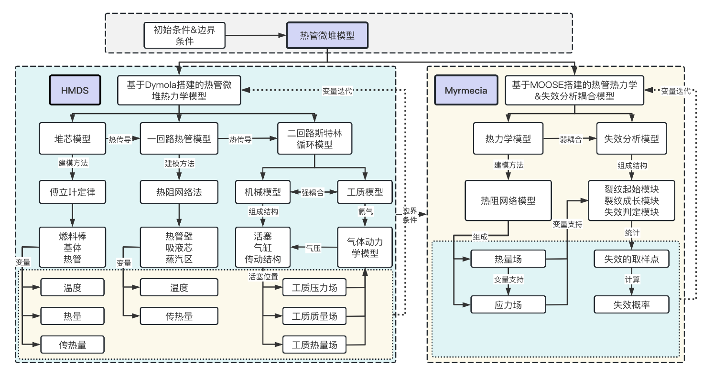

**图1-1: 本文的主要研究内容示意图**

热管微堆的热力学仿真系统HMDS对包括热管微堆的堆芯、一回路热管以及二回路斯特林热力学循环在内的模块进行了热力学建模仿真。其中，堆芯模型包括燃料棒和基体的导热模型；基于热阻网络法搭建了一回路热管模型；二回路的斯特林热力学循环则由机械模型以及氦气工质的气体动力学模型耦合而成。热管失效分析模型Myrmecia的搭建及其传热极限分析部分则是在已完成的HMDS热力学模型的数据基础上进一步开发完成的，它由热管的热力学模型以及热管的失效分析模型两个子模型耦合而成。值得强调的是，本文在MOOSE中针对热管进一步开展有限元建模仿真的目的主要有两个：一是分析热管的传热性能，以尽可能的提升热管的传热量，进而增大反应堆的输出功率；二是研究热管的可靠性，了解不同参数以及变量对热管失效概率的影响，以尽可能的减少热管微堆运行时发生事故的概率。此外，本文针对热管的研究重点放在热管的稳态运行，默认碱金属热管能够顺利完成冻态启动，并使用热阻网络法完成热管模型的搭建，从而得到热管稳态运行时的温度场。之后，在热管温度场的基础上基于MOOSE中Tensor Mechanics模块内相关的应力基类开发有对应的应力模块；从而完成热管的热力学模型搭建。最后，在热管热力学模型的基础上进行失效分析模型的搭建。该失效分析模型主要用于研究热管壁内表面裂纹对热管运行的潜在危害。它包含对裂纹尺寸进行初始化的裂纹起始模块、根据应力强度因子计算裂纹成长速度的裂纹成长模块以及当热管失效时判断热管失效事件的判断模块。综上所述，该热管模型不仅能够完成热管热力学的稳态仿真，还具备根据当前热力学参数预测热管发生不同失效事件的概率的功能。能够为热管微堆设计者在设计热管时既提供传热方面的数据参考，又兼顾热管运行时的安全性能。

正文将围绕上述两款模型，结合建模的原理及过程开展论述。具体包含各个部分的运行原理分析、数学模型概述、物理模型的选择与搭建、模型的验证以及稳态和瞬态工况的分析。各个章节具体的研究内容安排如下：第一章：研究目的以及国内外研究现状。第二章：堆芯热力学模型的搭建及其验证。第三章：一回路热管热力学模型的搭建及其验证。第四章：一回路热管失效分析模型的搭建及其验证。对热管模型在不同参数、变量情形下进行失效概率的预测；以分析不同设计方案对热管热力学性能和失效概率的影响。第五章：二回路斯特林热气机的搭建及其验证。对斯特林循环进行瞬态、稳态（包括敏感性分析）分析；以研究不同工况下其热功率及热效率的变化。第六章：总结上述研究成果并对其进行展望。

# **第二章 堆芯热力学模型开发与分析**

在第一章中提到了百千瓦级热管微堆可以作为太空探索器、深海探险装置、受灾断电地区以及偏远地方的能量源，具有广泛的应用市场。对此，本章将针对百千瓦级热管微堆的堆芯热力学模型进行开发、验证与分析。

## 2.1 **模型开发平台--Dymola**

随着核科学与技术的不断更新迭代以及核能系统复杂性的不断增加，传统的单一物理场仿真软件逐渐难以满足对现代核能工程中涉及的多物理场进行精确仿真的需求，例如流体流动、传热、结构力学等物理场相互耦合的反应堆系统[32]。为了更全面地理解和模拟这些复杂的工程问题，工程师和研究人员往往需要依赖多物理场仿真工具[33]。在多物理场仿真领域，ANASYS与COMSOL等商业软件可谓家喻户晓。然而它们高昂的使用费以及不开源的特点也同时制约着它们的使用者们。反观另一款由法国达索公司基于Modelica语言开发而来的Dymola则以其底层语言开源且易于移植至开源平台等优点逐渐受到越来越多领域内学者的关注，且国内亦有基于Modelica语言自主开发的可替代工业软件，如Mworks等。作为一款开源的建模语言，Modelica语言是一种面向方程的建模语言，它旨在为各种物理领域的系统行为提供精准的描述和模拟的特性使得工程师能够以一种自然而直观的方式描述系统，同时涵盖机械、电气、热力学等多个物理领域。这为解决涉及多种物理现象的工程问题提供了理想的平台[34, 35]。

同时，模型编辑器也是Dymola提供的强大工具之一，它可以为用户提供直观且功能丰富的建模界面。与此同时，支持文本模式的编辑使得用户可以根据实际需求选择最适合的建模方式。这种灵活性让用户在建模过程中更加自由，满足不同使用场景的需求。Dymola的仿真引擎是其另一个亮点，能够执行动态仿真。通过对系统在不同工况下的行为进行观察和分析，工程师可以深入了解系统的动态特性。这为优化设计提供了有力的支持，使工程师能够更有效地调整系统参数以满足特定需求。仿真结果以图表、曲线等形式呈现，使用户能够直观地了解系统各个方面的响应，从而在建模过程中实现实时的调整和优化[36, 37]。

除此之外，Dymola的核心优势之一还在于其卓越的跨领域建模能力。它能够无缝地涵盖机械、电气、热力学等多个物理领域。这种全面性使得工程师可以在同一个环境中对系统进行全面建模，并更好地理解不同领域之间物理变量的相互影响。此外，Dymola采用了组件化建模的方法进行模块开发，这使得用户能够将一个复杂的大系统划分为多个独立的小系统/组件，如图2-1所示便是一个在Dymola中搭建完成的安全壳外流道冷却模型，该模型以及本文的其余模型都由Modelica基础库中的组件或者自主开发的组件构建而成，且都能够在开源软件OpenModelica中复现。该模型被细分为水箱模块、管道模块、阀门模块以及外流道散热模块。这极大地提高了模型的可维护性和可重用性。

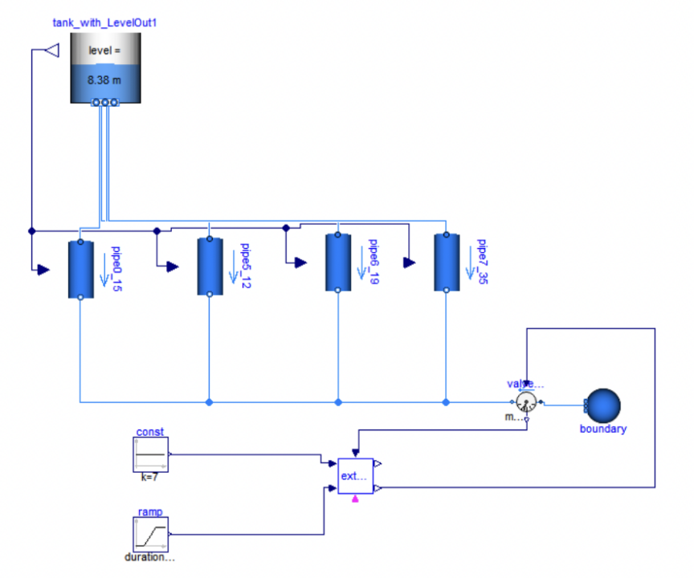

**图2-1: 安全壳外流道冷却模型原理图**

最后，除了内置的建模和仿真功能之外，Dymola还支持与外部C语言函数进行集成。通过External C函数，用户可以在Modelica模型中调用和使用在C语言中实现的功能，进一步拓展了Dymola的应用领域。这为用户提供了更大的灵活性和定制化的空间，使得他们能够更好地适应特定的仿真需求。如图2-2所示为在Dymola中搭建完成的通讯模组，它能够实现Modelica模型与外部其他仿真软件之间的数据交互。以Fluent为例，它能够将数据传递至UDF模块并接收Fluent中的数据从而完成双向数据互通。

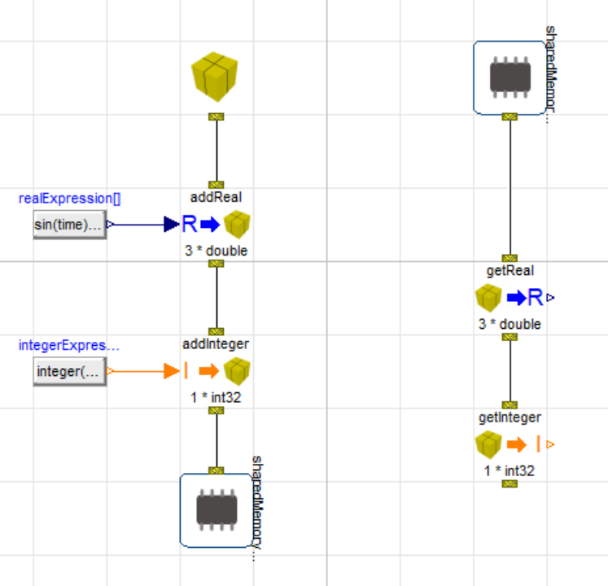

**图2-2: Dymola中用于与外部进行数据交互的通讯模组**

## 2.2 **堆芯热力学模型开发**

### 2.2.1 **堆芯结构**

至今，热管微堆已经经历了60余年的发展，而标准化热管微堆堆芯的“基本型”则在2002年LANL提出“HOMER”热管冷却式反应堆设计方案时才被奠定。如下图2-3所示为经典的典型热管冷却反应堆示意图，其设计结构包含一个排布有燃料棒和热管的紧凑布置反应堆，堆芯布置方式一般为六边形。堆芯的外侧与前端面布置有反射层与屏蔽层。热管冷却反应堆的控制棒一般采用旋转控制鼓的设计方案，控制鼓的周向上设置有其他材料的反射层，以实现控制鼓旋转时对反应堆功率的调节[38, 39]。

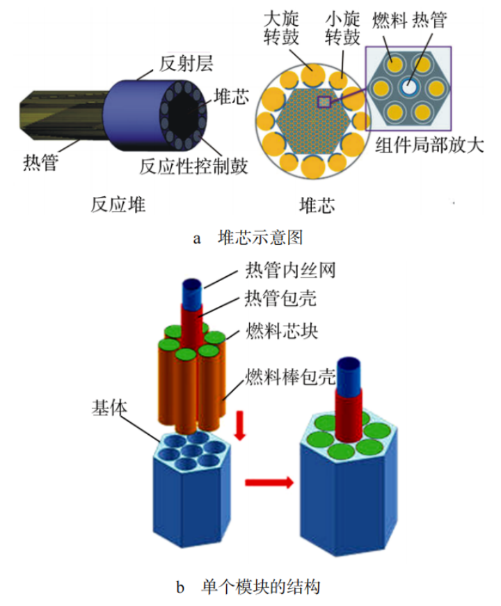

<strong>图2-3: 典型的热管微堆堆芯结构示意图[38]</strong>

### 2.2.2 **HMDS中热管热力学模型的开发以及验证**

为了完成堆芯模型的开发与验证，需要先在Dymola中完成热管热力学模型的搭建。关于使用热阻网络法搭建热管热力学模型的详细介绍将在第三章中进行展开；为了避免赘述，该小节只针对Dymola中的HMDS热管模型开展热力学验证用于辅助后续堆芯模型的搭建。图2-4为热管热力学模型在Dymola中的图形开发界面。模型左侧的输入端用于接收热管的热源温度；右侧的两个输出端用于输出热管壁冷凝段外表面的温度以及热管的总传热量。

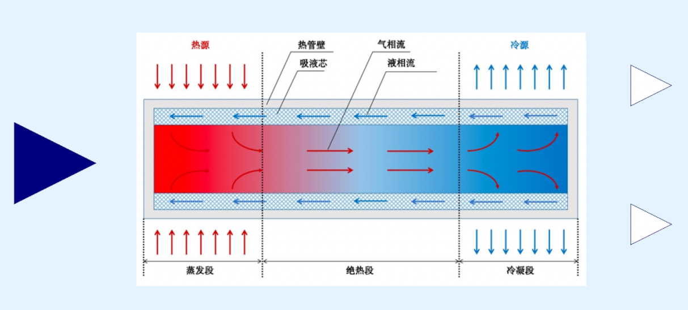

**图2-4: HMDS中热管模型的图形界面**

为验证该热管模型的准确性，将使用Hu等人搭建的SAM程序中热管的温度变量值作为对照数据进行验证[40]。两个热管模型在相同设计参数下各处温度的对比情况如表2-1所示。两个模型误差最大处为 ⑨ 号取样点，误差为-1.59K，相对误差为-0.23%；且所有取样点处的误差都小于0.5%。因此，可以认为HMDS中热管模型能够很好的模拟热管各处的温度。

**表2-1:HMDS与SAM的热管温度对比情况**

<table><tr><td>
取样编号
</td><td>
HMDS（<em>K</em>）
</td><td>
SAM（<em>K</em>）
</td><td>
误差（<em>K</em>）
</td><td>
相对误差（<em>%</em>）
</td></tr><tr><td>
①
</td><td>
899.71
</td><td>
899.71
</td><td>
0
</td><td>
0%
</td></tr><tr><td>
②
</td><td>
865.49
</td><td>
865.43
</td><td>
0.06
</td><td>
0.01%
</td></tr><tr><td>
③
</td><td>
853.09
</td><td>
853.01
</td><td>
0.08
</td><td>
0.01%
</td></tr><tr><td>
④
</td><td>
852.70
</td><td>
853.01
</td><td>
-0.31
</td><td>
-0.04%
</td></tr><tr><td>
⑤
</td><td>
852.68
</td><td>
851.69
</td><td>
0.99
</td><td>
0.12%
</td></tr><tr><td>
⑥
</td><td>
851.37
</td><td>
850.90
</td><td>
0.47
</td><td>
0.06%
</td></tr><tr><td>
⑦
</td><td>
850.72
</td><td>
850.90
</td><td>
-0.18
</td><td>
-0.02%
</td></tr><tr><td>
⑧
</td><td>
810.12
</td><td>
810.10
</td><td>
0.02
</td><td>
0%
</td></tr><tr><td>
⑨
</td><td>
695.95
</td><td>
697.54
</td><td>
-1.59
</td><td>
-0.23%
</td></tr></table>

### 2.2.3 **堆芯验证模型的开发**

在进行堆芯模型的搭建之前，需要先进行以下的简化和假设：

1. 鉴于中子运输模型的复杂性，燃料棒的建模只考虑热力学领域。并将燃料棒产生的热量设置为恒定的稳态热功率。
2. 由于Dymola是基于方程对工程问题进行求解，而非基于网格。因此，其难以进行三维仿真。对此，本文搭建的热管微堆堆芯模型将燃料棒假设为温度分布均匀的棒体（点热源）。而基体各处的温度则根据其距离燃料棒边缘的长度通过傅立叶定律计算得到。
3. 为方便堆芯模型的搭建，本文也将在Dymola中使用热阻网络法搭建热管模型，以便完善堆芯的热力学计算。在热管的设计参数确定后，其热阻大小便也确定下来。此时只需要得知热管蒸发段处的热源温度以及冷凝段的冷源温度即可得知热管的传热量。假设热管与燃料棒均匀的等距排布在基体上，则热管的热源温度可以通过计算基体的平均温度获得，热管的冷源温度则需要被预先设置为恒温。

如图2-5所示为热管微堆中堆芯模型的构建流程图。本文将堆芯模型拆解为燃料棒、不锈钢基体与热管三部分进行建模。燃料棒被设置为带有内置稳态热源且温度分布均匀的棒体，它的待求解变量为平均温度、热量和热功率。蜂窝煤状的不锈钢基体用于安插稳定燃料棒与热管的同时，还负责将热量传导至热管，该子模型中的待求解变量则为基体的各处温度、总热量等。最后，热管子模型则是根据热阻网络法构建而来，热阻网络的划分及各处热阻的计算公式将在第三章进行详细说明。通过热管子模型能够求得热管各处的平均温度、热管的热阻以及热管的传热量等变量。图2-5中的流程1为热管传热量的计算过程，其具体算式如公式(1-1)所示：

$$
热管传热量= \frac{(基体的平均温度-冷凝段的恒定温度)}{热管的热阻}
\tag{2-1}
$$

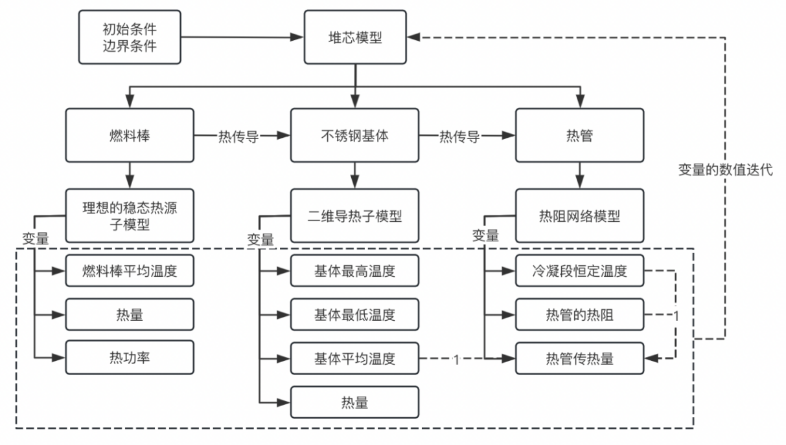

**图2-5: 热管微堆中堆芯模型的构建原理图**

就堆芯模型搭建的第一步，本文选取了Zhou等人基于ANL的热管数据搭建的热管微堆模型作为对照模型。其中，该对照模型内燃料棒、基体以及热管的详细材料参数如表2-2所示[21]。同时，相同的材料参数也将用于在Dymola中搭建堆芯模型。堆芯模型的起始温度设置为875<em>K</em>，热管冷凝段外表面的温度设置为800<em>K</em>，燃料棒的热功率则为40<em>kW</em>。

**表2-2: 热管微堆堆芯及热管的材料参数**

<table><tr><td></td><td>
基体
</td><td>
燃料棒
</td><td>
热管
</td><td></td><td></td></tr><tr><td></td><td></td><td></td><td>
蒸发区
</td><td>
吸液芯
</td><td>
热管壁
</td></tr><tr><td>
密度 ( $\frac{kg}{m^{3}})$ 
</td><td>
1873.9
</td><td>
1.1E4
</td><td>
1
</td><td>
865
</td><td>
7670
</td></tr><tr><td>
比热容 ( $\frac{J}{kg}$ )
</td><td>
1603.53
</td><td>
939
</td><td>
1\times 10^{4}
</td><td>
1200
</td><td>
568.7
</td></tr><tr><td>
热导率 ( $\frac{W}{m\cdot K^{-1}}$ )
</td><td>
30
</td><td>
18
</td><td>
1\times 10^{6}
</td><td>
47.37
</td><td>
21.82
</td></tr></table>

基于ANL的热管数据所绘制的热管微堆简化模型如图2-6所示。该模型由最中心的燃料棒、不锈钢基体以及六根呈六边形排布的热管组成，各个部件的尺寸已在图中标注。在该模型中，燃料棒产生的大量热量通过基体传导至热管的蒸发段，热管内的工质再通过相变将热量传递至热管的冷凝段，最后热量在反应堆的二回路被利用。

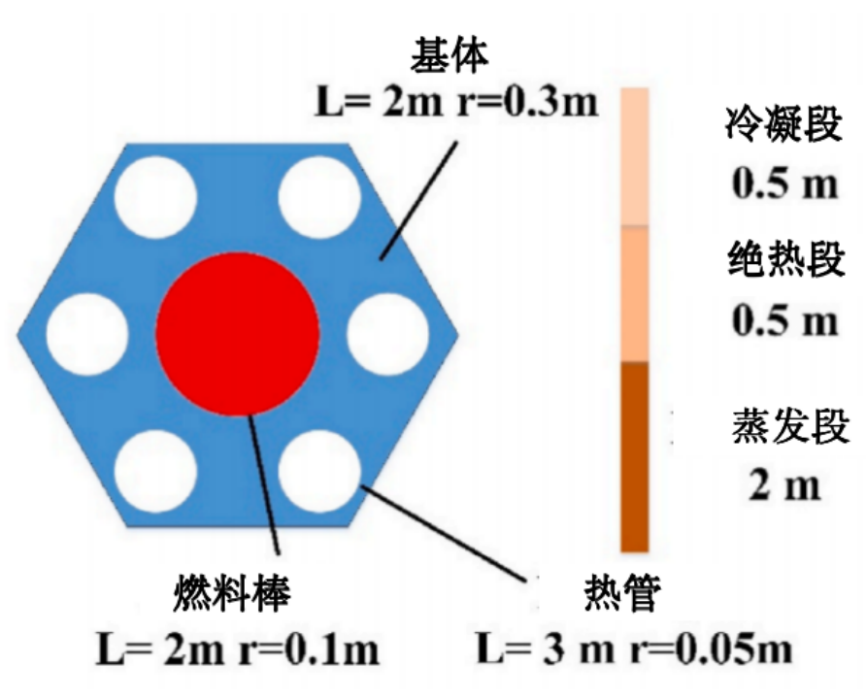

<strong>图2-6: 热管微堆的简化模型结构图[21]</strong>

图2-7-(a)为Dymola中搭建HMDS堆芯模型时的图形化界面。在该界面用户可以通过拖拽、链接左边模型库中的元器件完成模型的搭建。

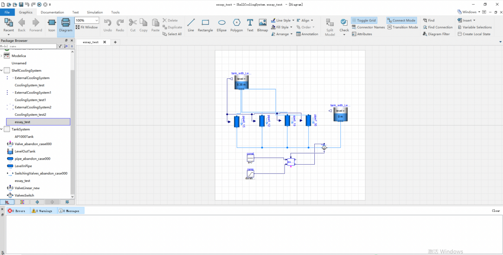

1. Dymola模型中的图形化界面

图2-7-(b)为Dymola中搭建HMDS堆芯模型时的文本界面。用户可以在该界面设置模型的参数、变量以及方程。在保证变量数与方程数量一致无误后便可以进入仿真界面开始运行模型。

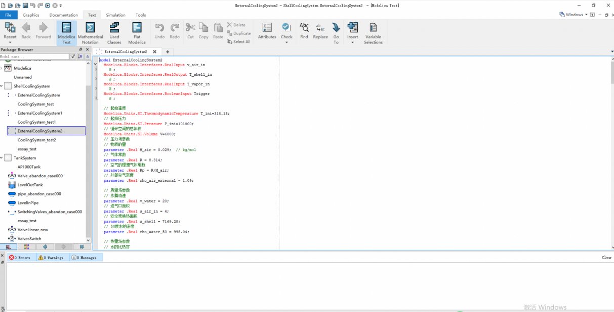

(b) Dymola模型中的文本编辑界面

在开始运行模型后，内置求解器将完成方程组的求解工作。各变量的仿真数值曲线则可以通过在变量栏内勾选相应的变量在数值窗口获得。结果如图2-7-(c)所示，为Dymola中搭建HMDS堆芯模型时的仿真结果界面。

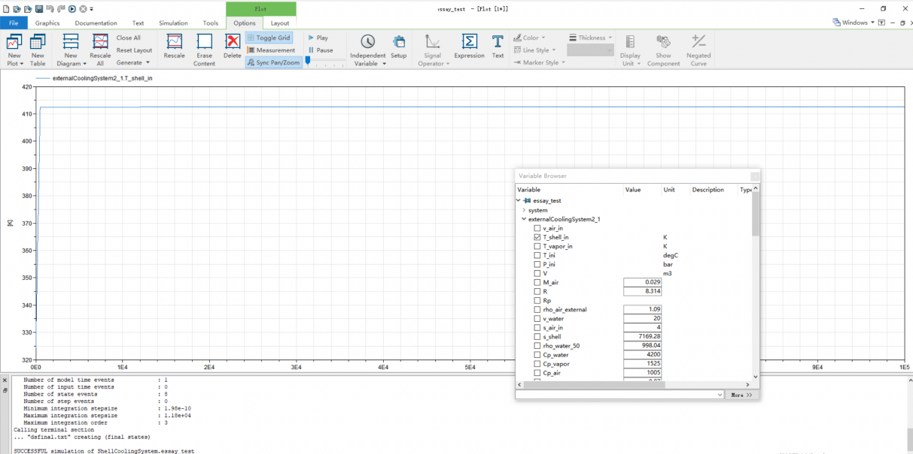

(c) Dymola模型中仿真结果的展示界面

**图2-7: Dymola中堆芯模型的图形、文本、仿真界面**

如图2-8所示为周等人基于ANL的热管数据搭建的ANL模型与本文搭建的HMDS模型中燃料棒与基体的温度分布对照图。在达到稳态后，HMDS堆芯模型的基体温度误差为0.53*K*，相对误差为0.06*%*；燃料棒温度的误差为12.57*K*，相对误差为1.23*%*。HMDS堆芯模型与ANL模型的燃料棒温度与基体温度仿真结果符合度较好。而HMDS堆芯模型的燃料棒平均温度误差明显大于基体平均温度误差则是由于燃料棒建模时被简化为一维模型而导致的，但从图2-8的结果来看这对后续基体的传热影响不大。综上表明本文在Dymola中搭建的HMDS堆芯模型具备模拟热管微堆堆芯传热现象的能力。

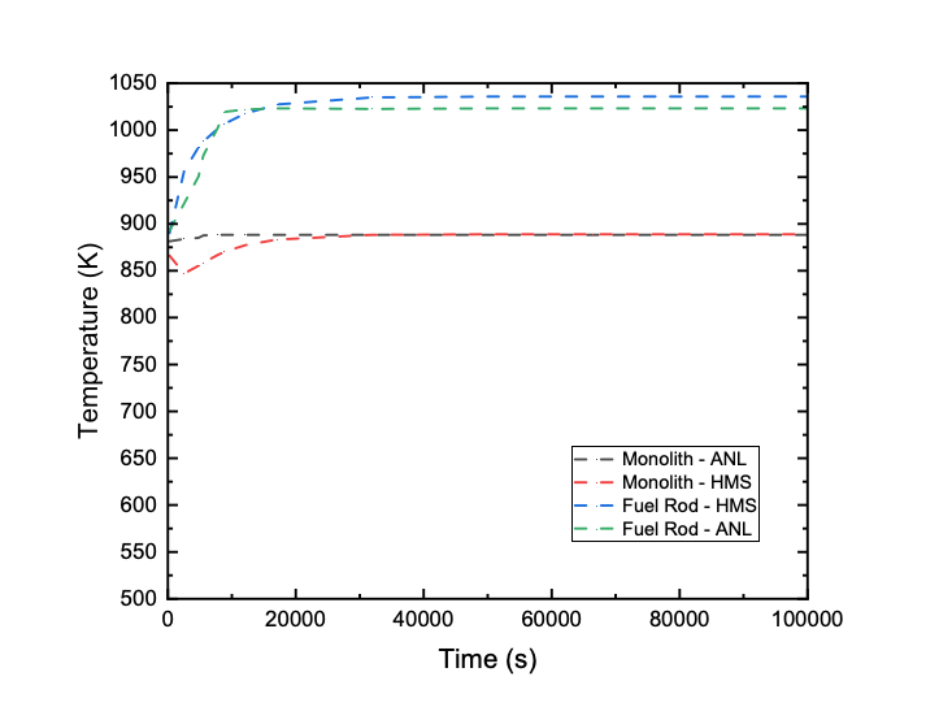

**图2-8: ANL模型与HMDS模型中基体和燃料棒的温度分布**

## 2.3 **堆芯模型的开发与分析**

### **2.3.1 350kW堆芯的开发与验证**

为完成百千瓦级热管微堆的搭建，堆芯的热功率设置为350*<text style="italic">kW*</text>。堆芯模型中燃料棒等组件的详细材料参数与2.2.3小节中相同。热管的蒸发段、绝热段和冷凝段长度分别为1 $m$ 、0.5 $m$ 和0.3 $m$ 。热管壁的厚度与吸液芯的厚度分别为1.9 $mm$ 和1 $mm$ 。基体的外表面默认为绝热层。模型的起始温度、热管的冷凝段外表面温度等也都与2.2.3小节中保持一致。350*<text style="italic">kW*</text>热管微堆堆芯的结构简图如图2-9所示。

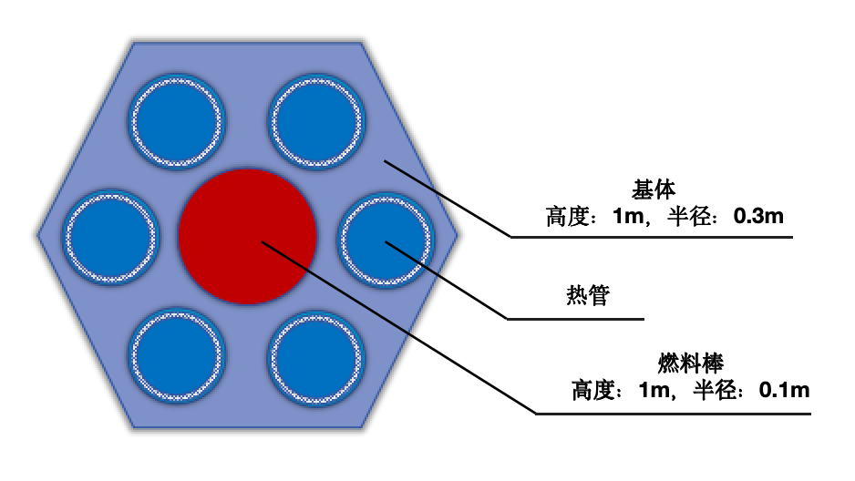

**图2-9: 350kW热管微堆堆芯的结构简图**

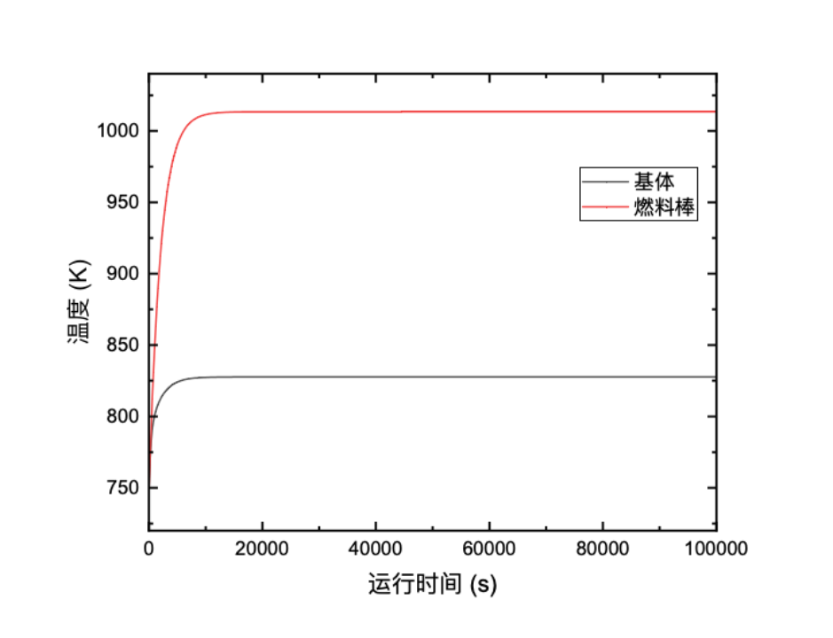

**图2-10: 350kW堆芯模型的温度分布示意图**

重复2.2.3小节的建模步骤完成HMDS中350*kW*堆芯模型的搭建后。此时堆芯模型的燃料棒平均温度、基体平均温度如图2-10所示。在达到稳态后，基体的温度为826.15*K*，燃料棒的温度为1008.89*K*。虽然本节设计的堆芯热功率更高，且体积更小；但是相较2.3节中堆芯基体的温度要低62.65*K*。这是由于该小节使用的热管传热性能更好，能够在堆芯启动后更快的将热量传导出去，从而保证堆芯的安全性。

## 2.4 **350kW堆芯模型的分析**

#### 2.4.1 **热管单点失效对堆芯温度的影响**

如上述小节所介绍的，热管微堆采用热管将堆芯的热量传递至二回路。且为增大传热效率往往使用碱金属作为热管的工质，这使得热管需要在高温情况下运行，而较大的热应力强度又可能让热管本身发生形变，甚至导致结构破裂。加之热管蒸发段直接与堆芯相接触，高辐照的工作环境又加剧了热管蒸发段发生蠕变以及脆化的概率。除此之外，当热管内壁面存在裂纹时，内部快速流动的碱金属工质将加速裂纹的成长，最终导致热管壁破裂[41]。因此，在热管微堆模型中考虑热管单点失效事故是十分有必要的。下文将在2.3节搭建的350<em>kW</em>堆芯模型的基础上依次减少热管的数量以模拟单根、两根热管失效情形下热管微堆堆芯上的温度变化，仿真结果如图1所示。随着热管失效数量的增加，堆芯的散热负担将被分摊至其余正常工作的热管。这将使得单根热管的传热量增加，同时导致堆芯的基体以及燃料棒上的温度都上升了13.82摄氏度。

上述情况较好的证明了热管微堆的抗单点失效性，然而这并不意味着少数热管失效对热管微堆的运行就无伤大雅。一方面，当更多的热管发生失效时其余热管可能会因为传热量超过传热极限而发生熔毁，进而发生“雪崩式”连锁反应导致其余所有热管都失效。另一方面，堆芯各部件的温度在短时间内剧增将会产生巨大的热应力，这可能会使得堆芯部件开裂从而影响微堆的正常运行。综上所述，热管微堆具有良好的抗单点失效性能，这在热管数量多的情形下表现更佳，因为这样分担传热负担的热管更多。但热管微堆发生单点失效仍会对其运行产生巨大隐患，需要极力避免。

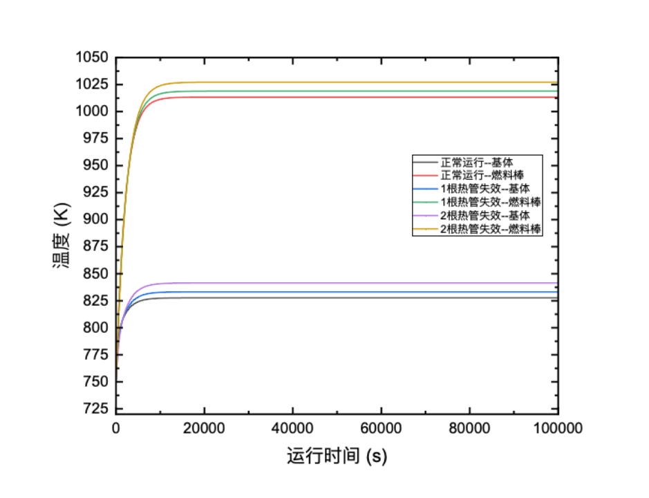

**图1: 热管微堆正常运行/失效情形下堆芯的温度变化示意图**

#### 2.4.2 **热管的热阻大小对堆芯温度的影响**

热管负责将热管微堆中堆芯的热量导出，在这个过程中热管本身的材料、尺寸等设计因素都将影响热管导出热量的大小以及效率，而这关乎着整个热管微堆的输出热功率以及安全性能。以堆芯为例，若热管的传热能力不足将使得多余的热量无法从堆芯及时排出而导致堆芯温度过高。因此，在热管微堆的设计过程中考虑热管的材料、尺寸等设计因素对热管传热能力的影响是十分有必要的。而在热阻网络模型中，热管的这些设计因素对热管传热性能的影响则可以统一为通过改变热管的热阻大小完成的。下文将以2.3小节搭建的350*kW*堆芯模型为基础，通过更改热管的热阻大小来观察堆芯温度的变化情况。仿真结果如图1所示，随着热管热阻的增大，热管的传热效率随之下降，堆芯各部件的温度则随之上升。当热管的热阻从原基础值的0.00474扩大1.6倍后堆芯的基体以及燃料棒温度都上升了16.59摄氏度。显然，更大的热管热阻并不利于堆芯的散热，也不利于对核燃料的充分利用。因此，在不影响热管安全性能的前提下尽可能减小热管的热阻是有必要的。关于该问题的具体讨论将在本文的第四章进行。

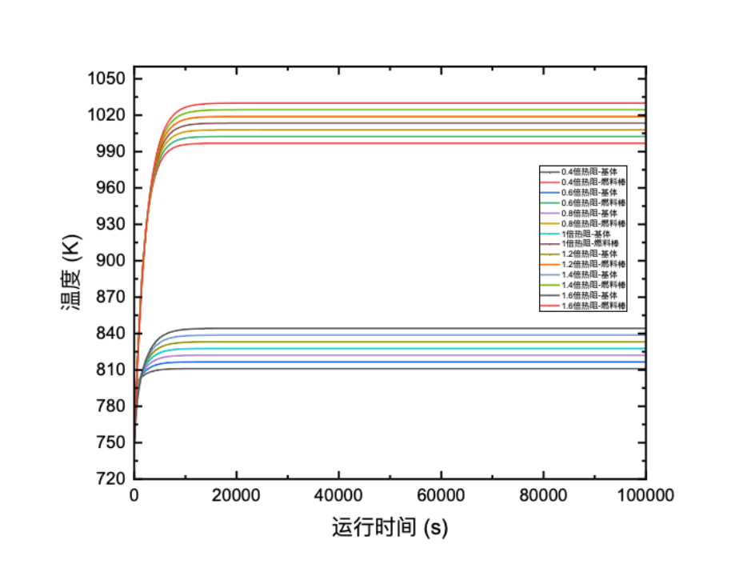

**图1：不同热阻情况下堆芯的温度变化示意图**

## 2.5 **本章小节**

本章针对热管微堆的堆芯结构特点，在Dymola中进行了基础的堆芯热力学模型以及热管力学模型设计并分别进行了堆芯的稳态、瞬态验证和热管的稳态验证，验证结果表明这两个模型的最大误差分别为1.23%与0.23%，模型的仿真结果可靠。在完成堆芯验证模型的开发与验证之后，又在此基础上进行350kW热功率堆芯的开发以及分析。所得出的分析结果表明热管微堆具有较好的抗单点失效性；热管的热阻大小会直接影响堆芯的温度。至此，本文已经完成了HMDS系统中堆芯以及热管的热力学模型搭建。

# **第三章 基于MOOSE的热管热力学模型分析**

在Dymola中完成堆芯以及热管热力学模型的开发工作后，HMDS系统已经初备对热管微堆的堆芯和一回路开展热力学仿真的能力。然而，热管微堆的设计并不能够只考虑其热力学性能，安全性能同样是反应堆设计的重中之重。对此，本章以及第四章将在MOOSE平台针对热管开发一款名为Myrmecia的程序，用以综合衡量热管的传热性能以及安全性能，用以为后续的碱金属热管设计提供一些参考。

## 3.1 **模型开发平台—MOOSE**

热管微堆中的热管起到将堆芯产生的热量传递至二回路，确保整个反应堆堆芯温度适中的关键作用。因此，热管在微堆运行期间的热力学性质以及可靠性都具有重要的研究意义。为达到上述两方面的要求，需要对热管进行包括温度分布、气压分布、应力分布、传热量在内的热力学分析以及针对网格节点的随机抽样和失效概率计算。然而上述内容要求仿真平台不仅能够提供快速、高精度、耦合性能良好等性能，还需要能够根据热力学参数和变量完成失效概率预测的功能。故热管热力学模型的搭建将在MOOSE（Multiphysics Object-Oriented Simulation Environment）平台上进行。MOOSE是一款起源于2008年，由美国爱达荷国家实验室（INL）开发的面向对象的多物理场耦合开源软件。其自带的热力学、材料、边界、后处理等模块及读值法、插值法等工具使得开发者无论在建模还是二次开发时都能够得心应手。除此之外，它具备全隐式、全耦合、高精度、高并发、网格自动化以及支持多种求解算法等优点[42]。

以本文搭建的热管模型为例，如图3-1所示为一款MOOSE程序的四层基本组成结构。根据从上到下的调用顺序，它们依次是：最上层的热管模型，在这一层中包含需要求解的偏微分方程、解变量、辅助变量、参数的设定以及整个模型的初始化。第二层是物理层，这一层主要包括用来构建上一层“热管模型”的物理模块。它们包括热管不同组成部件的材料物性设定、热管的热力学模型（热阻网络模型）、边界条件的设定、求解内核以及辅助内核的设定、热传导和热对流模块等。最后，第一层设置的偏微分方程组会在物理层中被离散化。第三层则主要包括Libmesh函数库，该函数库主要负责网格相关的处理工作，例如网格上数据的输入/输出。除此之外，它还会将第二层中经离散化的偏微分方程分解成残差方程和雅可比矩阵并提供有限元法来求解整个模型。第四层也就是最底层的求解层，这一层主要包括开源的PETSc求解器及其内部举足轻重的SNEs非线性求解器，它们将负责对第三层中包括非线性方程在内的方程组进行求解。值得一提的是，强大的求解器还能够为MOOSE程序提供包括NEWTON、JFNK（Jacobian Free Newton Krylov）、PJFNK（Precondition Jacobian Free Newton Krylov）、FD（PETSc对项使用有限差分法）在内的多样化求解方法。其中，由于本文的热管模型并不是十分复杂的非线性系统，因此为使得模型的求解过程高效且稳定，本文在MOOSE中搭建的热管模型在求解时选用NEWTON法。

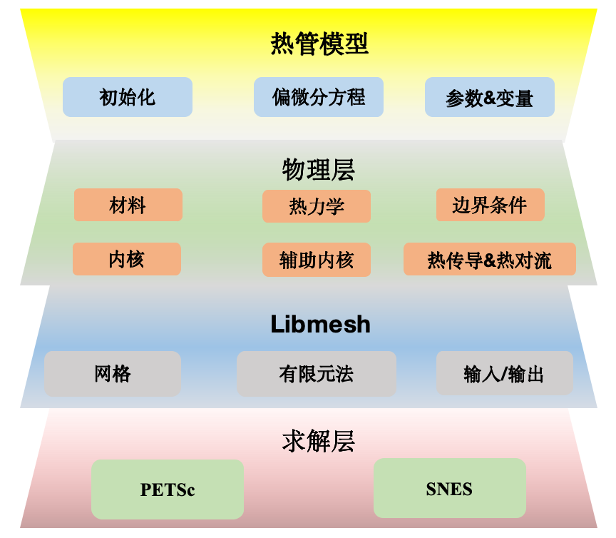

**图3-1: MOOSE程序的基本组成结构图**

正是得益于以上四层结构提供的丰富功能，基于MOOSE框架搭建的热管模型才能够精确且高效的完成热力学问题的求解以及数百万个取样点的快速取样以及取样点的失效判断。本文基于MOOSE框架开发的类如图3-2所示。它们按照归属可以分为热力学模型以及失效分析模型两个部分。而按照功能则可以分为Kernels、Bcs、Materials以及AuxKernels等，它们分别用于提供解变量求解所需要的控制方程，方程求解所需要的初始条件和边界条件，为其他类及模块提供参数、变量值，辅助求解方程。同时，为方便后续版本迭代以及简化建模过程，本文基于MOOSE框架开发的Kernels下属类都带有AD前缀，即使用MOOSE提供的自动微分功能。

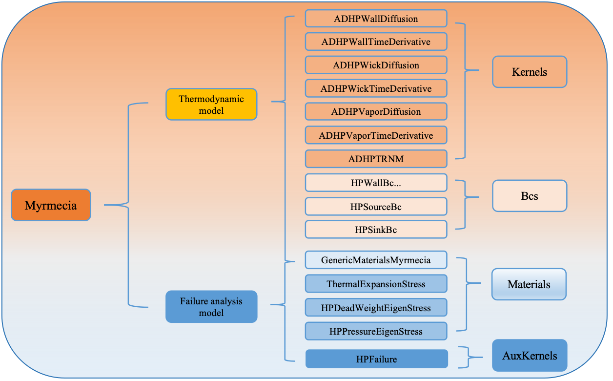

**图3-2: 基于MOOSE开发的热管程序架构图**

## 3.2 **热管热力学模型的开发**

### 3.2.1 **热管传热原理及优势**

热管诞生于1964年的LANL，设计之初被应用于热离子核反应堆中，用来充当反应堆的一回路以将堆芯产生的热量传递至二回路，从而保证整个反应堆的温度维持在安全范围[43]。热管主要具备以下优点[14]：

1. 导热系数高。使用热阻网络法对热管进行传热分析时几乎可以把热管看作一根导热的固体棒，而它的有效导热系数可以达到良导体铜的103-104倍，即按照热管的横截面积计算可达4.3 $\ast$ 108 <em>kW/m2</em>。
2. 适用范围广泛。根据不同的材料和工质制造出来的热管可以运行于-200～2000摄氏度的场景。
3. 热管一般都不具有运动部件，仅依靠相变进行非能动式传热，因此其固有安全性良好，在使用时更加安全可靠。

如图3-3所示为热管工作原理示意图。从径向看它主要由三层结构组成，它们从外向内分别是热管壁、吸液芯和蒸气区。热管壁通常使用热导率较高的金属制成以减小热传导损耗并增加导热效率。吸液芯的材料选择除考虑热导率外，由于其毛细孔半径和孔隙率等参数会影响热管的传热效率和传热极限等关键指标，同样需要慎重考虑。最后，中心部分的中空区域则是蒸气区，是工质流动传热的通道。从轴向看，热管又可以分为三个工作区间，它们分别是与热源接触并吸收热量的蒸发段、工质携带热量并进行几乎无损耗传热的绝热段以及与冷源接触并向冷源释放热量的冷凝段。

除上述结构和工作区间外，热管的工质也是必不可少的一部分。而热管工质的选择往往与热管的使用场景密不可分。以本文的研究对象热管微堆为例，其内部热管的使用温度范围一般为800～1000<em>K</em>，考虑到堆芯产生的热量庞大，选用热导率高的钠作为工质不仅能够增大热管的传热效率，而且相比于钾和钠-钾合金等其他选择，钠的运行温度范围更加广阔[44]。除此以外，近年来新能源产业的兴起使得锂离子电池的生产应用十分广泛，这也造成了存储量本就稀少的锂元素市场价节节攀升。反观钠元素的庞大存储量则使得选用钠作为热管的工质具有更好的经济效益。

在热管微堆实际运行时，热管的蒸发段与冷凝段分别与堆芯和二回路斯特林循环接触。最初时刻，由于堆芯产生的大量热量传入热管内，热管中的工质钠会快速融化，最后蒸发成气态。（由于本文使用热阻网络模型进行热管的模型搭建，默认热管能够进入稳态运行，而不考虑热管的冻态启动问题。因此，本文热管中的工质钠只考虑液态与气态的两相转换。）若此时热管两端工质的温度记为<em>T1</em>和<em>T2</em>，压力则分别会达到与之相对应的饱和蒸气压<em>P1</em>和<em>P2</em>。由于<em>P1</em>大于<em>P2</em>，故在蒸发段汽化吸热后的工质会途径绝热段流向冷凝段，并在冷凝段的汽液交互面上冷凝成液体后将潜热传递给冷源。之后，液态工质会在吸液芯表面毛细力的作用下进入吸液芯中的液流通道并回到蒸发段，从而构成工质的循环回路。

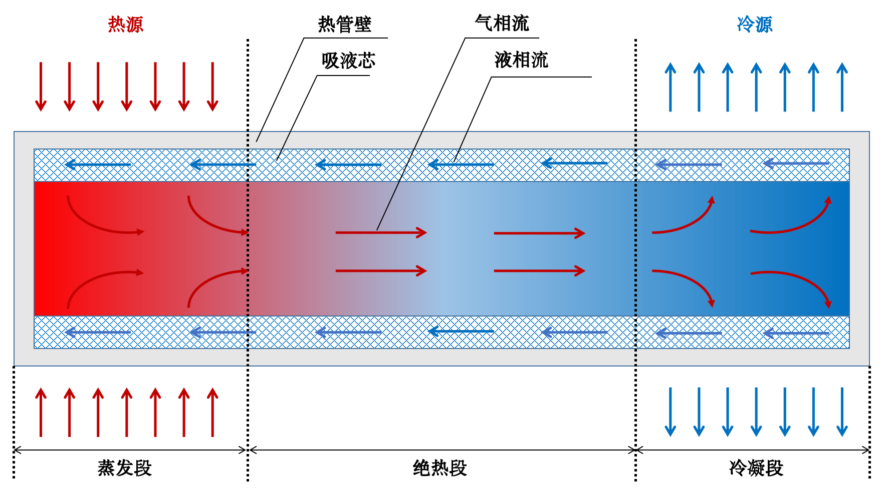

**图3-3: 热管工作原理示意图**

### 3.2.2 **热管的温度控制方程**

为使得MOOSE对偏微分方程能够进行快速高效的求解，需要对模型中提供的偏微分方程进行一些预处理。一方面，为方便计算机进行运算，需要把常规的偏微分方程以基础方程组成的弱形式写入输入文件中。另一方面，为方便后续Libmesh使用有限元法对各个网格元素上的偏微分方程进行求解，需要在物理层中先将热管模型中提供的偏微分方程进行空间离散化，具体离散化策略如方程（3-1）所示。

$$
\int_{\Omega }^{ }f\left(x\right)dx = \sum_{e}^{ }\int_{\Omega _{e}}^{ }f\left(x\right)dx.
\tag{3-1}
$$

其中， $\Omega$  是总积分区域， $\Omega _{e}$  是子积分区域， $e$  子积分区域的标志，而 $x$  则是积分点。

由于本文设计的热管模型主要针对运行温度在800<em>K</em>～1000<em>K</em>区间的热管微堆，因此热管壁材料选用316不锈钢[38]。热量在热管壁上以传导方式进行传递，其温度控制方程如方程（3-2）所示。下列温度控制方程都将基于MOOSE自带的自动微分(AD)模块搭建[45]。

$$
\rho _{w}c_{pw}\frac{\partial T}{\partial t}- \nabla \cdot \left(k_{w}\nabla T\right) =0.
\tag{3-2}
$$

热管壁温度控制方程的弱形式如方程（3-3）所示：

$$
\left(\rho _{w}c_{pw}\frac{\partial T}{\partial t},\psi \right)+\left(k_{w}\nabla T,\nabla \psi \right) - \left\langle k_{w}\nabla T,\psi \right\rangle = 0.
\tag{3-3}
$$

其中， $\psi$  为试函数，前面两项体积积分都在MOOSE中有对应的Kernel基类可供继承。最后一项边界条件也在MOOSE中具有对应的BC基类可供继承。

吸液芯的传热方式既包括热传导又包括热对流，但是其热对流的传热量远远小于其通过热传导传递的热量。尤其是在以钠等金属为工质的碱金属热管中，吸液芯通过热对流传递的热量往往可以忽略不计[15]。因此，吸液芯的温度控制方程可以被简化为一个如式（3-4）所示的热传导方程。

$$
\rho _{eff}c_{peff}\frac{\partial T}{\partial t}- \nabla \cdot \left(k_{eff}\nabla T\right)=0.
\tag{3-4}
$$

其中， $\omega$ 表示吸液芯的孔隙率。吸液芯的等效密度以及等效定压比热容乘积的计算公式如（3-5）所示。

$$
\rho _{eff}c_{peff}= \omega \rho _{e}c_{pe}+\left(1-\omega \right)\rho _{s}c_{ps}.
\tag{3-5}
$$

而（2-4）中吸液芯的等效导热系数 $k_{eff}$ 的计算式则如（3-6）所示[46]。

$$
k_{eff} = \frac{k_{e}\left[\left(k_{e}+ k_{s}\right) -\left(1-\omega \right)\left(k_{e}- k_{s}\right)\right]}{\left[\left(k_{e}+ k_{s}\right)+\left(1-\omega \right)\left(k_{e}- k_{s}\right)\right]}.
\tag{3-6}
$$

实际上，碱金属热管在稳态运行时其内部工质的传热方式也可以简单的等效为热传导[47]，此处不再赘述。在完成数学模型的搭建后，热管内基本的传热原理便由以上几个数学方程完成控制。后续的物理模型将进一步通过物理原理完成热管内更细致的温度场建模。

### 3.2.3 **热阻网络模型**

首先需要明确的是本文搭建的热管模型不仅仅需要能够模拟热管的热力学性能，还需要在此基础上针对已有的温度、应力、压力等参数预测热管的失效概率，以达到分析热管长期稳态运行下安全、可靠性的目的。关于热管物理模型的搭建，Shi等人就应用于反应堆的热管模型提出了一种两相三域的建模框架并大量总结了该领域已有的成果。目前，关于反应堆中的热管建模方法大致有三种：一是只使用控制方程完成模型搭建，该方法最为复杂困难，却最为精准有效。二是使用热阻网络模型，该方法简便高效，但无法针对流体工质开展时瞬态研究。三是使用努赛尔系数等无量纲参数以及控制方程开展建模[26]。相比于完全使用控制方程构建热管模型，虽然通过热阻网络模型无法得知流体工质的流速和组成等参数，但也能够精确的完成热管温度、热量、应力以及压力等热力学参数的分析。而且热阻网络模型的上述功能已经足够达成本文的研究目的，同时它还具备精简高效、节省计算资源等优点。因此，本文将选用热阻网络模型完成热管物理模型的搭建。

根据热量在热管中的流动过程，可以将热量在热管内的损耗程度以热阻网络的形式表示出来。如图3-4所示，为热管上半截面的热阻网络模型原理图。热量在蒸发段处从热源处进入热管内，并沿热管径向先后穿过热管壁、吸液芯和蒸发区到达蒸气区中心，再沿热管轴向经过绝热段后到达冷凝段，并在此处沿着热管径向先后穿过蒸气区、吸液芯和热管壁后流向冷源。整个过程中忽略热管壁以及吸液芯中的轴向热阻，原因是其远远大于热管壁、吸液芯的径向热阻。

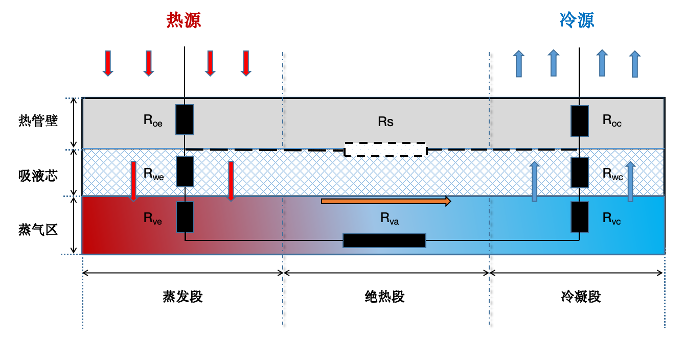

**图3-4: 热管的热阻网络模型原理图**

现在，只需要计算出各个热阻的阻值就能够在得知热源温度以及冷源温度的情况下算出热管内温度的分布以及传热情况。热管壁以及吸液芯使用常见的热阻计算公式，蒸气区相关的热阻计算公式则采用Chen等人提出的形式[48]。所有的热阻计算公式及对应的含义见表3-1。

**表3-1: 热管中各处热阻的计算公式**

<table><tr><td>
热阻方程
</td><td>
含义
</td></tr><tr><td>
 $R_{oe}= \frac{\ln\left(\frac{r_{o}}{r_{w}}\right)}{2\pi k_{w}L_{e}}$ 
</td><td>
蒸发段热管壁的径向热阻
</td></tr><tr><td>
 $R_{we}= \frac{\ln\left(\frac{r_{w}}{r_{v}}\right)}{2\pi k_{eff}L_{e}}$ 
</td><td>
蒸发段吸液芯的径向热阻
</td></tr><tr><td>
 $R_{ve}= \frac{R_{n}T_{v}^{2}\sqrt{2\pi R_{g}T_{v}}}{h_{fg}^{2}P\pi d_{v}L_{e}}$ 
</td><td>
蒸发段蒸气区的径向热阻
</td></tr><tr><td>
 $R_{va}= \frac{8\mu _{g}R_{g}T_{v}^{2}L_{a}}{\pi \rho _{v}r_{v}^{2}P_{v}h_{fg}^{2}}$ 
</td><td>
蒸气区的轴向热阻
</td></tr><tr><td>
 $R_{vc}= \frac{R_{n}T_{v}^{2}\sqrt{2\pi R_{g}T_{v}}}{h_{fg}^{2}P\pi d_{v}L_{c}}$ 
</td><td>
冷凝段蒸发区的径向热阻
</td></tr><tr><td>
 $R_{wc}= \frac{\ln\left(\frac{r_{w}}{r_{v}}\right)}{2\pi k_{eff}L_{c}}$ 
</td><td>
冷凝段吸液芯的径向热阻
</td></tr><tr><td>
 $R_{oc}= \frac{\ln\left(\frac{r_{o}}{r_{w}}\right)}{2\pi k_{w}L_{c}}$ 
</td><td>
冷凝段热管壁的径向热阻
</td></tr></table>

### 3.2.4 **热管的传热极限**

热管在实际应用时可能会因为本身材料属性、形状结构等因素使得传热过程受到限制，工程上将这种现象称为热管的传热极限[49]。为确保本文设计的热管能够符合传热规则并正常运行，接下来将考虑几种基本的热管传热极限，它们分别是毛细极限、沸腾极限和携带极限。由于本文的研究对象是运行温度在800～1000<em>K</em>的高温碱金属热管，因此主要影响低温热管的声速极限再次不进行考虑。

一方面，毛细泵送压力作为促成热管内工质循环的唯一驱动力，其大小直接决定了热管的热力学循环效率，进而限制了热管的传热能力。当吸液芯表面温度与工质饱和温度之间的温差较小时，随着热流密度的增加，气-液交互面的蒸发加强，使得蒸发段液体减少。当毛细压力不足以将液态泵送回蒸发区时，热管便会因为毛细极限而烧毁。这便是热管的毛细极限。

它的计算公式如（3-7）所示。

$$
Q_{cap} = \frac{\frac{2\sigma }{r_{c}}+\rho gL\sin\theta }{L_{eff}(F_{l}+F_{v})}
\tag{3-7}
$$

其中，热管有效长度的计算式如下：

$$
L_{eff} = L_{a}+0.5(L_{c}+L_{e}),
$$

$Q_{cap}$  是毛细极限， $\sigma$  表示液态工质的表面张力， $r_{c}$  为毛细半径， $\theta$  是热管的倾斜角度， $F_{l}$ 和 $F_{v}$  则分别表示液相工质和气相工质的摩擦力。

另一方面，若吸液芯表面的温度与工质饱和温度之间的温差上升，则会发生核态沸腾。核态沸腾有利于传热，但如果气泡过大则会无法排出吸液芯甚至阻碍液态从冷凝区回流。更严重的，大量气泡结合成的气膜将会阻碍液态工质接触蒸发器。这将使得热管壁面的温度迅速上升，最终导致热管烧毁。这便是热管的沸腾传热极限。沸腾极限的计算公式如（3-8） 所示。

$$
Q_{boi} = \frac{2\pi L_{e}k_{w}\Delta T_{cri}}{\ln(\frac{r_{i}}{r_{v}})}
\tag{3-8}
$$

其中， $Q_{boi}$  是热管的沸腾极限。临界温差表示为 $\Delta T_{cri}$ ，它的大小等于蒸发段热管壁与工质蒸气之间的温差。

除此之外，由于气相工质与液相工质的流动方向相反，因此在气-液交界面上存在剪切力。这使得过高的蒸气速度会将小液滴携带入蒸气中并将其传输至冷凝段。当过多的液体被携带离开蒸发段时将导致蒸发段烧干。这一现象称为热管的携带极限。它的计算式如（3-9）所示。

$$
Q_{ent} = A_{v}h_{fg}\sqrt{\frac{\sigma \rho _{v}}{2r_{e}}}
\tag{3-9}
$$

其中， $A_{v}$  表示吸液芯的横截面积，而 $r_{e}$  则表示吸液芯上毛细孔的水力半径。

## 3.3 **热管热力学模型的验证**

该小节将使用被验证过的仿真模型与实验数据分别对已完成的热管热力学模型进行验证，以确保热管模型的准确性。而对比的变量则选择具有重要意义的热管温度分布，这是因为热管内的温度分布不仅极大的影响着热管的传热性能，更决定了热管所受的热应力大小，对热管失效分析有着重要的参考意义。首先，本文选择Hu等人基于MOOSE搭建的热管模型中的温度分布数据作为对照，并将热管参数设置至与之一致[40]。相应的的热管材料参数见表3-2。

**表3-2: 热管验证模型的材料参数及尺寸**

<table><tr><td></td><td>
蒸气区
</td><td>
吸液芯
</td><td>
热管壁
</td></tr><tr><td>
外径 (<em>m</em>)
</td><td>
0.06
</td><td>
0.065
</td><td>
0.07
</td></tr><tr><td>
密度 (<em>kg/m3</em>)
</td><td>
1.00
</td><td>
865.00
</td><td>
7670.00
</td></tr><tr><td>
比热容 (<em>J/kg</em>)
</td><td>
1.0\times 10^{6}
</td><td>
1200.00
</td><td>
568.72
</td></tr><tr><td>
热导率 (<em>W/m-K</em>)
</td><td>
1.0\times 10^{7}
</td><td>
65.00
</td><td>
21.82
</td></tr><tr><td></td><td>
蒸发段
</td><td>
绝热段
</td><td>
冷凝段
</td></tr><tr><td>
长度 (<em>m</em>)
</td><td>
1.0
</td><td>
0.5
</td><td>
0.3
</td></tr><tr><td>
传热系数 (<em>W/m2-K</em>)
</td><td colspan="3">
hs1 = 106, h9s = 104
</td></tr></table>

如图3-5所示，为本文基于热阻网络模型中热阻划分方式绘制的温度采样区域划分示意图。改图为热管的上半纵向截面。后续模型验证中所用到的温度变量便是在这些区域取得的温度平均值。

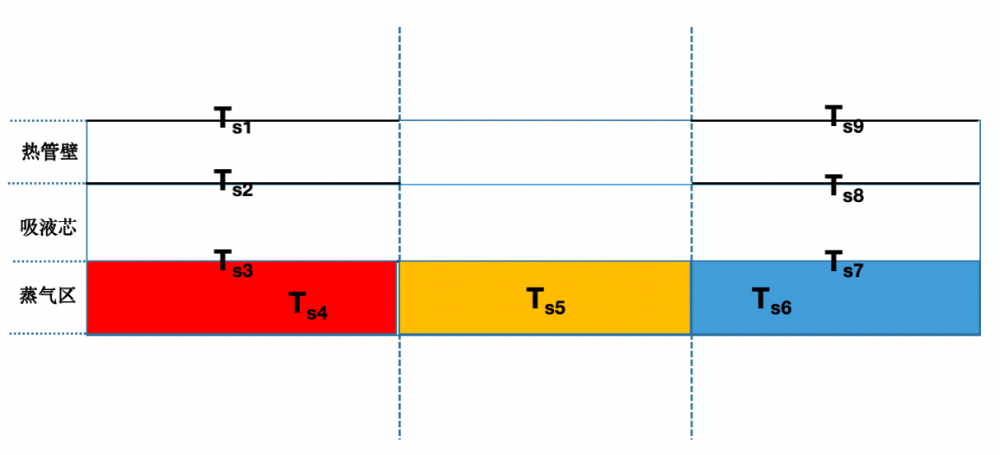

**图3-5: 热管温度采样区分布示意图**

模型搭建完成并成功运行后得到本文HMDS模型中热管温度分布数据与所对照模型仿真数据的误差与相对误差情况如表3-3所示。根据对比结果可知：二者的最大误差为1.69*K*，最大相对误差则为0.23*%*。HMDS中的热管模型仿真结果与对照模型的仿真结果较符合。

**表3-3: 热管温度分布对照表**

<table><tr><td>
取样处
</td><td>
Myrmecia（<em>K</em>）
</td><td>
Faghri（<em>K</em>）
</td><td>
误差（<em>K</em>）
</td><td>
相对误差（<em>%</em>）
</td></tr><tr><td>
 $T_{s1}$ 
</td><td>
899.71
</td><td>
899.71
</td><td>
0
</td><td>
0%
</td></tr><tr><td>
 $T_{s2}$ 
</td><td>
865.06
</td><td>
865.59
</td><td>
-0.53
</td><td>
-0.06%
</td></tr><tr><td>
 $T_{s3}$ 
</td><td>
852.80
</td><td>
853.22
</td><td>
-0.42
</td><td>
-0.05%
</td></tr><tr><td>
 $T_{s4}$ 
</td><td>
852.80
</td><td>
853.22
</td><td>
-0.42
</td><td>
-0.05%
</td></tr><tr><td>
 $T_{s5}$ 
</td><td>
851.45
</td><td>
851.55
</td><td>
-0.05
</td><td>
-0.01%
</td></tr><tr><td>
 $T_{s6}$ 
</td><td>
851.45
</td><td>
850.65
</td><td>
0.8
</td><td>
0.09%
</td></tr><tr><td>
 $T_{s7}$ 
</td><td>
850.72
</td><td>
850.65
</td><td>
0.07
</td><td>
0.01%
</td></tr><tr><td>
 $T_{s8}$ 
</td><td>
811.10
</td><td>
809.41
</td><td>
1.69
</td><td>
0.21%
</td></tr><tr><td>
 $T_{s9}$ 
</td><td>
697.28
</td><td>
695.68
</td><td>
1.6
</td><td>
0.23%
</td></tr></table>

为进一步验证热管热力学模型的准确性，下文将使用Yamamoto等人针对热管开展的热力学实验中的热管壁温度数据进行模型验证[50]。在使用参考文献中的热管参数更改热管模型后，该试验中的热管详细材料参数以及尺寸如表3-4所示。

**表3-4: Yamamoto等人进行的热管试验中热管的设计参数**

<table><tr><td>
工质
</td><td>
钠
</td></tr><tr><td>
热管壁材料
</td><td>
SUS 316L
</td></tr><tr><td>
全长
</td><td>
1000  $mm$ 

蒸发段：265  $mm$ 

冷凝段：500  $mm$ 

第一段绝热段：48  $mm$ 

第二段绝热段：187  $mm$ 
</td></tr></table>

在使用上述参数更新热管模型后，热管模型仿真结果与实验数据的对照情况如图3-5所示。仿真结果与实验数据的最大误差为6*K*，最大相对误差为0.625*%*，仿真结果与实验数据较吻合。综上，可以认为本文搭建的热管模型能够完成对热管热力学方面的仿真与模拟。

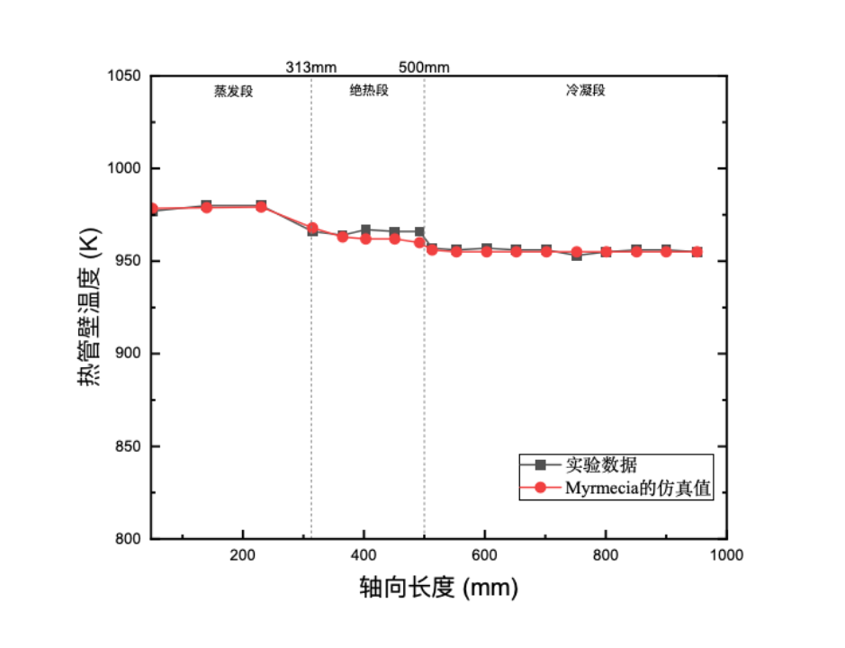

**图3-5: 热管仿真结果与实验数据的对照图**

## 3.4 **本章小节**

本章基于热管的运行原理并参考了前人在热管方面的设计经验，整理获得了热管壁、吸液芯以及工质的相关设计参数，并基于这些参数在MOOSE中开发了相应的温度控制方程模块和材料模块。之后，出于本文对热管热力学方面的研究范围以及后续热管失效模型的需求考虑，选用快速便捷的热阻网络法完成了Myrmecia的热力学模型开发并对该模型进行了模型-模型与模型-实验数据的双重验证。验证结果表明该模型的最大误差为0.625%，热管热力学模型准确可靠，这为后续热管失效分析模型的开发打下了良好的数据支撑。

# **第四章 基于MOOSE的热管失效模型分析**

在MOOSE中完成的Myrmecia热力学模型能够为热管设计者提供包括热管壁、吸液芯以及蒸汽区各处的温度分布情况和热流量大小。然而仅仅依靠这些变量数据无法直观的得知热管的安全属性，故基于热管热力学模型进一步开发Myrmecia的失效分析模型以计算热管的失效概率是十分有必要的。

## 4.1 **热管失效模型**

尽管针对金属表面的无损检测技术越发成熟，但在热管的实际铸造、焊接、运输过程中仍可能会造成热管壁内、外表面出现裂纹。尤其是在热管管体与两端的盖子进行焊接时，容易造成裂痕等损伤。由于反应堆中的热管在运行时既需要长期承受堆芯产生的高温环境，还要面临堆芯长时间高强度辐照的挑战。这些物理因素都容易造成热管的裂纹发生恶化，除此之外，热管内部的高温碱金属工质还会对热管内表面造成流动腐蚀，进而加剧已经存在的裂纹损伤。上述情形都可能造成热管壁的形变甚至是破裂，导致其他热管的传热负担加重。如果多根热管接连发生事故，还会使得堆芯热量无法及时传出而引发严重事故。因此，针对反应堆中热管壁上的裂纹开展热管的失效分析是十分有必要的。综上，本文将搭建一个热管的失效分析模型对热管的失效概率进行预测，具体组成如图4-1所示。

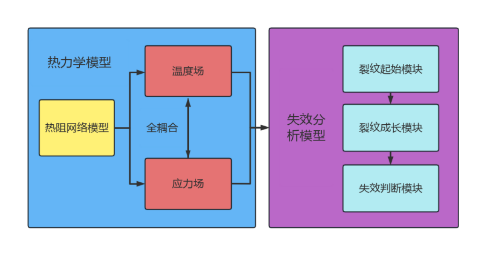

**图4-1: 热管模型结构原理图**

首先，该模型结合以往裂纹在反应堆一回路管道分布的经验函数对热管壁上的裂纹进行初始化。之后再以热管壁受到的热应力、自重应力、气压应力为基础计算裂纹因为疲劳以及应力腐蚀而扩张的速度。最后，当裂纹尺寸达到临界值时，再根据热管壁的断裂标准判断事故的发生类型。而热管设计者则可以参考失效概率的计算结果来适当调节热管的设计参数以及改变热管的运行工况，从而达到减小热管失效概率的目的。

## 4.2 **裂纹起始模块**

为完成热管失效分析模型的构建，首先需要得知裂纹在热管表面的分布情况以及这些裂纹的长度、宽度和深度等尺寸信息。相较于热管外壁面的裂纹，内壁面的裂纹更加隐蔽不易发现，且会额外承受来自内部高温工质的流动腐蚀。因此，热管内壁面裂纹的危害也更大[31]。如图4-2所示为热管上半部分径向截面的裂纹示意图。图中的参数 $h、 a、 b$  和 $R_{i}$  分别代表热管壁的厚度、裂纹的深度、裂纹的半长以及热管壁的内径。裂纹的长度和深度都会随着运行时间而生长，一旦裂纹深度等于热管壁厚度时（ $a \geq h$ ）热管便发生失效事故。

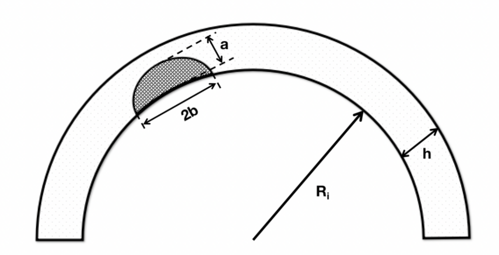

<strong>图4-2: 热管壁上的裂纹简图[51]</strong>

实际上，不同裂纹尺寸出现的概率也与上述热管参数的大小息息相关。参考Harris等人根据以往反应堆一回路中的316不锈钢管道内壁面的裂纹数据，整理出的如（4-1）及（4-2）所示的概率密度分布函数[51]。不难看出，初始尺寸越大的裂纹出现的概率也越低。利用这两个概率密度函数即可完成热管模型初始化时对裂纹尺寸的初始赋值。

$$
P\left(\frac{a}{h}\right)= \mu _{1}h\ast e^{-\mu _{1}a}.
\tag{4-1}
$$

$$
P\left(\frac{a}{b}\right)= \frac{\mu _{2}e^{-\mu _{2}\left(\frac{1}{\frac{a}{b}}\right)-1}}{\left(\frac{a}{b}\right)^{2}}.
\tag{4-2}
$$

## 4.3 **裂纹成长模块**

在完成裂纹尺寸的初始化后，该小节将分别讨论热管的疲劳失效概率以及应力腐蚀断裂概率（SCC）。根据Xu等人的研究，热管的蠕变失效概率远小于上述两种失效事故的概率[31]，故在此不进行考虑。

**（1） 疲劳失效**

在反应堆运行时，热管壁会因为长期受到温度的波动而承受疲劳应力，一旦热管壁的应力强度因子超过临界值，便会使得裂纹尺寸增大，最终可能导致热管的疲劳失效。根据Harris等人从实验数据推导出的经验公式，热管壁上的裂纹因为疲劳应力而扩张的速度如（4-3）所示。

$$
\frac{da}{dn}= c[\frac{\Delta K}{\left(1-R_{l}\right)^{\frac{1}{2}}}]^{m}=c\left(K^{'}\right)^{m}.
\tag{4-3}
$$

$$
\frac{da}{dn}= \left\{\begin{array}{c}c\left(K^{'}\right)^{m},       K^{'}> k_{0}^{'} \\      0,       K^{'}\leq k_{0}^{'}\end{array}\right..
$$

其中，

$$
\Delta K= K_{max}- K_{min},
$$

$$
R_{l}= \frac{K_{min}}{K_{max}},
$$

$$
K_{max}= \sigma _{max}\sqrt{\frac{\pi a}{Q}}Y\left(\frac{a}{h},\frac{b}{a}\right),
$$

$$
K_{min}= \sigma _{min}\sqrt{\frac{\pi a}{Q}}Y\left(\frac{a}{h},\frac{b}{a}\right),
$$

$$
\sigma _{max}= \sigma _{t}+ \sigma _{p}+ \sigma _{g},
$$

$$
\sigma _{min}= \sigma _{g}.
$$

上述等式中， $\frac{da}{dn}$  表示裂纹由于疲劳而扩张的速度，其中参数 $c$  = 9.14E-12，参数 $m$ =4。然而，裂纹并非一定会因为疲劳而扩张，除非应力强度因子 $k^{'}$  大于临界引力强度因子 $k_{0}^{'}$ 。 $k_{max}$  和 $k_{min}$  分别表示热管壁在一个周期内的最大应力强度因子以及最小应力强度因子。而 $\sigma _{max}$  和 $\sigma _{min}$  则分别表示热管壁在一个周期内所受到的最大应力以及最小应力。

本文在考虑热管内壁面的裂纹时，默认其受力均匀。参考Zheng等人的研究成果[52]，应力强度因子的计算公式如（4-4）所示。

$$
K= \sigma \sqrt{\frac{\pi a}{Q}}\left(A_{0}+A_{1}\left(\frac{a}{h}\right)+A_{2}\left(\frac{a}{h}\right)^{2}+A_{3}\left(\frac{a}{h}\right)^{4}\right).
\tag{4-4}
$$

其中，

$$
A_{0}=0.07e^{\left[-5.051\left(\frac{a}{b}\right)\right]}+1.044,
$$

$$
A_{1}=0.665e^{\left[-3.393\left(\frac{a}{b}\right)\right]}-0.43,
$$

$$
A_{2}=1.161e^{\left[-3.386\left(\frac{a}{b}\right)\right]}+0.771,
$$

$$
A_{3}=1.46e^{\left[-4.165\left(\frac{a}{b}\right)\right]}-0.179,
$$

$$
Q=1+1.464\left(\frac{a}{b}\right)^{1.65}     .
$$

考虑到热管的轴向应力通常是应力中最大的，也是对热管裂纹的生长速度影响最大的。因此，本文在热管壁所受应力方面只考虑热应力、气压应力以及自重应力。为满足热管模型中应力计算的需求，本研究基于MOOSE框架的RankTwoTensor类开发有以下三个应力类，它们分别是ADThermalExpansion-

Stress、ADHPPressureEigenStress和ADHPDeadWeightEigenStress。对应的应力计算公式如（4-5）～（4-7）所示。这些类都归属于Materials模块，并会在热管失效模型运行时为其他类或者模块提供参数、变量值等帮助。

$$
\sigma _{t}=E\alpha \left(T_{f}- T_{ini}\right).
\tag{4-5}
$$

$$
\sigma _{p}= \frac{Pr_{i}}{2h}.
\tag{4-6}
$$

$$
\sigma _{g}= \frac{G}{A}.
\tag{4-7}
$$

其中， $E$  和 $\alpha$  分别表示热管壁的杨氏模量和热膨胀系数。 $T_{ini}$  为运行开始时热管壁的起始温度，而 $T_{f}$  则表示运行的最后时刻（稳态后）热管壁的温度。 <em>G</em> 表示热管壁的自重力。 $p$  为热管内部的气压，虽然它不能够通过热管的热阻网络模型直接计算得出，但是它可以使用等效经验公式（4-8）计算得出[53]。

$$
p=2.99\ast10^{11}\ast\frac{1}{T^{0.5}}\ast10^{\frac{-5567}{T}}.
\tag{4-8}
$$

**（2） SCC**

从Xu等人的研究结果不难看出造成裂纹成长的因素当中，应力腐蚀断裂（SCC）的影响要远大于疲劳断裂以及蠕变断裂。这是由于应力腐蚀断裂的形成原因是热管壁不仅仅需要在高温（可能高压）的情况下长期运行，承受巨大的热应力、气压应力以及自重应力。此外，热管壁内部的结构裂纹还需要长期处于高温碱金属的流动腐蚀下。上述两个方面对热管壁的组合侵蚀才使得SCC成为对热管壁的最大潜在危害。基于此，了解SCC对热管壁裂纹成长速度的影响便成为了重中之重。Gangloff等人基于对实验数据的整理总结出了（4-9）所示的经验公式。该公式基于热管壁上的应力强度因子将热管壁上裂纹的成长速度划分为三个区间[54]。

$$
\frac{da}{dt}\left(\frac{mm}{s}\right) = \left\{\begin{array}{c}2\ast 10^{-9},                 K<46.2MPa\\3.33\ast 10^{-11},  46.2MPa\leq K<400MPa\\2.1\ast 10^{-7},               K>400MPa\end{array}\right..
\tag{4-9}
$$

**（3） 失效判断模块**

在完成裂纹尺寸的初始赋值后，裂纹成长速度将一直随着运行时间而累加。一旦裂纹的深度大于热管壁厚度，将发生热管失效事件。而根据热管壁破口处的尺寸以及应力情况则可以将热管的失效事故分为热管泄漏和热管破裂。根据Harris等人的研究成果，热管失效事故的判定式如（4-10）所示。如果满足该不等式则表示热管发生的失效事故为破裂，否则为泄漏。

$$
\sigma \ast A > \sigma _{f}(A-A_{crack}).
\tag{4-10}
$$

其中，

$$
A_{crack}=ab(2+\frac{a}{r_{i}}),
$$

$$
\sigma _{f}= \frac{\sigma _{ys}+\sigma _{ult}}{2}.
$$

$\sigma$  表示热管壁所受到的径向应力之和，即热应力、气压应力和自重应力之和。 $\sigma _{f}$  表示热管壁截面的临界应力。 $\sigma _{ys}$  为屈服应力。 $\sigma _{ult}$ 为极限应力。 $A$  为热管壁的横截面积，而 $A_{crack}$  则为裂纹的面积。

## 4.4 **热管失效模型的验证**

热管模型的网格节点中将存储包括温度、应力、气压等变量以及裂纹尺寸等参数的数值。而这些数值将在模型运行时实时更新并参与热管热力学模型以及失效分析模型的计算。此外，每个网格节点还有一个属性变量state用于记录它的当前状态，其初始值为1，表示该节点正常。而当热管中的裂纹深度大于热管壁厚度并经过失效判定模块分类后，对于发生泄漏事件的节点，state将被重新改写为0；另外，发生破裂的节点，state则会被改写为-1。

关于样本的抽样方法，本文开发的HMDS的热管模型在输入文件（.i文件）的Sampler模块中使用MOOSE自带的MenteCarlo类完成对热管模型上节点中变量的随机取样。所抽取的变量为节点状态变量state，在抽样时各个节点的状态值会被分别统计，数量也将会被分别累加。在运行结束后再进行概率计算，具体的计算公式如下：

$$
P_{l}\left(t_{ini}\leq t\leq t_{e}\right)= \frac{N_{l}(t_{ini} \leq t \leq t_{e})}{N}.
\tag{4-11}
$$

$$
P_{b}\left(t_{ini}\leq t\leq t_{e}\right)= \frac{N_{b}(t_{ini} \leq t \leq t_{e})}{N}.
\tag{4-12}
$$

$$
P_{f}= P_{l}+ P_{b}.
\tag{4-13}
$$

其中， $P_{l}$  表示热管裂纹发生泄漏的概率, 而 $P_{b}$  则表示热管裂纹发生破裂的概率。 $t_{ini}$  和 $t_{e}$  分别表示取样时间的开始点和结束点。 $N_{l}$  为取样点中发生泄漏事件的节点数量， $N_{b}$  为取样点中发生破裂事件的节点数量，而 $N$  则表示所有取样点的数量。本小节中的所有内容也都将被集成在HPFailure中，且所有计算得出的失效概率结果都能够在电脑终端显示。

Xu等人在综合考虑了热管的疲劳失效、应力腐蚀断裂以及蠕变失效在内的失效因素，并收集了多组通过实验数据得到的经验公式。开发了一款热管失效概率预测程序，可以根据当前热管的稳态工况来进行不同时间段热管失效概率的预测，失效概率也包括泄漏和破裂两种情况。Xu以LANL设计的MegaPower热管堆为例，以其稳态的运行工况条件为失效预测软件的输入[31]。具体的，热管壁选用316不锈钢制成，其杨氏模量取 $1.46 \ast 10^{11} Pa/m$  而热膨胀系数则取 $1.91 \ast 10^{-5} /K$ 。热管壁的内径及厚度分别为7.5<em>mm</em>和1mm。热管的工质选用钠。稳态运行时热管的平均温度为948.15<em>K</em>。在使用上述条件调整热管模型网格、参数后得出的运行结果与Xu的失效预测模型结果对比如图4-3所示。

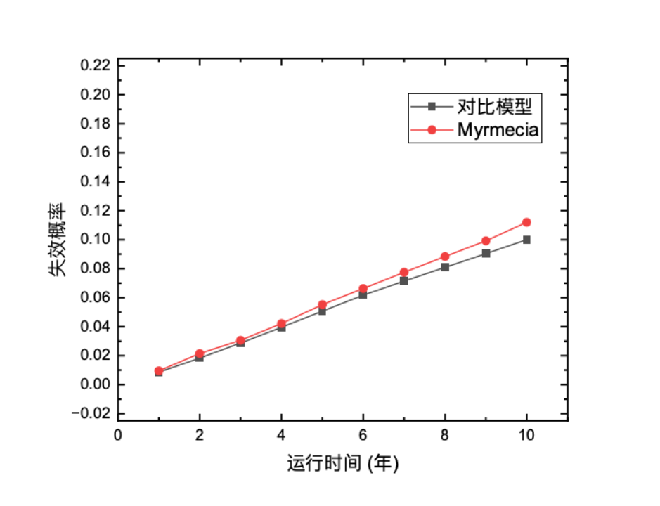

**图4-3: 与对照模型的失效概率结果对照图**

## 4.5 **热管热力学及失效概率模型的分析**

### 4.5.1 **热管模型的参数设置**

1. **基础参数**

为方便下文对热管的失效概率以及热力学性能开展进一步分析研究，需要搭建合适的热管模型为研究对象。为此，本小节将对热管模型的一系列参数进行设计与说明。首先，为了让热管具有更好的传热性，模型中热管的工质选用传热性能更好的钠。热管壁材料选用316不锈钢（SUS316），热管壁的杨氏模量和热膨胀系数分别为1.46 $\ast$ 1011 ${Pa}/{m}$  和 1.91 $\ast$ 10-5 ${1}/{K}$ 。为减小热管传热过程中的热损耗，热管壁的厚度通常为毫米级，本文搭建的热管模型则默认初始厚度为1<em>mm</em>。热管的稳态运行温度设计在850<em>K</em>左右。起始温度设置为750K。其余的热管基本参数则如表4-1所示。为方便单独对热管性能开展研究，将热管的热源温度和冷源简化为恒温热源并将温度分别设置为850K和780K。热管单位时间内的传热量（功率）计算公式如（4-14）所示。

$$
Power= \frac{T_{heat} - T_{cool}}{R_{total}}.
\tag{4-14}
$$

在热管热源、冷源温度确定的前提下。基于表4-1的热管参数以及3.4节所示的热阻计算公式不难算出该热管的传热量为6041.59*W*。然而，该热管模型通过3.5节的传热极限公式计算所得出的毛细极限、沸腾极限和携带极限中数值最小的沸腾极限为22234.5*W*。显然，该小节设计的热管模型中，其传热量远低于传热极限的最小限制，故其能够符合热力学要求正常运行。

**表4-1: 热管的基本参数**

<table><tr><td></td><td>
热管壁
</td><td>
吸液芯
</td><td>
蒸发区
</td></tr><tr><td>
外径（ $m$ ）
</td><td>
0.020
</td><td>
0.018
</td><td>
0.016
</td></tr><tr><td>
密度（ $kg/m3$ ）
</td><td>
7980.00
</td><td>
880.00
</td><td>
1.00
</td></tr><tr><td>
比热容（ $J/kg$ ）
</td><td>
500
</td><td>
1150
</td><td>
1.0\times 10^{6}
</td></tr><tr><td>
热导率（ $W/m-K$ ）
</td><td>
21.5
</td><td>
47.5
</td><td>
1.0\times 10^{7}
</td></tr><tr><td></td><td>
蒸发段
</td><td>
绝热段
</td><td>
冷凝段
</td></tr><tr><td>
长度（ $m$ ）
</td><td>
1.3
</td><td>
0.4
</td><td>
0.3
</td></tr></table>

**（2） 取样点**

除了热管的基本设计参数以外，模型的取样点数量也同样值得关注。因为它不仅会影响采样计算的精确度，而且对于程序的运行效率也有影响。所以，有必要在不影响仿真准确度的前提下尽可能高的提升运行的效率。如图4-4所示，当取样点数量达到百万级后，热管的两种失效概率波动都较小。尤其是在取样点数量超过四百万后，两种失效概率的数值趋于稳定，说明此时模型预测的失效概率可靠度较高。

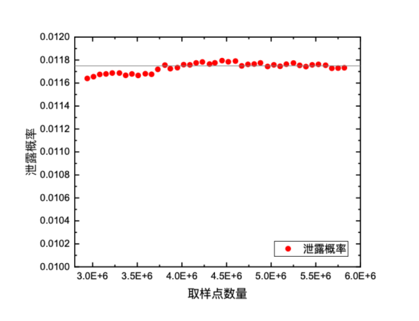

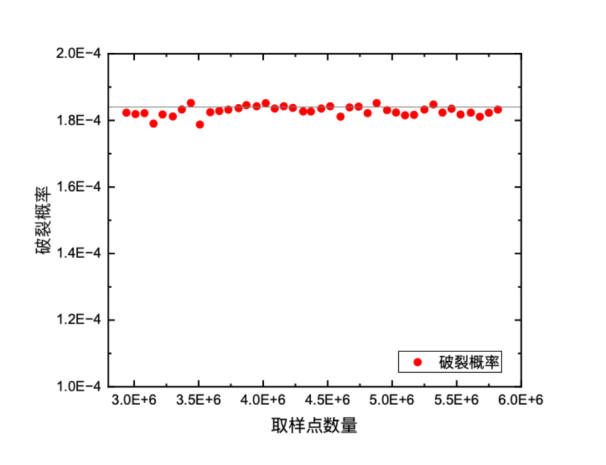

(a) 不同取样点数量下发生泄漏的概率      (b) 不同取样点数量下发生破裂的概率

**图4-4: 不同取样点数量下的热管失效概率示意图**

另一方面，由于计算机的计算资源有限，采样点量级也会对单点（单个取样点）的平均采样时间产生影响。因此，需要综合考虑取样点数量对仿真结果的影响以及对模型运行速度的关联。如图4-5所示为取样点数量从1E4量级增加到1E7量级时模型的总运行时间以及单点运行时间的变化示意图。不难看出，在取样点数量为5百万左右时单点采样时间最小。综上所述，本文搭建的HMDS热管模型失效分析模块中采样点的数量设置为500万综合性价比最高。

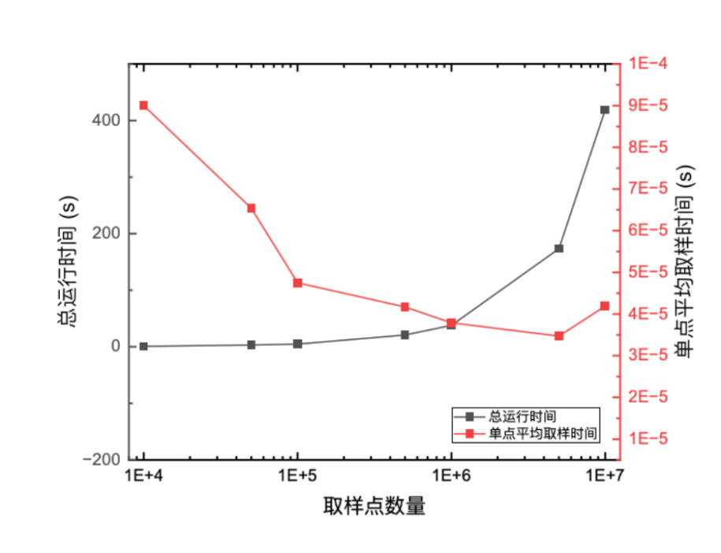

**图4-5: 不同取样点数量下模型的总运行时间以及单点运行时间变化示意图**

**（3） 方程参数**

除前面两小节中分析的热管参数外，方程中的一些参数也可能对模型的仿真结果有一定影响。尤其是裂纹初始尺寸的概率密度函数，即方程（3-1）和（3-2）。它们所包含的不确定性参数 $\mu _{1}$ 和 $\mu _{2}$ 的数值会影响热管内壁面裂纹的初始尺寸大小，而裂纹的初始尺寸又将影响热管的整体失效概率。本文的热管模型与Harris的实验对象材料一致、工况接近，故 $\mu _{1}$ 和 $\mu _{2}$ 取值也采用该实验对象的数值，分别为4和1.5。然而对于其他类型的热管这两个参数的值则具有一定的不确定性，需要根据实际情况选取。Xu等人在研究中指出 $\mu _{2}$ 的取值对热管失效概率影响不明显[31]。因此，下文将仅针对 $\mu _{1}$ 进行敏感性分析，以探究其在不同的取值情况下对热管失效概率的影响，相应的仿真结果如图4-6所示。不难看出 $\mu _{1}$ 的取值无论对热管的泄漏概率还是破裂概率而言都有影响，尤其是当它的值小于3时尤为明显。当 $\mu _{1}$ 的取值为1时热管的泄漏概率和破裂概率分别为1.03E-2和5.44E-5，而当 $\mu _{1}$ 的值为3时这两种失效概率则分别减小了约18倍和16倍，达到了5.73E-4和3.34E-6。这是由于裂纹尺寸的概率密度函数中 $\mu _{1}$ 越大，意味着裂纹的起始深度大概率更浅，因而在相同工况下运行相同时间后发生失效事件的概率也更小。

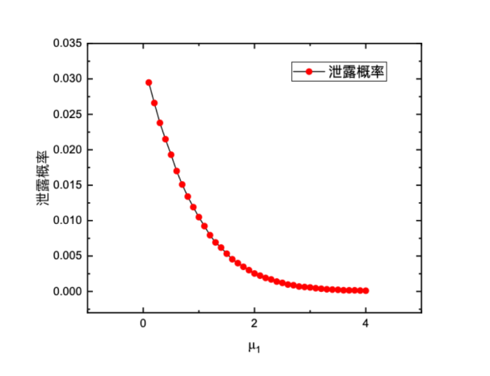

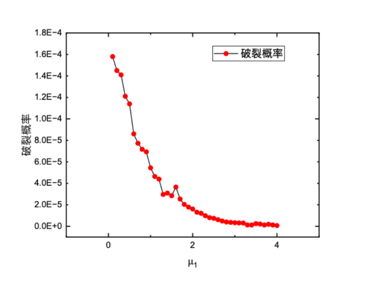

(a)不同 $\mu _{1}$ 取值下热管泄漏概率的变化曲线 (b)不同 $\mu _{1}$ 取值下热管破裂概率随 $\mu _{1}$ 的变化曲线

**图4-6:** $\mu _{1}$ **对热管失效概率的影响**

### 4.5.2 **热管失效概率分析**

1. **热管壁厚度**

热管微堆中堆芯的热量需要穿过热管壁进入热管内部从而开启一个热量循环，热管壁上的裂纹也需要深度大于热管壁厚度才会引发热管失效。不难看出热管壁对热管的热力学性能的提升以及安全性能的保证都具有重要意义，适当的热管壁厚度应当能够在保证热管失效概率足够低的同时尽量提高热管的传热性能。下文将以1.3、1.5、1.7、1.9、2.15、2.4 $mm$ 为例进行热管壁厚度的敏感性分析。另外需要注意的是：在改变热管壁厚度的同时也应当确保热管能够正常运行，即热管的传热量应当低于热管最小的传热极限。如图4-7所示，图1-(a)为不同热管壁厚度下热管的三种传热极限变化示意图，其中最小的为沸腾极限。图1-(b)为不同热管壁厚度下沸腾极限与热管传热量的数值比照图，显然，无论是在图中的哪一种热管壁厚度情形下，热管的传热量都小于热管三种传热极限中最小的沸腾极限。因此，可以认为本文搭建的热管模型中，热管壁厚度从1.3 $mm$ 至2.4 $mm$ 的各种情形下热管都满足热力学要求。

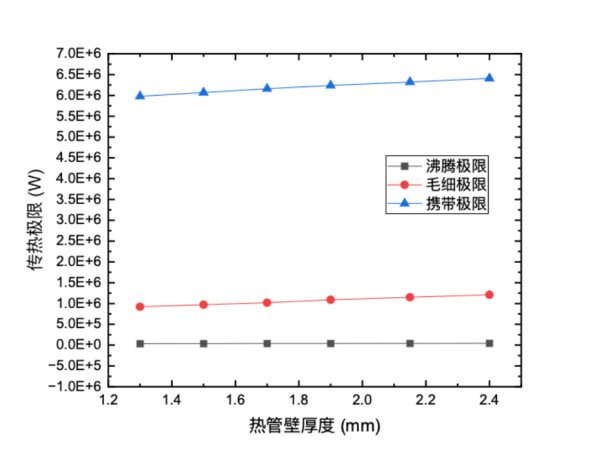

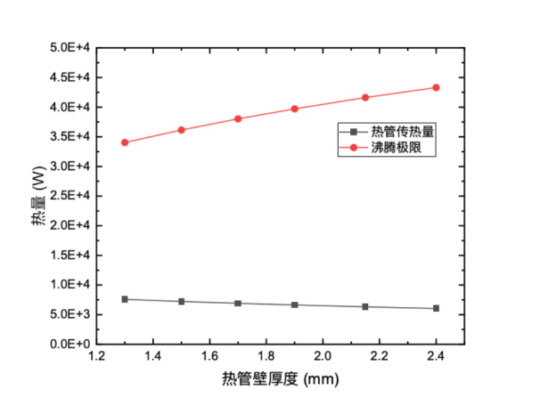

(a)热管的三种传热极限示意图           (b)热管传热量与沸腾极限示意图

**图4-7: 不同热管壁厚度下热管的传热极限以及传热量示意图**

如图4-8所示为不同热管壁厚度下的热管失效概率变化示意图。图中数据显示随着热管壁厚度以及运行时间的增加，热管发生泄漏事件以及破裂事件的概率都会随之下降。当热管壁厚度为1.3 $mm$ 时热管发生泄漏和破裂的概率分别为6.06E-2和5.07E-3；当热管壁厚度为2.4 $mm$ 时则为8.18E-4和6.16E-6，分别减小了823倍以及74倍。这是由于更厚的热管壁厚度能够有效的抵消裂纹由于SCC引起的尺寸扩张，进而减少热管失效事故的发生概率。

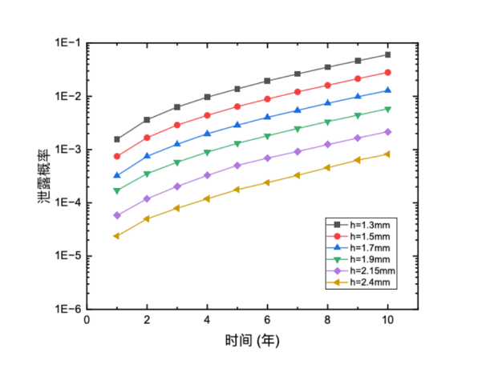

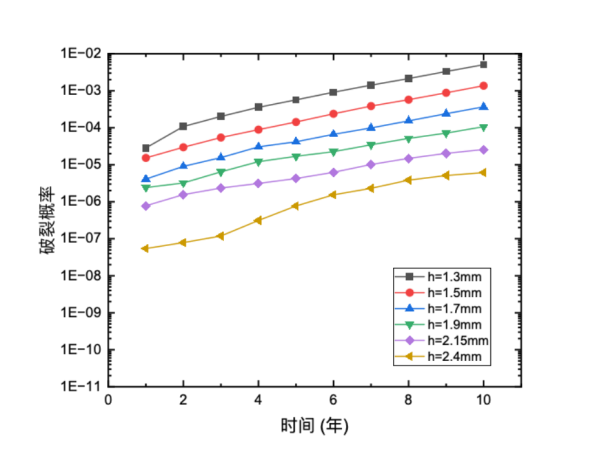

(a)热管发生泄漏事件的概率             (b) 热管发生破裂事件的概率

**图4-8: 不同热管壁厚度下热管的失效概率变化示意图**

尽管增加热管壁的厚度能够有效预防热管发生失效事故，但是随着热管壁厚度增加的还有它的质量以及体积。这在追求轻量化的热管微堆中无疑是负面影响，尤其是用于太空探索供能的热管微堆。除此之外，更厚的热管壁也会影响热管的热阻，进而改变热管的传热性能。如图4-9所示为不同热管壁厚度下热管壁各工段温度以及热管传热量的变化示意图。随着热管壁厚度的增加，热管壁的温度略有下降，而热管的传热量更是明显下降。显然，增加热管壁厚度不利于热管的传热。以本文搭建的热管模型为例，假设期望热管在运行一年期间发生失效的概率小于某传统轻水堆运行一年的失效概率——3E-4，则在综合考虑热管安全性能以及传热性能两方面的前提下，在上述热管壁厚度选项中，将热管壁厚度设置为1.9<em>mm</em>不失为一个不错的选择[55]。因为在该厚度下热管失效的概率为1.73E-4，既能满足失效概率要求又能尽量保证热管的传热量。

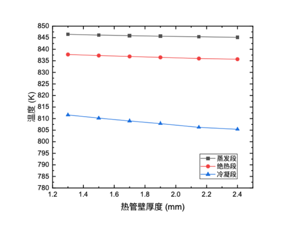

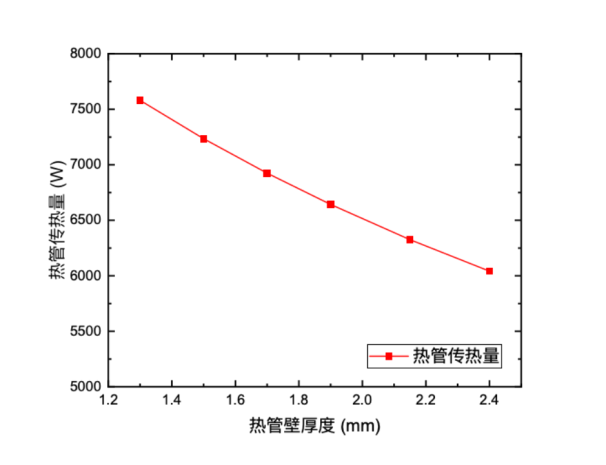

(a)热管壁各工段温度变化示意图              (b)热管传热量变化示意图

**图4-9: 不同热管壁厚度对热管热力学性能的影响**

**（2） 热管壁内径**

在进一步探索热管壁内径对热管热力学性能以及安全性能有何影响之前，有必要先确保下文热管壁内径的变化不会使得热管的传热量大于热管最小的传热极限从而导致热管无法正常运行。图4-10-(a)为不同热管壁内径下热管的三种传热极限变化图，显然沸腾极限依旧为三种传热极限中最小的。图4-10-(b)则为不同热管壁内径下热管的传热量与沸腾极限的对比图。在图中各种热管壁内径情形下，热管的传热量都小于此时热管的沸腾极限。因此，可以认为将热管壁内径从10 $mm$ 逐渐增加到25 $mm$ 期间并不影响热管的正常运行。

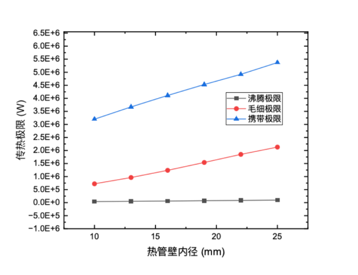

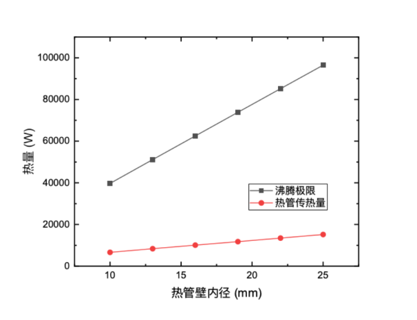

(a)热管的沸腾极限、毛细极限和携带极限。     (b)热管的传热量与沸腾极限对照图

**图4-10: 不同热管壁内径下热管的传热量及传热极限示意图**

单纯增加热管壁内径对热管的热阻会有一定影响；因此，除热管的传热性能外，热管壁内径对热管失效概率的影响也需要被考虑在内。如图4-11所示为不同热管壁内径下热管失效概率随运行时间变化的示意图。图中数据显示不同热管壁内径的热管发生失效事件的概率差异不大，无论是泄露事件还是破裂事件。这是由于在默认热管热源温度以及冷源温度不变的前提下改变热管壁内径大小对热管壁上的温度以及热应力影响不大，而这两个变量才是改变热管失效概率的关键因素。

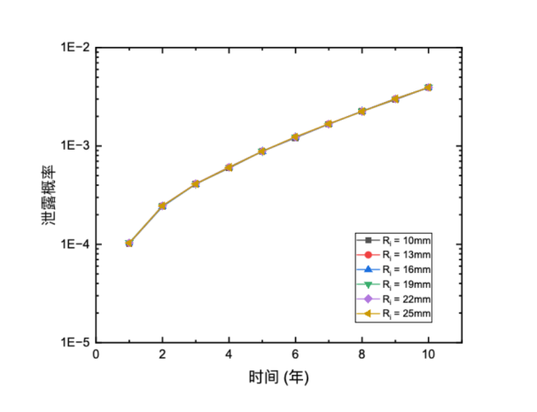

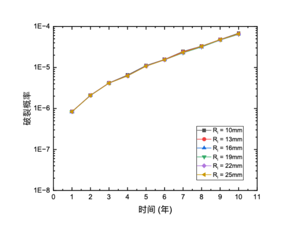

(a)热管发生泄漏事件的概率示意图        (b) 热管发生破裂事件的概率示意图

**图4-11: 不同热管壁内径下热管的失效概率随运行时间变化示意图**

一方面，单纯增大热管壁内径无疑会使得热管质量更大，这将不利于热管微堆在一些对质量有严苛要求的场合发挥。例如热管微堆用于太空供能时，更大的重量往往意味着更高昂的发射费用。所以，在考虑更改热管壁内径时，也需要考虑热管的功质比。图4-12-(a)显示当热管壁内径从10 $mm$ 逐渐增加到25 $mm$ ，热管的传热量也随之呈线性递增。这是由于更大的热管壁内径使得热管具有更大的空间来容纳碱金属工质，从而使得热管的传热能力更强。但此时热管的功质比却因为更大的热管壁尺寸而出现小范围的递减。

另一方面，碍于热管微堆的堆芯尺寸有限，选择更粗的热管可能会导致堆芯所能容纳的热管数量减少。因此，在考虑更改热管壁内径的同时，热管的功率密度也需要被考虑在内。如图4-12-(b)所示为不同热管壁内径下热管的功率密度变化图。随着热管壁内径从10 $mm$ 逐渐增加到25 $mm$ ，热管的功率密度从2.11E7 ${W}/{m^{2}}$ 降至7.65E6 ${W}/{m^{2}}$ ，降幅达2.76倍之多。

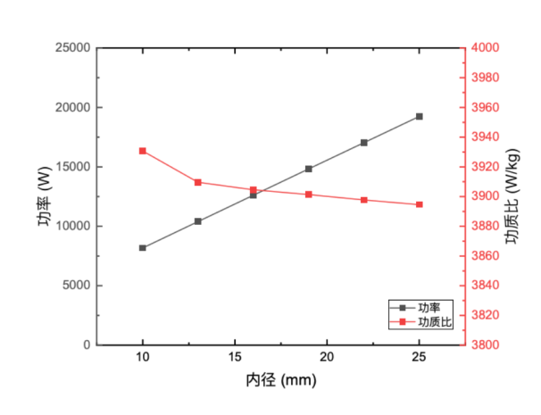

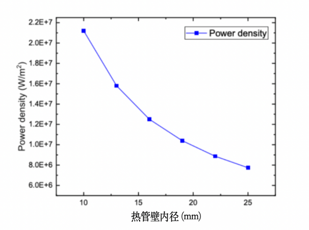

（a）热管传热量和功质比示意图            （b）热管功率密度示意图

**图4-12: 不同热管壁内径下热管传热量、功质比和功率密度变化示意图**

提升热管壁的内径能够增加单根热管的传热量，减少热管的使用数量。但是不利于对堆芯面积的充分利用，会导致热管微堆的总热功率减小，甚至会使得热管微堆在服役年限到达时堆芯内部仍存有大量核燃料未被使用。而适当减小热管壁内径则可以通过提升热管的功率密度从而有效提升热管微堆堆芯的利用率，进而提高整个热管微堆的热功率，但是需要制造更多“细小”的热管来完成堆芯的移热，这对于热管的制作工艺以及热管的安全性能往往有更高的要求。综上所述，从反应堆的整体性能角度出发，使用热管壁内径更小的热管进行传热或许是一个更好的选择。

**（3） 不同工段**

热管模型的起始温度决定了热管各个工段的起始温度相同，然而当热管微堆完全启动达到稳态后它们之间的温度则存在明显的差异。这将使得各个工段运行前后的温差不同，进而让各个工段间的热应力不同。作为让热管裂纹加速成长的关键因素，热应力的差异自然也将造成热管各工段失效概率的差异。而探究热管不同工段失效概率的差异性对预知热管安全运行的薄弱段具有重要意义。如表1所示为相同仿真情形下热管不同工段的失效概率汇总情况。热管各工段之间的温度、应力不同导致它们的应力强度因子之间有差异。一方面，裂纹的疲劳成长速度与应力强度因子（方程4-3）呈正相关关系。这使得热应力更大的蒸发段裂纹的疲劳成长速度更快。另一方面，本文采用的SCC裂纹成长方程（方程4-9）为跨度较大的分段函数，各工段应力强度因子之间的差异不足以使得各工段的SCC裂纹成长速度不同。故各工段裂纹的SCC成长速度相同。从Xu等人的研究成果可知：热管内壁面裂纹的SCC成长速度远大于疲劳成长速度。因此，才会出现模型运行前期温度、热应力和应力强度因子更大的蒸发段失效概率明显更高，而至运行后期各工段失效概率却逐渐接近的情况。

**表4-2: 热管不同工段的失效概率**

<table><tr><td>
运行时间

（年）
</td><td>
蒸发段

泄露
</td><td>
绝热段

泄露
</td><td>
冷凝段

泄露
</td><td>
蒸发段

破裂
</td><td>
绝热段

破裂
</td><td>
冷凝段

破裂
</td></tr><tr><td>
1
</td><td>
5.65E-3
</td><td>
5.50E-3
</td><td>
5.26E-3
</td><td>
3.53E-4
</td><td>
2.86E-4
</td><td>
2.02E-4
</td></tr><tr><td>
2
</td><td>
1.27E-2
</td><td>
1.27E-2
</td><td>
1.22E-2
</td><td>
8.64E-4
</td><td>
7.75E-4
</td><td>
7.71E-4
</td></tr><tr><td>
3
</td><td>
2.18E-2
</td><td>
2.14E-2
</td><td>
2.10E-2
</td><td>
1.53E-3
</td><td>
1.47E-3
</td><td>
1.45E-3
</td></tr><tr><td>
4
</td><td>
3.30E-2
</td><td>
3.27E-2
</td><td>
3.25E-2
</td><td>
2.64E-3
</td><td>
2.54E-3
</td><td>
2.52E-3
</td></tr><tr><td>
5
</td><td>
4.79E-2
</td><td>
4.74E-2
</td><td>
4.72E-2
</td><td>
4.27E-3
</td><td>
4.16E-3
</td><td>
4.08E-3
</td></tr><tr><td>
6
</td><td>
6.63E-2
</td><td>
6.60E-2
</td><td>
6.60E-2
</td><td>
6.88E-3
</td><td>
6.67E-3
</td><td>
6.59E-3
</td></tr><tr><td>
7
</td><td>
9.06E-2
</td><td>
9.05E-2
</td><td>
9.04E-2
</td><td>
1.08E-2
</td><td>
1.05E-2
</td><td>
1.05E-2
</td></tr><tr><td>
8
</td><td>
1.22E-1
</td><td>
1.22E-1
</td><td>
1.22E-1
</td><td>
1.67E-2
</td><td>
1.66E-2
</td><td>
1.64E-2
</td></tr><tr><td>
9
</td><td>
1.62E-1
</td><td>
1.62E-1
</td><td>
1.62E-1
</td><td>
2.57E-2
</td><td>
2.55E-2
</td><td>
2.54E-2
</td></tr><tr><td>
10
</td><td>
2.14E-1
</td><td>
2.14E-1
</td><td>
2.14E-1
</td><td>
3.99E-2
</td><td>
3.97E-2
</td><td>
3.92E-2
</td></tr></table>

**（4） 热管壁材料**

除上文已经讨论过的部分热管变量以及参数外，热管壁的材料对热管的热力学性能以及安全性能同样具有重大影响。随着反应堆技术的更新迭代，新型的热管微堆中对基体以及热管壁的要求也越加严苛。为应对上述挑战，学者们一直在尝试使用各种金属铸造热管壁以期获得性能更优越的热管[56]。近些年来，包括Inconel718以及C63000在内的新型金属材料以其高强度和良好的抗腐蚀性等优点而被频繁的应用于航空航天和核能领域。下文将以传统反应堆中常用的奥氏体不锈钢与上述两种材料的参数进行热管壁模型的搭建。由于缺少其他热管壁材料的经验公式，无法预测用这些材料铸成热管壁时热管的失效概率，因此下文只对这三种热管壁材料进行关键参数--热应力的比较。三种材料制成热管壁时热管壁上的热应力分布情况如图4-13所示。显然，C63000型热管壁具有更低的热应力，这意味着它可能具有更低的裂纹成长速度。

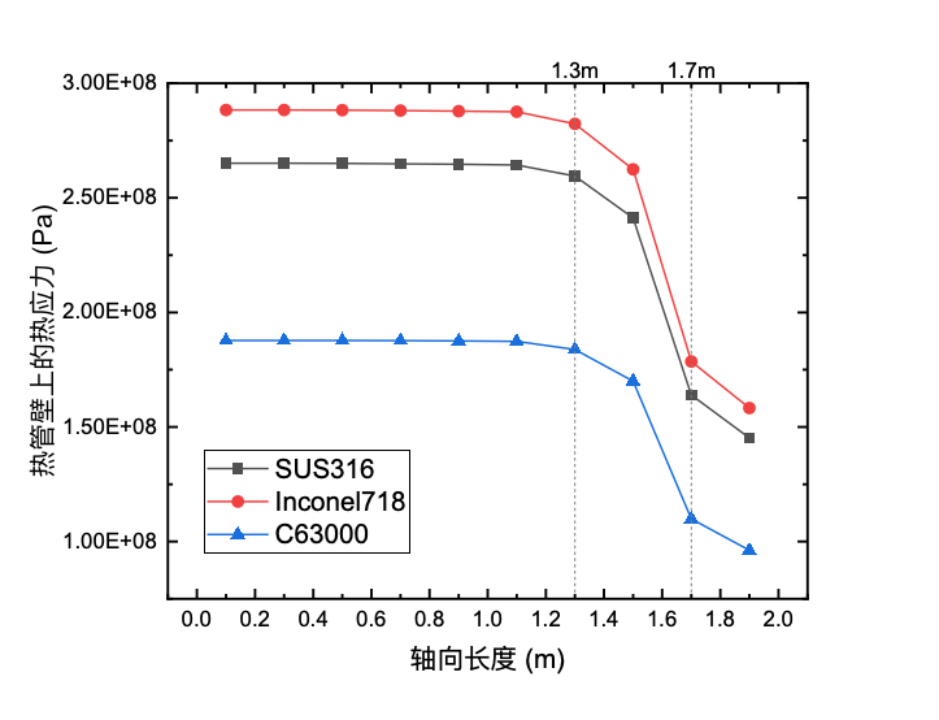

**图4-13: 不同热管壁材料对热管壁上热应力的影响示意图**

**（5）影响力权重**

上述4.7节其他目的仿真结果表明，热管的温度 、壁厚和热管壁内径等各种参数对其失效概率都有一定的影响。而了解每个参数对热管失效概率的影响程度，对日后优化热管设计具有重要意义。表4-3为保持其他变量不变的前提下，失效概率相对于热管不同独立参数的一阶偏导数排行。这些偏导值的大小将作为这些参数对热管失效概率影响权重的参考依据。其中，热管壁的厚度是对热管失效概率影响最大的参数，无论是泄漏概率还是破裂概率。其次，初始运行温度对热管的破裂概率也有一定的影响。热管的不同工段之间失效概率的差异则不甚明显。最后，当热管的热源温度以及冷源温度固定时，改变热管壁的内径对失效概率的影响最小。对这些参数进行适当优化可以在一定程度上减小热管的失效概率。除此之外，运行时间虽然不是热管的参数，无法人为干预，但它对热管失效概率的影响十分值得关注。

**表4-3: 热管失效概率的影响因素排行**

<table><tr><td>
影响力排行
</td><td>
影响因素
</td><td>
偏导值（泄露）
</td></tr><tr><td>
1
</td><td>
热管壁的厚度
</td><td>
-5.98E-5
</td></tr><tr><td>
2
</td><td>
时间
</td><td>
5.67E-5
</td></tr><tr><td>
3
</td><td>
起始温度
</td><td>
-4.56E-5
</td></tr><tr><td>
4
</td><td>
工段
</td><td>
1.00E-5
</td></tr><tr><td>
5
</td><td>
热管壁内径
</td><td>
1.02E-7
</td></tr><tr><td>
影响力排行
</td><td>
影响因素
</td><td>
偏导值（破裂）
</td></tr><tr><td>
1
</td><td>
热管壁的厚度
</td><td>
-5.06E-5
</td></tr><tr><td>
2
</td><td>
时间
</td><td>
4.56E-5
</td></tr><tr><td>
3
</td><td>
起始温度
</td><td>
7.00E-6
</td></tr><tr><td>
4
</td><td>
工段
</td><td>
1.05E-6
</td></tr><tr><td>
5
</td><td>
热管壁内径
</td><td>
3.00E-8
</td></tr></table>

## 4.6 **本章小节**

本章基于Myrmecia的热力学模型在MOOSE中开发了包括热应力在内的各种应力模块，并在此基础上进一步开发出了Myrmecia的失效分析模型。该失效分析模型的研究对象为热管内壁的裂纹。首先，它根据经验公式为裂纹的起始尺寸（深度和宽度）赋值；在通过各种应力参数计算出应力强度因子后，再根据应力强度因子得出裂纹的成长速度；最后结合热管的运行时间计算出裂纹在运行期间的增长量。与此同时，裂纹失效判断程序将根据裂纹失效标准实时判定裂纹是否失效并统计失效情况。在完成Myrmecia失效模型的搭建之后对其进行了模型-模型的验证，验证结果表明其误差较小，有较高的可靠度。该模型可以为后续的碱金属热管设计提供热力学性能以及安全性能的综合性参考。

# **第五章 斯特林热气机模型分析**

第二章已经完成了对热管微堆中一回路热管的热力学以及失效分析建模。上述工作不仅搭建了HMDS热管微堆模型可以通过获得热管内温度、热量的分布以研究其传热极限和传热能力。还使用MOOSE这一先进的基于网格和有限元数值计算的多物理场仿真软件搭建了热管失效概率与热力学耦合模型Myrmecia。得益于其底层求解器具备优秀的非线性求解能力，Myrmecia能够精确、快速的计算出热管多维网格上变量分布与变化的同时还能够针对热管多维网格进行大量的变量数据采样来计算热管发生失效事件的概率。

另一方面，热管从堆芯传导出来的热量需要被有效利用，而百千瓦级的热力学循环中斯特林循环以其较大的功质比、较高的稳定性以及简易的结构完美契合热管微堆的设计理念[57]。下文对于热管微堆中二回路斯特林循环（又称斯特林热气机）的建模目的则主要在于研究热气机冷、热源温度对热气机热功率以及热效率的影响。而斯特林热气机建模的核心工作则是对气缸内部气体工质的动力学模型进行搭建，并在Dymola中基于Modelica语言来完成对其内部复杂、非线性的流体运动进行建模。

## 5.1 **斯特林热气机的运行原理**

1816年苏格兰牧师Robert Stirling发明了第一台外燃闭式循环热气机，直到一百余年后才被一位名为Rolf Meijier的工程师命名为斯特林热气机[58]。随着良好耐热材料的研发以及人们对热气机原理的更深入研究，现代斯特林热气机的研发在20世纪迎来高潮。表5-1中展示的是这期间开发出的部分斯特林热气机。

**表5-1: 部分斯特林热气机的型号及参数**

<table><tr><td>
名称
</td><td>
类型
</td><td>
热源
</td><td>
制动功率（<em>kW</em>）
</td><td>
开发者
</td><td>
参考文献
</td></tr><tr><td>
System7
</td><td>
Gamma
</td><td>
Heat store
</td><td>
0.005
</td><td>
JCGS
</td><td>
[59]
</td></tr><tr><td>
RE-1000
</td><td>
Gamma
</td><td>
Electrical
</td><td>
1.2
</td><td>
Sunpower
</td><td>
[60]
</td></tr><tr><td>
TDE
</td><td>
Gamma
</td><td>
Natural gas
</td><td>
1.2
</td><td>
M.T.I.
</td><td>
[61]
</td></tr><tr><td>
Proto 2
</td><td>
Beta
</td><td>
Natural gas
</td><td>
1.75
</td><td>
G.E.
</td><td>
[62]
</td></tr><tr><td>
GPU-3
</td><td>
Beta
</td><td>
Diesel oil
</td><td>
4.2
</td><td>
General Motors
</td><td>
[63]
</td></tr><tr><td>
1-365
</td><td>
Beta
</td><td>
Light oil
</td><td>
30
</td><td>
Philips
</td><td>
[64]
</td></tr><tr><td>
4-275/P75
</td><td>
Alpha
</td><td>
Gasoline
</td><td>
118
</td><td>
United Stirling
</td><td>
[65]
</td></tr></table>

随着当前社会对能源需求的不断扩大以及自然环境的持续恶化，清洁能源的开发利用势在必行。斯特林热气机作为一种外燃闭式循环热气机，以其能够直接利用太阳能、核能等清洁能源作为热源进行工作，且产生的噪声污染小等优点逐渐受业内外人士青睐[57, 66]。

如图5-1所示为斯特林热气机的结构简图，其与传统热机的最大区别在于它的膨胀气缸与压缩气缸之间还连接有一个蓄热式回热器（以下简称蓄热器），蓄热器能够在工质从一个气缸流向另一个气缸时对其进行定容吸/放热，以提高斯特林热气机对热量的利用效率[67]。

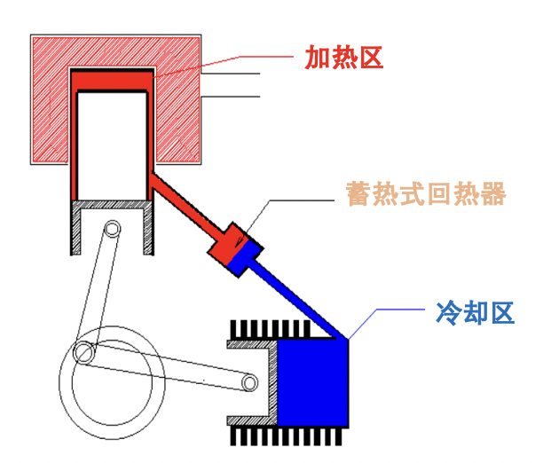

**图5-1:** $\alpha$ **型斯特林热气机结构简图**

斯特林热力学循环主要由以图5-2中四个过程组成：

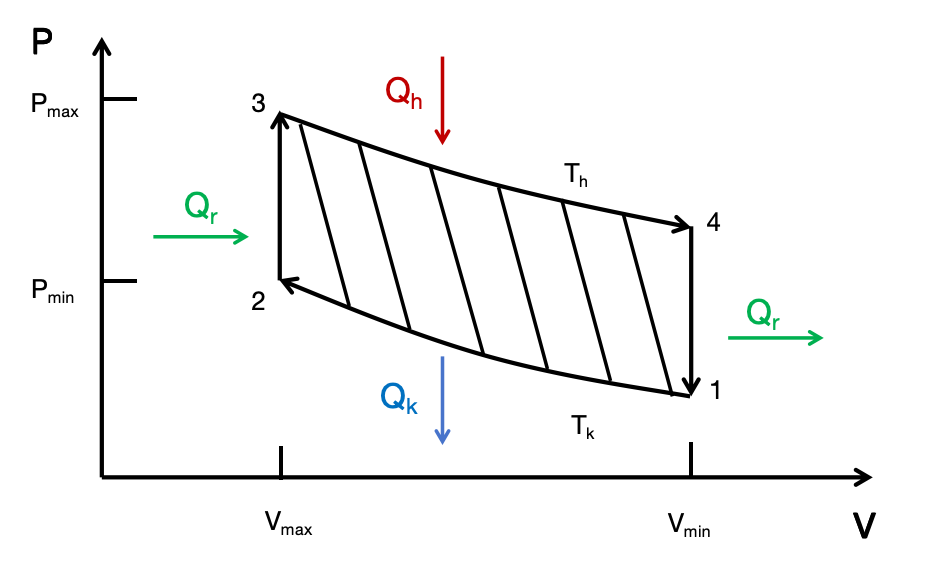

**图5-2: 斯特林循环的热力学原理图**

1～2：等温放热--低温工质向冷源放热同时接受热区活塞做功并被压缩的过程，对冷源的放热量为<em>Qk</em>。

2～3：等容吸热--低温工质在定容情况下从蓄热器吸热，吸热量为<em>Qr</em>。

3～4：等温吸热--高温工质从热源吸热同时对外做功的过程，从热源的吸热量为<em>Qh</em>。

4～1：等容放热--高温工质在定容情况下向蓄热器放热，在理想斯特林循环中，蓄热器前后两次对工质的吸、放热量大小相同，大小为<em>Qr</em>。

斯特林热气机在热管微堆中的工作原理如图5-3所示。在过程1中，一回路将反应堆堆芯产生的热量传递至换热器。在过程2处，换热器将热量传递至斯特林热气机的热端做为整个斯特林循环的热量输入。过程3和4实际上是一个可逆过程，表示蓄热器在斯特林热气机内部完成的两个定容吸、放热步骤。从过程3到过程4是当工质流向压缩气缸时从工质吸热，反之则表示工质流向膨胀气缸时蓄热器向工质放热。最后，过程5则是热量通过斯特林热气机冷端向冷源释放剩余热量。

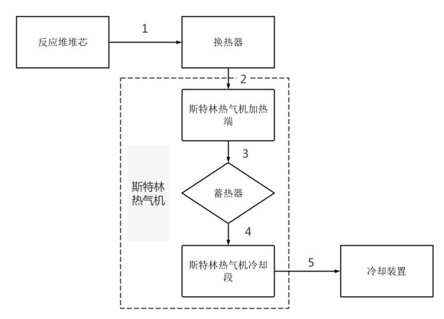

**图5-3: 斯特林热气机模型的热流原理图**

## 5.2 **斯特林热气机模型的开发**

该小节将把斯特林热气机模型分为机械模型和气体热力学模型两个部分来介绍一个α型斯特林热气机模型在Dymola中的搭建过程。其中，机械模型由热气机的各个机械部件组成，用于模拟热气机运行时其各个部件的动态特性。气体热力学模型则根据机械模型中活塞的位移来计算热气机内部工质的各种变量。同时，气体热力学模型还会输出一个合外力以驱动机械模型中的活塞进行运动，从而达到两个模型的耦合。至于斯特林热气机内部工质的选择，由于氦气具备较好的传热性能、流动性、压缩性，且工作时传热损失小[68]。因此，本文中斯特林热气机内的气体工质选用氦气。同时，为提高热管微堆的实用性以及适用性，本文搭建的斯特林热气机模型的预期热功率将设定为百千瓦级。

### 5.2.1 **参数设置**

斯特林热气机模型的基本设计参数如表5-2所示。

**表5-2: 斯特林热气机参数表**

<table><tr><td>
参数
</td><td>
数值
</td><td>
参数
</td><td>
数值
</td></tr><tr><td>
外部气压
</td><td>
0.1(<em>MPa</em>)
</td><td>
起始温度
</td><td>
273.15(<em>K</em>)
</td></tr><tr><td>
内部起始气压
</td><td>
9(<em>MPa</em>)
</td><td>
稳态平均气压
</td><td>
12.9(<em>MPa</em>)
</td></tr><tr><td>
热源温度
</td><td>
873.15(<em>K</em>)
</td><td>
冷源温度
</td><td>
293.15(<em>K</em>)
</td></tr><tr><td>
高温气缸死体积
</td><td>
0.00583(<em>m3</em>)
</td><td>
低温气缸死体积
</td><td>
0.00816(<em>m3</em>)
</td></tr><tr><td>
换热器通道体积
</td><td>
0.00778(<em>m3</em>)
</td><td>
总体积
</td><td>
0.0229(<em>m3</em>)
</td></tr><tr><td>
蓄热器的蓄热系数
</td><td>
200(<em>W/K</em>)
</td><td>
蓄热器比热容
</td><td>
1000(<em>J/kg-K</em>)
</td></tr><tr><td>
蓄热器质量
</td><td>
0.01(<em>kg</em>)
</td><td>
活塞行程
</td><td>
0.2(<em>m</em>)
</td></tr><tr><td>
膨胀气缸活塞直径
</td><td>
0.15(<em>m</em>)
</td><td>
压缩气缸活塞直径
</td><td>
0.15(<em>m</em>)
</td></tr><tr><td>
体积压缩比
</td><td>
1.6
</td><td>
气体常数
</td><td>
8.314(<em>J/kg-K</em>)
</td></tr><tr><td>
加热端换热能力
</td><td>
800(<em>W/K</em>)
</td><td>
冷却端换热能力
</td><td>
800(<em>W/K</em>)
</td></tr><tr><td>
工质的摩尔质量
</td><td>
4(<em>kg/kmol</em>)
</td><td>
工质的比热容
</td><td>
3213.7(<em>J/kg-℃</em>)
</td></tr><tr><td>
工质的粘度系数
</td><td>
1.89E-5(<em>Pa-s</em>)
</td><td>
蓄热器热泄漏系数
</td><td>
0.9
</td></tr></table>

### 5.2.2 **机械模型**

**（1） 斯特林热气机的机械结构**

本文的建模对象 $\alpha$ 型斯特林热气机，除气缸外的各个运动部件三维简图以及功能说明如下[69]。

1） 活塞头

如图1所示为活塞头的结构简图。其侧面的活塞环起到密封、导热和控油等作用，而连接杆则用于安装轴承滚珠，以连接活塞头和活塞杆。

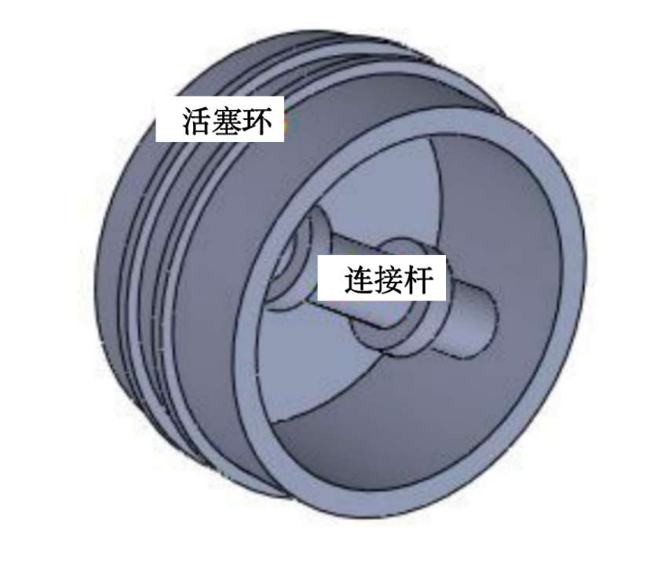

<strong>图5-4: 活塞头的结构简图[69]</strong>

2） 滚珠轴承

滚珠轴承用于活塞头和活塞杆以及活塞杆和传动结构之间的连接。它可以大大减小活塞杆和传动轴之间的摩擦，从而减小摩擦损耗，提高斯特林热气机的运行效率。

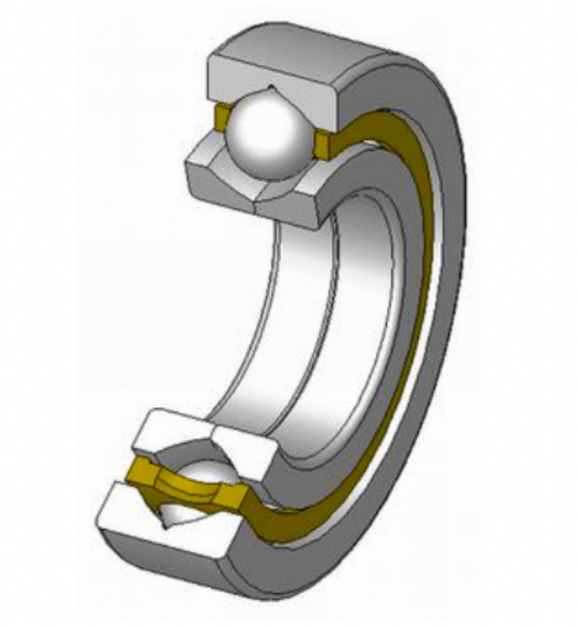

<strong>图5-5: 轴承滚珠的结构简图[69]</strong>

3） 活塞杆

如图5-6所示为活塞杆的结构简图。它用于活塞头和传动结构的连接，将活塞头受到的压力传递至曲柄结构。

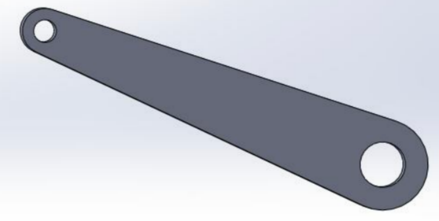

<strong>图5-6: 活塞杆的结构简图[69]</strong>

4） 曲柄结构

图5-7为曲柄的结构简图。它将活塞的往复式运动转换为“旋转运动”，方便后续机械结构的传动，进而将气动力转换为机械动力进行输出。

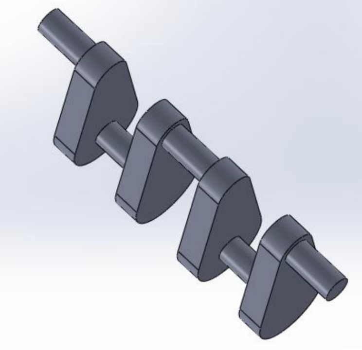

<strong>图5-7: 曲柄的结构简图[69]</strong>

5） 整体结构简图

在将上述部件进行组装后便可得到图5-8所示的斯特林热气机整体结构简图。

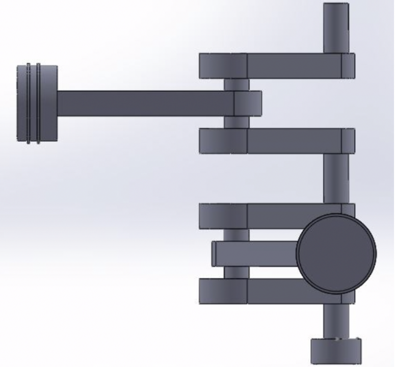

<strong>图5-8:</strong> $\alpha$ <strong>型斯特林热气机的整体结构简图[69]</strong>

**（2）机械模型的开发与测试**

如图5-9所示为斯特林热气机的机械模型。它由膨胀气缸组件和压缩气缸组件两部分组成，这两部分组件都包括一个气缸、一个活塞、一根活塞杆、一套曲柄以及对应的机械连接部件。机械模型的搭建旨在方便更加细致的了解斯特林热气机运行过程中各个机械部件的运转情况，从而更加真实的还原斯特林热气机运行时的情景。

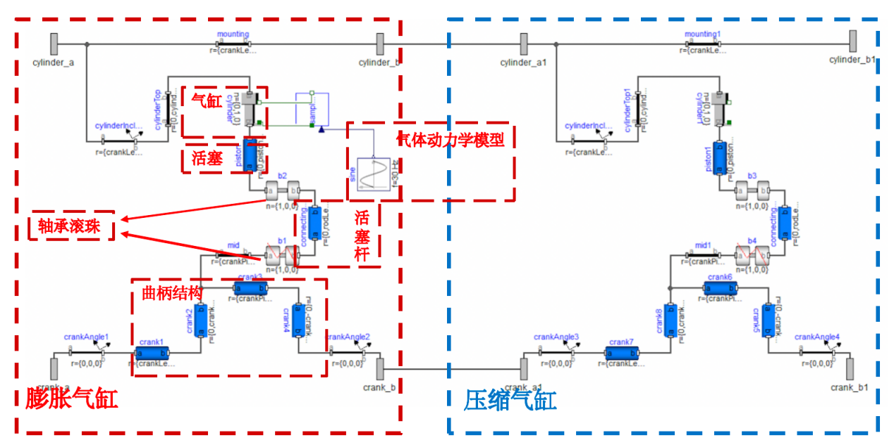

**图5-9: 斯特林热气机的机械模型示意图**

如图5-10所示为斯特林热气机机械模型的参数设置页面，用户可以在此处自行定义各个部件的尺寸、方位等参数。为提高热气机使用时的稳定性，设置两个气缸之间的夹角呈90度。

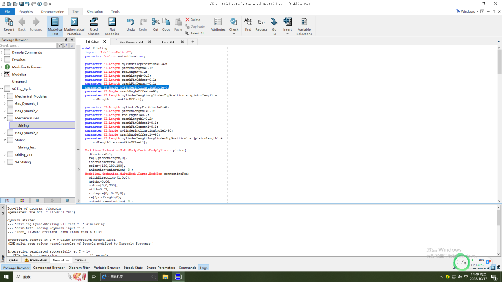

**图5-10: 斯特林热气机机械模型的参数设置页面**

在完成机械模型的搭建后，为进一步确定其准确性，本小节将对机械模型进行验证。由于斯特林热气机中活塞的受力曲线及其运动轨迹都呈正弦变化[]。因此，在以正弦驱动力为输入的前提下，机械模型中活塞的运动轨迹也应该符合预期结果。首先，需要增加动力模块以驱动机械模型。为方便起见，如图5-11所示在此处以一个正弦信号源代表动力模块。再添加接口模块，为动力模块的数值输出赋予物理意义，并为接口模块提供与机械模型耦合的法兰接口。

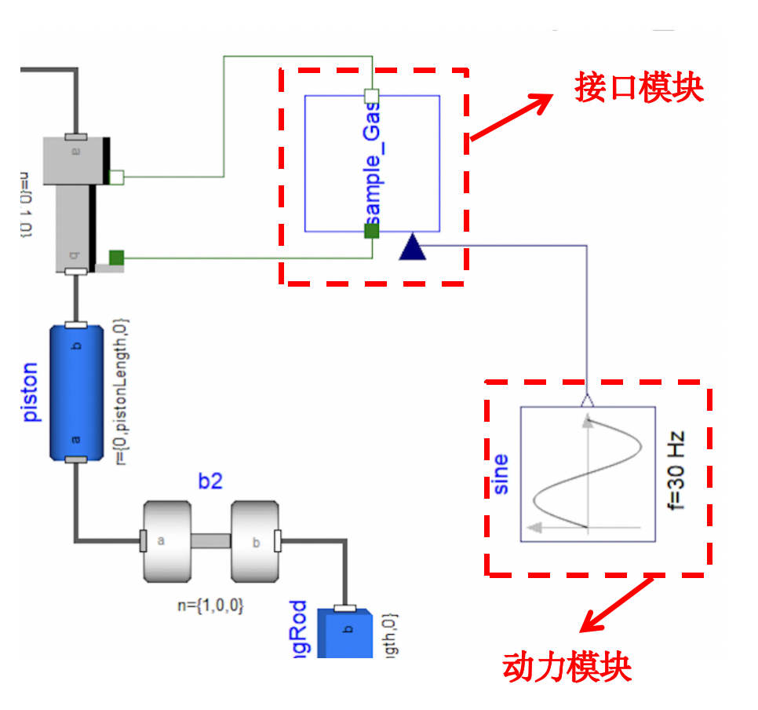

**图5-11: 斯特林热气机的机械模型中接口、动力模块的布置**

活塞位移为活塞头位置与气缸顶部位置的相对位置之差，气缸保持静止，且顶部位置设置为0，活塞的行程为0.2 $m$ 。对斯特林热气机机械模型的测试结果如图5-12所示。两个活塞的位移轨迹都呈正弦变化，且二者的位移轨迹之间有90度的相位角差。综上，斯特林热气机的机械模型运行结果符合预期。

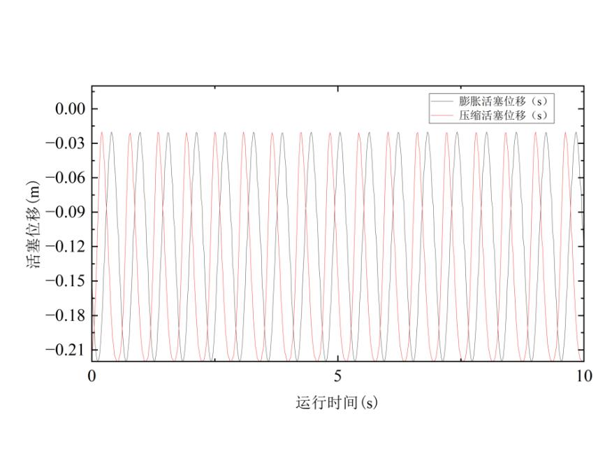

**图5-12: 斯特林热气机中活塞的位移轨迹**

**（3） 工质气体动力模型的开发**

为简化建模过程，本文选择先将气体动力学模型进行独立建模，待其完善后再进行与机械模型的耦合。在本小节后续的气体动力学模型的搭建过程中，活塞的位移以两个三角函数代替。同时，为增加程序与模块的层次性、复用性以及可读性，斯特林热气机的动力学模块采用分层开发的策略，具体步骤如下：

1. 恒温气体模型：根据活塞位置来确定两个气缸内工质的不同状态，如质量、流量、物质的量、密度、压力等。

2. 变温气体模型：在继承恒温气体模型的基础上，引入温度、热量、热流量、热源、冷源、对流换热系数等参数或者变量。

3. 带蓄热器模型：在继承变温气体模型的基础上，增加蓄热器模块。为蓄热器定义摩尔质量、换热系数等参数以及质量、物质的量、温度、热量、热流量等变量。

在斯特林热气机气体动力学模型的后续验证中，热气机的热源温度设置为斜坡函数，其最小值为仿真的起始温度，即373.15 $K$ ；并在2s后达到最大值873.15 $K$ 。冷源温度则固定为293.15 $K$ 。

**1） 恒温气体模型的构建与测试**

恒温气体模型的构建原理如图1所示，它能够根据参数sd（膨胀活塞位移轨迹）、sp（压缩活塞位移轨迹）来确定热气机内部气体工质的属性，最后根据活塞两端的压力差对外提供一个合外力。恒温气体模型的方程如表5-3所示，其中膨胀气缸内的工质记为高温工质；压缩气缸内的工质记为低温工质；通道为蓄热器与两个气缸连接的中空管道。

**表5-3: 恒温气体模型的方程**
<table><tr><td>
 方程 
</td><td>
注释
</td></tr><tr><td>
 $V_{1} = V_{m1} + A_{1}\ast sd.$ 
</td><td>
高温工质体积
</td></tr><tr><td>
 $V_{2} = V_{m2} + A_{2}\ast sp - A_{1}\ast sd + 2\ast l_{d}\ast A_{1}.$ 
</td><td>
低温工质体积
</td></tr><tr><td>
 $P_{l} = (P_{1}+P_{2})/2.$ 
</td><td>
通道气压
</td></tr><tr><td>
 $M\ast n_{1} = m_{1}.$ 
</td><td>
高温工质质量
</td></tr><tr><td>
 $M\ast n_{2} = m_{2}.$ 
</td><td>
低温工质质量
</td></tr><tr><td>
 $M\ast n_{l} = m_{l}.$ 
</td><td>
通道工质质量
</td></tr><tr><td>
 $m_{t} = m_{1}+m_{2}+m_{3}.$ 
</td><td>
工质总质量
</td></tr><tr><td>
 $n_{t} = m_{t}/M.$ 
</td><td>
工质总物质的量
</td></tr><tr><td>
 $V_{1}\ast P_{1} = n_{1}\ast R\ast T_{1}.$ 
</td><td rowspan="2">
理想气体方程
</td></tr><tr><td>
 $V_{2}\ast P_{2} = n_{2}\ast R\ast T_{2}.$ 
</td></tr><tr><td>
 $ro_{1} = P_{1}/(R_{p}\ast T_{1}).$ 
</td><td>
高温工质密度
</td></tr><tr><td>
 $ro_{2} = P_{2}/(R_{p}\ast T_{2}).$ 
</td><td>
低温工质密度
</td></tr><tr><td>
 $ro_{l} = P_{l}/(R_{p}\ast T_{l}).$ 
</td><td>
通道工质密度
</td></tr><tr><td>
 $if c<0,mp_{1} = c\ast A_{an}\ast ro_{l},mp_{2} = c\ast A_{an}\ast ro_{2}.$ 
</td><td rowspan="2">
工质流量
</td></tr><tr><td>
 $if c\geq 0, mp_{1} = c\ast A_{an}\ast ro_{1},mp_{2} = c\ast A_{an}\ast ro_{l}.$ 
</td></tr><tr><td>
 $der(m_{1}) = -mp_{1}.$ 
</td><td>
高温工质流量
</td></tr><tr><td>
 $der(m_{l}) = mp_{1}-mp_{2}.$ 
</td><td>
通道工质流量
</td></tr><tr><td>
 $der(m_{2}) = mp_{2}.$ 
</td><td>
低温工质流量
</td></tr><tr><td>
 $(P_{1}-P_{2})\ast A_{an}-A_{l}\ast mu\ast (der(sd)/((d_{c}-d_{1})/2)) = c\ast der(m_{l})+m_{l}\ast der(c).$ 
</td><td>
工质质量守恒
</td></tr><tr><td>
 $der(T_{1}) = 0.$ 
</td><td rowspan="3">
工质恒温
</td></tr><tr><td>
 $der(T_{2}) = 0.$ 
</td></tr><tr><td>
 $der(T_{l}) = 0.$ 
</td></tr><tr><td>
 $f_{1} = (P_{1}-P_{o})\ast A_{1}.$ 
</td><td>
膨胀活塞受的力
</td></tr><tr><td>
 $f_{2} = (P_{2}-P_{o})\ast A_{2}.$ 
</td><td>
压缩活塞受的力
</td></tr></table>

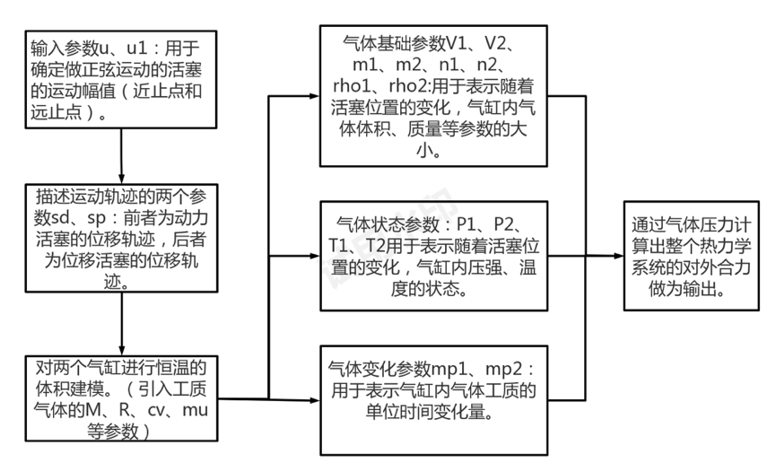

**图5-13: 恒温气体模型搭建过程**

本文搭建的斯特林热气机默认为理想的斯特林热气机，因此不发生工质泄漏，工质总质量保持不变。通道内工质的总质量则由于两个气缸中死体积的存在而始终可以充满工质。恒温气体模型的部分仿真结果如图5-14所示。当两个活塞进行往复式运动时，气缸内的气腔体积也随活塞的位移发生对应变化。与此同时，工质会通过蓄热器通道在膨胀气缸和压缩气腔缸内来回流动，这使得两个气缸内工质的质量和体积曲线都会呈周期性震荡。

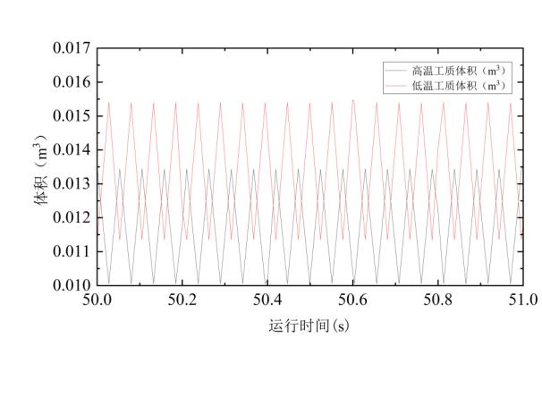

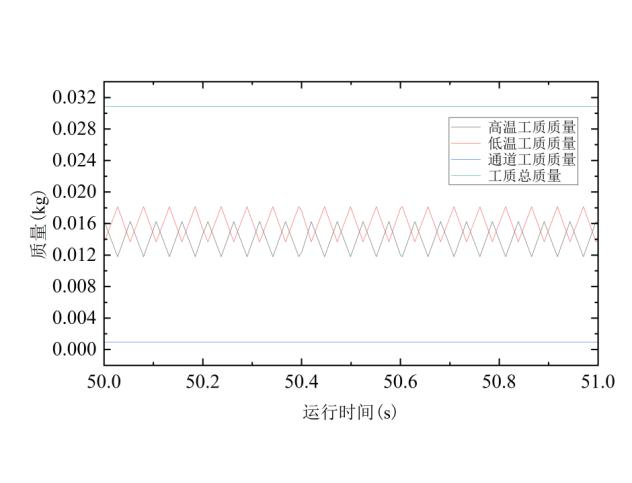

**图5-14: 两个气缸内工质的体积、质量变化**

**2） 变温气体模型的构建与测试**

在这一小节中将为斯特林热气机的气体动力学模型引入热量和热流量的概念。对此，首先需要明确斯特林热气机内部热流原理。如图5-15所示分别为用于表示斯特林热气机内部热流原理的Urieli’s法（a）与alternative法（b）。二者的区别主要在于前者将热损耗及对外做功损失的热量在高温气缸中清算，而后者则将上述系统损失的热量在低温气缸中清算[70]。为简化建模过程以及减小冷端换热器的负担，本文选用Urieli’s法对斯特林热气机的热学部分进行分析与建模。

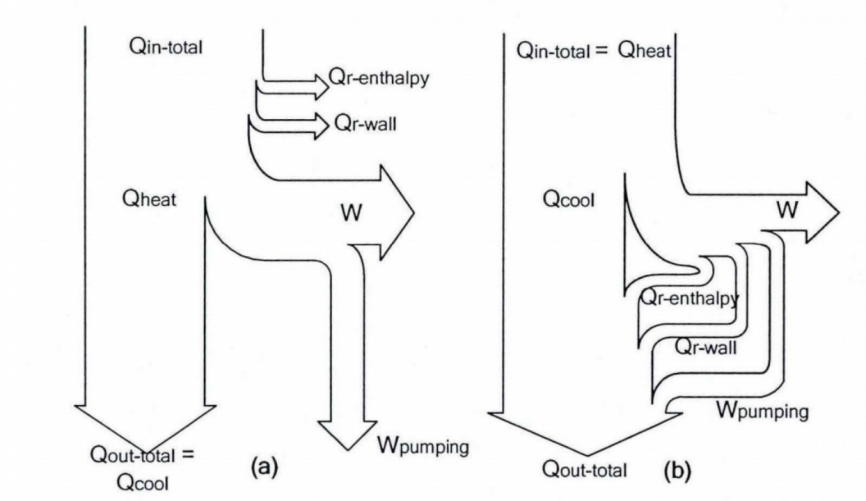

**图5-15: 斯特林热气机的热流原理图**

为了更好的理解和构建斯特林热气机中的热量传递过程，可以参考下图5-16所示的斯特林传热流程图。其中，<em>QH</em>为热源的热量，<em>TH</em>为热源的温度；<em>Q1</em>为高温气缸内工质的热量、<em>T1</em>为高温气缸内工质的温度；<em>Q0</em>为热气机内因为传导导致的热损失；<em>QR</em>为蓄热器的换热量；<em>∆QR</em>为蓄热器损失的热量；<em>W</em>为热气机对外做的功；<em>Q2</em>为低温气缸内工质的热量，<em>T2</em>为低温气缸内工质的温度；<em>QC</em>为冷源的热量，<em>TC</em>为冷源的温度。驱动斯特林热气机运作的关键因素是热源与冷源的温差，既<em>TH</em> - <em>TC</em>。斯特林系统的热量来源于热源的热量<em>QH</em>，热源的温度<em>TH</em>与高温气缸内工质的温度<em>T1</em>之间的温差使得热流量<em>Qpc</em>进入斯特林系统并被高温气缸内的工质吸收，此时<em>Q1</em>将增大。高温气缸内工质的热量<em>Q1</em>在减去热传导损耗<em>Qpo</em>、蓄热器损耗<em>Qpr</em>以及对外做功<em>W</em>后经过蓄热器并被蓄热器吸收热量<em>QR</em>，剩余热量跟随工质进入低温气缸。低温气缸内工质的温度<em>Q2</em>与冷源温度<em>TC</em>的温差使得热流量<em>Qpf</em>流出斯特林系统进入冷源。

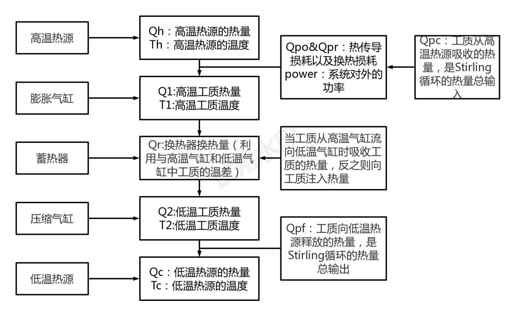

**图5-16: 斯特林热气机热流传递原理图**

在该模块中，新增添的公式如表5-4所示。

**表5-4: 变温气体模型中新增的热力学公式**

<table><tr><td>
 $Qp_{c} = U_{c}\ast A_{c}\ast(T_{h}-T_{1})$ .
</td><td>
热气机吸热量
</td></tr><tr><td>
 $Qp_{f} = -U_{f}\ast A_{f}\ast(T_{2}-T_{c}).$ 
</td><td>
热气机散热量
</td></tr><tr><td>
 $Q_{c} = m_{1}\ast c_{v}\ast T_{1}$ .
</td><td>
高温工质热量
</td></tr><tr><td>
 $Q_{f} = m_{2}\ast c_{v}\ast T_{2}$ .
</td><td>
低温工质热量
</td></tr><tr><td>
 $Q_{l} = m_{l}\ast c_{v}\ast T_{l}$ .
</td><td>
通道工质热量
</td></tr><tr><td>
 $if c<0,der(Q_{c}) = Qp_{c} - mp_{1}\ast c_{v}\ast T_{l};$ 

 $else, der(Q_{c}) = Qp_{c} - mp_{1}\ast c_{v}\ast T_{1}.$ 
</td><td>
高温工质热流量
</td></tr><tr><td>
 $if c<0,der(Q_{f}) = Qp_{f} + mp_{2}\ast c_{v}\ast T_{2};$ 

 $else, der(Q_{f}) = Qp_{f} + mp_{2}\ast c_{v}\ast T_{l}.$ 
</td><td>
低温工质热量
</td></tr><tr><td>
 $if c<0,der(Q_{l}) = -mp_{2}\ast c_{v}\ast T_{2} + mp_{1}\ast c_{v}\ast T_{l};$ 

 $else, der(Q_{l}) = -mp_{2}\ast c_{v}\ast T_{l} - mp_{1}\ast c_{v}\ast T_{1}.$ 
</td><td>
通道工质热流量
</td></tr></table>

在完成变温气体模型的搭建后，对热力学仿真结果进行分析。如图5-17所示为斯特林系统的热流量曲线示意图。由于此时的气体动力学模型还未完善，对流换热面积、对流换热系数、工质气压等都未加优化；因此此时系统的热量流入较小。此时的斯特林系统未考虑做功、热损耗等热量流失因素。随着斯特林热气机的启动，从热端进入的部分热量将用于加热工质，因此这时的热量输入大于热量的输出。直到系统达到稳态后，整个斯特林系统的热量流入等于热量流出。如图5-18所示则为工质的热量及温度曲线。气体工质的温度和热量则随着周期性的加热和散热同样呈现周期性变化。与此同时，由于缺少蓄热器，使得高温气缸内大量工质的热量被直接传送到低温气缸内，加之此处未考虑做功和热损耗对高温气缸吸热量的影响，因此两个气缸内工质的温度接近。系统从热源吸热以及对冷源放热导致内部工质的热量呈周期性波动，由于气体工质质量守恒，因此气体工质的温度呈周期性变化。

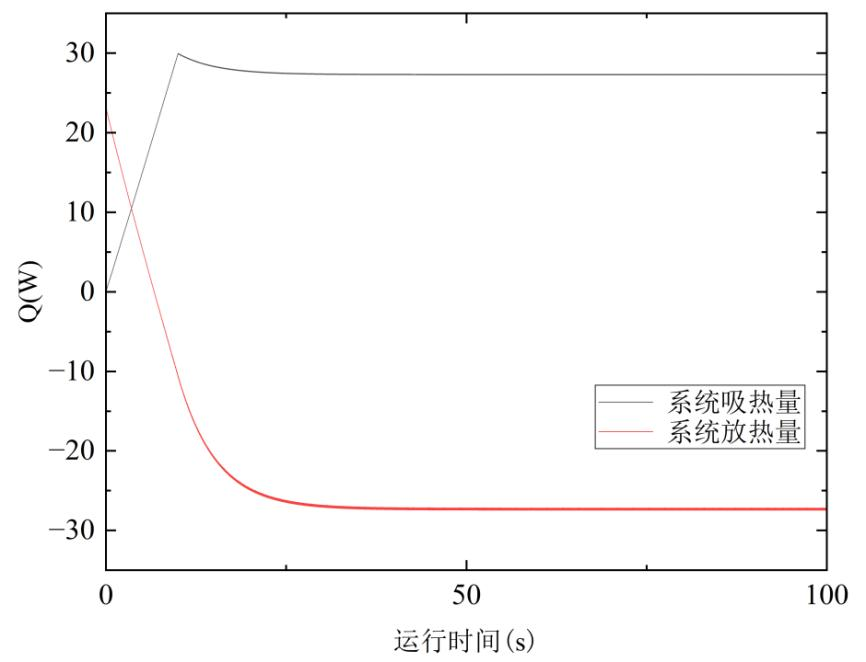

**图5-17: 斯特林系统的热量流入与流出曲线示意图**

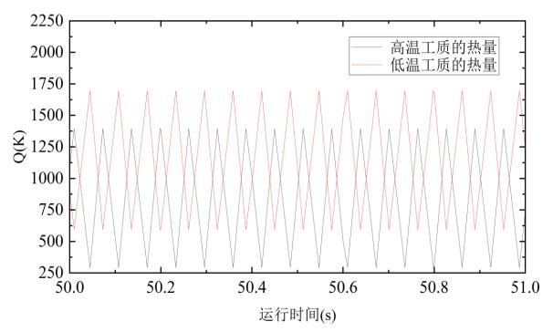

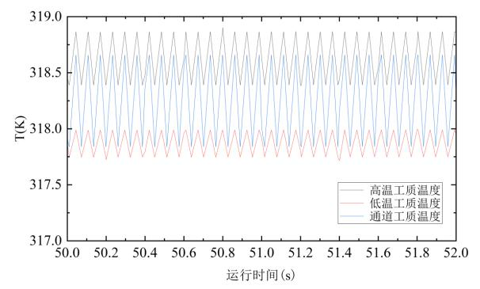

(a)  工质热量                      (b)工质温度

**图5-18: 变温气体模型的热力学仿真结果**

**3） 气体动力学模型的完善**

在完成变温气体模型的搭建后，气体动力学模型已经基本能够完成对斯特林热气机内氦气工质的工况模拟。该小节则将进一步完善气体动力学模型，并引入蓄热器以及热损耗公式以期达到更符合现实情况的仿真效果。其中，新增加的热力学公式见表5-5。

**表5-5: 蓄热器热力学公式**

<table><tr><td>
 $Qp_{reg} = U_{reg}\ast(T_{reg}-T_{l})$ 
</td><td>
蓄热器热流量大小
</td></tr><tr><td>
 $Q_{reg} = m_{reg}\ast cp_{reg}\ast T_{reg}$ 
</td><td>
蓄热器热量
</td></tr><tr><td>
 $der(Q_{reeg}) = -Qp_{reg}$ 
</td><td>
蓄热器热流量
</td></tr></table>

斯特林热气机内部的热量会通过其金属结构向外传导，并最终散播到空气中。这部分热量被称为传导热损耗<em>Qo</em>，其计算公式如方程（5-1）所示[71]。其中， $k_{o}$ 为斯特林热气机热端到冷端的等效热泄漏系数，大小为5<em>W/m</em>。

$$
Q_{o} = k_{o}(T_{h} - T_{c}).
\tag{5-1}
$$

同样的，蓄热器也会由于热传导及其密封性出现部分热量损耗，该损耗记为蓄热器损耗，即<em>QR</em>。它的计算公式如方程（5-2）所示[71]。其中，<em>n</em>为工质的摩尔质量； $C_{p}$ 为工质在蓄热器中的定容比热容，大小为15 <em>J/</em>(<em>mol-K</em>)； $\varepsilon _{R}$ 为蓄热器的热效率，大小为0.9。

$Q_{R} = nC_{p}(1-\varepsilon _{R}) \ast (T_{1}-T_{2})$ *.*                                    （5-2）

除上述热损耗之外，活塞在运行时与气体工质之间的摩擦引起的热量损耗同样不容忽视，这部分热损耗记为流阻热损，即 $Q_{f}$ ，其计算公式如方程（5-3）所示[]。其中， $C_{fr}$ 为摩擦系数； $\mu _{g}$ 为工质的动力粘度。

$$
Q_{f} = -\frac{2C_{fr}\mu _{g}\rho _{g}u_{g}V}{Ad^{2}}
\tag{5-3}
$$

完善气体动力学模型后，为新模块命名为Gas\_Dynamic3，并对其进行测试。部分测试结果如图5-19所示。其中，（a）图为回（蓄）热器的热量及其热流量曲线图。随着热源温度的升高，热气机内的工质温度也随之上升，蓄热器由于工质温度高于自身温度而进行吸热。因此，蓄热器的热量随着热源温度上升而上升，并在后者稳定后随即进入稳态。由于蓄热器的热量在热源温度上升期间增大，因此它的热流量在这期间的一个循环内，吸热量的绝对值总是大于放热量，直到蓄热器的温度和热量达到稳态后持平。（b）图为传导热损耗和蓄热器损耗的示意图，二者在系统达到稳态后的平均大小分别为3 $kW$ 与11.4 $kW$ 。传导热损耗与热气机两端温差成正比，因此在热源温度稳定后达到稳定值。蓄热器损耗则与两个气缸内的工质温差成正比，但即使热气机工况达到稳态，工质温度也并非一成不变，而是呈周期性波动。同理，蓄热器损耗到达稳态后也呈周期性波动。（c）图为摩擦损耗示意图，其平均大小在达到稳态后3.62 $kW$ 。摩擦损耗与摩擦系数成正比关系，而后者与活塞运行速度的大小呈正相关。对于位移轨迹呈正弦函数的斯特林热气机，其运行速度为位移轨迹关于时间的偏导数，即余弦函数；故而摩擦损耗曲线也呈周期性波动。

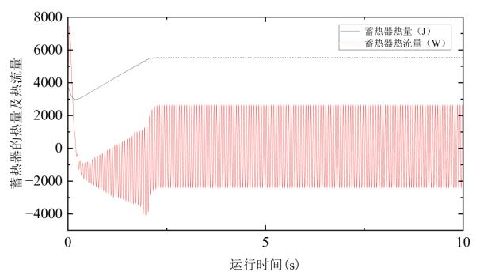

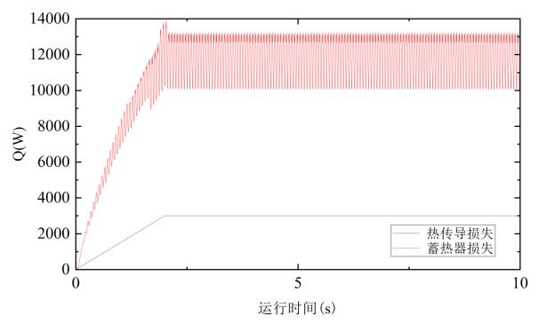

（a） 蓄热器热力学参数                    （b）热损耗示意图

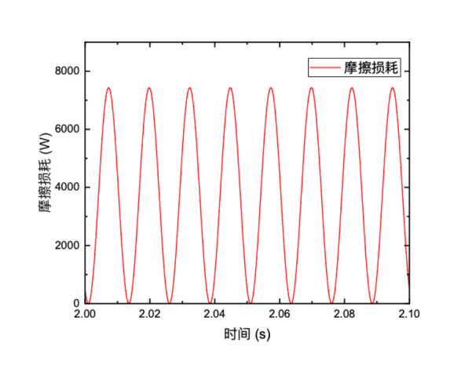

（c）摩擦损耗示意图

**图5-19: 蓄热器及热损失的测试结果**

**（4） 机械模型与气体动力学模型的耦合及验证**

**1）机械模型与气体动力学模型的耦合**

在分别完成斯特林热气机的机械模型及气体动力学模型的搭建后，如图5-20所示，该小节将把二者耦合并进行相应的验证。该耦合模块被命名为stirling。

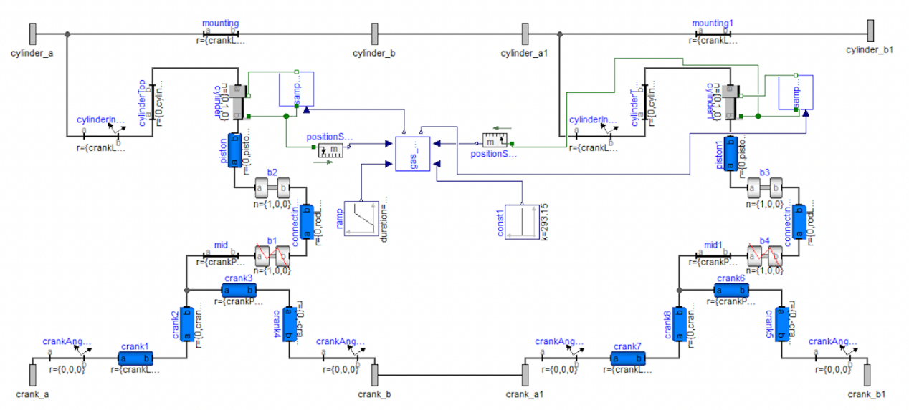

**图5-20: 斯特林热气机耦合模型的图形界面**

机械模型与气体动力学模型的耦合原理如图5-21所示。气体动力学模型根据活塞位移计算出包含气压在内的热力学变量，从而得到活塞两端的气压差。气压差则作为机械模型的输入，用于驱动活塞的运动。

**图5-21: 斯特林热气机内部模型的耦合原理图**

**2）耦合模型的验证**

如图1（a）所示为本文搭建的斯特林热气机各部分的温度曲线示意图。随着热源温度升高以及斯特林热气机系统内热量增加，热气机的各部分温度随之升高。在系统达到稳态后，膨胀气缸内的高温工质温度最高；压缩气缸内的低温工质温度最低；通道内工质的温度则介于两个气缸中工质的温度之间，且温度波动范围大于蓄热器内温度的波动范围，以便工质在流过蓄热器时进行换热。图5-22-（b）则为某斯特林热气机模型一个工作循环内不同时刻的温度场剖视图[70]。不难看出，高温工质、低温工质、蓄热器等各个部分的温度变化规律与图5-22-（a）的温度变化情况相符合，而蓄热器与膨胀气缸之间的换热通道内工质温度始终高于蓄热器温度，反之蓄热器与压缩气缸之间的换热通道内工质温度始终低于蓄热器温度。由于本文搭建的斯特林热气机模型的通道未以蓄热器为分界将通道划分为高温换热通道与低温换热通道，而是将二者作为一个整体进行建模。故通道中工质的温度曲线幅值大于蓄热器温度且呈周期性变化。

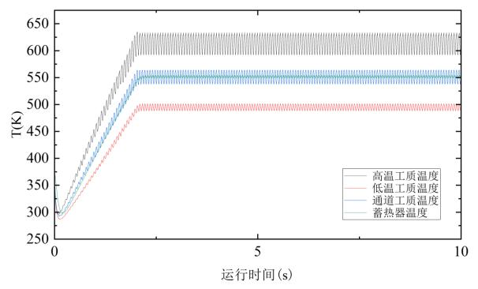

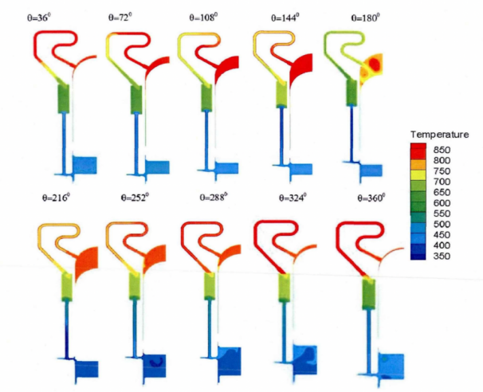

（a）本文斯特林模型的温度变化         （b）对照模型的温度变化

**图5-22: 斯特林热气机温度分布曲线示意图**

为进一步验证stirling模型的准确性，为斯特林热气机设置不同的热源及冷源温度，以观察其热效率的变化情况，并使用已被验证过的模型进行数据验证[71, 72]。表5-6所示为不同热源温度下，本文搭建的斯特林热气机模型的热力学变量仿真值。

**表5-6: 不同热源温度下斯特林热气机的热力学性能**

<table><tr><td>
高温热源温度（ $K$ ）
</td><td>
Power（ $kW$ ）
</td><td>
Q_loss（ $kW$ ）
</td><td>
Qpc（ $kW$ ）
</td><td>
Qpf

（ $kW$ ）
</td><td>
效率
</td><td>
T1（ $K$ ）
</td><td>
T2

（ $K$ ）
</td></tr><tr><td>
673.15
</td><td>
37.50
</td><td>
9.40
</td><td>
164.80
</td><td>
117.90
</td><td>
22.75%
</td><td>
510.50
</td><td>
413.00
</td></tr><tr><td>
723.15
</td><td>
46.50
</td><td>
10.50
</td><td>
190.00
</td><td>
133.00
</td><td>
24.47%
</td><td>
537.00
</td><td>
427.00
</td></tr><tr><td>
773.15
</td><td>
63.60
</td><td>
11.40
</td><td>
222.00
</td><td>
147.00
</td><td>
28.65%
</td><td>
561.00
</td><td>
444.00
</td></tr><tr><td>
823.15
</td><td>
66.00
</td><td>
12.00
</td><td>
243.00
</td><td>
165.00
</td><td>
27.16%
</td><td>
587.00
</td><td>
460.00
</td></tr><tr><td>
873.15
</td><td>
74.40
</td><td>
12.70
</td><td>
270.60
</td><td>
183.50
</td><td>
27.49%
</td><td>
605.00
</td><td>
476.00
</td></tr></table>

如图1所示为不同热源温度下斯特林热气机热效率的对比示意图，可以看出尽管二者在建模方式、热气机尺寸等方面存在差异；但二者的仿真对象都为热管微堆中的斯特林热气机，且在建模时都考虑了热管的存在。在保持热气机冷源温度不变的前提下，随着热气机热源温度逐步上升，前期两个斯特林热气机的热效率都随之上升。但当热源温度超过一定数值时，由于热管等传热装置的热阻增大，两个斯特林热气机的热效率又都随着热源温度的上升而发生回落。

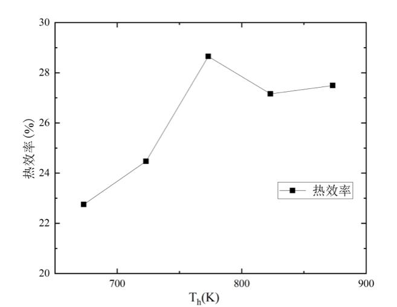

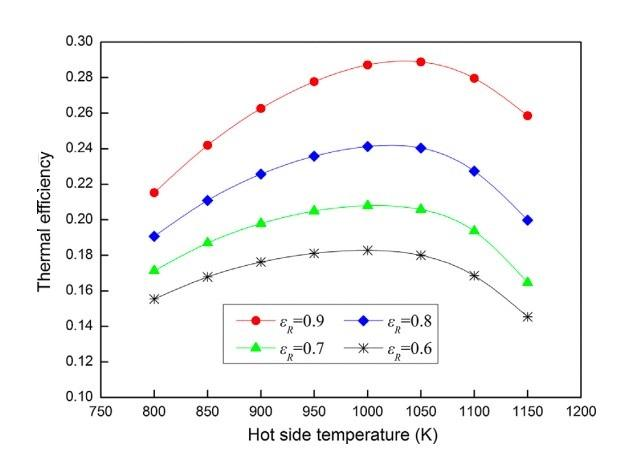

(a)本文搭建的斯特林热气机热效率              (b)对照模型的热效率[71]

**图5-23:不同热源温度下斯特林热气机的热效率示意图**

表5-7所示为不同热气机冷源温度下，本文搭建的斯特林热气机模型的热力学变量仿真值。

**表5-7: 不同热气机冷源温度下斯特林热气机的热力学性能**

<table><tr><td>
热源温度（ $K$ ）
</td><td>
Power（ $kW$ ）
</td><td>
Q_loss（ $kW$ ）
</td><td>
Qpc（ $kW$ ）
</td><td>
Qpf

（ $kW$ ）
</td><td>
效率
</td><td>
T1（ $K$ ）
</td><td>
T2（ $K$ ）
</td></tr><tr><td>
273.15
</td><td>
79.70
</td><td>
13.30
</td><td>
281.00
</td><td>
188.00
</td><td>
28.36%
</td><td>
598.00
</td><td>
464.00
</td></tr><tr><td>
283.15
</td><td>
77.05
</td><td>
12.95
</td><td>
275.00
</td><td>
185.00
</td><td>
28.01%
</td><td>
603.00
</td><td>
470.00
</td></tr><tr><td>
293.15
</td><td>
74.40
</td><td>
12.70
</td><td>
270.60
</td><td>
183.50
</td><td>
27.49%
</td><td>
605.00
</td><td>
476.00
</td></tr><tr><td>
303.15
</td><td>
72.50
</td><td>
12.50
</td><td>
265.00
</td><td>
180.00
</td><td>
27.36%
</td><td>
610.00
</td><td>
481.00
</td></tr><tr><td>
313.15
</td><td>
71.10
</td><td>
12.40
</td><td>
261.00
</td><td>
177.50
</td><td>
27.24%
</td><td>
616.00
</td><td>
491.00
</td></tr><tr><td>
323.15
</td><td>
68.70
</td><td>
12.20
</td><td>
254.50
</td><td>
173.60
</td><td>
26.99%
</td><td>
620.00
</td><td>
497.50
</td></tr></table>

如图5-24所示则为不同冷源温度下斯特林热气机热效率的对比示意图。在保持热源温度不变的前提下，随着冷源温度逐步上升，两个斯特林热气机模型的热效率仿真值都随之单调下降。综上，可以认为本文搭建的斯特林热气机模型能够较好的模拟斯特林热气机运行时的各种热力学状态。

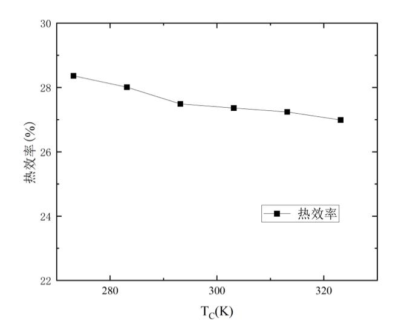

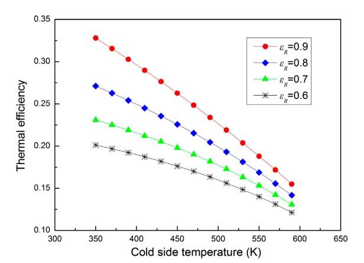

(a)本文搭建的斯特林热气机热效率              (b)对照模型的热效率[71]

**图5-24: 不同热源温度下斯特林热气机的热效率示意图**

## 5.3 **耦合模型的仿真结果分析**

（1）

Dymola中提供模型的三维动画，可以用于观察整个模型在空间内的运行状况。stirling模型运行时，一个周期内四个不同时刻的三维动画如图5-25所示，该三维图形只展示包括活塞、活塞杆、曲柄在内的关键运动部件。图（a）中膨胀活塞正在向远止点运动，压缩活塞正在向近止点运动；图（b）中膨胀活塞到达远止点，压缩活塞则到达近止点；这两张图均处于等温放热过程，此时工质从压缩气缸途径蓄热器流向膨胀气缸，并从蓄热器中吸收热量，该吸热过程为等容吸热。与此同时，膨胀气缸内的工质从热源吸热并膨胀，同时推动膨胀活塞向远止点运动并对外做功。同理，图（c）中膨胀活塞正在向近止点运动，压缩活塞正在向远止点运动；图（d）中膨胀活塞到达近止点，压缩活塞则到达远止点；这两张图表示的工况为等温吸热过程，此时工质从膨胀气缸途径蓄热器流向压缩气缸，并向蓄热器中释放热量，该放热过程为等容放热。与此同时，压缩气缸内的工质工质向冷源放热并被压缩。

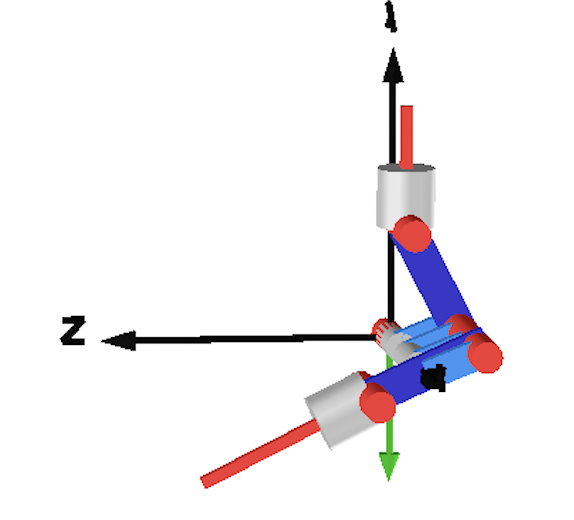

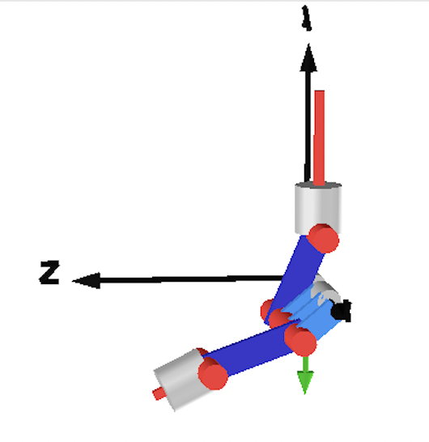

（a）                                （b）

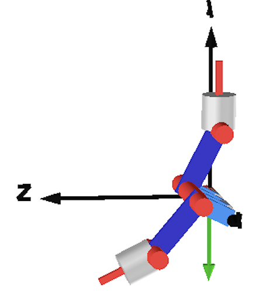

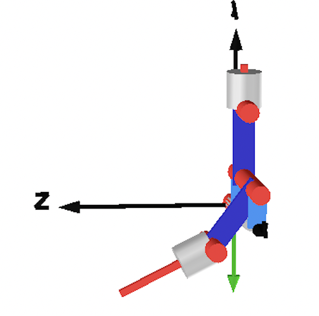

（c）                                 （d）

**5-25: 斯特林模型运行时不同时刻的三维图像**

斯特林热气机从加热区吸收的热量 $Qp_{c}$ 以及向冷却区释放的热量 $Qp_{f}$ 变化如图5-26所示。随着热源温度升高，热源与斯特林热气机加热区的温差也随之升高。因此，斯特林热气机通过对流传热进入膨胀气缸的热量以及从压缩气缸散出的热量也越多。在达到稳态后，斯特林系统从热源吸收的热量以及向冷源释放的热量平均值分别为341.5 $kW$ 和-221 $kW$ （负号表示能量从热气机系统流出）。此时，斯特林热气机的输出热功率为：

$$
Power = Qp_{c}+Qp_{f}-Q_{o}-Q_{R}-Q_{f} = 102.48 kW.
$$

符合建模前对斯特林热气机输出热功率的预期。

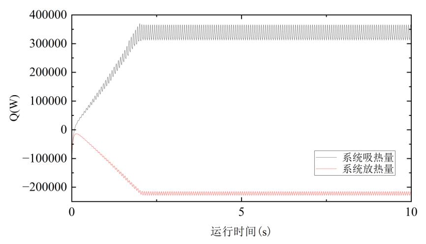

**图5-26: 斯特林系统与外界的换热量示意图**

## 5.4 **HMDS的系统级热力学分析**

在完成HMDS系统的搭建后，本小节将针对该热管微堆热力学模型进行热力学分析。斯特林热源温度设置为斜坡函数，热源升温时间为3s，且默认热管壁冷凝段与斯特林热气机的受热端直接接触，热源温度的最高值为热管壁冷凝段的外表面温度。冷源温度固定。热管失效以及热阻的改变都发生在模型运行前。

### 5.4.1 **HMDS模型的耦合**

如图5-27所示为HMDS系统中堆芯模块、热管模块以及斯特林热气机模块在Dymola内的整体耦合原理图。堆芯模块将基体的平均温度作为热管的热源温度传递给热管模块；热量从热管壁的蒸发段外表面进入热管，在经过热阻网络后从热管壁的冷凝段外表面离开热管。之后以热管壁冷凝段外表面的温度作为斯特林热气机的热源温度（此处假设斯特林热气机的受热段换热面积足够大），热量进入热气机内部后通过加热氦气工质产生的气压推动活塞运动，运动的活塞带动传动结构将能量传递出去。

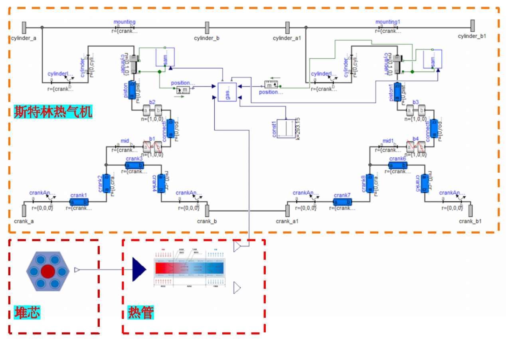

**图5-27: HMDS耦合模型原理图**

### 5.4.2 **HMDS模型的分析**

**（1） 热管失效时斯特林热气机的热功率分析**

热管在正常运行/发生失效的情况下斯特林热气机输出热功率示意图如图5-28所示。随着热管失效数量增加，堆芯的基体以及热管的输入温度都随之上升，这使得斯特林热气机的热源温度（热管壁冷凝段外表面的温度）也随之上升，从而加大了热气机两端的温差，令斯特林热气机的热功率得以从11.1*kW*提升至11.58*kW*，增幅达4.32%。

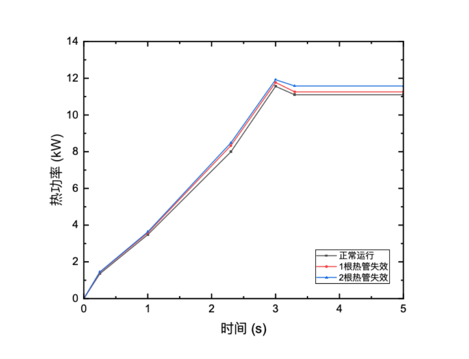

**图5-28: 热管正常/失效情形下斯特林热气机的热功率变化**

**（2） 不同热管热阻下斯特林热气机的热功率分析**

不同热管热阻下斯特林热气机的热功率变化图如图5-29所示。随着热管的热阻增大，堆芯的基体温度也随之上升，这使得与堆芯基体相接触的热管蒸发段外表面温度也跟着变高。但是，热管更大的热阻却使得热管冷凝段外表面的温度变得更低。最后，导致斯特林热气机的热源温度降低，减小了热气机3.46%的热功率。

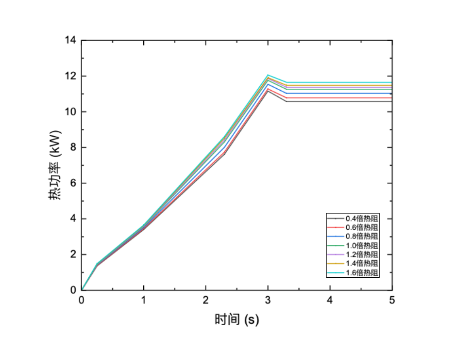

**图5-29: 热管不同热阻情形下斯特林热气机的热功率变化**

无论是热管发生失效使得堆芯温度上升亦或是热管热阻变化使得堆芯和热管温度上升都会影响斯特林热气机的热功率数值。这是因为它们都导致了热气机的热源温度变化，而热气机冷源温度固定，这便使得热气机两端的温差也发生了变化，进而改变了斯特林热气机的热功率。综上所述，为进一步提升二回路斯特林循环的输出功率，通过减小热管的热阻以及增大热管蒸发段的外表面温度等手段来增大热管冷凝段外表面温度值得尝试。

## 5.5 **本章小节**

本章在Dymola平台开发了HMDS系统中的最后一个模块--二回路斯特林热气机。该模型由机械模型与气体动力学模型强耦合而成；前者基于Dymola平台的内燃机案例改造而来，后者则是依靠自主开发。机械模型将活塞的位移变量传递至气体动力学模型以实时更新工质气体的状态；气体动力学模型则将气压传递给机械模型用于推动活塞的运动。在完成上述两部分模块的模型搭建并成功耦合后对耦合模型进行了验证，验证结果表明本文搭建的斯特林热气机运行特性与被验证模型的运行特性相符合，结果较可靠。最后，将第二章中开发的热管微堆堆芯及热管的热力学模型与斯特林热气机模型相耦合便完成了HMDS系统的全部开发，该热管微堆热力学模型可以为后续热管微堆的设计提供较为全面的数据参考。

# **第六章 总结与展望**

## 6.1 总结

本文基于Dymola搭建了HMDS程序用于热管微堆的热力学仿真。它包括热管微堆的堆芯、一回路热管以及二回路斯特林循环。在HMDS的堆芯模型中完成了燃料棒、基体的热力学仿真。并使用热阻网络法完成了HMDS中热管模型的搭建。而HMDS的二回路斯特林循环则是通过机械模型与气体动力学模型耦合完成的。除此之外，本文还针对热管微堆中工况恶劣的热管基于MOOSE框架构建有热管仿真程序Myrmecia。同时，HMDS与Myrmecia之间的热管模型都由热阻网络法构成，能够轻易的完成相互之间的变量数据移植。且上述的程序都是基于开源建模平台或语言自主开发。本文主要取得的研究成果如下：

1. 在Dymola中使用Modelica语言完成了以斯特林热力学循环为二回路的热管微堆的整体热力学模型搭建，并将整个仿真模型命名为HMDS，意为热管微堆仿真系统。它由堆芯、一回路热管以及二回路斯特林循环三个子模型组成。其中，HMDS的堆芯由一根燃料棒和六根呈六边形围绕燃料棒的热管以及不锈钢基体组成。它能够完成堆芯各部件瞬态和稳态的热力学仿真，且在相同情形下进行的仿真对仿真验证中误差较小。而基于热阻网络法搭建的HMDS热管模型验证结果表明该子模型不仅快速，且还具有较高的精度，能够准确模拟出热管各处的温度和热量。最后，由机械模型以及气体动力学模型耦合而成的HMDS二回路系统与验证模型相比具有高度一致的物理规律。因此，可以认为HMDS能够较好的模拟热管微堆在稳态以及瞬态下的热力学状态，能够基于该模型进行反应堆的安全性分析。
2. 在完成HMDS热力学系统建模的基础上，使用C++于MOOSE框架中进行了热管分析程序Myrmecia的搭建。并且基于二者热管模型的热力学原理一致，实现了HMDS与Myrmecia之间热管参数的移植，这间接完成了基于方程建模的Dymola与基于有限元法建模的MOOSE之间的耦合。通过该方法可以使用极小的计算资源先在HMDS中获得热力学变量的仿真值，之后再将这些仿真值作为Myrmecia的边界条件进行仿真来获得热管网格上各节点的失效概率。
3. 本文基于MOOSE平台开发了一款名为Myrmecia的热管仿真程序。该程序由热管的热力学子模型以及失效分析子模型组成，且后者是基于前者提供的温度、应力等热力学变量搭建而来。这两个子模型都通过了仿真软件/实验数据的验证。验证结果表明Myrmecia的热力学模型同样能够很好的模拟热管的稳态热力学运行状态。同时，其失效分析模型对于热管的失效概率预测偏差也较小。最后，仿真结果表明热管的尺寸、运行温度以及起始温度等都对热管的热力学性能以及失效概率具有一定的影响。综上，Myrmecia不仅能够准确模拟热管稳态时的热力学性能，还能够较好的完成热管失效概率的预测。这在设计热管微堆的热管时，能够从热力学性能以及安全性能两个方面提供一些综合性的信息。

## 6.2 展望

为达到更加精准、全面的对热管微堆进行系统仿真的目的，本文的部分研究内容有待进一步完善：

(1) 由于HMDS中的350kW堆芯模型仅使用六根大热管进行传热，较大的热管内径使得热管的功率密度较低，这将不利于对堆芯热量的充分利用，同时也限制着反应堆的输出功率。同时，本文对热管微堆单点失效的讨论并不深入，后续可以进一步增加热应力模块以及堆芯的应力极限参数来预测热管微堆堆芯发生故障的概率。

(2) 无论是Myrmecia热管程序还是HMDS中的热管模型都是基于热阻网络模型搭建而成，这意味着二者都只能进行热管的稳态研究。然而热管微堆中热管的实际运行情况复杂而多变，尤其是碱金属热管在室温下的冻态启动过程中，碱金属工质需要经历从固态到液态再到气态的复杂相变。这期间的工质状态、温度、流速等状态和变量都关乎着热管是否能够正常启动。为解决上述问题，由控制方程构建的多维多相态模型不失为本文热管模型的一个很好的改进方向。

(3) HMDS中的斯特林热力学循环考虑了机械模型以及气体动力学模型两方面，但二者的耦合仅存在于工质与活塞之间。对于工质与气缸之间的摩擦损耗则未进行考虑；气缸的传导热损耗模型使用的也是简易的经验公式。总的来说，斯特林热力学模型在细致程度上还有待提升。另一方面，如何调整堆芯以及一回路热管以使得二回路斯特林热力学循环的热力学性能更好也值得被更进一步研究。

# **攻读硕士期间的科研成果**

Kun,Wei. Zhang, S., Zheng, J., Yu, P., & Miao, H. (2024). Myrmecia: Failure analysis and thermodynamic coupled simulation program for heat pipe in micro reactor based on MOOSE. Nuclear Engineering and Design, 418, 112939.

<a href="https://doi.org/10.1016/j.nucengdes.2024.112939"><u>https://doi.org/10.1016/j.nucengdes.2024.112939</u></a>

# **参考文献**

[2]	张海龙. 中国新能源发展研究 [D], 2014.

[3]	KHTTAB K. Nuclear power reactors in the world [J]. Atom and Development, 2021, 33(2): 43-55.

[4]	RAIMI D, CAMPBELL E, NEWELL R G, et al. Global energy outlook 2022: Turning points and tension in the energy transition [J]. Resources for the Future: Washington, DC, USA, 2022.

[5]	温家宝主持召开国务院常务会议讨论通过《能源发展“十二五”规划》再次讨论并通过《核电安全规划(2011-2020年)》和《核电中长期发展规划(2011-2020年)》 [J]. 中国三峡, 2013, (01): 87-88.

[6]	核电中长期装机目标或超预期新项目酝酿“开闸” [J]. 中国重型装备, 2012, (01): 38.

[7]	PEAKMAN A, HODGSON Z, MERK B. Advanced micro-reactor concepts [J]. Progress in Nuclear Energy, 2018, 107: 61-70.

[8]	杨波, 沈海滨. 中国核电发展现状及趋势 [J]. 世界环境, 2014, (03): 16-7.

[9]	JOHNSON R A, MORGAN W T, ROCKLIN S R. Design, ground test and flight test of SNAP 10A, first reactor in space [J]. Nuclear engineering and design, 1967, 5(1): 7-21.

[10]	ZHANG W, ZHANG D, WANG C, et al. Conceptual design and analysis of a megawatt power level heat pipe cooled space reactor power system [J]. Annals of Nuclear Energy, 2020, 144.

[11]	HU G, HU R, KELLY J, ORTENSI J. Multi-physics simulations of heat pipe micro reactor [R]: Argonne National Lab.(ANL), Argonne, IL (United States), 2019.

[12]	苏明煜. 我国核能产业的综述与展望 [J]. 电子技术, 2022, 51(08): 304-5.

[13]	YAN B, WANG C, LI L. The technology of micro heat pipe cooled reactor: A review [J]. Annals of Nuclear Energy, 2020, 135: 106948.

[14]	袁乃驹. 核工程中采用热管的探讨 [J]. 核动力工程, 1980, (03): 52-54.

[15]	FAGHRI A, BUCHKO M, CAO Y. A study of high-temperature heat pipes with multiple heat sources and sinks: Part I—Experimental methodology and frozen startup profiles [J]. 1991.

[16]	FAGHRI A, BUCHKO M, CAO Y. A study of high-temperature heat pipes with multiple heat sources and sinks: Part II—Analysis of continuum transient and steady-state experimental data with numerical predictions [J]. 1991.

[17]	ALAWNEH L M, VAGHETTO R, HASSAN Y, WHITE H G S. Conceptual design of a 3 MWth yttrium hydride moderated heat pipe cooled micro reactor [J]. Nuclear Engineering and Design, 2022, 397.

[18]	MCCLURE P R, POSTON D I, DASARI V R, REID R S. Design of megawatt power level heat pipe reactors [J]. Report of Los Alamos National Laboratory, USA, 2015.

[19]	HUANG J, WANG C, GUO K, et al. Heat transfer analysis of heat pipe cooled device with thermoelectric generator for nuclear power application [J]. Nuclear Engineering and Design, 2022, 390.

[20]	WANG C, SUN H, TANG S, et al. Thermal-hydraulic analysis of a new conceptual heat pipe cooled small nuclear reactor system [J]. Nuclear Engineering and Technology, 2020, 52(1): 19-26.

[21]	ZHOU Y, WANG J, GUO Z, et al. 3D-2D coupling multi-dimension simulation for the heat pipe micro-reactor by MOOSE&SAM [J]. Progress in Nuclear Energy, 2021, 138.

[22]	ZHANG Y, CHAI X, WANG C, et al. Thermal-hydraulic analysis of heat pipe reactor experimental device with thermoelectric generators [J]. Progress in Nuclear Energy, 2022, 146: 104137.

[23]	PANDA K K, DULERA I V, BASAK A. Numerical simulation of high temperature sodium heat pipe for passive heat removal in nuclear reactors [J]. Nuclear Engineering and Design, 2017, 323: 376-385.

[24]	PARK S-S, KIM J W, KIM Y I, et al. 10 kWe Heat Pipe Reactor Battery Design for Underwater Vehicles [J]. 2021.

[25]	POSTON D I, KAPERNICK R J, GUFFEE R M, et al. Design of a heatpipe-cooled Mars-surface fission reactor, F, 2002 [C]. American Institute of Physics.

[26]	SHI S, LIU Y, YILGOR I, SABHARWALL P. A two-phase three-field modeling framework for heat pipe application in nuclear reactors [J]. Annals of Nuclear Energy, 2022, 165.

[27]	SHIN J H, KONG B S, JEONG C, et al. Evaluation of radiation resistance of an austenitic stainless steel with nanosized carbide precipitates using heavy ion irradiation at 200 dpa [J]. Nuclear Engineering and Technology, 2023, 55(2): 555-565.

[28]	SWARTZ M M, BYERS W A, LOJEK J, BLUNT R. Westinghouse evinci™ heat pipe micro reactor technology development; proceedings of the International Conference on Nuclear Engineering, F, 2021 [C]. American Society of Mechanical Engineers.

[29]	YANG C, ZHUANG N, ZHAO H, TANG X. Dynamic performance of the combined stirling thermoelectric conversion technology for a lunar surface nuclear power system [J]. Applied Thermal Engineering, 2023, 221: 119873.

[30]	DAI Z, WANG C, ZHANG D, et al. Design and analysis of a free-piston stirling engine for space nuclear power reactor [J]. Nuclear Engineering and Technology, 2021, 53(2): 637-646.

[31]	XU X, LIANG Q, PENG C. Failure probability evaluation for a weld of the heat pipe in the Mega-Power heat pipe cooled reactor [J]. Annals of Nuclear Energy, 2022, 177.

[32]	HO M, OBBARD E, BURR P A, YEOH G. A review on the development of nuclear power reactors [J]. Energy Procedia, 2019, 160: 459-466.

[33]	程书灿, 赵彦普, 张军飞, 张劲弦. 电力设备多物理场仿真技术及软件发展现状 [J]. 电力系统自动化, 2022, 46(10): 121-137.

[34]	MATTSSON S E, ELMQVIST H, OTTER M. Physical system modeling with Modelica [J]. Control engineering practice, 1998, 6(4): 501-510.

[35]	ELMQVIST H, MATTSSON S E, OTTER M. Modelica: The new object-oriented modeling language; proceedings of the 12th European Simulation Multiconference, Manchester, UK, F, 1998 [C].

[36]	FRITZSON P, ENGELSON V. Modelica—A unified object-oriented language for system modeling and simulation; proceedings of the ECOOP’98—Object-Oriented Programming: 12th European Conference Brussels, Belgium, July 20–24, 1998 Proceedings 12, F, 1998 [C]. Springer.

[37]	DEMPSEY M. Dymola for multi-engineering modelling and simulation; proceedings of the 2006 IEEE Vehicle Power and Propulsion Conference, F, 2006 [C]. IEEE.

[38]	余红星, 马誉高, 张卓华, 柴晓明. 热管冷却反应堆的兴起和发展 [J]. 核动力工程, 2019, 40(04): 1-8.

[39]	GIBSON M A, POSTON D I, MCCLURE P R, et al. Heat transport and power conversion of the kilopower reactor test [J]. Nuclear Technology, 2020, 206(sup1): 31-42.

[40]	HU G, HU R, ZOU L. Development of heat pipe reactor modeling in SAM [Z]. Argonne National Lab.(ANL), Argonne, IL (United States). 2019

[41]	KANNINEN M F. Mechanical Fracture Predictions for Sensitized Stainless Steel Cracks [J]. EPRI, 1976: NP-192.

[42]	PERMANN C J, GASTON D R, ANDRŠ D, et al. MOOSE: Enabling massively parallel multiphysics simulation [J]. SoftwareX, 2020, 11: 100430.

[43]	CHOI Y J, LEE S, JANG S, et al. Conceptual design of reactor system for hybrid micro modular reactor (H-MMR) using potassium heat pipe [J]. Nuclear Engineering and Design, 2020, 370: 110886.

[44]	CAO Y, FAGHRI A. Transient two-dimensional compressible analysis for high-temperature heat pipes with pulsed heat input [J]. Numerical Heat Transfer, 1991, 18(4): 483-502.

[45]	LINDSAY A, STOGNER R, GASTON D, et al. Automatic differentiation in MetaPhysicL and its applications in MOOSE [J]. Nuclear Technology, 2021, 207(7): 905-922.

[46]	CHI S W. Heat Pipe Theory and Practice: A Source Book, Hemisphere Pub [J]. Corp, New York, 1976.

[47]	ZOU L, HU R. Recent SAM Code Improvement to Heat Transfer Modeling Capabilities [R]: Argonne National Lab.(ANL), Argonne, IL (United States), 2019.

[48]	CHEN Q. Research on Heat Pipe Technology and Performance Analysis Code [J]. Atomic Energy Science and Technology, 2020, 54(7): 1176.

[49]	CHEN X, DU P, TIAN R, et al. Study on heat transfer characteristics and structural parameter effects of heat pipe with fins based on MOOSE platform [J]. Nuclear Engineering and Technology, 2023, 55(1): 364-372.

[50]	YAMAMOTO T, TANAKA Y, SASAKI M, HATORI H. Study on life of sodium heat pipe [M]. Advances in Heat Pipe Technology. Elsevier. 1982: 389-98.

[51]	HARRIS D O, LIM E Y, DEDHIA D D. Probability of pipe fracture in the primary coolant loop of a PWR plant. Volume 5. Probabilistic fracture mechanics analysis. Load Combination Program Project I final report [Z]. Lawrence Livermore National Lab., CA (USA); Science Applications …. 1981

[52]	ZHENG X J, KICIAK A, GLINKA G. Weight functions and stress intensity factors for internal surface semi-elliptical crack in thick-walled cylinder [J]. Engineering Fracture Mechanics, 1997, 58(3): 207-210.

[53]	WANG C, ZHANG D, QIU S, et al. Study on the characteristics of the sodium heat pipe in passive residual heat removal system of molten salt reactor [J]. Nuclear Engineering and Design, 2013, 265: 691-700.

[54]	GANGLOFF R P. 6.02-hydrogen-assisted cracking [J]. Comprehensive Structural Integrity Oxford, United Kingdom: Elsevier Ltd, 2003: 47-64.

[55]	RASMUSSEN N C. Reactor safety study: An assessment of accident risks in US commercial nuclear power plants [M]. NTIS, 1974.

[56]	NARENDRA BABU N, KAMATH H C. Materials used in Heat Pipe [J]. Materials Today: Proceedings, 2015, 2(4-5): 1469-1478.

[57]	BELTRÁN-CHACON R, LEAL-CHAVEZ D, SAUCEDA D, et al. Design and analysis of a dead volume control for a solar Stirling engine with induction generator [J]. Energy, 2015, 93: 2593-2603.

[58]	WALKER G. Stirling engines [J]. 1980.

[59]	WHITE M. Miniature Stirling engines for artificial heart power; proceedings of the Proc, Intersoc Energy Convers Eng Conf;(United States), F, 1983 [C]. University of Washington, Joint Center for Graduate Study, Richland, WA.

[60]	SCHREIBER J. Initial results of sensitivity tests performed on the RE-1000 free-piston stirling engine; proceedings of the Proc, Intersoc Energy Convers Eng Conf;(United States), F, 1984 [C]. NASA Lewis Research Center, Cleveland, Ohio.

[61]	DOCHAT G, VITALE N, MOYNIHAN T. Development free-piston Stirling test-bed engine; proceedings of the Proc, Intersoc Energy Convers Eng Conf;(United States), F, 1981 [C]. Mech Technol Inc, Latham, NY, USA.

[62]	MEIER R. Development and demonstration of a Stirling/Rankine heat activated heat pump; proceedings of the Heat Pump Contractors' Program Integration Meeting, F, 1982 [C].

[63]	THIEME L G. Low-power baseline test results for the GPU 3 Stirling engine [R], 1979.

[64]	MEIJER R J. The Philips hot-gas engine with rhombic drive mechanism [M]. 1960.

[65]	CROWLEY J. Standardized efficiency terms: Comparison of some Stirling engine performance figures; proceedings of the Proc, Intersoc Energy Convers Eng Conf;(United States), F, 1984 [C]. Engineering Technology Division, Oak Ridge National Laboratory, Oak Ridge, TN.

[66]	SINGH U R, KUMAR A. Review on solar Stirling engine: Development and performance [J]. Thermal Science and Engineering Progress, 2018, 8: 244-56.

[67]	JIA B, ZUO Z, TIAN G, et al. Development and validation of a free-piston engine generator numerical model [J]. Energy Conversion and Management, 2015, 91: 333-41.

[68]	NI M, SHI B, XIAO G, et al. Improved Simple Analytical Model and experimental study of a 100 W β-type Stirling engine [J]. Applied Energy, 2016, 169: 768-87.

[69]	GARCIA PRAT A. Sistema autònom de generació elèctrica basat en motor Stirling [D]; Universitat Politècnica de Catalunya, 2013.

[70]	SULTAN U. 斯特林发动机性能分析和优化模型的研究 [D], 2017.

[71]	FAN S, LI M, LI S, et al. Thermodynamic analysis and optimization of a Stirling cycle for lunar surface nuclear power system [J]. Applied thermal engineering, 2017, 111: 60-71.

[72]	YANG H-S. Numerical model for predicting the performance and transient behavior of a gamma-type free piston Stirling engine [J]. Applied Thermal Engineering, 2021, 185.

# **致谢**