文章编号：0258-0926(2024)04-0155-07; DOI:10.13832/j.jnpe.2024.04.0155

# 小型钠冷快堆核电源负荷跟踪运行模式研究

尹　凯，龚　琳，段天英，侯　斌，戴饶棋，刘　勇，胡加永

中国原子能科学研究院核工程设计研究所，北京，102413

摘要：基于 RELAP/GSE联合 MATLAB/Simulink平台，针对小型钠冷快堆耦合斯特林热电转换模块的方案开展仿真建模，以研究某小型钠冷快堆核电源系统的负荷跟踪运行能力及运行模式。针对负荷阶跃且无控制系统介入的极端情况，分层次考验核电源各回路系统的负荷跟踪能力，同时提出适应负荷跟踪模式下的控制方案并进行验证。仿真结果表明，该电源系统可承受±10%的负荷阶跃变化，具有较强的配合电网调峰的负荷跟踪能力。同时，本研究提出了该电源系统负荷跟踪运行模式的两套协调控制方案，通过仿真分析和比选给出了适用于小型钠冷快堆电源负荷跟踪运行模式的协调控制方案。

关键词：小型钠冷快堆；斯特林；负荷跟踪；控制方案；Simulink

中图分类号：TL425 文献标志码：A

# Study on Load-following Operation Mode of Small Sodium-Cooled Fast Reactor Nuclear Power System

Yin Kai, Gong Lin, Duan Tianying, Hou Bin, Dai Raoqi, Liu Yong, Hu Jiayong

Department of Nuclear Engineering and Design, China Institute of Atomic Energy, Beijing, 102413, China

Abstract: Based on the platform of RELAP/GSE combined with MATLAB/Simulink, a simulation model is established for the scheme of coupling Stirling thermoelectric conversion module in small sodium-cooled fast reactors, so as to study the load following operation capability and operation mode of the nuclear power supply system of a small sodium-cooled fast reactor. In the extreme case of load step and no control system intervention, the load-following capability of each loop system of nuclear power supply is tested in a hierarchical manner, and a control scheme suitable for load-following mode is proposed and verified. The simulation results show that the power supply system has the ability to withstand ±10% load step changes and has strong loadfollowing capability to cooperate with grid peak shaving. At the same time, this research proposes two coordinated control schemes for the load-following operation mode of the power supply system, and provides a coordinated control scheme suitable for the load-following operation mode of the small sodium reactor power supply through simulation analysis and comparison.

Key words: Small sodium-cooled fast reactor, Stirling engine, Load-following, Control scheme, Simulink

## 0 引　言

负荷跟踪运行是指发电机组的发电功率跟随电网负荷需求的变化而改变，该运行方式和能力对电网负荷调峰方式和稳定性有着重要影响。小型钠冷快堆核电源系统（后简称“小钠堆电源”）属于小型反应堆，具有投资低、建设周期短、部署灵活等优势，主要用于边远山区、海上平台、数据中心[1] 等应用场景。由于这些场景往往位置偏远特殊，难以与大型城市电网连接，这就对小钠堆电源适应需求、负荷跟踪运行的能力提出了很高的要求。因此有必要对小钠堆电源的负荷跟踪运行模式进行研究，提出适用于负荷跟踪模式下的协调控制方案。在负荷跟踪运行模式中，要求小钠堆电源输出功率跟随负荷需求进行变化，相比于已建成的中国试验快堆（CEFR）及示范快堆所采用的基本负荷运行模式[2]，其增加了从电网到堆电源的反馈回路，要求电源参与到电网的调节中。负荷跟踪模式对反应堆控制的要求更高，控制系统也更加复杂。目前业内针对小钠堆电源的仿真建模及控制系统研究工作相对较少。

本文针对中国原子能科学研究院设计的某型号小钠堆电源的设计方案及参数，基于 RELAP/GSE 联合 MATLAB/Simulink 平台建立了小钠堆电源全系统仿真模型，分层次分析了核电源各回路系统的负荷跟踪响应能力，并针对其负荷跟踪模式进行了研究，给出了适用于负荷跟踪运行模式的协调控制方案。

## 1 主工艺系统建模

以某小钠堆电源为研究对象，其主热传输系统主要包含 3 个部分：一回路钠系统、二回路钠系统、斯特林热电转换模块（含废热排放回路等）。堆芯及一回路采用一体化回路式设计方案；二回路作为中间回路，实现放射性与斯特林发电模块的隔离；斯特林发电模块包含斯特林发电机和废热排放装置，斯特林发电机采用氦气作为工作介质，吸收二回路的热量进行发电做功，同时冷端连接废热排放系统以导出发电转换的废热。小钠堆电源总体技术指标见文献 [3]。

基于仿真研究的内容及精度需要，采用RELAP/GSE 联 合 MATLAB/Simulink 的 方 案 开展建模得到了研究分析工具。对于堆芯及一、二回路的主要热工水力过程及传热环节，采用核电厂安全分析使用的最佳瞬态分析程序 RELAP 作为堆芯、一回路、中间热交换器（IHX）以及二回路的建模软件；堆芯物理采用 6 组缓发中子的点堆动力学模型，反应性引入参照控制棒积分价值曲线引入，反应性反馈简化为考虑燃料多普勒反馈效应和冷却剂平均温度反馈效应。对于上述建模内容，均采用广泛应用于核电仿真领域的GSE 软件中自带 Fortran 编译器编程建模；对于全厂协调控制系统、斯特林发电机运行模型、斯特林热电转换及其热传递、废热排放系统等，采用 MATLAB/Simulink 平台进行了仿真建模。同时将 RELAP 与 MATLAB/Simulink 建立数据接口连接，使两者可实现数据同步交互计算，从而实现全堆的联合仿真。各模型整体耦合关系如图 1 所示。

在完成上述主工艺系统模型的搭建后，分别通过斯特林发电机发电效率特性的稳态分析验证（与理论曲线比较）、小钠堆电源的总体参数满功率工况稳态仿真验证、无保护反应性引入及无保护一回路流量降低的两个瞬态工况仿真验证的方式，验证本文中建模方法及成果的合理和正确性。验证结果表明，该模型的斯特林发电机仿真特性与理论曲线趋势一致，稳态工况关键参数与设计值偏差均在 1% 内，且瞬态工况各参数变化趋势正确、合理，可用于运行模式分析与研究。

## 2 研究方案设计

### 2.1 各部件负荷跟踪能力研究

文中所述小钠堆电源采用了钠-钠-氦气三回路工艺设计，与同样是钠冷快堆的 CEFR[4] 有如下几点主要差异：①小钠堆电源的一回路采取的是回路式堆型结构，而非 CEFR的池式结构，这使得其钠装量及热惰性将显著小于 CEFR，相关响应特性也将有显著差异；②二回路和三回路采用的是热交换器实现，而非一般堆型使用的蒸汽发生器；③斯特林发电机属于外燃机，是由气缸内介质经过冷却、压缩、吸热、膨胀的外燃循环形成动力输出，而常规电厂采用的汽轮机是由蒸汽推动叶片将内能转化为汽轮叶片的动能，进而转换成电能，一般为朗肯循环。两者的动力转换原理、转换效率、响应特性和控制方法均不相同，具有显著的差异。基于上述差异，有必要针对小钠堆电源单独开展负荷跟踪研究。首先，应按照各回路逐一分析，依次通过仿真分析探究各回路的负荷跟踪能力，找出影响负荷跟踪能力的薄弱环节，再进行电源整体的负荷跟踪能力进行研究，选择相适应的控制算法以进行优化。

为考核上述工况是否满足反应堆的运行要求，应确保各参数不超过相应的保护限值，参考CEFR得到如表 1 所示小钠堆电源的主要运行限值（由于 CEFR与小钠堆电源满功率设计值存在差异，该限值选取为相对满功率设计值的偏差值）。

### 2.2 负荷跟踪模式控制方案研究

当电网负荷要求降低时，负荷需求将通过控制器发送到各个回路，通过各个回路的控制系统进行协调配合，最终将输出电功率稳定在相应需要的负荷上。其中堆功率，一、二回路流量，斯特林热电转换模块以及废热排放系统的协调控制方案需要进行重点研究。本文提出了两种协调控制方案，并分别针对模型开展仿真分析，研究各个控制系统响应负荷变化的过程中各项参数的变化范围、趋势以及控制特性，初步分析上述控制方案的可行性，通过比较分析提出更优的控制方案。

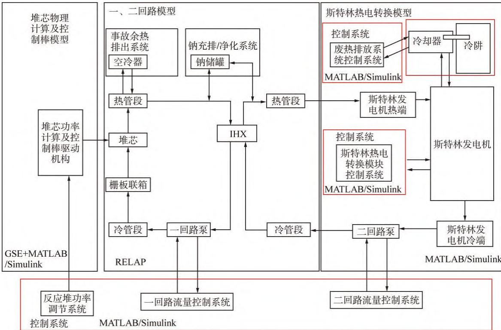  
图 1 小钠堆电源各模型整体耦合关系  
Fig. 1 Overall Coupling Relationship of Each Model for Small Sodium-Cooled Fast Reactor Power Supply IHX—中间热交换器

表 1 小钠堆电源重要参数及其限值  
Tab. 1 Important Parameters and Limits of Small Sodium-Cooled Fast Reactor Power Supply
<table><tr><td rowspan=1 colspan=1>参数名称</td><td rowspan=1 colspan=1>限值</td></tr><tr><td rowspan=1 colspan=1>堆芯出口钠温</td><td rowspan=1 colspan=1>上升不超过30℃</td></tr><tr><td rowspan=1 colspan=1>IHX二次侧出口钠温</td><td rowspan=1 colspan=1>上升不超过30℃</td></tr><tr><td rowspan=1 colspan=1>核功率</td><td rowspan=1 colspan=1>&lt;113%Pn</td></tr></table>

P—额定功率

## 3 仿真分析

### 3.1 边界换热改变的方法

在考察堆芯及一、二回路对负荷阶跃的响应时，需将 IHX 二次侧作为换热边界。对于 IHX

的二次侧，可以写出能量守恒方程，根据下式在 Simulink中建立相应的换热边界模型。

$$
w ( \tau ) c [ T _ { \mathrm { i } } ( \tau ) - T _ { \mathrm { o } } ( \tau ) ] = \mathcal { Q } ( \tau ) + M ( \tau ) c \frac { \mathrm { d } \overline { { T ( \tau ) } } } { \mathrm { d } \tau }
$$

式中，w 为二回路工质的质量流量，kg/s；c 为二回路工质平均比热容，J/(kg·K)；Ti 为入口温度，K；T 为出口温度，K；Q 为换热功率，W；M 为工质总质量，kg；τ 为时间变量，s。

通过对公式中的 Q 值输入相应的阶跃变化，可以调节换热边界的换热功率，使得堆芯及一、二回路的实际换热功率阶跃变化，从而研究负荷变化对堆芯及一、二回路的影响。

### 3.2 堆芯及一、二回路负荷跟踪能力

在 100%P 稳态工况无控制系统作用的条件下，将小钠堆堆芯及一、二回路仿真边界的传热功率阶跃下降10%，关键参数的响应如图2 所示。从图 2 中可见，负荷阶跃下降后， 堆芯出口钠温和 IHX 二次侧出口钠温立即上升，分别在 20 s和 15 s 后稳定在 558.2℃ 和 551.1℃ 附近；核功率在温度负反馈作用下跟踪换热负荷，在 40 s 内基本稳定在 90% 核功率；燃料热点温度受核功率影响降低至 1108.6℃；全过程响应迅速，过渡过程稳定，所有参数均未超出保护限值。由于二回路换热变化对一回路影响存在一定的热传递时间，堆芯出口钠温上升速率稍慢于 IHX 温度参数，但小钠堆电源整体负荷跟踪响应情况显著快于 CEFR及其他大型钠冷快堆，这主要得益于小钠堆电源减少中间传热回路，堆芯采用回路式设计且结构紧凑，一、二回路钠装量小等设计特性。

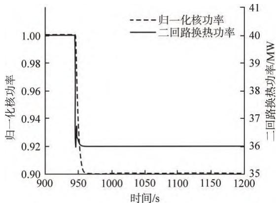

a 核功率二回路换热功率随时间变化  
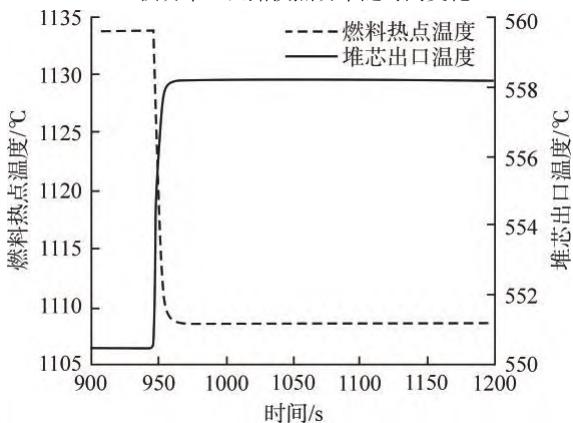  
b 燃料热点及堆芯出口温度随时间变化

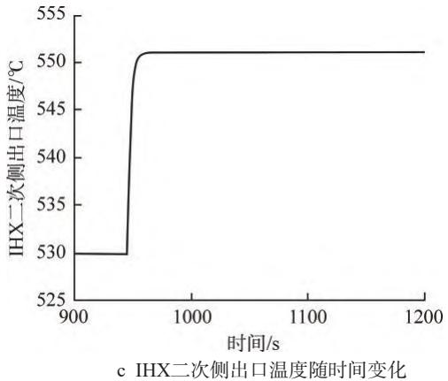  
图 2 负荷阶跃下降时小钠堆电源关键参数的响应  
Fig. 2 Response of Key Parameters of Small Sodiumcooled Reactor Power Supply under Load Step Decrease

## 4 负荷跟踪运行模式下的控制

当电网负荷要求变化时，在小钠堆电源的协调控制系统作用下，功率、流量、斯特林发电机的吸热量发生变化，斯特林发电机壁温及转化效率随之变化，从而使得输出功率发生改变以适应负荷要求。本节仍以负荷阶跃下降 10% 为例，研究小钠堆电源协调控制系统响应负荷变化的能力、调节品质以及整体控制效果。

### 4.1 方案一

按照工质压力是否变化，斯特林发电机的运行控制模式可分为定压运行和调压运行两种。考虑调压运行模式下的协调控制方案：功率调节系统，采用电功率需求值（负荷值）计算得到的核功率值作为前馈信号，斯特林发电机热壁温度百分比偏差作为调整信号，加和得到该电源的核功率定值，将核功率实际值与定值进行闭环调节。一、二回路流量控制系统根据给定的负荷信号采取开环控制，调节目标为与当前负荷相匹配流量所对应的指定转速。斯特林热电转换控制系统，以斯特林发电机压力为主调参数，由需求信号以及负荷-压力曲线计算出需求压力作为前馈信号，电功率需求值与实测值的相对偏差作为调整信号，2 个信号加和后对压力进行开环调节。废热控制系统维持与负荷相对应的流量。构建各环节的控制系统，可得到协调控制方案一，如图 3 所示。针对方案一开展了满功率稳态工况验证，验证了其在该工况下的控制效果。

针对协调方案一进行仿真。在 100%P 稳态工况下，50 s 时给予系统一个 10% 的负荷阶跃降低，堆电源关键参数的响应如图 4 所示。可以看出，负荷阶跃下降 10% 时小钠堆电源在协调控制系统作用下，控制棒根据核功率与负荷需求偏差调节核功率，气泵和调节阀根据电功率需求调节斯特林发电机所需压力，使得核功率和电功率分别稳定在对应的需求值。核功率和电功率均快速下降并在 2000 s 左右达到稳定，归一化核功率和归一化电功率分别变为 0.870 和 0.900，与负荷需求一致，斯特林发电机效率有所下降。斯特林发电机热壁温度调节作用下温度维持 440℃ 不变，斯特林冷壁温度、燃料热点温度、堆芯出口温度及 IHX 二次侧出入口温度在协调控制系统的作用下，变化趋势与核功率基本一致，分别由满功率稳态运行值变化为 43.3、1082.2、542.7、523.15℃ 和 426.5℃，约在 2000 s 后进入稳定状态。整体过渡过程平稳，速度较快，无停堆动作触发，满足控制系统要求。

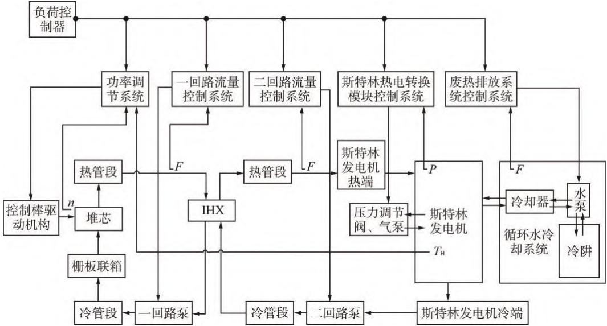  
图 3 协调控制方案一示意图  
Fig. 3 Schematic Diagram of Coordinated Control Scheme #1  
n—核功率；F—一、二回路或循环水冷却系统的工质流量； $T _ { \mathrm { H } ^ { - } }$ —斯特林发电机热壁温度；P—斯特林发电机工质压力

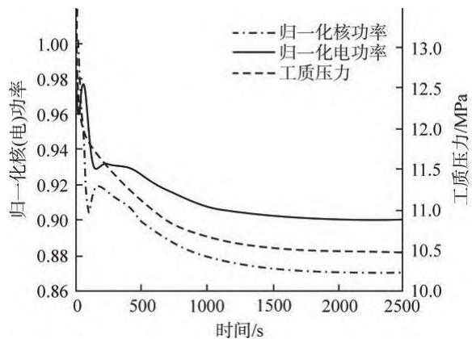  
a 核功率、电功率、工质压力随时间变化

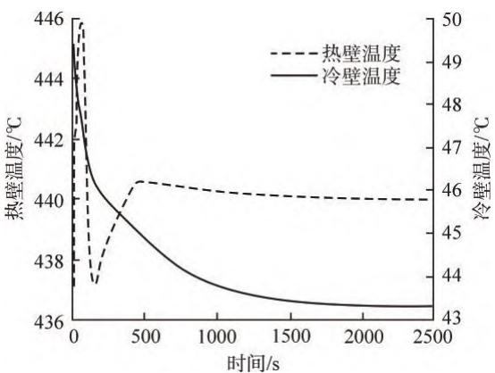  
b 冷热壁温度随时间变化

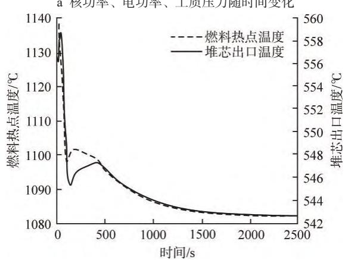  
c 燃料热点及堆芯出口温度随时间变化

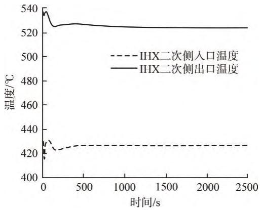  
d IHX二次侧出入口温度随时间变化  
图 4 负荷阶跃下降 $1 0 \% P _ { \mathrm { ~ n ~ } }$ 工况下协调控制方案一仿真结果  
Fig. 4 Simulation Results of Coordinated Control Scheme #1 with Load Step Decrease by 10%P

### 4.2 方案二

若斯特林发电机采用定压运行模式，无法根据工质压力调整电功率，则核-电功率的对应关系将为映射关系，可通过核-电功率对应关系调节电功率输出进行负荷跟踪。具体协调控制方案如下：功率调节系统，根据电功率需求值（负荷值）计算得到该电源的核功率需求值，以此为前馈并叠加电功率需求值与实际值的偏差调整信号，得到核功率的定值信号，并依据该定值进行核功率闭环调节。一、二回路流量控制系统根据给定的负荷信号采取开环控制，调节目标为与当前负荷相匹配流量所对应的指定转速。斯特林热电转换模块控制系统，通过固定斯特林发电机工质压力，电功率输出最终由核功率（即斯特林发电机的吸热量）直接调整控制。废热控制系统同方案一。构建各环节的控制系统，得到协调控制方案二，如图 5 所示。同样针对满功率稳态工况，验证了其在该工况下的控制效果。

针对协调方案二进行仿真，在 100%P 稳态工况下，50 s 时给予系统引入一个 10% 的负荷阶跃降低，小钠堆电源关键参数的响应如图6 所示。可以看出，负荷阶跃下降 10% 时堆电源在协调控制系统作用下，控制棒根据核功率与负荷需求偏差调节核功率，核功率和电功率均快速下降并在 350 s 左右达到稳定，归一化核功率和输出电功率分别变为 0.946 和 0.905，与负荷需求一致，斯特林发电机效率有所下降。同时，斯特林发电机冷壁温度、热壁温度、燃料热点温度、堆芯出口温度、IHX 二次侧出口温度及 IHX 二次侧入口温度在协调控制系统的作用下，变化趋势与核功率基本一致，分别由满功率稳态运行值变化为48.4、420、1095.3、531.2、510.3℃ 和405.3℃，约在 500 s 内完成。整体过渡过程平稳，速度较快，无停堆动作触发，满足控制系统要求。

### 4.3 负荷跟踪控制方案的分析比较

从稳定性、准确性和快速性这 3 个方面分析比较上述两种控制方案的差异和优劣点。方案一最终稳定性较好，满足要求；核功率、电功率不存在超调现象；由于包含核功率闭环及压力闭环两个调节回路，利用斯特林发电机壁温调节核功率，通过压力调节电功率，其最终的核功率、电功率的调节偏差约 1‰，准确度很高，其他温度参数结果一致。但由于闭环控制环节较多且复杂，控制系统的调节稳定时间较长（2000\~3000 s），需要采用的调节执行机构除控制棒外还有气泵和压力调节阀，压力实时调节的实现相对复杂。

方案二稳定性较好；核功率有小幅超调，电功率不存在超调现象；由于只依据核-电负荷关系作为定值对核功率进行闭环调节，其最终的核功率、电功率的调节偏差稍大，接近 1%，其他温度参数结果一致，随着运行过程负荷与核功率偏差可能发生变化或者偏差逐渐增大，需要在一段时间进行修正；由于闭环控制环节较少，控制系统的调节稳定时间较短（300\~500 s）；需要采用的调节执行机构只有控制棒，实现相对简单。综合比较，方案二优于方案一。

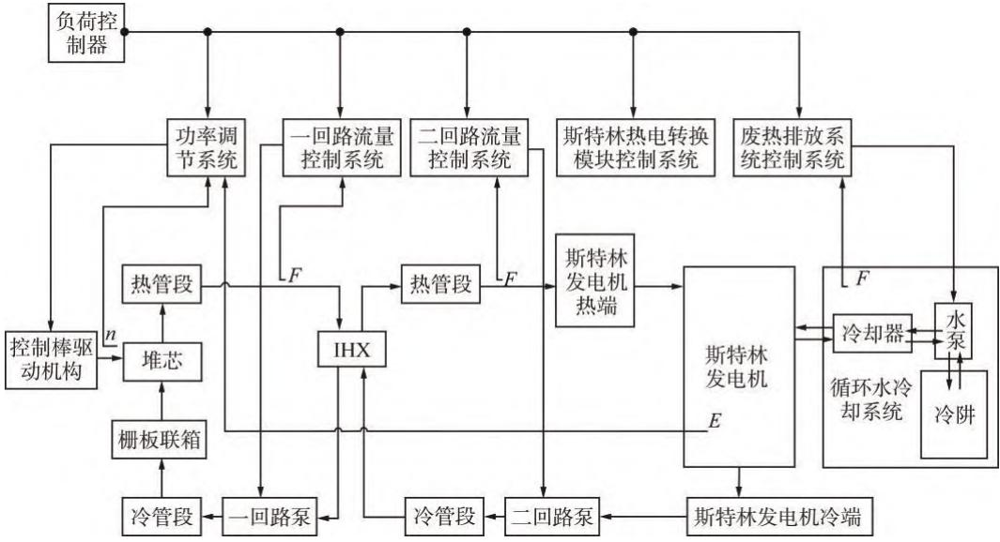  
图 5 协调控制方案二示意图  
Fig. 5 Schematic Diagram of Coordinated Control Scheme #2  
E—斯特林发电机的输出电功率

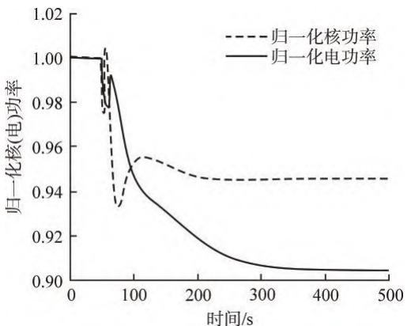  
a 核功率、电功率随时间变化

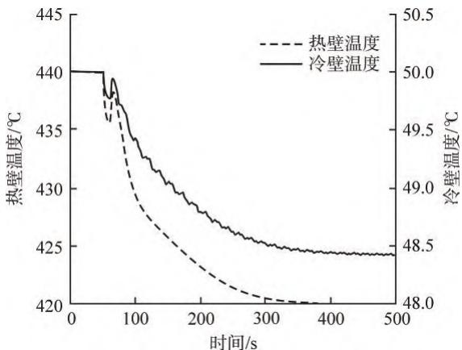  
b 冷热壁温度随时间变化

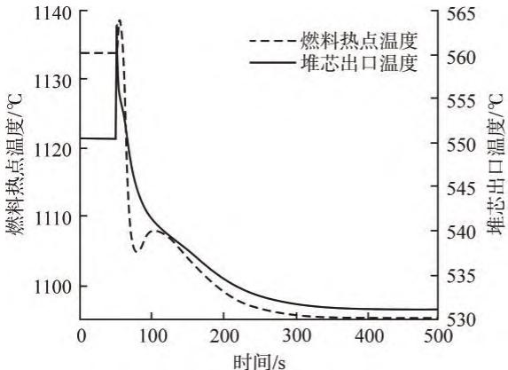  
c 燃料热点及堆芯出口温度随时间变化

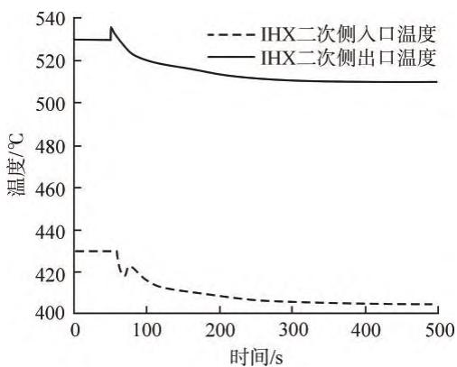  
d IHX二次侧出入口温度随时间变化  
图 6 负荷阶跃下降 $1 0 \% P _ { \mathrm { n } }$ 工况下协调控制方案二仿真结果  
Fig. 6 Simulation Results of Coordinated Control Scheme #2 with Load Step Decrease by 10%P

## 5 结　论

基 于 RELAP/GSE 联 合 MATLAB/Simulink平台，建立了一套用于小钠堆耦合斯特林热电转换模块核电源的仿真分析模型，分回路以及整体验证了该小钠堆电源的负荷跟踪能力，同时针对负荷跟踪运行模式下的控制方案进行研究分析，可得出以下结论：

（1）在目前工艺设计和关键参数限值条件下，小钠堆电源承受±10% 的负荷阶跃变化，具备较好的负荷跟踪适应能力。

（2）该小钠堆电源的堆芯及一、二回路承受负荷阶跃的能力较强，基于优良的设计特性其响应速度较大型钠冷快堆显著加快。而斯特林热电转换模块的负荷跟踪能力满足负荷跟踪运行需求，但响应时间相对前者更长，最终响应速度主要由斯特林热电转换模块的特性及其控制方案确定，但并不影响电源整体负荷跟踪能力实现。

（3）通过分析比较，协调控制方案一和方案二均满足小钠堆电源的负荷跟踪运行要求。其中，方案二较方案一有显著优势，建议采用方案二作为小钠堆电源的协调控制方案。

综合上述分析，建议该小钠堆电源采用负荷跟踪运行模式，可参与局部电网调峰。

## 参考文献：

周培德，侯斌，陈晓亮，等. 小型反应堆技术发展趋[1]势 [J]. 原子能科学技术，2020, 54(S1): 218-225.

刘勇，徐海斌，张媛媛，等. 大型钠冷快堆核电站负[2]荷运行模式研究 [J]. 中国仪器仪表，2019(6): 49-54.

侯斌，吕田，周科源，等. 用于海上钻井平台的小型[3]钠冷快堆核电源概念设计方案 [J]. 原子能科学技术，2018, 52(3): 494-501.

张玮瑛，段天英，刘勇，等. 中国实验快堆负荷跟踪能[4]力分析 [J]. 原子能科学技术，2017, 51(11): 2028-2035.

（ 责任编辑： 邵梦凡 ）