堆芯物理与热工水力

# 小型钠冷快堆电源建模及安全特性研究

尹 凯,段天英,乔鹏瑞,侯 斌,戴饶棋（中国原子能科学研究院 核工程设计研究所,北京 102413）

摘 要：为了研究小型钠冷快堆堆芯耦合斯特林动力转换系统的安全运行特性，文章基于 RELAP/GSE 联合 MATLAB/Simulink 平台建立了钠冷堆芯、一二回路钠系统、斯特林热电转换系统及辅助系统的全系统仿真模型，并通过斯特林效率分析以及参数稳态计算值与设计值的比较验证了仿真模型的合理性。通过对小型钠冷快堆典型事故工况进行仿真分析，结果表明，小型钠冷快堆电源具有良好的安全特性。该文章成果可为小型钠冷快堆核电源的总体设计、控制特性研究和事故分析提供工具和理论参考。

关键词：小型钠冷快堆；斯特林；Relap；建模；安全分析

中图分类号：TL425

文献标识码：A

DOI: 10.16157/j.issn.0258-7998.2024.S1.044

中文引用格式：尹凯，段天英，乔鹏瑞，等 . 小型钠冷快堆电源建模及安全特性研究 [J]. 电子技术应用，2024,50（S1）:243-251.

英文引用格式：Yin Kai, Duan Tianying, Qiao Pengrui, et al. Modeling and safety characteristic research of small sodium-cooled fast reactor [J]. Application of Electronic Technique,2024,50(S1): 243-251.

# Modeling and safety characteristic research of small sodium-cooled fast reactor

Yin Kai, Duan Tianying, Qiao Pengrui, Hou Bin, Dai Raoqi (China Institute of Atomic Energy, Department of Nuclear Engineering and Design, Beijing102413, China)

Abstract: In order to study the safety operation characteristics of the system of Small Sodium-Cooled Fast Reactor coupled with Stirling power conversion system, this paper focuses on a small sodium-cooled fast reactor power. Based on the RELAP/GSE combined with MATLAB/Simulink platform, this paper established fullsystem simulation models of sodium-cooled reactor core, the primary and second loop sodium system, Stirling thermoelectric conversion system and auxiliary system are established. By Stirling efficiency analysis and the comparison between the calculated parameters and the design values, the rationality of the simulation models is verified. Through the simulation analysis of typical accident conditions of Small Sodium-Cooled Fast Reactor, the results show that the Small Sodium-Cooled Fast Reactor Power Supply has good safety characteristics. The results of this paper can provide tools and theoretical references for the overall design, control characteristics and accident analysis of Small Sodium-Cooled Fast Reactor Nuclear Power Supply.

Key words: small sodium-cooled fast reactor; Stirling engine; Relap; modeling; safety analysis

## 0 引言

随着核能技术的不断地发展，小型核反应堆电源因其在安全性、经济性等方面较大型核电站有着显著优势，已成为核能利用的又一发展方向和重要路线。依托钠冷快堆的深厚技术基础及成熟经验，原子能院设计并开发了采用一体化堆芯、模块式设计、具有非能动安全特性、适合各类特殊环境部署应用的小型钠冷快堆电源系统（后简称小钠堆电源），可灵活适用于边远山区、海上平台、数据中心[1] 等各种应用场景。

目前国内外主流核动力转换形式均为压水堆匹配二回路朗肯循环的方式，建模研究的主要对象为压水堆 - 蒸汽发生器 - 汽轮机等系统及回路，斯特林机的动力转换方式在核电领域的研究和实践相对较少，有必要开展反应堆与斯特林耦合发电系统的建模仿真，并针对其安全特性进行深入研究。本文以某型号小钠堆电源为建模对象，将钠冷快堆与斯特林发动机相结合，通过RELAP/GSE 联合 MATLAB/Simulink 平台的方式，建立了包含钠冷堆芯、一二回路钠系统、斯特林热电转换系统及辅助系统的全系统仿真模型，并选取了典型事故工况对小钠堆电源的安全运行特性进行了分析。结果证明，小钠堆电源具有良好的安全特性。

## 1 小型钠冷快堆总体方案介绍

小型钠冷快堆主热传输系统主要包含三个部分：一回路钠系统、二回路钠系统、斯特林热电转换系统（含废热排放回路等）。堆芯及一回路采用一体化回路式设计方案，二回路作为中间回路实现放射性钠与斯特林发电模块的隔离，保持了斯特林热电转换系统为非放系统，便于系统的运行和维修。斯特林发电模块采用氦气作为工作介质，它吸收二回路的热量进行发电做功，同时冷端连接废热排放系统以导出发电转换的废热。小型钠冷快堆的总体技术指标见表1。

表1 小型钠冷快堆总体技术指标[2]
<table><tr><td rowspan=1 colspan=1>参数</td><td rowspan=1 colspan=1>数值</td><td rowspan=1 colspan=1>参数</td><td rowspan=1 colspan=1>数值</td></tr><tr><td rowspan=1 colspan=1>热功率/MW</td><td rowspan=1 colspan=1>40</td><td rowspan=1 colspan=1>堆芯尺寸/mm</td><td rowspan=1 colspan=1>φ800×1100</td></tr><tr><td rowspan=1 colspan=1>电功率/MW</td><td rowspan=1 colspan=1>10</td><td rowspan=1 colspan=1>二回路流量/(kg/s)</td><td rowspan=1 colspan=1>308.4</td></tr><tr><td rowspan=1 colspan=1>转换效率/%</td><td rowspan=1 colspan=1>25</td><td rowspan=1 colspan=1>IHX 二次侧入口温度 /C</td><td rowspan=1 colspan=1>430</td></tr><tr><td rowspan=1 colspan=1>冷却剂</td><td rowspan=1 colspan=1>Na</td><td rowspan=1 colspan=1>IHX 二次侧出口温度 /C</td><td rowspan=1 colspan=1>530</td></tr><tr><td rowspan=1 colspan=1>覆盖气体</td><td rowspan=1 colspan=1>氩气</td><td rowspan=1 colspan=1>单台斯特林功率/MW</td><td rowspan=1 colspan=1>1</td></tr><tr><td rowspan=1 colspan=1>一回路型式</td><td rowspan=1 colspan=1>回路式</td><td rowspan=1 colspan=1>斯特林机台数</td><td rowspan=1 colspan=1>10</td></tr><tr><td rowspan=1 colspan=1>主泵类型</td><td rowspan=1 colspan=1>电磁泵</td><td rowspan=1 colspan=1>单台斯特林缸数</td><td rowspan=1 colspan=1>16</td></tr><tr><td rowspan=1 colspan=1>中间热交换器(IHX)</td><td rowspan=1 colspan=1>4台</td><td rowspan=1 colspan=1>斯特林热效率/%</td><td rowspan=1 colspan=1>33.5</td></tr><tr><td rowspan=1 colspan=1>环路数</td><td rowspan=1 colspan=1>2</td><td rowspan=1 colspan=1>工作介质</td><td rowspan=1 colspan=1>氦气</td></tr><tr><td rowspan=1 colspan=1>堆芯进/出口温度/℃</td><td rowspan=1 colspan=1>440/550</td><td rowspan=1 colspan=1>平均工作压力/MPa</td><td rowspan=1 colspan=1>13.5</td></tr><tr><td rowspan=1 colspan=1>堆芯流量/(kg/s)</td><td rowspan=1 colspan=1>280.6</td><td rowspan=1 colspan=1>循环水冷却器进/出温度/℃</td><td rowspan=1 colspan=1>28.6/20</td></tr><tr><td rowspan=1 colspan=1>燃料活性区高度/mm</td><td rowspan=1 colspan=1>1100</td><td rowspan=1 colspan=1>最高工作压力/MPa</td><td rowspan=1 colspan=1>20</td></tr></table>

## 2 主要系统建模

### 2.1 总体模型结构

建模采用了 RELAP/GSE 联合 MATLAB/Simulink的方案。总体建模方案示意图如图 1 所示。对于堆芯及一、二回路的主要热工水力过程及传热环节，本文使用了核电厂安全分析使用的最佳瞬态分析程序 RELAP 作为堆芯、一回路、中间热交换器以及二回路的建模软件；对于堆芯物理、反应性引入及反馈，采用已广泛应用于核电仿真领域的 GSE 软件进行建模；对于全厂协调控制系统、斯特林热气机本体运行模型、斯特林热电转换及其热传递、废热排放系统等，则采用了 MATLAB/Simulink 平台进行了建模。同时，通过在 RELAP/GSE与MATLAB/Simulink之间建立数据交互接口，实现了全堆的联合仿真。

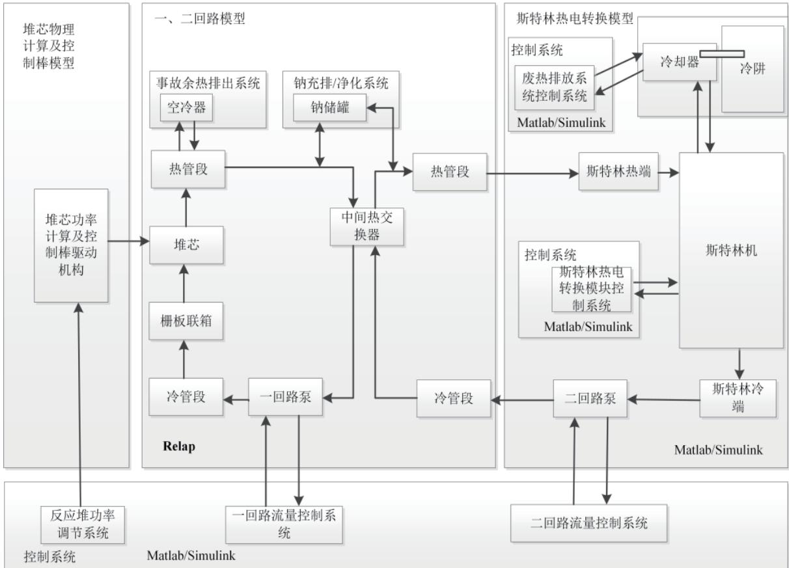  
图1 各模型整体耦合关系

### 2.2 反应堆堆芯物理模型

小型钠冷快堆的堆芯体积小，忽略堆芯中子分布的不均匀性，采用六组缓发中子先驱核的点堆动力学方程来描述小型钠冷快堆的中子随时间变化趋势 [3]。其方程表述如下：

$$
\frac { \mathrm { d } N \left( t \right) } { \mathrm { d } t } = \frac { \rho \left( t \right) - \beta } { \Lambda } N \left( t \right) + \sum _ { i = 1 } ^ { 6 } \lambda _ { i } C _ { i } \left( t \right)
$$

$$
\frac { \mathrm { d } C _ { i } \left( t \right) } { \mathrm { d } t } = \frac { \beta _ { i } } { \Lambda } N \left( t \right) - \lambda _ { i } C _ { i } \left( t \right) \qquad i = 1 , 2 . . . , 6\tag{1}
$$

式中N(t)—中子密度， $\mathrm { c m } ^ { - 3 }$

$\rho ( t )$ —反应性，△ k/k；

$\beta i \cdot$ —缓发中子份额，考虑六组缓发中子， 取$1 { \sim } 6 ;$

—总的缓发中子份额， $\beta = \Sigma \beta i _ { \mathrm { } }$

Λ—中子代时间，s；

λi—第i组先驱核的衰变常数，1/s；

—第 组先驱核的浓度， $\mathrm { c m } ^ { - 3 } 。$

基于MATLAB/Simulink平台对式（1）建立模型，以实现上述点堆动力学计算仿真，从而得到核功率值。

### 2.3 堆芯及一二回路热工水力模型

RELAP 是国际通用的反应堆热工水力建模软件 ,其开发了以两相系统的非均相和非平衡态流体动力学为基础的模型，采用快速半隐式的数值方法求解。本文采用搭载在 GSE 平台的 RELAP 进行建模，可较精细地仿真堆芯及一回路、二回路等主要流路和主热传输过程的稳态及瞬态情况。RELAP 具体原理及方程描述见文章 [4]。

以RELAP 搭建堆芯及一回路、中间热交换器 [5] 及二回路边界的模型，如图2所示。各节点含义如表2所示。为简化计算将各环路的两台IHX合并成一个进行建模。

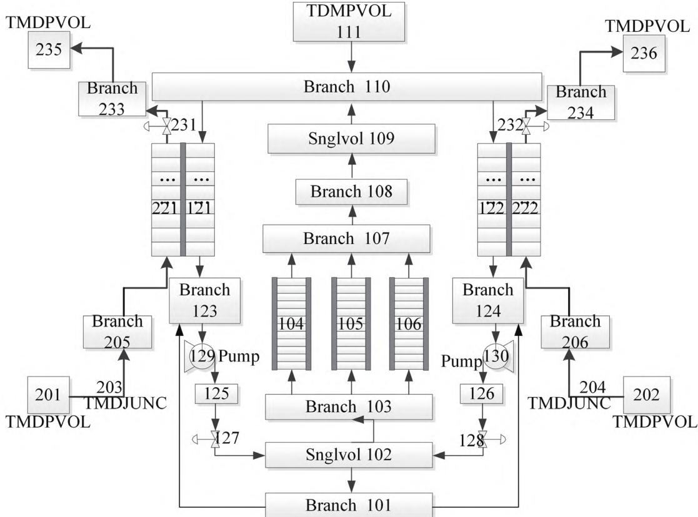  
图2 堆芯、一回路系统及二回路边界模型

表2 节点含义表
<table><tr><td rowspan=1 colspan=1>节点号</td><td rowspan=1 colspan=1>节点说明</td><td rowspan=1 colspan=1>节点号</td><td rowspan=1 colspan=1>节点说明</td></tr><tr><td rowspan=1 colspan=1>101</td><td rowspan=1 colspan=1>主容器冷却管道</td><td rowspan=1 colspan=1>123/124</td><td rowspan=1 colspan=1>冷管段</td></tr><tr><td rowspan=1 colspan=1>102</td><td rowspan=1 colspan=1>下栅板联箱</td><td rowspan=1 colspan=1>125/126</td><td rowspan=1 colspan=1>一回路泵出口体积</td></tr><tr><td rowspan=1 colspan=1>103</td><td rowspan=1 colspan=1>堆芯入口体积</td><td rowspan=1 colspan=1>127/128</td><td rowspan=1 colspan=1>一回路止回阀</td></tr><tr><td rowspan=1 colspan=1>104</td><td rowspan=1 colspan=1>最热燃料组件</td><td rowspan=1 colspan=1>129/130</td><td rowspan=1 colspan=1>一回路主循环泵</td></tr><tr><td rowspan=1 colspan=1>105</td><td rowspan=1 colspan=1>其他燃料组件</td><td rowspan=1 colspan=1>201/202</td><td rowspan=1 colspan=1>IHX二次侧钠入口压力边界</td></tr><tr><td rowspan=1 colspan=1>106</td><td rowspan=1 colspan=1>除燃料组件外其他堆芯流道</td><td rowspan=1 colspan=1>203/204</td><td rowspan=1 colspan=1>IHX 二次侧钠入口流量边界</td></tr><tr><td rowspan=1 colspan=1>107</td><td rowspan=1 colspan=1>堆芯出口体积</td><td rowspan=1 colspan=1>205/206</td><td rowspan=1 colspan=1>IHX二次侧钠入口流量分配节点</td></tr><tr><td rowspan=1 colspan=1>108/109/110</td><td rowspan=1 colspan=1>热管段</td><td rowspan=1 colspan=1>231/232</td><td rowspan=1 colspan=1>IHX二次侧钠出口调节阀</td></tr><tr><td rowspan=1 colspan=1>121/122</td><td rowspan=1 colspan=1>IHX一次侧管道</td><td rowspan=1 colspan=1>233/234</td><td rowspan=1 colspan=1>IHX 二次侧钠出口流量混合节点</td></tr><tr><td rowspan=1 colspan=1>221/222</td><td rowspan=1 colspan=1>IHX 二次侧管道</td><td rowspan=1 colspan=1>235/236</td><td rowspan=1 colspan=1>IHX 二次侧钠出口压力边界</td></tr><tr><td rowspan=1 colspan=1>111</td><td rowspan=1 colspan=1>一回路压力边界条件</td><td rowspan=1 colspan=1></td><td rowspan=1 colspan=1></td></tr></table>

### 2.4 反应性反馈系统模型

一般而言，钠冷快堆的反应性反馈主要来源为燃料多普勒效应、燃料棒轴向膨胀效应、堆芯径向膨胀效应及钠密度效应等 [6]，这些反馈效应的主要影响因素为燃料温度和一回路冷却剂钠平均温度等因素影响。忽略燃料棒以及堆芯的膨胀效应，将反馈简化处理为燃料多普勒效应和冷却剂温度效应两种，并假定反应性反馈系数为常数不变。反应堆引入的反应性将等于控制棒引入的 $\rho _ { d } ( t )$ 和反应性负反馈效应带来的反应性 $\rho _ { f } ( T _ { f } )$ 和$\rho _ { N a } ( T _ { N a } )$ 的求和，即：

$$
\rho \left( t \right) = \rho _ { d } \left( t \right) + \rho _ { f } \left( T _ { f } \right) + \rho _ { N a } \left( T _ { N a } \right)\tag{2}
$$

式中 $\rho _ { f } ( T _ { f } )$ 为多普勒效应。多普勒效应与燃料温度的关系 [7] 如下：

$$
T _ { f } \frac { \mathrm { d } \rho _ { f } } { \mathrm { d } f } { = } k _ { D }\tag{3}
$$

其中 $k _ { D }$ 为燃料多普勒系数。对上式进行积分、整理，可得：

$$
\rho _ { f } \left( T _ { f } \right) = k _ { x } \ln \frac { T _ { f } } { T _ { f , 0 } }\tag{4}
$$

$\rho _ { N a } ( T _ { N a } )$ 为冷却剂温度效应。该效应与冷却剂温度的关系可以用如下公式表述[8]

$$
\frac { \mathrm { d } \rho _ { N a } } { \mathrm { d } T } { = } k _ { N a } \frac { \mathrm { d } T _ { N a } } { \mathrm { d } T }\tag{5}
$$

其中 $k _ { N a }$ 为冷却剂温度效应。对上式进行积分、整理，可得：

$$
\rho _ { _ { N a } } \left( T _ { _ { N a } } \right) = k _ { _ { N a } } ( T _ { _ { N a } } - T _ { _ { N a , 0 } } )\tag{6}
$$

依据上述公式，利用采用 GSE 平台对反应性反馈进行整体建模。

### 2.5 斯特林发电机模型

斯特林发动机的建模分析方法主要包括零阶、一阶、二阶、三阶、四阶分析法，建模精度由低到高。本文根据建模精度需求和计算能力，采用了二阶绝热分析法来对斯特林机进行稳态性能分析，仿真建立了斯特林发电机的稳态模型，绝热模型图如图3所示。

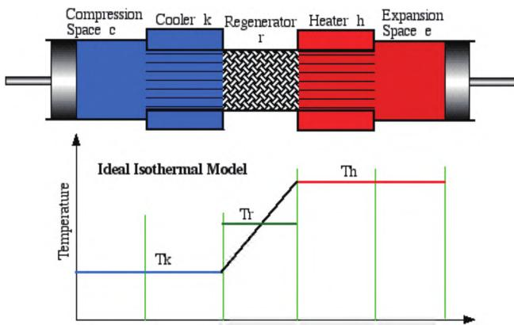  
图3 斯特林发动机的绝热模型图[9]

采用理想绝热分析法对斯特林各腔室内温度分布进行分析（字母 c，k，r，h，e 分别代表斯特林发动机的压缩腔、冷却器、回热器、加热器、膨胀腔五个腔室），考虑并引入回热器损失、外壳轴向损失等进行修正。有关理想绝热法的详细介绍见文献 [10]、[11]和 [12]。

理想绝热分析的主要假设有 [10-11]：(1) 工质为理想气体；(2) 任一瞬时发动机内气体压力不随空间位置变化；(3) 工质流动方向无传热；(4) 循环过程工质质量不变；(5) 缸壁、活塞以及死容积中的工质的温度恒定；6. 壁面温度缓慢变化（相对斯特林循环速度而言）。

### 2.6 斯特林发电模块传热瞬态分析模型

斯特林发电机的效率与斯特林冷热壁温度以及工质平均压力有关，为了建立斯特林发电模块在不同功率下的瞬态模型，需要计算斯特林发电机在不同工况下的冷热壁温度。主要的传热过程如图4所示。

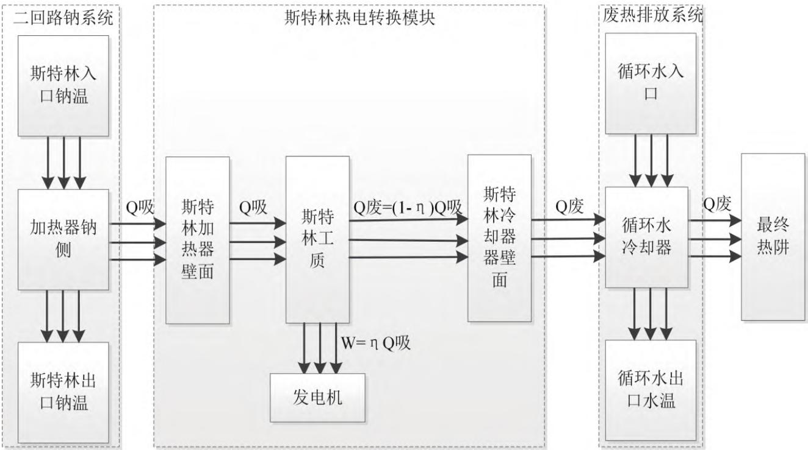  
图4 斯特林热电转换系统的换热关系

斯特林模块的换热公式描述如下：

$$
\begin{array} { r l } & { m _ { a c } C _ { m } \frac { d } { d t } \frac { \displaystyle M _ { a c } } { \displaystyle } = { v _ { m a } C _ { m } } \Big ( T _ { n m } - T _ { n m } \Big ) - b _ { m a } \mathcal { A } _ { m } \Big ( T _ { n m } - T _ { s } \Big ) } \\ & { \quad m _ { a c } C _ { m } \frac { d } { d t } \frac { \displaystyle M _ { a c } } { \displaystyle } = b _ { m a } \mathcal { A } _ { m } \Big ( T _ { n m } - T _ { n m } \Big ) - b _ { R a } \mathcal { A } _ { m } \Big ( T _ { n m } - T _ { n c } \Big ) } \\ & { \quad m _ { a c } C _ { m } \frac { d } { d t } \frac { \displaystyle M _ { b c } } { \displaystyle } = b _ { R a } \mathcal { A } _ { R } \Big ( T _ { n m } - T _ { n b } \Big ) - b _ { c a } \mathcal { A } _ { c } \Big ( T _ { n e } - T _ { c } \Big ) } \\ & { \quad m _ { c } C _ { c } \frac { \displaystyle M _ { c } } { \displaystyle d t } b _ { t } \mathcal { A } _ { c } \Big ( T _ { n e } - T _ { c } \Big ) \big ( 1 - \eta \Big ) - b _ { m a } \mathcal { A } _ { c } \Big ( T _ { c } - T _ { n } \Big ) } \\ & { \quad m _ { a c } C _ { a } \frac { \displaystyle M _ { a c } } { \displaystyle d t } - b _ { m a } \mathcal { A } _ { a } \Big ( T _ { c } - T _ { n e } \Big ) - w _ { c } C _ { c } \Big ( T _ { a m } - T _ { n m } \Big ) } \\ & { \quad m _ { a c } C _ { a } \frac { \displaystyle M _ { a c } } { \displaystyle d t } - b _ { m a } \mathcal { A } _ { a } \Big ( T _ { n m } - T _ { n m } \Big ) - w _ { c } C _ { v } \Big ( T _ { n m } - T _ { n c } \Big ) } \end{array}\tag{7}
$$

式中， $T _ { n a } .$ $T _ { n a i n } .$ $T _ { n a o u t }$ 分别为斯特林发动机加热器壳侧钠平均温度、进出口温度； $T _ { H \bullet } \ T _ { H e \bullet } \ T _ { C }$ 分别为斯特林发动机加热器壁面温度、氦气工质平均温度及冷却器壁面温度； $T _ { \scriptscriptstyle { W } } \ { \cal T } _ { \scriptscriptstyle { W i n } } \ { \cal T } _ { \scriptscriptstyle { W o u t } }$ 分别为斯特林发动机冷却器循环水平均温度和进出口温度； $T _ { w s } \mathrm { ~ \ } T _ { w s i \setminus } \mathrm { ~ \ } T _ { w s o \setminus }$ 热阱分别为斯特林发动机废热排放系统最终的循环水平均温度、进出口温度、最终热阱温度； $h _ { n a \bf { \setminus } } \ h _ { H \bf { \setminus } } \ h _ { C \bf { \setminus } }$ $h _ { w } , \ h _ { w s }$ 分别为各个换热界面上的换热系数； $C _ { n a \bf { \cdot } \Lambda } C _ { H \bf { \cdot } \Lambda }$ $C _ { H e } , \ C _ { C } , \ C _ { w }$ 分别为钠、加热器、氦气工质、冷却器及水的热容；A为各个换热界面的换热面积； $W _ { n a } \setminus \ W _ { w }$ 分别为钠和冷却水的质量流量； $\eta$ 为斯特林发动机效率。

上述集总方程主要包含了钠与斯特林加热器换热、斯特林加热器与氦气工质换热、氦气工质与斯特林冷却器换热、斯特林冷却器与循环水换热以及最终废热排放到热阱中的过程。根据冷却换热关系可知 $\mathrm { T } _ { \mathrm { w s i } } { = } \mathrm { T } _ { \mathrm { w o u t } }$ $\mathrm { T } _ { \mathrm { w s o u } } \mathrm { t } { = } \mathrm { T } _ { \mathrm { w i n } } ,$ 同时取最终冷源为固定温度即 T 热阱${ = } 4 ^ { \circ } \mathrm { C } _ { \circ }$ 在瞬态工况下，斯特林输入的吸热量改变，热壁及冷壁温度发生变化从而改变了斯特林的运行状态和效率，实际做功也将随之改变。由于斯特林机单次循环时间较外界温变时间短很多（斯特林每秒30 个循环），故在每个时刻可以假设斯特林机均处于当前工作条件下的准稳态。采用 2.5 中的稳态分析模型计算斯特林机循环效率，并引入上述瞬态换热方程进行计算，得到的冷、热壁温又作为下一次斯特林机效率稳态计算的输入参数，反复迭代收敛得到斯特林发动机冷热壁温度和实际效率，从而最终得到斯特林的输出电功率。

## 3 模型验证

### 3.1 斯特林发电机仿真特性验证

影响斯特林发电机效率的主要因素为冷壁温度、热壁温度以及工质平均压力[13]。固定冷热壁温 $\scriptstyle ( T _ { H } = 4 4 0 ^ { \circ } \mathrm { C } ,$ $T _ { C } { = } 5 0 ~ ^ { \circ } \mathrm { C } )$ ，分析工质平均压力对斯特林效率影响，绘制图如图 5(a) 所示，可见工质平均压力在 6 MPa 以上对效率影响较小接近于 1，仅在压力继续减小时效率出现大幅下降，与文献 [14]P53 中的图 4.9（a）变化趋势相一致。

固定工质平均压力13.5 MPa和冷壁温度 $5 0 ~ ^ { \circ } \mathrm { C } ,$ ，分析热壁温度对斯特林效率影响，绘制图如图 5(b) 所示，可见效率随热壁温度上升而上升，当热壁温度降至 184℃以下后，斯特林无法启动。与文献[14]P35中的图3.8变化趋势相一致。

故斯特林发电机仿真模型的合理性得以验证。

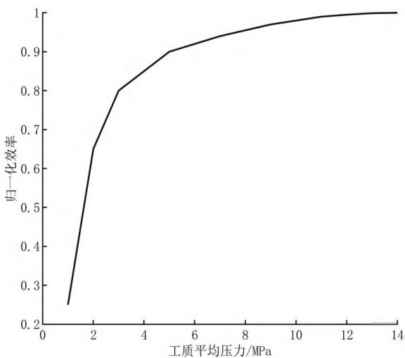

(a)工质压力对效率影响  
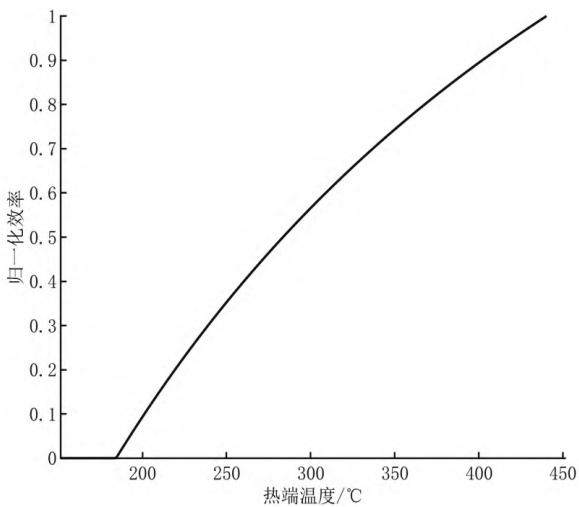  
(b)热端温度对效率影响  
图5 斯特林发动机效率随工质压力、热壁温度变化图

### 3.2 稳态工况验证

额定功率下，对小钠堆电源模型进行整体仿真计算，表 3 给出了模型计算值与设计值的偏差，可见关键参数的偏差都在1%以内（其中“/”格的参数为给定条件），验证了该模型在稳态工况下的准确度和可用性。

表3仿真结果与设计值比较
<table><tr><td rowspan=2 colspan=1>参数名称</td><td rowspan=1 colspan=3>额定功率</td></tr><tr><td rowspan=1 colspan=1>设计值</td><td rowspan=1 colspan=1>计算值</td><td rowspan=1 colspan=1>偏差/%</td></tr><tr><td rowspan=1 colspan=1>核功率/MW</td><td rowspan=1 colspan=1>40</td><td rowspan=1 colspan=1>40.122</td><td rowspan=1 colspan=1>0.305</td></tr><tr><td rowspan=1 colspan=1>电功率/MW</td><td rowspan=1 colspan=1>10</td><td rowspan=1 colspan=1>10.005</td><td rowspan=1 colspan=1>0.05</td></tr><tr><td rowspan=1 colspan=1>堆芯入口钠温 /℃</td><td rowspan=1 colspan=1>440</td><td rowspan=1 colspan=1>440.51</td><td rowspan=1 colspan=1>0.116</td></tr><tr><td rowspan=1 colspan=1>堆芯出口钠温 /℃</td><td rowspan=1 colspan=1>550</td><td rowspan=1 colspan=1>550.46</td><td rowspan=1 colspan=1>0.084</td></tr><tr><td rowspan=1 colspan=1>一回路流量/(kg/s)</td><td rowspan=1 colspan=1>280.6</td><td rowspan=1 colspan=1>280.56</td><td rowspan=1 colspan=1>0.014</td></tr><tr><td rowspan=1 colspan=1>IHX 二次侧入口温度 /℃</td><td rowspan=1 colspan=1>430</td><td rowspan=1 colspan=1>429.94</td><td rowspan=1 colspan=1>0.014</td></tr><tr><td rowspan=1 colspan=1>IHX 二次侧出口温度 /℃</td><td rowspan=1 colspan=1>530</td><td rowspan=1 colspan=1>529.97</td><td rowspan=1 colspan=1>0.006</td></tr><tr><td rowspan=1 colspan=1>二回路流量/(kg/s)</td><td rowspan=1 colspan=1>308.4</td><td rowspan=1 colspan=1>308.4</td><td rowspan=1 colspan=1>1</td></tr><tr><td rowspan=1 colspan=1>单台斯特林热功率/MW</td><td rowspan=1 colspan=1>1.0</td><td rowspan=1 colspan=1>1.000 5</td><td rowspan=1 colspan=1>0.05</td></tr><tr><td rowspan=1 colspan=1>工质平均压力/MPa</td><td rowspan=1 colspan=1>13.5</td><td rowspan=1 colspan=1>13.5</td><td rowspan=1 colspan=1>/</td></tr><tr><td rowspan=1 colspan=1>斯特林热壁温度/℃</td><td rowspan=1 colspan=1>440</td><td rowspan=1 colspan=1>439.96</td><td rowspan=1 colspan=1>0.01</td></tr><tr><td rowspan=1 colspan=1>斯特林冷壁温度/℃</td><td rowspan=1 colspan=1>50</td><td rowspan=1 colspan=1>49.99</td><td rowspan=1 colspan=1>0.02</td></tr></table>

## 4 安全特性研究

### 4.1 无保护- 反应性引入事故

假设小钠堆电源处于满功率运行状态下，单根价值最高的调节棒以最大移动速度失控提升，在 160 s 内线性引入 0.001 71 △ k/k 反应性，保护系统不动作。核电源各回路响应情况如图 6 所示，随着一根调节棒失控抽出，核功率开始大幅增加，并于258 s达到峰值1.134，随后由于负反馈效应超过引入反应性使堆功率逐渐下降并最终稳定在1.105附近（即44.2 MW）；斯特林机功率逐步增加，最终在 300 s 附近稳定在 1.187 附近，且增加幅度显著大于核功率。产生上述现象的主要原因是整体温升使斯特林冷热端温差变大，从而斯特林效率大幅提升，受吸热量和热效率增加的双重影响，最终增幅接近核功率的2倍。

与此同时，由于堆芯功率显著上升，堆芯的热点温度和冷却剂出口温度都快速上升，分别由 1 $1 3 8 ^ { \circ } \mathrm { C }$ 上升至 1 226.8 ℃及由 $5 5 0 ~ ^ { \circ } \mathrm { C }$ 上升至 $6 0 0 . 4 \ { ^ { \circ } } \mathrm { C } .$ ，但均未超过相应安全限值并留有较大的裕量。IHX 二次侧出入口温度分别上升约 36 ℃和 46 ℃，温升幅度低于堆芯出口温度；斯特林热壁由 440 ℃升至 $4 6 8 \ ^ { \circ } \mathrm { C }$ ，冷壁由 50 ℃升至 52.9 ℃，冷热壁温差继续拉大从而造成了斯特林效率的提升。根据上述仿真分析，小钠堆电源在该类事故工况叠加无保护条件下，功率最终增幅约 10%，热工参数在安全限值内且仍具备一定的安全裕度。

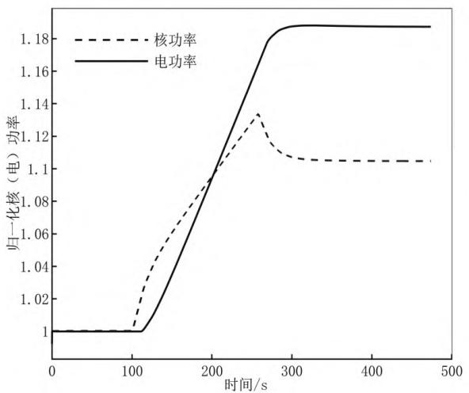  
(a) 核、电功率随时间变化

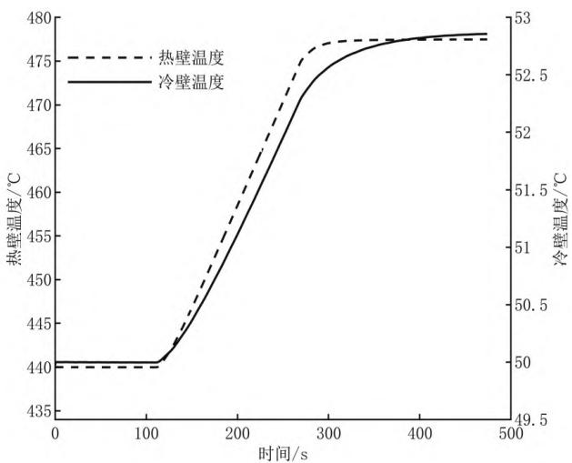  
(b) 冷热壁温度随时间变化

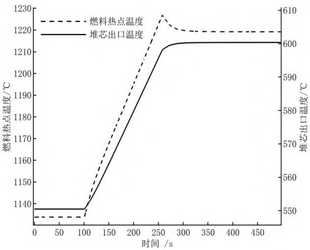  
(c)燃料热点及堆芯出口温度随时间变化

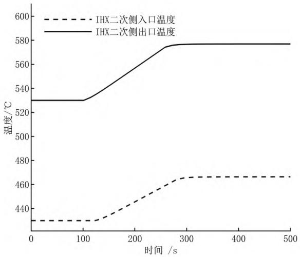  
(d)IHX二次侧出入口温度随时间变化  
图6 无保护反应性引入事故各回路参数响应情况

### 4.2 无保护-一二回路排热能力下降

假设小钠堆电源处于满功率运行状态下，100 s时一二回路流量突然降为70%，保护系统不动作。核电源各回路响应情况如图7所示。当发生一二回路排热能力下降事故后，随着流量的阶跃降低，冷却能力不足导致反应堆平均温度瞬间上升，随着负反馈引入，功率快速下降使平均温度快速回落直至低于原平均温度值，此时核功率引入正反应性功率重新回升，最终堆芯平均温度和核功率相互影响并最终稳定，堆芯平均温度由 $4 9 5 ^ { \circ } \mathrm { C } \mathcal { F }$ 为 $4 9 6 . 9 \ ^ { \circ } \mathrm { C } ,$ 平均温度升高所引入的负反应性使此时的核功率稳定在原值的0.989倍。斯特林在吸热量和效率双重因素的影响下降幅略大于核功率，为前值的0.98倍。

与此同时，因回路冷却能力不足，堆芯以及 IHX 的进出口温差显著拉大。堆芯的热点温度和冷却剂出口温度都快速上升，分别由 $1 1 3 8 ~ ^ { \circ } \mathrm { C }$ 上升至 $1 1 4 8 . 5 ~ ^ { \circ } \mathrm { C }$ 及由$5 5 0 ~ ^ { \circ } \mathrm { C }$ 上升至 $5 7 3 . 5 \ ^ { \circ } \mathrm { C } ,$ ，但均未超过相应安全限值并留有较大的裕量。堆芯进出口温差由 $1 1 0 ~ ^ { \circ } \mathrm { C }$ 增大至 153.2${ } ^ { \circ } \mathrm { C } ,$ 平均温度仅上升 $1 . 9 ~ ^ { \circ } \mathrm { C } _ { \circ }$ IHX 二次侧出入口温度分别上升约 $1 6 . 4 ~ ^ { \circ } \mathrm { C }$ 和下降 $2 5 ~ ^ { \circ } \mathrm { C } .$ ，进出口温差增大但平均温度降低 $4 . 3 ~ ^ { \circ } \mathrm { C } ,$ ，主要原因为一回路核功率下降，导致二回路平均温度下降；受到二回路平均温度降低影响，斯特林热壁由 440 ℃降低至 $4 3 6 \ ^ { \circ } \mathrm { C } ,$ ，冷壁由 $5 0$ ℃降低至 $4 9 . 7 \ ^ { \circ } \mathrm { C } ,$ ，冷热壁温差减小从而造成了斯特林效率的小幅下降。根据上述仿真分析，小钠堆电源在该类事故工况叠加无保护条件下，功率最终小幅下降约 1%，热工参数在安全限值内且仍具备一定的安全裕度。

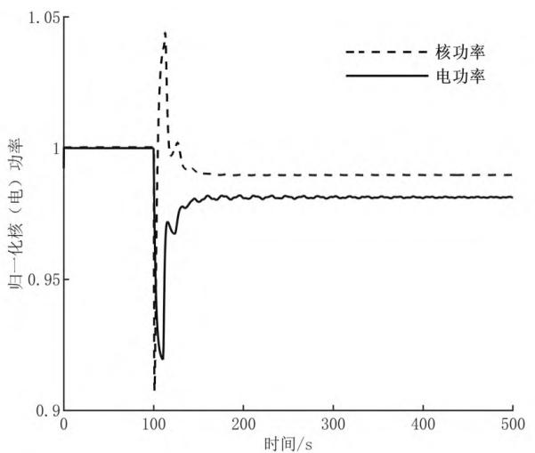  
(a)核、电功率随时间变化

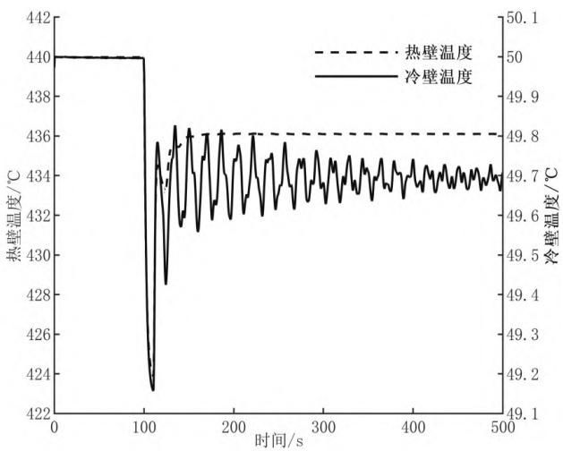  
(b)冷热壁温度随时间变化

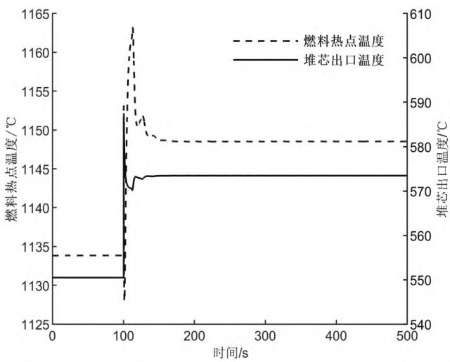  
(c)燃料热点及堆芯出口温度随时间变化

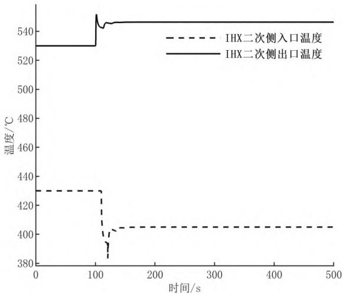  
(d)IHX 二次侧出入口温度随时间变化  
图7 无保护一二回路排热能力下降事故各参数响应情况

## 5 结论

本 文 基 于 RELAP/GSE 联 合 MATLAB/Simulink平台，建立了小型钠冷快堆耦合斯特林热电转换系统核电源的仿真模型，并对小钠堆电源安全特性进行了仿真研究，得到如下结论。

(1)本文开发了小钠堆耦合斯特林热电转换系统的全系统仿真模型，并通过斯特林发电机仿真特性与理论对比，以及通过稳态仿真结果与设计值的比较，验证了模型的合理性。

(2)同时，本文选取了小钠堆的两类典型事故工况开展了其安全特性的仿真研究，结果表明，在无保护 - 反应性引入、无保护 - 一二回路排热能力下降的工况下，因堆芯负反馈及其他固有安全性设计、斯特林热电效率随温度变化等因素，小钠堆各回路热工参数的瞬态过程及稳定后值均在安全限值内，且裕度较大。系统稳定后可正常运行，充分验证了小钠堆的安全特性。

本文主要创新点在于，不同于常规压水堆-汽轮机的常规建模方法，针对钠冷快堆耦合斯特林系统的核动力转换形式进行了深入分析、分部建模并实现联合仿真，形成了经过验证的、可用于安全及运行特性分析的仿真模型。同时，通过仿真分析，本文验证了小钠堆电源系统具有良好的安全特性。本文结果可为对小型钠冷快堆堆芯或基于斯特林发电的其它类似堆型的建模与分析提供参考。

## 参考文献

[1] 周培德,侯斌,陈晓亮,等.小型反应堆技术发展趋

势 [J]. 原子能科学技术 ,2020,54(201): 218-225.

[2] 侯斌,吕田,周科源,等.用于海上钻井平台的小型钠冷快堆核电源概念设计方案[J].原子能科学技术 ,2018,52(3): 494-501.

[3] 段天英.中国实验快堆控制系统的仿真研究[D]北京：中国原子能科学研究院,1999.

[4] 刘勇, 徐海斌, 陈林,等.大型钠冷快堆核电站蒸汽发生器仿真模型开发与分析[J].中国仪器仪表，2019(5):71-75.

[5] 张厚明，段天英，王刚,等.中间热交换器建模仿真研究 [J]. 核科学与工程 ,2014(1): 107-115.

[6] 张厚明,段天英,刘国发.大型示范快堆功率运行仿真研究[D].北京:中国原子能科学研究院,2013.

[7] Tang Y S, Jr Coffield R D, Merkley R A. Thermal Analysis of Liquid Metal Fast Breeder Reactors[M]. USA: American Nuclear Society, 1978: 257-262.

[8] 苏著亭,叶长源,阎凤文,等.钠冷快增殖堆[M].北京：原子能出版社, 1990.

[9] 田文静.斯特林发动机热力循环计算及性能模拟

[D]. 兰州：兰州理工大学 , 2011.

[10] Bataineh K M. Numerical thermodynamic model of alpha -type Stirling engine[J]. Case Studies in Thermal Engineering, 2018, 12.

[11] TIMOUMI Y, TLILI I, NASRALLAH S B. Performance optimization of Stirling engines[J]. Renewable Energy, 2008, 33(9):2134-2144.

[12] MARTINI W R. Stirling engine design Manual[R]. DONASA/3152-78/1,1983.

[13] 龚琳,段天英,刘勇. 水下小型无人钠钾堆控制方案研究[D].北京:中国原子能科学研究院,2023.

[14] 金东寒.斯特林发动机技术[M].哈尔滨：哈尔滨工程大学出版社 ,2009:35, 53.

（收稿日期：2024-01-04）

## 作者简介

尹凯（1995-），男，博士研究生，主要研究方向：核反应堆控制。