蘭州理工大学 ERSITYOFTECHNOLOGY

# 硕士学位论文

# 斯特林发力计算

学位申请人姓名田文静

养单位机电工程学院

导师姓名及职称龚俊教授吴建中高级工程师

学科专业机械制造及其自动化

研究方向斯特林发动机

论文提交日期2011年5月日

学校代号：10731

学号：082080201033

密级：

# 兰州理工大学硕士学位论文

# 斯特林发动机热力循环计算及性能模拟

学位申请人姓名： 田文静

导师姓名及职称： 龚俊教授吴建中高级工程师

培养单位： 机电工程学院

专业名称： 机械制造及其自动化

论文提交日期： 2011年5月31日

论文答辩日期： 2011年6月5日

答辩委员会主席： 余生福

The Research on Stirling Engine Thermodynamic Cycle Calculation and Performance Simulation by TIAN Wenjing

# B.E. (Lanzhou University of Technology) 2008

A thesis submitted in partial satisfaction of the

Requirements for the degree of

Master of Engineer

in

Mechanical Manufacture and Automation

in the Graduate School

of

LAN Zhou University of Technology

Supervisor

Professor Gong Jun

May, 2011

# 兰州理工大学学位论文原创性声明和使用授权说明

原创性声明

本人郑重声明：所呈交的论文是本人在导师的指导下独立进行研究所取得的研究成果。除了文中特别加以标注引用的内容外，本论文不包含任何其他个人或集体已经发表或撰写的成果作品。对本文的研究做出重要贡献的个人和集体，均已在文中以明确方式标明。本人完全意识到本声明的法律后果由本人承担。

作者签名：田文静

日期：2011年6月8日

# 学位论文版权使用授权书

本学位论文作者完全了解学校有关保留、使用学位论文的规定，同意学校保留并向国家有关部门或机构送交论文的复印件和电子版，允许论文被查阅和借阅。本人授权兰州理工大学可以将本学位论文的全部或部分内容编入有关数据库进行检索，可以采用影印、缩印或扫描等复制手段保存和汇编本学位论文。

本学位论文属于

1、保密，在\_2年解密后适用本授权书。

2、不保密口。(请在以上相应方框内打“√”)

作者签名：用文静

日期：2011年6月8日

导师签名：

日期：2011年6月8日

# 目录

摘要.. I  
Abstract.. .. II  
插图索引.. ..IV  
附表索引.. . V  
第1 章 绪论 .1  
1.1 课题的背景和意义 ..1  
1.1.1 能源现状及存在的问题 1  
1.1.2 太阳能的开发利用. .1  
1.1.3 太阳能热发电技术. .2  
1.1.4 碟式太阳能热发电系统的工作原理 .2  
1.2 斯特林发动机及其发展史 .3  
1.2.1 古代斯特林发动机的发展. .3  
1.2.2现代斯特林发动机的开创阶段. .4  
1.2.3斯特林发动机的进一步发展阶段. .4  
1.3斯特林发动机国内外发展现状 .5  
1.3.1 国外发展现状 ..5  
1.3.2 国内发展现状.. ..6  
1.4 课题来源及主要研究内容 ...7  
1.4.1 课题来源. ..7  
1.4.2 课题主要研究内容 ..7  
第2章 斯特林发动机的工作原理及热力循环分析方法的介绍 ..9  
2.1 斯特林发动机的工作原理 ..9  
2.2 斯特林发动机几种热力循环计算方法的介绍 ..13  
2.2.1一阶分析法——理想等温模型分析法 ..13  
2.2.2 二阶分析法——理想绝热模型分析法 ..15  
2.2.3三阶分析法——节点分析法.. ..17  
2.3斯特林发动机几种分析计算方法的比较 .19  
2.4 本章小结. .20  
第3章 斯特林发动机性能模拟优化方法—理想绝热分析法 .21  
3.1 理想绝热分析法 .21  
3.1.1 理想绝热法模型的建立. ..21  
3.1.2 理想绝热模型分析 .22  
3.2 损失计算. .26  
3.2.1 斯特林发动机实际循环. .26  
3.2.2 活塞往复热损失 .26  
3.2.3 压缩损失.. .27  
3.2.4 回热器损失 ..29  
3.2.5 本章小结 ..31  
第4章 斯特林发动机热力循环绝热分析法建模方程的求解方法 ...32  
4.1 方程的求解. .32  
4.1.1 Runge-Kutta 法求解 .32  
4.1.2 初始条件. .33  
4.1.3 斯特林发动机稳态循环计算过程 ..33  
4.2 发动机参数.. .36  
4.2.1 循环参数 .36  
4.2.2 结构参数 .36  
4.2.3 工质参数 ..38  
4.3理想绝热循环计算结果分析. ..38  
4.3.1 绝热循环下的性能分析. ..39  
4.3.2 考虑损失变工况性能分析. ..42  
4.4 本章小结... ..46  
第 5 章 STY1 型斯特林发动机性能试验 ..47  
5.1 任务来源与目的. ..47  
5.2 实验技术要求及条件.. ...47  
5.2.1 发动机电加热系统. .47  
5.2.2 发动机试验热保护装置. ..47  
5.2.3发动机测试与数据采集系统 ..47  
5.2.4 试验人员 ..48  
5.3 试验方法. .48  
5.4 试验过程.. ..48  
5.4.1 试验前准备 .48  
5.4.2 发动机试验 .49  
5.4.3 发动机停车 .49  
5.4.4 试验结束... .49  
5.5 发动机试验过程分析 .49  
5.5.1 Tecplot 软件介绍. .49  
5.5.2发动机试验数据动态分析. ....50  
5.6 本章小结.... ...53  
结论... ...54  
参考文献.. ...56  
致谢... ....59  
附录A（攻读硕士研究生期间发表的论文） ...61

# 摘要

在环境污染和能源形势日趋严峻的背景下，开发太阳能等可再生能源已成为人类迫切的需要。碟式太阳能热发电技术是太阳能热利用中最有潜力的技术，具有广阔的发展前景。斯特林发动机是太阳能热发电系统中最为重要的组成部分，它负责将吸收的太阳能转化为电能。斯特林发动机性能的好坏，直接决定了碟式太阳能系统的成败。所以，如何提高发动机的发电功率和效率已成为待解决的关键性问题。

首先，针对斯特林发动机发电功率和效率的问题，本文以四缸双作用斯特林发动机为研究重点，分别介绍了三种常用的模拟斯特林发动机的分析方法，通过比较，选择出在研究斯特林发动机性能上较为合理、可取的分析方法——绝热分析法。重点阐述绝热分析法，建立适用于模拟四缸双作用斯特林发动机的性能模型为目标函数，以具体工况为约束条件来考虑在循环过程中可能伴随的相关热损失，本文着重介绍影响斯特林发动机发电功率和效率的三大损失。

其次，对斯特林发动机热力循环绝热分析法模型中列出的微分方程，采用四阶龙格—库塔（Runge-kutta）法对绝热模型的微分方程组求解。为快速而准确的计算，编写 VB程序用计算机来实现四阶龙格—库塔（Runge-kutta）法求解微分方程组，从而计算出发动机相关性能参数。

再次，通过在其实习公司车间搭建试验平台，模拟实际工况，对斯特林发动机发电过程进行模拟、分析，找出在试车的整个动态过程中，加热温度和系统的平均压力是影响发电效率和功率的主要因素。在此基础上运用 Tecplot v10.0软件对发电性能进行模拟。

最后，提出斯特林发动机发电过程存在的问题和提高发电功率和效率的可行性建议。

关键词：碟式太阳能热发电系统；四缸双作用斯特林发动机；绝热分析法；四阶龙格—库塔（Runge-kutta）法；性能模拟

With an increasingly grim background of the environmental pollution and energy situation, the development of solar and other renewable energy sources has been becoming an urgent need. Dish solar thermal power generation is the most promising technology, with broad prospects for development. Stirling engine is the most important part of the solar thermal power generation system, which is responsible for absorbing solar energy into electrical energy. Stirling engine's performance is good or bad, which derectly determines the success or failure of dish solar system. Therefore, how to improve the engine's power output and efficiency have become an un- solved and crucial problem. First, as for the Stirling engine power output and efficiency issues, this paper takes the four-cylinder double acting Stirling engine for the emphases research and respectively describes the three commonly used and analog methods of analysis of Stirling engine. By comparing, we select more reasonable and desirable method - adiabatic analysis, within the Stirling engine performance research. We mainly describe the adiabatic analysis and establish suitable for the four-cylinder double acting Stirling engine simulation performance model for the target function. While, we use the specific conditions as the constraint conditions to consider in the recycling process may be associated with some heat losses. In this paper, we focus on providing the three losses of the influence of Stirling engine power output and efficiency information. Secondly, the adiabatic analysis method has listed the differential equations in the Stirling engine thermodynamic cycle; we use fourth-order Runge - Kutta method for solving the adiabatic model of differential equations. In order to quickly and accurately calculate these differential equations, we compile VB program with computer to achieve fourth-order Runge - Kutta method for solving differential equations. Therefore, we also can calculate engine's relevant performance parameters Again, we build a test platform in one Company attached to a school Limited to simulate and analyze Stirling engine power generation process through actual working conditions, and find out that the heating temperature and system average pressure is power output and efficiency of the main factors, which the whole process is in commissioning process. On the basis of using the Tecplot v10.0 software to simulate the electrical performance.

# Abstract

Finally, I put forward some problems about Stirling engine power generation process and some feasible suggestions in order to improve power output and efficiency.

Keywords: Dish Solar Thermal Power Generation Systems; Four-cylinder Double Acting Stirling Engine; Adiabatic Analysis; Runge - Kutta Method; Performance Simulation.

# 插图索引

图 1.1 碟式太阳能热发电系统. .2  
图 2.1 斯特林循环工作过程示意图. .11  
图 2.2 四缸双作用斯特林发动机. .12  
图 2.3 理想等温循环模型.. ..14  
图2.4 理想等温循环和卡若循环比较 ..14  
图 2.5 理想绝热循环模型 ..16  
图 2.6 理想绝热循环.. ..16  
图 2.7 节点分析模型 ..17  
图 2.8 斯特林理想循环与实际循环的 P-V 图 ..18  
图 3.1 理想绝热循环模型. ..21  
图 3.2 一般换热模型. ..22  
图 3.3 绝热压缩腔.... .24  
图 3.4 活塞往复热损失示意图 .27  
图 3.5 牛顿粘性定律示意 .28  
图 3.6 回热器温度分布... ..30  
图4.1 斯特林发动机稳态循环计算程序框图 ..34  
图4.2 发动机各部分的温度分布 .35  
图 4.3 绝热循环下 Ve-θ 和 Vc-θ 图 .40  
图 4.4 绝热循环下 Te-θ 和 Tc-θ 图 ..40  
图 4.5 绝热循环下的 P-θ 图. ..41  
图 4.6 绝热循环下的 p-V 图. .41  
图 4.7 绝热循环下的 W-θ 和 Q-θ 图. ..42  
图4.8 发动机性能参数随加热温度变化曲线. .43  
图4.9 发动机相关损失随加热温度变化曲线.. ..44  
图 5.1 发动机数控系统实时监控界面 ..48  
图 5.2 发动机热端温度变化曲线图 ..50  
图 5.3 发动机系统压力变化曲线图.. ..51  
图5.4 发动机发电功率与温度变化关系图 ..52  
图5.5 发动机发电功率与压力变化关系图. ..53

# 附表索引

表120Kw斯特林发动机的尺寸.. ..39  
表2西安斯特林发动机理想绝热循环与计及损失循环参数比较......43

# 第1章 绪论

## 1.1 课题的背景和意义

### 1.1.1 能源现状及存在的问题

近年来，随着人们对能源和环境这两个全球性问题的日益关注，以及人们生活水平的不断提高和工业文明的不断推进，人类对能源的需求量也越来越大。伴随着常规能源所引起的环境污染也日益严重的问题，人类已经意识到以煤、石油、天然气为代表的矿物燃料储藏量的有限性会成为社会发展的隐患，因此人们开始不断寻找新的能够替代矿物燃料的主要能源地位。

在当今世界的能源结构中，人类利用的能源主要是石油、天然气和煤炭等化石能源。但是这些化石能源都面临枯竭的危机，截至2002年底，世界石油可采储量为1427亿吨，可采40.6年；天然气为 $1 5 5 . 7 8 \times 1 0 ^ { 4 }$ 亿立方米，可采60.7年；煤炭为9844.5亿吨，可采204年。我国的能源资源储量不容乐观。根据最新资料，我国能源经济可开发剩余可采储量的资源保证程度仅为129.7年，其中，原煤仅为114.5年，原油仅为20.1年，天然气仅为49.3年。化石能源的大量开发和利用，是造成大气污染和其他类型的环境污染与生态破坏的主要原因之一。全球气候变化是当前国际社会普遍关注的重大全球环境问题，它主要是发达国家在其工业化过程中燃烧大量化石燃料产生的 $\mathrm { C O } _ { 2 }$ 等温室气体的排放所造成的。在过去的100年中，全球平均气温上升了 $0 . 3 { \sim } 0 . 6 ^ { \circ } \mathrm { C }$ ，全球海平面上升了10～25cm。频繁的飓风、水源污染、湿地沙化都是自然对人类的惩罚。能源枯竭和环境污染两大问题严重制约着人类社会的发展。要从根本上解决这个问题，就要求我们大力开发对环境友好的新能源[1]。

### 1.1.2 太阳能的开发利用

在众多的新能源中，太阳能因其具有以下一些优点，拥有非常广阔的应用前景。

（1）储量“无限性”。太阳每秒钟放射的热量大约是 $3 . 7 5 \times 1 0 ^ { 2 3 } \mathrm { k W }$ ，其中到达地球陆地表面的辐射能大约为 $1 . 7 \times 1 0 ^ { 1 3 } \mathrm { k W }$ ，相当于目前全世界一年内消耗的各种能源所产生的总能量的35,000多倍，太阳的寿命至少尚有40亿年，相对于人类历史来说，太阳可源源不断供给地球能源的时间可以说是无限的。

（2）分布普遍性。相对于其他能源来说，太阳能对于地球上绝大部分地区存在普遍性，可就地取用，这就为常规能源缺乏的国家和地区解决能源问题提供了

美好的前景。

（3）利用清洁性。太阳能像风能、潮汐能等洁净能源一样，其开发利用时几乎对环境不造成任何的污染。

（4）利用的经济性。一是接收太阳能时不收任何的“税”，可以随地取用；二是在目前的技术发展水平下，太阳能的利用不仅可能而且可行。我国拥有十分丰富的太阳能资源。我国陆地表面每年接受的太阳辐射能约为147×108000万千瓦时，年日照时数大于2000小时的地区面积较大，约占全国总面积的2/3以上，主要为西藏、青海、新疆、内蒙古南部、山西、陕西北部、河北、山东、辽宁、吉林西部等广大地区，这些太阳能资源丰富或较丰富的地区，具有利用太阳能的良好条件[2]。

### 1.1.3 太阳能热发电技术

太阳能的利用方式有很多，主要有太阳能光发电、太阳能热利用、太阳能动力利用等。太阳能热发电是太阳能利用中的重要形式。它具有技术成熟、发电成本低和容易与化石燃料形成混合发电系统的优点，被认为是可再生能源发电中最有前途的发电方式。

太阳能热发电技术主要有三种，分别为槽式太阳能发电系统、塔式太阳能发电系统和碟式太阳能发电系统。与另外两种太阳能发电系统相比，碟式太阳能发电系统具有布局灵活、应用前景非常广泛、发电效率高、起步投资少、结构简单、降低成本潜力及系统优化潜力巨大等一系列优点，因而成为了人们研究的焦点。

### 1.1.4 碟式太阳能热发电系统的工作原理

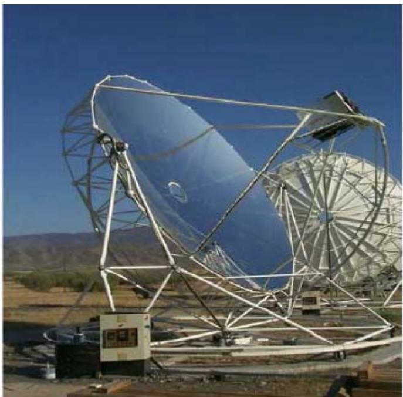  
图 1.1 碟式太阳能热发电系统

碟式太阳能热发电系统主要包括三个部分：聚光器、吸热器和斯特林发动机。聚光器是一个旋转抛物面形状的装置。抛物面由反射性极强的材料制成，可以反射太阳光。它由太阳跟踪系统驱动，时刻对准太阳，可以将投射到其表面的太阳光通过反射汇聚到抛物面的焦点位置。吸热器被安置在聚光器的焦点处，把汇聚的太阳能接受到吸热器的腔体内部。吸热器内部安装有斯特林发动机的加热器，进入吸热器的太阳能将通过加热器转化为热能，为发动机的工质所吸收，达到为发动机提供热源的目的。斯特林发动机是系统中十分重要的关键部件。它是将吸收的热能转化为动能的动力装置。在斯特林发动机的末端连上一个发电机，就可以把发动机输出的轴功转化为电能。整个碟式太阳能热发电系统就是这样将太阳能转化为电能的。本课题研究的是碟式太阳能热发电系统中的斯特林发动机部分[45]

## 1.2 斯特林发动机及其发展史

斯特林发动机，也叫热气机，是一种外燃（或外部加热）封闭循环活塞式发动机，其对燃烧方式或外燃系统的特性无特殊要求，只要外燃温度高于闭式循环中的工质温度即可。例如，各种可燃物的燃烧装置、太阳能、原子能、废热、蓄热气装置以及化学反应生成热装置等均可成为斯特林发动机的外部加热热源。根据发动机的设计要求，外部热源的温度有的高达2300K，低的只有几度温差，其对多种燃料高度适应性的特点使之具有广泛的用途，上至太空，下至水中。斯特林发动机的闭式循环系统由膨胀腔、加热器、回热器、冷却器和压缩腔组成，并依次串接在一起组成循环回路，其内封入氢气、氦气或空气等气体作为工质，依靠活塞运动使循环系统的有关容积发生周期性的变化，工质得以在循环系统中做周期性的往复流动。工质在较低温度下被压缩，然后在较高温度下发生膨胀做功。理想的斯特林循环由两个等温和等容过程组成，其循环效率为卡诺循环效率，循环输出功在相同的压力范围内比内燃机要大。因氢气和氦气有很高的热传递能力，它们一直被用做斯特林发动机的工质。为得到最大的输出功率，工质的压力应在5-15Mpa范围内，因而工质工作在高压下使得斯特林发动机的密封非常困难。实际工作的斯特林发动机的效率虽然不能达到卡诺效率，但其热效率比较高，其循环系统中，工质压力变化平缓，循环压力比通常小于2，而且没有气阀结构，因而其运转平稳安静。斯特林发动机的发展史大致可以分为以下3个阶段：

### 1.2.1 古代斯特林发动机的发展

在十九世纪初至十九世纪中叶，人们创造了各种各样的斯特林发动机。1807年，乔治·凯莱（GeorgeCayley）创建了第一台能实际工作的开式循环斯特林发动机，当时叫炉膛式热气机。1816年，罗伯托·斯特林发明了闭式循环斯特林发动机，并在采石场上作泵水工作。约翰·埃里克松（JohnEricssion）在斯特林发动机的发展上也做了大量的工作。但是限于当时的条件和人们对这些斯特林发动机的认识程度，大部分斯特林发动机的功率和效率都很低，不但没能取代蒸汽机，反而被比斯特林发动机晚发明半个多世纪的内燃机所淘汰。1916年最后一台老式斯特林发动机出厂，斯特林发动机的发展至此告一段落。

### 1.2.2 现代斯特林发动机的开创阶段

荷兰的菲利普公司是现代斯特林发动机的发展鼻祖。从三十年代末到六十年代末整整三十年时间内，菲利普公司开创了现代斯特林发动机发展的新阶段。1938年，荷兰的边远地区缺乏电力，需要一种运转安静且能够使用多种燃料和寿命较长的无线电装置的供电设备。菲利普公司经过全面考证后选择了使用斯特林发动机，并制成了电功率为200W的斯特林发动机发电机组，与无线电装置配套使用。1947年，菲利普公司宣布制成了功率为1.2KW的斯特林发动机，重量比原先下降50%，体积下降了125%。1955年，按逆向斯特林循环工作的制冷机在菲利普公司投产，制冷温度12-80K，与此同时，对作为原动机使用的斯特林发动机用现代化技术进行了深入研究，作了根本性的改革，使斯特林发动机的效率和功率得到大幅度的提高，出现了新一代的斯特林发动机。由于菲利普公司成功地创建了现代斯特林发动机，受到各国有关单位的重视和青睐。1958年，美国的通用发动机公司率先与菲利普公司签订了专利合同。研制的单位越来越多，从而进入了斯特林发动机发展的第三阶段。

### 1.2.3 斯特林发动机的进一步发展阶段

到六十年代后，研制斯特林发动机的单位纷纷崛起，投入斯特林发动机的发展洪流，因此，斯特林发动机得到进一步的发展，同时出现了各种各样使用不同能源的斯特林发动机。斯特林发动机正在向实用化、商品化迈进。使用普通石油液态燃料的车用斯特林发动机已经发展到相当成熟的阶段，重量和尺寸与内燃机相当，而经济性比同类内燃机要好得多；燃烧煤或生物质能的斯特林发动机正在发展中，它适用于缺油第三世界国家，特别适用于广大农村。使用太阳能的斯特林发动机也在这个阶段发展起来，它适用于多阳地区。盘式聚光器收集太阳能，作为斯特林发动机的动力能源，1MW级的斯特林发动机太阳能电站已完成模型试验和可行性论证，发展计划正在规划中。另外，美国热发电计划与Cummins公司合作，1991年开始开发商用的7千瓦盘式/斯特林发电系统，5年投入经费1800万美元。1996年Cummins向电力部门和工业用户交付7台盘式发电系统，1997年生产25台以上。Cummins预计10年后年生产超过1000台。该种系统适用于边远地区独立电站。美国热发电计划还同时开发25千瓦的盘式发电系统。25千瓦是经济规模，因此成本更加低廉，而且适用于更大规模的离网和并网应用。

1996年在电力部门进行实验，1997年开始运行。由于盘式斯特林系统光学效率高，启动损失小，效率高达30%左右，所以得到很多专家的青睐。同时人们也越来越意识到热气机技术能对保存资源和保护环境起到积极的作用。因此，越来越多的国家和组织开始参与热气机技术的研究和发展活动。大量资金开始投入到研究中来。1995年秋，在日本召开的第七届斯特林发动机大会上甚至提出“21世纪是斯特林发动机的世纪”[3]。

## 1.3 斯特林发动机国内外发展现状

由于斯特林发动机所独具的优势，国内外很多科研人员和科研机构都在积极地研发高性能的斯特林发动机，使斯特林发动机获得了快速的发展。下面是一些较为重要的研究成果。

### 1.3.1 国外发展现状

L.Berrin Erbay 和 Hadbi Yavuz 研究了斯特林发动机在闭式回热循环过程中的做功能力。通过对动力活塞和配气活塞做功过程引入了新的假设，得到了计算最大功率和效率的公式和在最大功率下的压缩比4。

Zhaolin Gu,Haruki Sato,Xiao Feng 研究了在斯特林发动机工作过程中加入超临界回热过程以提高热效率的方法。论文分别对多相流体工质和有相变的流体工质进行分析，结论认为超临界回热过程确实可以提高斯特林发动机的效率[5]。

R Impero Abenavoli,We Dong,L.Fedele,A.Sciahoni 介绍了一种新型的旋转式斯特林发动机。论文详细的推导了旋转部件运动而引起的膨胀腔和压缩腔体积随时间的变化函数，进而得到了发动机的功率和效率的表达式。文中还给出了这种发动机的简图[6]。

Stig Kildegard Andersen,Henrik Carlsen,Per Grove Thomsen 利用数值分析的方法研究在考虑回热器基体温度差异的因素下，斯特林发动机回热器基体的最优化问题。他们发现，回热器基体温度的摆动有两种方式：一种结果在轴向方向接近线性，而另一种在轴向结尾处曲线向下弯曲，这将导致气体进入回热器时温度与回热器有很大的差值。第一种方式提高了发动机的性能，而第二种方式则降低了发动机的功率和效率7]。

S.C.Kaushik,S.Kumar对不可逆斯特林发动机和埃里克森发动机进行了有限时间热力学分析。通过分析发现，在回热器效率为1的条件下，两种循环的效率等于卡诺循环的效率。另外，回热器的效率不会影响发动机的输出功率[8]。

Shahrir Abdullah,Belal F.Yousif,Kamaruzzaman Sopian 对低温差双作用斯特林发动机用于太阳能时的设计问题进行了讨论。应用第三类分析方法，得到了最优化参数。由计算结果可知，发动机最优化速度为120rpm，扫气容积比2.31,加热器，冷却器和回热器的容积比分别为1.31,1.31 和2.01[9]。

### 1.3.2 国内发展现状

沈阳航空工业学院飞行器动力与能源工程学院李修宝等人采用一维数值分析法把工质的流动简化成一维非定常流动，列出工质流动的连续方程，能量方程，动力方程，并通过计算机仿真总结出斯特林机的效率和回热器的回热效率以及它的容纳高热通量有很大的依赖性[10]。

华北电力大学动力工程系谢英柏等研究的小型斯特林机的回热器热损失，表明回热器的热损失主要包括以下几部分：回热损失、压降损失、导热损失等等。同时证明了系统的热效率很大程度上依赖回热器的效率[11]。

吴锋，陈林根，孙丰瑞分析了热阻、回热时间和不完全回热对斯特林发动机输出功率的影响。分析结果表明，增大发动机换热器的换热面积和热传递系数以提高热导率，对于提高发动机的输出功率,是至关重要的12]。

顾根香，金东寒，阎珽对斯特林发动机动态特性进行了研究。研究的主要创新在于建立了精度更高的非线性数学模型。研究结果表明，仿真计算的结果与实测值是基本吻合的，从而验证了本文所建立的非线性模型的有效性13]。

顾根香，王芝秋进一步研究双作用斯特林发动机循环均匀性。论文阐述了双作用斯特林发动机的循环不均匀的机理，认为由于不均匀性的存在，将使斯特林发动机压比升高，传动件寿命降低；功率下降和经济性恶化；工作稳定性不好。认为在上下活塞环之间开设缓冲腔的方法可有效地提高循环均匀性，对发动机性能的负影响较小，能有效地改进双作用斯特林发动机的性能[14]。

顾根香，金东寒，张熹对双作用斯特林发动机活塞环性能分散性进行了研究。结果认为，由于各缸工质质量和工质压力不等，各个加热器的壁温将产生较大的差异，必将导致发动机性能的恶化15]

北京航空航天大学能源与动力工程学院胡雪光等对斯特林发动机绝热分析法进行了详细的阐述，计算误差主要是由于没有计算机械损失、发动机参数，对GPU-3型和P-40型斯特林发动机进行了绝热分析。收集了NASALewis 研究中心的GPU-3 型和P-40型斯特林发动机不同工况下的一系列实验测试数据，通过绝热分析法计算数据和实验测试数据的对比可知:斯特林发动机绝热分析法计算的轴功率、吸热量均偏大；轴功率的计算误差随着转速的增加而增大，随着压力的增加而减小；吸热量的计算误差随着转速的增加而增大；绝热分析气损失以及没有考虑非定常的交变流动的影响造成的。绝热分析法是斯特林机热效率计算的第二发展阶段 [42]

姚睿，吴克启提出了空间太阳能发电系统中采用自由活塞式斯特林发动机发电装置的概念设计模型,确立了整个概念设计的框架,并对自由活塞式斯特林发动机作了初步设计[17]，

蔡保华，王幼纯，陈焕倬对斯特林发动机中回热器性能进行了分析。论文在充分考虑回热器实际情况的基础上建立了回热器模型，并提出用α₀，β₀，γ₀等无量纲数来反映回热器对发动机的影响。试验结果表明，必须合理选择参数，使斯特林发动机的功率和效率最佳，而不能一味地追求回热器的高效率[18]。

华中科技大学交通科学与工程学院张志国等采用一维数据模型把斯特林机分为7个模块，采用节点分析法,数值模拟了NASA12.5kW的斯特林发动机内部的交变流动和换热过程，得出其内部压力、温度、速度、功率和效率等参数的动态变化规律。节点分析法是现代斯特林机特效率分析的有效的方法19]

吴锋，孙丰瑞，陈林根研究了太阳能驱动斯特林热机的最优性能。论文讨论了将太阳能动力和斯特林发动机结合所得到的最优性能。建立了不可逆循环的模型，导出了太阳能一斯特林热机的最大功率和最佳总效率，为实际太阳能—斯特林热机的模型评估和工况预选，提供了一个最佳方案[20]。

胡亚联，吴锋分析了有限速率过程对活塞式斯特林发动机性能的影响。论文导出了以理想气体或范德瓦尔斯气体为工质的斯特林发动机的最大输出功率与热效率的关系，以及最大热效率与输出功率的关系，并推出了一些新的有限时间热力学的性能界限[21]。

## 1.4 课题来源及主要研究内容

### 1.4.1 课题来源

本课题来源于公司实际应用项目，解决的问题：分析影响斯特林发动机发电功率和效率的主要参数并对其参数进行性能分析，从而提出其可行性改进措施。

### 1.4.2 课题主要研究内容

针对斯特林发动机发电功率和效率问题，本课题采用理想绝热模型分析法对一台额定输出功率为20kW的四缸双作用斯特林发动机进行热力循环计算并对其工作性能进行模拟、分析。在此基础上，还在实习公司的车间内搭建试验平台，通过模拟实际工况做了试车试验，对试验数据进行理论分析，通过试车报告分析出影响斯特林发动机发电功率和效率的主要因素并进行性能分析，从而提出提高发动机发电效率的有效措施。本课题主要研究内容为：

(1)斯特林发动机热力循环计算有施密特循环分析法、理想绝热模型分析法和节点模型分析法三种分别属于一阶，二阶和三阶的分析方法，并且对其三种方法做了比较，找出在研究斯特林发动机性能上较为可取的方法—绝热分析法。

（2）对斯特林发动机热力循环部分运用理想绝热分析法建模，考虑在循环过程中的相关损失，着重介绍了影响斯特林发电功率和效率主要的三种损失。

（3）对斯特林发动机热力循环绝热分析数学模型中列出的微分方程，采用四阶龙格—库塔（Runge-Kutta）法对绝热模型的分析方程组进行理论求解。通过运用VB6.0来编写程序，用计算机可以快速而准确的计算出发动机的相关性能参数。

（4）通过在实习公司车间搭建试验平台，模拟实际工况，对斯特林发动机发电过程进行模拟。因为发动机试验过程是一个动态过程，其中包含了调节加热温度和调节系统平均压力两个过程，且这两个过程在试验中是相辅相成的。所以加热温度和系统平均压力是本课题发电效率的理论值高于实际值的主要影响因素。并运用 Tecplot v10.0 软件对斯特林发动机性能进行分析

(5)提出斯特林发动机发电过程存在问题和提高斯特林发动机发电功率和效率的一些可行性建议。

# 第2章 斯特林发动机的工作原理及热力循环分析方法的介绍

## 2.1 斯特林发动机的工作原理

斯特林发动机是太阳能热发电系统中最为重要的组成部分，它负责将吸收的太阳能转化为电能。斯特林发动机性能的好坏，直接决定了碟式太阳能系统的成败。

斯特林发动机是一种外部加热的闭式循环活塞式发动机。斯特林发动机通常分为以下五个部分：热腔，加热器，回热器，冷却器和冷腔。热腔和加热器处于循环的高温部分，因此通常称它们为热区；冷腔和冷却器处于循环的低温部分，称为冷区。

斯特林发动机的理想工作过程是以斯特林循环为基础的。斯特林循环是一种理想的热力循环，由两个等温过程和两个等容过程组成。具体工作过程如图2.1所示：

循环系统由一个装有两个活塞的气缸构成，在两个活塞间设有回热器。回热器在一个循环中交替地从工质吸收热能和向工质释出热能，因而可以将它设想成为一块热力海绵。回热器两侧由活塞和气缸组成的腔室分别形成热的膨胀腔（又叫热腔）和冷的压缩腔（也叫冷腔）。这两个腔室的容积变化分别由活塞控制。温度始终为最低循环温度 $\mathrm { T _ { C } }$ 和最高循环温度 ${ \mathrm { T } } _ { \mathrm { E } } ,$ 因而回热器的两端具有温差 $\mathrm { T _ { E ^ { - } } T _ { C } }$ 假定回热器的通流容积忽略不计，且回热器作用是完善的，活塞移动时无摩擦损失，工质为理想气体且无泄漏，这样，斯特林循环就有如下4个热力过程组成：

**1. 等温压缩过程**

循环开始时，压缩腔活塞处于其内止点，此时压缩腔容积最大；膨胀腔活塞处于外止点并紧靠回热器，此时膨胀腔容积为零。因此，工质全部集中在压缩腔，温度为最低循环温度 $\mathrm { T } _ { \mathrm { C } } ,$ 工质压力也最低。工质在循环始点（压缩始点）的状态如图2.1中的点1所示。在压缩过程中，膨胀腔活塞在其外点止点保持不动，而压缩腔活塞从内止点向外止点移动。随着压缩活塞的移动，系统容积逐渐缩小，工质在压缩腔中受到压缩。待压缩活塞移动到其外止点前一定距离后，压缩过程结束，如点2所示，此时系统容积已从最大值 $\mathrm { V } _ { 1 }$ 缩小到最小值 $\mathrm { V } _ { 2 }$ 。为了在最低循环温度 $\mathrm { T _ { C } }$ 下进行等温压缩，压缩热 $\mathrm { Q _ { C } }$ 必须由气缸壁从系统内部逐渐导出，同时外界在整个压缩过程中得向系统做功 $\mathrm { W } _ { 1 } { - } _ { 2 }$ 。在理想状态下，压缩热 $\mathrm { Q _ { C } }$ 等于压

缩功 $\mathrm { W } _ { 1 } { - } _ { 2 }$ ，即

$$
\mathbf { W } _ { _ { 1 - 2 } } = { \cal Q } _ { C } = R T _ { _ C } \ln \left( V _ { _ 2 } / V _ { 1 } \right)\tag{2-1}
$$

式中 R 为气体常数

**2.等容加热过程**

如图2.1所示，等容加热过程从点2开始，至点3结束。过程开始时，压缩活塞从点2继续向其外止点移动，到达外止点时过程结束；与此同时，膨胀活塞开始由外止点向内止点移动。两个活塞作相反运动的结果，压缩腔容积的缩小值等于膨胀腔容积的增大量，系统总容积不变，即 $\mathrm { V } _ { 2 } { = } \mathrm { V } _ { 3 }$ ，过程是等容的。在这一等容过程中，压缩腔的容积变到零，而膨胀腔容积开始由零逐渐增大，结果是压缩腔中的工质全部被赶到膨胀腔。工质从压缩腔到膨胀腔前，必须流经回热器并得到回热器的加热，热量 $\mathrm { Q } _ { \mathrm { R } }$ 从回热器传给工质，使工质温度从最低循环温度 $\mathrm { T _ { C } }$ 上升到最高循环温度 $\mathrm { T _ { E } }$ 后流入膨胀腔。所以，这一过程称作等容加热过程。在本过程结束时，工质全部处于膨胀腔，且温度为 $\mathrm { T _ { E } }$ ，同时压力也上升到最高压力$\mathrm { P } _ { 3 }$ ，如图2.1中的压容图和温熵图所示。在该过程中，因系统容积不变，故不做功，但工质内能增大。在理想状态下，热能 $\mathrm { Q } _ { \mathrm { R } }$ 为

$$
\mathcal { Q } _ { R } = C _ { V } \left( T _ { 3 } - T _ { 2 } \right) = C _ { V } \left( T _ { E } - T _ { C } \right)\tag{2-2}
$$

式中 $\operatorname { C v }$ 为 $\mathrm { T } _ { \mathrm { C } } { \sim } \mathrm { T } _ { \mathrm { E } }$ 温度范围内工质的平均等容比热。

**3.等温膨胀过程**

在等温膨胀过程中，压缩活塞在外止点保持不动，膨胀活塞继续向其内止点移动，结果系统容积增大，压力下降，待膨胀活塞移动到内止点时过程结束。此时，系统容积已从最小容积 ${ \bf V } _ { 3 } ~ ( = { \bf V } _ { 2 } )$ 扩大到最大容积 ${ \bf V } _ { 4 } ~ ( = { \bf V } _ { 1 } )$ 。为了实现等温膨胀，即 ${ \mathrm { T } } _ { 3 } { = } { \mathrm { T } } _ { 4 } { = } { \mathrm { T } } _ { \mathrm { E } }$ ，外源必须通过气缸壁向工质供给等温膨胀热 $\mathrm { Q _ { E } }$ ，同时系统向外界做等温膨胀功 $\mathrm { W } _ { 3 ^ { - } 4 }$ ，即

$$
\mathrm { W } _ { 3 - 4 } = { \cal Q } _ { E } = R T _ { \phantom { } _ { E } } \ln \left( V _ { 4 } / V _ { 3 } \right)\tag{2-3}
$$

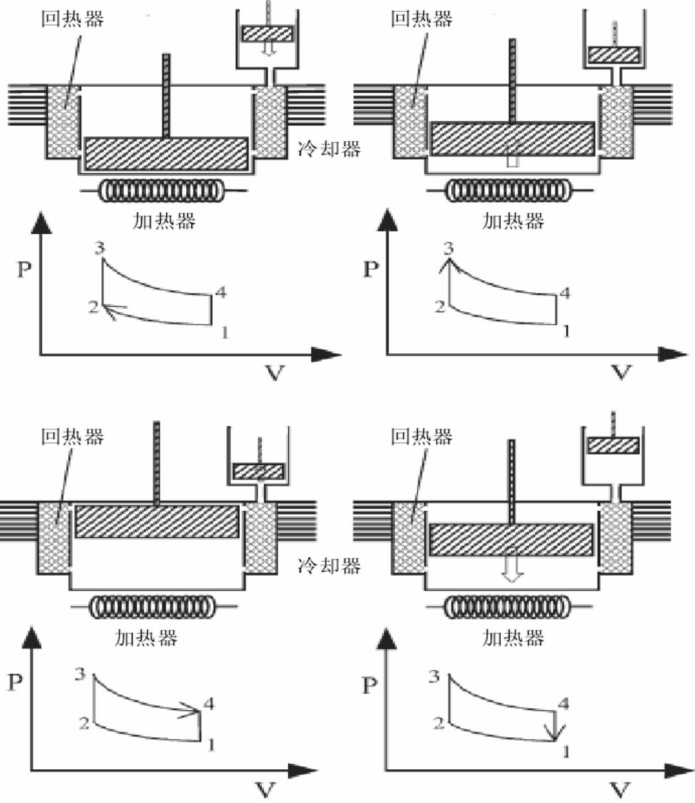  
图 2.1 斯特林循环工作过程示意图

**4.等容冷却过程**

在这一过程中，压缩活塞从其外止点移动到内止点，同时膨胀活塞从其内止点移动到外止点，结果将膨胀腔中的工质全部驱入压缩腔，在流经回热器时，回热器从工质中吸走热能 $\mathrm { Q } _ { \mathrm { R } } ^ { } { ' }$ ，使工质温度从最高循环温度 $\mathrm { T _ { E } }$ 下降到最低循环温度$\mathrm { T _ { C } }$ 后流入压缩腔。两个活塞作相反运动的结果，使工质在最大容积 $\mathrm { V } _ { 4 } { = } \mathrm { V } _ { 1 }$ 下得到冷却，故叫等容冷却过程。在理想状态下，工质传给回热器的热能 $\mathrm { Q } _ { \mathrm { R } } ^ { } { ' }$ 为

$$
{ \mathcal { Q } } _ { R } ^ { \prime } = C _ { V } \left( T _ { 1 } - T _ { 4 } \right) = C _ { V } \left( T _ { C } - T _ { E } \right)\tag{2-4}
$$

至此，斯特林循环的4个过程全部结束，工质状态回复到循环始点的状态。由式（2-2）和式（2-4）可知，工质与回热器间在一个循环中无热能的得失，即$scriptstyle \mathrm { Q _ { R } = Q _ { R } : = 0 }$ ，也就是说，在等容冷却过程中工质传给回热器的热能 $\mathrm { Q } _ { \mathrm { R } } ^ { \ \prime }$ 在等容加热

过程中将全部传给工质。工质在循环中与外界的热交换仅为 $\mathrm { Q _ { E } }$ 和 $\mathrm { Q _ { C } }$ ，所做的功 $\mathrm { W } { = } \mathrm { W } _ { 1 } { - } _ { 2 } { + } \mathrm { W } _ { 3 } { - } _ { 4 }$ ，即

$$
W = \mathrm { W } _ { _ { 1 - 2 } } + \mathrm { W } _ { _ { 3 - 4 } } = R T _ { _ { E } } \left( 1 - \tau \right) \mathrm { l n } \varepsilon _ { _ { V r } }\tag{2-5}
$$

式中 $\tau = T _ { c } / T _ { E }$ ，循环温度比

$\varepsilon _ { \scriptscriptstyle V r } = V _ { 1 } / V _ { 2 }$ ，容积压缩比

斯特林循环在最高温度 $\mathrm { T _ { E } }$ 下的供热 $\mathrm { Q _ { E } }$ 和在最低温度 $\mathrm { T _ { C } }$ 下的释热 $\mathrm { Q _ { C } }$ ，都是在等温下完成的，满足热力学第二定律对最高热效率的要求，即斯特林循环的循环效率等于卡诺效率。事实上，根据热效率的一般定义，斯特林循环的循环效率$\boldsymbol { \mathsf { \Pi } } \mathfrak { \eta } _ { \mathsf { C } }$ 为

$$
\eta _ { \mathrm { c } } = W / Q _ { E } = 1 - \tau\tag{2-6}
$$

即为卡诺效率，其大小仅决定于循环温度比τ，即确定于循环温度上限 $\mathrm { T _ { E } }$ 和下限 $\mathrm { T _ { C } } ^ { [ 2 2 ] [ 4 3 ] }$

目前，公司正在研制一种非常有前途的斯特林发动机—四缸双曲轴双作用斯特林发动机。图2.2显示了其大致结构。所谓双作用，是指气缸中的活塞既起热活塞的作用，也起冷活塞的作用，活塞一端为热腔，另一段为冷腔。每一个气缸的冷腔都与相邻气缸的热腔相连，并且在其中有冷却器、回热器和加热器，它们组成一个完整的循环系统。这样，四个气缸和四个活塞以及四套热交换器组成了四个完整的闭式循环系统，相当于四个双作用斯特林发动机，但气缸和活塞组的数目却减小了一半，使得其结构大为紧凑，体积和重量大大下降。

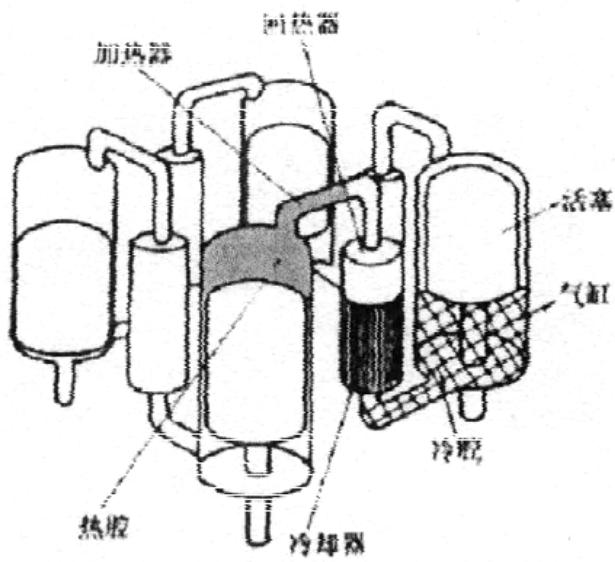  
图 2.2 四缸双作用斯特林发动机

## 2.2 斯特林发动机几种热力循环计算方法的介绍

本节主要讨论斯特林发动机热力循环分析计算的几种方法，分别阐述用于计算斯特林发动机性能的施密特分析法、绝热模型分析法和节点分析法。通过比较，找出研究斯特林发动机热力循环部分较合理的计算方法。

斯特林发动机热力循环分析方法可分为一阶方法、二阶方法和三阶方法等。一阶方法主要是指施密特循环分析法，这种方法假定压缩和膨胀过程是在等温条件下进行的，是一种理想循环的分析方法，我们又称之为理想等温模型分析法。二阶方法主要是指在绝热分析的基础上，考虑因传热和流动引起的损失，这种方法假定压缩和膨胀过程是在绝热条件下进行的。三阶分析方法是一种控制体分析方法，针对控制体直接求解一维控制方程，并在此基础上考虑相关损失，这种方法也称节点分析法[23]。

### 2.2.1 一阶分析法—理想等温模型分析法

#### 2.2.1.1 基本假设

早期斯特林发动机性能分析主要由G·Schmidt提出的施密特循环理论。该理论规定往复件作简谐运动，并作了一些假设：

1.施密特循环是完全的回热过程；

2.系统各处的瞬时压力都相等；

3.不考虑工质泄漏，工质的质量保持不变；

4.在换热器中没有温度梯度；

5.缸壁和活塞温度恒定，附加容积中工质的温度恒定；

6.工作腔容积按正弦变化；

7.工质为理想气体，遵循理想气体状态方程；且作稳定流动。

#### 2.2.1.2 理想等温循环分析

**1. 建模**

考虑如图2.3所示的理想等温斯特林发动机模型，这种模型的等温过程是假定在加热器和冷却器中传热是无限的，因而工质气体在膨胀腔和加热器中总是处于高热源温度 $\mathrm { T _ { h } }$ 不变，在压缩腔和冷却器中总是保持低热源温度 $\mathrm { T _ { k } }$ 不变。

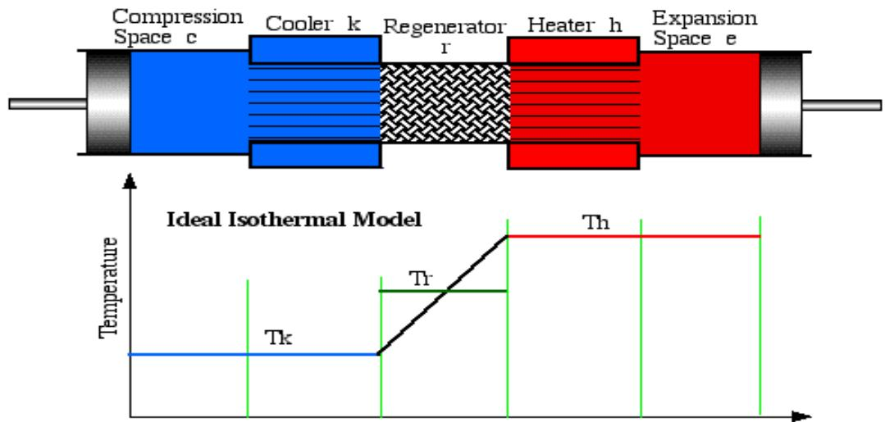  
图 2.3 理想等温循环模型

**2. 循环分析**

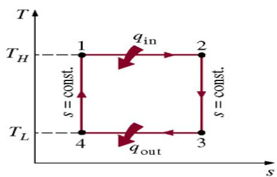

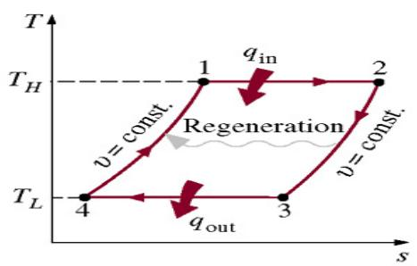

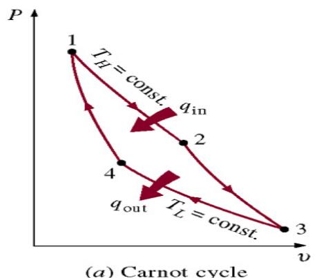

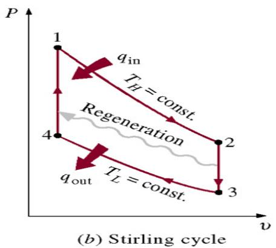  
图2.4 理想等温循环和卡诺循环比较

在理想等温循环模型即施密特循环模型中，（1）工质在压缩腔中等温压缩，循环开始时，工质全部集中在压缩腔中，压缩腔的容积最大，膨胀腔的容积为零。温度为最低温度 $\mathrm { T _ { L } }$ ，工质压力也为最低。随着压缩活塞的移动，系统容积逐渐缩小，工质在压缩腔中受到压缩。如图2.4，容积由 $\mathrm { V } _ { 3 }$ 减小到 $\mathrm { { V } } _ { 4 }$ ，为了在最低循环温度 $\mathrm { { T _ { L } } }$ 下进行等温压缩，压缩热 $\mathrm { Q _ { L } }$ 必须由气缸壁从系统内部逐渐导出，同时外界在整个压缩过程中得向系统做功W。（2）随后膨胀腔容积逐渐增大，压缩腔容积逐渐缩小，压缩腔容积的缩小值等于膨胀腔容积的增大量，系统总容积不变，即 $\mathrm { V } _ { 4 } { = } \mathrm { V } _ { 1 }$ ，过程是等容的。在这一等容过程中，压缩腔的工质被赶到膨胀腔中，工质在到达膨胀腔之前必须先流经回热器并得到回热器的加热，热量 $\mathrm { Q } _ { \mathrm { R } }$ 从回热器传给工质，使工质温度从最低循环温度 $\mathrm { { T _ { L } } }$ 上升到最高循环温度 $\mathrm { T _ { H } }$ 后流入膨胀腔，这一过程称作等容加热过程,同时，压力也由 $\mathrm { P } _ { 4 }$ 上升为 $\mathrm { P } _ { 1 }$ 。（3）接下来工质在膨胀腔中为了实现等温膨胀，即 ${ \mathrm { T } } _ { 1 } { = } { \mathrm { T } } _ { 2 } { = } { \mathrm { T } } _ { \mathrm { H } }$ ，外源必须通过气缸壁向工质供给等温膨胀热 $\mathrm { Q _ { H } }$ ，同时系统向外界做等温膨胀功W，此时膨胀腔中的压力由 $\mathrm { P } _ { 1 }$ 下降到 $\mathrm { P } _ { 2 }$ （如图2.4所示）。（4）最后，将膨胀腔中的工质全部驱入压缩腔，在流经回热器时，回热器从工质中吸走热能 $\mathrm { Q _ { R } } ^ { \prime }$ ，使工质温度从最高循环温度 $\mathrm { T _ { H } }$ 下降到最低循环温度 $\mathrm { { T _ { L } } }$ 后流入压缩腔。此过程工质在最大容积 $\mathrm { V } _ { 2 } { = } \mathrm { V } _ { 3 }$ 下得到冷却，故叫等容冷却过程。

通过比较可以发现：当循环温度的上下限相同时，两种循环的热效率相等，故理想等温循环的效率亦为最高循环效率。

该理论是一种简单而又实用的分析计算方法。这种方法假定压缩和膨胀过程是在等温条件下进行的，是一种理想循环的分析方法。但是，施密特循环分析方法存在一些问题：循环分析中的等温模型在实际中不可能实现，且在分析中没有考虑到实际的循环过程中会伴随有各种流动损失和热损失，使实际的效率比理想等温循环的效率要低。例如是等温压缩和膨胀的施密特循环，则其效率为50%（即卡诺效率)，而对于绝热的压缩和膨胀过程则效率仅为34%。为更加接近实际的分析斯特林发动机的理想循环，把施密特循环做了一些改动，提出了理想绝热模型分析法。

### 2.2.2 二阶分析法—理想绝热模型分析法

#### 2.2.2.1 理想绝热分析的基本假设

1.工质为理想气体；

2.任一瞬时发动机内气体压力不随空间位置变化；

3.工质在流动方向无传热；

4.发动机工质无泄漏；

5.加热壁面温度变化频率与发动机工作频率相比小得多。

#### 2.2.2.2 理想绝热循环分析

**1.建模**

如图2.3所示的理想等温斯特林发动机模型的等温过程是在加热器和冷却器中传热是无限的，而绝热模型(如图2.5)认为，在热膨胀腔和冷压缩腔不发生换热，即换热系数为零；但在加热器和冷却器中的换热率为无限大的，始终处于循环温度 $\mathrm { T _ { h } }$ 和 $\mathrm { T } _ { \mathrm { k } }$ 。气缸中工质的温度变化在循环过程中有变化，并可能高于或低于 $\mathrm { T _ { h } }$ (在膨胀腔)，或者 $\mathrm { T _ { k } }$ (在压缩腔)。因而工质气体在膨胀腔和加热器中有个温度差，在压缩腔和冷却器同样也有温度差。

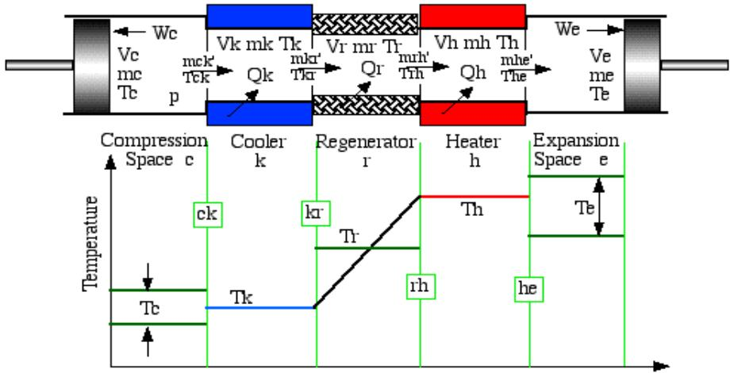  
图 2.5 理想绝热循环模型

**2.循环分析**

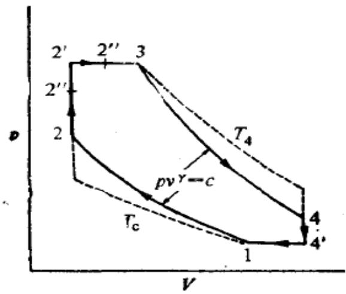  
图 2.6 理想绝热循环

在理想绝热循环模型中，假设压缩和膨胀是绝热的（无热交换）而不是前面所假设的等温过程。该循环示于图2.6。实际发动机很难做到等温压缩和等温膨胀，这些过程通常是多变过程。但是对于目前的理想化分析，用绝热过程取代多变过程，一般是可以满足要求的。具体循环过程为：（1）工质在压缩腔中的压缩过程为绝热过程，温度为最低温度Tc，工质压力也为最低。随着压缩活塞的移动，系统容积逐渐缩小，工质在压缩腔中受到压缩（如图2.6），容积减小，气缸内的压力增大。（2）随后压缩腔的工质被赶到膨胀腔中，工质在到达膨胀腔之前必须先流经回热器并得到回热器的热量，由于不完全回热，回热过程被分为部分等容$2 \sim 2 ^ { \prime }$ 和部分等压 $2 ^ { \prime } \sim 3$ ，工质被回热加热到 $T _ { 2 } ^ { ' }$ ,循环热进一步供给工质温度增加到$T _ { 3 }$ 。（3）接下来工质在膨胀腔中等温膨胀，此时膨胀腔中的压力下降。（4）最后，将膨胀腔中的工质全部驱入压缩腔，在流经回热器时，不完全回热过程又经历一个部分等容4\~4′和部分等压4′\~1的过程。在整个绝热循环中，由于气缸壁间的导热损失、气体流经回热器时，由于回热器复杂的丝网结构，使得工质在回热器中由于压降产生气体流动损失、机械摩擦损失、不完全回热损失等等。正是由于考虑到这些损失的存在，使得理想绝热分析法比理想等温分析法更接近实际的循环过程。

二阶分析方法主要是假定压缩和膨胀过程是在绝热分析的基础下进行的，热量传递在换热器中进行。对于实习公司研制的四缸双曲轴双作用斯特林发动机拥有四个气缸同时做功，但是各个气缸的做功原理和计算方法都是相同的，与单缸的斯特林发动机没有区别，只不过相邻的气缸间存在90°的相位领先角。其次，四缸双曲轴双作用斯特林发动机为了结构上的紧凑，用活塞将气缸分成了冷腔和热腔，这是它与单缸斯特林发动机的主要区别。相邻的冷腔和热腔产生了单缸发动机工作时不存在的热损失。这些新出现的热损失成为影响发动机性能的重要达素。在计算发动机性能的过程中，必须对其进行认真分析。

### 2.2.3 三阶分析法—节点分析法

#### 2.2.3.1 节点法分析模型

**1.建模**

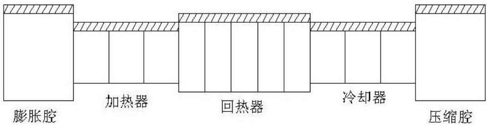  
图 2.7 节点分析模型

如图2.7所示，斯特林发动机用图示模型来表示。模型由五部分组成，即膨胀腔、加热器、回热器、冷却器和压缩腔。把这五部分的工作区进行控制体划分，膨胀区和压缩区各自为一个控制体，其体积是随时间变化的；加热器和冷却器各分成3个控制体，回热器分了5个控制体，这些控制体体积不变，但有热量通过壁面流进或流出。因为回热器里的结构相当复杂，理论上回热器划分的控制体数是越多越好，但考虑到计算时间与计算复杂性，可以做一些折中处理[24]。

#### 2.2.3.2 模型主要假设

（1）流动是一维的；

（2）发动机工质无泄漏；

（3）回热器回热是完善的；

（4）不考虑工质流动过程中的动能。

**2.实际循环**

在任何实际发动机中，由于各种因素的影响，都会使热效率远远低于理想循环的卡诺效率值。实际的热效率可以规定为理论卡诺效率的一部分。由于无益容积的存在，在工质从冷腔流到热腔的流动过程中，压力变化幅度减小，导致输出功率下降。发动机活塞的运动实际上是连续的，不可能间断运动，因此它明显的偏离理想状态。这样就导致斯特林发动机实际循环的四个过程没有明确的界限，即P-V图是一条光滑的封闭曲线（如图2.8所示）。

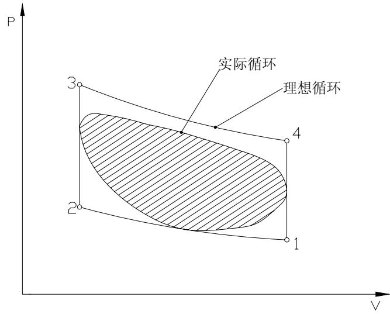  
图 2.8 斯特林理想循环与实际循环的 P-V 图

斯特林发动机的压缩过程和膨胀过程实际也不是等温的，发动机冷腔工质的平均温度高于理想循环的 $\mathrm { { T _ { L } } }$ 热腔工质的平均温度低于理想循环的 $\mathrm { T _ { H } } ,$ ，因此，冷腔的压缩功增大，热腔的膨胀功增大，导致发动机的功率和效率都下降。发动机的实际循环还存在各种损失，包括导热损失、穿梭损失、排气损失、热交换温差热损失、回热损失等。

发动机从热腔到冷腔存在温度梯度，因此，气缸壁以及其他从热区到冷区的导热途径必然存在导热损失。

活塞在气缸中作往复运动，由于活塞和气缸都具有温度梯度，因而就会发生穿梭传热损失。

上面导热损失和穿梭传热损失主要取决于发动机的温度水平，与转速和工质的压力关系不大。

在实际发动机中，由于排气会造成排气损失，因此排气带走的热量没有进入循环系统。排气损失随着对发动机供热量的增大而增加。

在理想循环中假定加热器或冷却器与工质的传热是完全的，实际上是不可能的，工质与换热器壁面必然存在温度差。在加热器中，工质温度低于壁面温度，在冷却器中则相反，工质温度高于壁面温度。由于换热器的传热量随着发动机功率升高而增大，因此这种热交换温差热损失也随着发动机的转速、工质的压力升高而增大。

回热器的有效性取决于回热器基体的热容量和通过回热器的工质热容量之比。回热器基体的热容量是有效的，而且工质的热容量不可能为零，因此发动机的回热是不完善的，造成回热损失。当工质压力升高或发动机转速提高，工质的热容量增大，导致回热器的回热损失增大。

排气损失、热交换温差热损失、回热损失随着发动机转速和工质压力的增大 而增大。

理想循环假定工质是理想气体，但实际上气体在流动过程中必然存在流动阻力损失，这表现为工质通过加热器、回热器、冷却器等通道时，工质压力的变化幅值会下降。工质流动阻力损失与工质压力、工质流速的平方成正比。工质流动阻力损失造成发动机功率和效率下降。

## 2.3 斯特林发动机几种分析计算方法的比较

斯特林发动机的分析计算数值模拟中，人们作了很多的努力，创立了不少循环性能的分析计算法，但由于热气机闭式循环系统的循环特性的复杂性，至今还没有一种公开发表的且为公众接受的通用计算法。在这些计算法中，最复杂的是节点分析法。从节点分析法建立模型中可以看出，它将所研究的控制体进行化分，划分的越细，越接近实际循环；在绘制出的P-V图就表现出一个连续的、没有明确分界的封闭曲线。然而由于工质的流阻系数和换热系数的局限性，这种复杂而又费时的节点分析法反而没有普遍使用价值。因为方程的一般分析解太复杂，因而需要用时间步进微量增值法进行数值求解，用经验公式进行简化后结果又不够精确，所以，在初步设计阶段更无使用价值。施密特循环分析法是理想等温模型分析法，认为发动机循环过程中压缩腔和膨胀腔保持恒温不变。但是此循环分析中的等温模型在实际中不可能实现，未计及相关热损失，所以，计算值往往比实际值偏高。当前不少学者和有经验的设计大师认为理想绝热模型分析法的实用价值较大，并推广使用。理想绝热模型分析法首先利用施密特循环对斯特林发动机作简单分析，然后利用理想绝热模型分析法分析斯特林发动机理想循环，最后，在理想绝热模型的基础上计算发动机的损失，在此基础上计算发动机相关性能参数，结果的精度较符合实际值。绝热循环计算需用数学计算机，何况计算机现在已为广大工程技术人员所掌握和运用。尽管绝热循环与实际情况还有一定的距离，但比等温循环总是好的多。与节点分析法相比，他的计算费用和时间要少得多。这方面的情况读者可以查李的论文（Lee，1976）以及廖斯、库瓦尔和史密斯的文

章[5] [2] [27]。

## 2.4 本章小结

本章通过对斯特林发动机工作原理的介绍和3种热力循环计算方法的简单介绍、分析和比较，找出较适合碟式斯特林发动机热力循环部分的计算方法——绝热分析法。相比之下，它在研究斯特林发动机性能上是最可取的。

# 第3章 斯特林发动机性能模拟优化方法—理想绝热模型分析法

本章主要讨论斯特林发动机性能模型优化方法—理想绝热模型分析法。斯特林发动机的性能主要是指发动机的功率和效率两个方面。本章对斯特林发动机建立合理的数学模型，阐述用于计算斯特林发动机性能的理想绝热模型分析法，列出符合条件的微分方程组。并且考虑到实际工况，斯特林发动机的实际循环存在着各种损失，这些损失主要分为两大类：压缩损失和热量损失。本章在此只分析其中影响最大的压缩损失、回热器热量损失、活塞往复热损失这三种损失。

## 3.1 理想绝热分析法

在斯特林发动机出现半个世纪后，施密特对斯特林循环做了初步经典的理论分析，称为施密特分析法，它是其它一些更加准确的分析方法的基础。后来为更加接近实际分析，采用绝热分析法。同时考虑因传热和流动引起的损失，这种方法假定压缩和膨胀过程是在绝热条件下进行的。

### 3.1.1 理想绝热法模型的建立

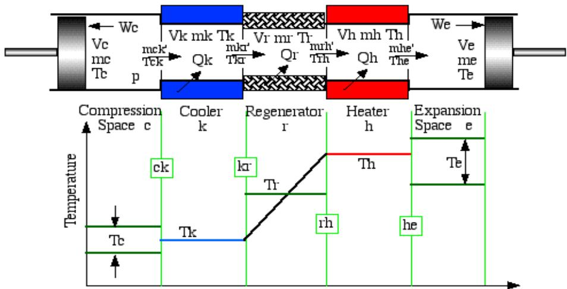  
图 3.1 理想绝热循环模型

用c、k、r、h、e表示压缩腔、冷却器、回热器、加热器、膨胀腔，此外用ck、kr、rh、he分别表示压缩腔和冷却器、冷却器和回热器、回热器和加热器、加热器和膨胀腔之间的交接面。用温度T和质量流量m'来表示交界面之间的热量和质量的传递。

由于压缩腔和膨胀腔是绝热的，所以其中温度Tc和Te在一个范围中变化，由具体的绝热过程决定而无法直接确定。这样压缩腔和冷却器、加热器和膨胀腔之间的交接面上的温度Tck和The就由工质的流向决定如下：

$$
\mathrm { \ddag { \begin{array} { l } { \mathrm { ~ \ddag ~ { \cdot } ~ } \mathrm { ~ \ m c k ^ { \prime } > 0 ~ \iiint ~ T c k = T c ~ \mathrm { \bf ~ \stackrel { \triangledown ~ } { \ H } ~ } } ~ \mathrm { \bf ~ T c k = T k } } \end{array} } }
$$

$$
\begin{array} { r } { \mathrm { ~ \ddag ~ { \ddag } ~ { \ m h e ^ { * } > 0 } ~ \iiint ~ { \mathrm { ~ T h e = T h } } ~ \mathrm { ~  ~ \mathfrak { \lesssim ~ } \iiint ~ { \lvert \mathrm { T h e = T e } } ~ } } } \end{array}
$$

而冷却器和回热器、回热器和加热器之间的交接面上的温度Tkr和Trh，由图 3.1 可以看出分别等于冷却器温度 Tk和加热器温度 Th。这是由于加热器和冷却器是等温的这一条件决定的。回热器中的温度仍然假设按直线规律变化，采用回热器有效温度 $T _ { r } = ( T _ { h } - T _ { k } ) / \ln ( T _ { h } / T _ { k } )$ 进行计算[28]。

**模型基本假设条件**

1. 工质为理想气体；

2.任一瞬时发动机内气体压力不随空间位置变化；

3.工质在流动方向无传热；

4.在循环过程中工质的质量保持不变，工质没有泄漏；

5. 缸壁、活塞以及死容积中的工质的温度恒定；

6.加热壁面温度变化频率与发动机工作频率相比小得多；

7.循环系统初始化下热腔与加热器内工质温度相等，冷腔与冷却器内工质温 度相等。

### 3.1.2 理想绝热模型分析

斯特林发动机中的热量传递通过强迫对流换热完成，热量在加热器中从外部热源传到工质，在回热器中利用循环积累和回收，最后在冷却器中通过工质排出到外界。实际情况下斯特林发动机工质的流动状态十分复杂，为使分析简化，假设流体在循环的任一瞬时呈现稳态流动。

根据如图3.2所示的一般换热模型（Generalised cell）推导能量方程，热量通过进口流量mi'和温度Ti流入系统，再通过出口流量 $\mathbf { m o ^ { \prime } }$ 和温度To流出系统。该模型的能量方程可以表述为：进入单元体的热量+传入单元体的热量=对环境做功+单元体内能增加量。

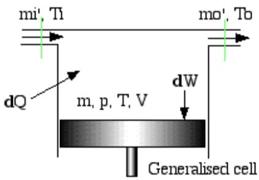  
图 3.2 一般换热模型

利用各个参量对曲轴转角θ的导数可以列出对于该模型的能量交换方程：

$$
d Q + ( C p \cdot T i \cdot m i ^ { \ast } - C p \cdot T o \cdot m o ^ { \ast } ) = d W + C \nu \cdot d ( m \cdot T )\tag{3-1}
$$

这里的 $d Q , d W , d ( m \cdot T )$ 表示的都是各参量对曲轴转角θ的导数，即 $d Q / d \theta$ 等等，本章以下部分都用这种表示方法， $C p , C _ { V }$ 分别是工质的定压比热容和定容比热容[29]。

由于斯特林发动机中工质的工作过程距离其临界点还很远，所以假设工质是理想气体。可以在发动机五个部分中分别使用状态方程及其微分形式：

$$
\begin{array} { l } { p V = m R T } \\ { \displaystyle d p \bigg / _ { p ^ { + } } d V \bigg / _ { V } = d m \bigg / _ { m ^ { + } } d T \bigg / _ { T } } \end{array}\tag{3-2}
$$

由工质总质量守恒： $m _ { c } + m _ { k } + m _ { r } + m _ { h } + m _ { e } = M$

得到： $p ( V _ { c } / T _ { c } + V _ { k } / T _ { k } + V _ { r } / T _ { r } + V _ { h } / T _ { h } + V _ { e } / T _ { e } ) / R = M$

即有循环瞬时压力：

$$
p = M R / ( V _ { c } / T _ { c } + V _ { k } / T _ { k } + V _ { r } / T _ { r } + V _ { h } / T _ { h } + V _ { e } / T _ { e } )\tag{3-3}
$$

这里 $T _ { r }$ 是回热器平均有效温度： $T _ { r } = ( T _ { h } - T _ { k } ) / \ln ( T _ { h } / T _ { k } )$

质量守恒方程求微分可得：

$$
d m _ { c } + d m _ { k } + d m _ { r } + d m _ { h } + d m _ { e } = 0\tag{3-4}
$$

对于所有热交换器，体积和温度都是常数，即 $d V$ 和 $d T$ 都为零，于是状态方程的微分形式就可以写成： $d m / m = d p / p$ ，即 $d m = d p \cdot m / p = ( d p / R ) \cdot V / T$ 。带入质量守恒微分方程(3-4)可得： $d m _ { c } + d m _ { e } + ( d p \mathrm { { \langle } R \rangle \mathrm { { \cdot } } ( V _ { k } \mathrm { { \langle } } T _ { k } + V _ { r } \mathrm { { \langle } T _ { r } + V _ { h } \mathrm { { \langle } T _ { h } \rangle = 0 } } }$ 。可以看出，只要解出 $d m _ { e }$ 和 $d m _ { c }$ 就可以得到压力变化率 $d p$

考虑如图 3.3 所示的绝热压缩腔 $( \ d Q _ { c } = 0 \quad )$ 根据能量交换方程可以写出：

$$
- C p \cdot T _ { c k } \cdot m _ { c k } \cdot = d W _ { c } + C \nu \cdot d ( m _ { c } \cdot T _ { c } )\tag{3-5}
$$

又由连续性考虑可知，压缩腔中工质气体增加的速率 $d m _ { c }$ 等于流入压缩腔的

质量 $- m _ { c k }$ '，而做功 $d { \boldsymbol { W } _ { c } }$ 等于 $p d V _ { c }$ 。带入理想气体性质： $p V _ { c } = m _ { c } R T _ { c }$ $C p - C \nu = R$ $C p / C \nu = \gamma$ 并进行简化就可以得到 $d m _ { c }$

$$
d m _ { c } = \left( p \cdot d V _ { c } + V _ { c } \cdot d p / \gamma \right) / ( R \cdot T _ { c k } )\tag{3-6}
$$

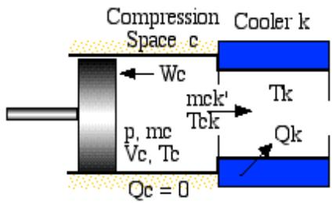  
图 3.3 绝热压缩腔

在膨胀腔中做相似的分析就可以得到 $d m _ { e }$

$$
d m _ { e } = ( p \cdot d V _ { e } + V _ { e } \cdot d p / \gamma ) / ( R \cdot T _ { h e } )\tag{3-7}
$$

把以上得到的 $d m _ { c }$ 和 $d m _ { e }$ 带入质量守恒方程就可以解出发动机循环瞬时压力的变化率 $d p$

$$
d p = \frac { - \gamma \cdot p \cdot ( d V _ { c } / T _ { c k } + d V _ { e } / T _ { h e } ) } { V _ { c } / T _ { c k } + \gamma ( V _ { k } / T _ { k } + V _ { r } / T _ { r } + V _ { h } / T _ { h } ) + V _ { e } / T _ { h e } }\tag{3-8}
$$

对先前的状态方程求积分，可以求得压缩腔和膨胀腔中的温度变化率：

$$
d T _ { c } = T _ { c } \cdot ( d p / \ p + d V _ { c } / V _ { c } - d m _ { c } / m _ { c } )\tag{3-9}
$$

$$
d T _ { e } = T _ { e } \cdot ( d p / \ p + d V _ { e } / V _ { e } - d m _ { e } / m _ { e } )\tag{3-10}
$$

在加热器、回热器和冷却器中温度是保持不变的，所以温度变化率为零，即$d T _ { k } = 0 , d T _ { r } = 0 , d T _ { h } = 0$

对于先前一般换热模型的能量方程，在三个热交换器中使用时，有条件$d W = 0$ 和温度T为常数，带入气体的状态方程就得到：

$$
d Q + ( C p \cdot T _ { i } \cdot m _ { i } \cdot - C p \cdot T _ { o } \cdot m _ { o } \mathbf { \ell } ) = C \nu \cdot T \cdot d m = V \cdot d p \cdot C \nu / R\tag{3-11}
$$

具体的对于三个热交换器可以得：

$$
\begin{array} { r l } & { d Q _ { k } = V _ { k } \cdot d p \cdot C \nu / R - C p \cdot ( T _ { c k } \cdot m _ { c k } ^ { \ast } - T _ { k r } \cdot m _ { k r } ^ { \ast } ) } \\ & { d Q _ { r } = V _ { r } \cdot d p \cdot C \nu / R - C p \cdot ( T _ { k r } \cdot m _ { k r } ^ { \ast } - T _ { r h } \cdot m _ { r h } ^ { \ast } ) } \\ & { d Q _ { h } = V _ { h } \cdot d p \cdot C \nu / R - C p \cdot ( T _ { r h } \cdot m _ { r h } ^ { \ast } - T _ { h e } \cdot m _ { h e } ^ { \ast } ) } \end{array}\tag{3-12}
$$

根据3.1节分析的结果24，热交换器是等温的而回热器是理想状态，于是有$T _ { k r } = T _ { k }$ 和 $T _ { r h } = T _ { h }$ 。于是传热量方程变为：

$$
\begin{array} { l } { d Q _ { k } = V _ { k } \cdot d p \cdot C \nu / R - C p \cdot ( T _ { _ { c k } } \cdot m _ { _ { c k } } ^ { \textrm { * } } - T _ { _ k } \cdot m _ { _ { k r } } ^ { \textrm { * } } ) } \\ { d Q _ { r } = V _ { r } \cdot d p \cdot C \nu / R - C p \cdot ( T _ { _ k } \cdot m _ { _ { k r } } ^ { \textrm { * } } - T _ { _ h } \cdot m _ { _ { r h } } ^ { \textrm { * } } ) } \\ { d Q _ { h } = V _ { _ h } \cdot d p \cdot C \nu / R - C p \cdot ( T _ { _ h } \cdot m _ { _ { r h } } ^ { \textrm { * } } - T _ { _ h e } \cdot m _ { _ { h e } } ^ { \textrm { * } } ) } \end{array}\tag{3-13}
$$

可以算出压缩腔和膨胀腔中的做功量和循环效率：

$$
\begin{array} { l } { { W = W _ { c } + W _ { e } } } \\ { { d W = d W _ { c } + d W _ { e } } } \\ { { d W _ { c } = p \cdot d V _ { c } } } \\ { { d W _ { e } = p \cdot d V _ { e } } } \\ { { \eta = W / W _ { e } } } \end{array}
$$

得到理想绝热模型分析的全部方程，总结如下：

$$
\begin{array} { r l } & { V = \mathcal { W } _ { 2 } ^ { \prime } ( \theta , \phi ^ { \prime } , \phi ^ { \prime } , \theta ^ { \prime } ) } \\ & { + \mathcal { W } _ { 3 } ^ { \prime } ( \theta , \phi ^ { \prime } , \phi ^ { \prime } ) } \\ & { + \mathcal { W } _ { 3 } ^ { \prime } ( \theta , \phi ^ { \prime } , \phi ^ { \prime } ) } \\ & { \cdots \mu _ { 2 } ^ { \mathcal { N } } ( \theta , \phi ^ { \prime } , \phi ^ { \prime } ) } \\ & { \cdots \mu _ { 3 } ^ { \mathcal { N } } ( \theta , \phi ^ { \prime } , \phi ^ { \prime } ) } \\ & { \cdots \mu _ { 4 } ^ { \mathcal { N } } ( \theta , \phi ^ { \prime } , \phi ^ { \prime } ) } \\ & { \cdots \mu _ { 4 } ^ { \mathcal { N } } ( \theta , \phi ^ { \prime } , \phi ^ { \prime } ) } \\ & { \cdots \mu _ { 5 } ^ { \mathcal { N } } ( \theta , \phi ^ { \prime } , \phi ^ { \prime } ) } \\ & { \cdots \mu _ { 6 } ^ { \mathcal { N } } ( \theta , \phi ^ { \prime } ) } \\ & { \cdots \mu _ { 7 } ^ { \mathcal { N } } ( \theta , \phi ^ { \prime } ) } \\ & { \cdots \mu _ { 7 } ^ { \mathcal { N } } ( \theta , \phi ^ { \prime } ) } \\ & { \cdots \mu _ { 7 } ^ { \mathcal { N } } ( \theta , \phi ^ { \prime } ) } \\ & { \cdots \mu _ { 7 } ^ { \mathcal { N } } ( \theta , \phi ^ { \prime } ) } \\ & { \cdots \mu _ { 7 } ^ { \mathcal { N } } ( \theta , \phi ^ { \prime } ) } \\ & { \cdots \mu _ { 1 1 } ^ { \mathcal { N } } ( \theta , \phi ^ { \prime } ) } \\ & { \cdots \mu _ { 1 1 } ^ { \mathcal { N } } ( \theta , \phi ^ { \prime } ) } \\ & { \cdots \mu _ { 1 2 } ^ { \mathcal { N } } ( \theta , \phi ^ { \prime } ) } \\ &  \cdots \mu _ { 1 3 } ^ { \mathcal { N } } ( \theta , \end{array}\tag{3-14}
$$

若 mck' > 0 则 Tck = Tc 否则 Tck = Tk

若 mhe' > 0 则 The = Th 否则 The = Te

$$
\begin{array} { r l } & { d T _ { c } = T _ { c } \cdot ( d p / \ p + d V _ { c } / V _ { c } - d m _ { c } / \ m _ { c } ) } \\ & { d T _ { c } = T _ { c } \cdot ( d p / \ p + d V _ { c } / V _ { c } - d m _ { c } / \ m _ { c } ) } \\ & { d Q _ { s } = V _ { c } \cdot d p \cdot C v / R - C p \cdot ( T _ { c } \cdot m _ { c } \cdot T _ { c } \cdot m _ { s } \cdot T _ { s } \cdot m _ { s } \cdot ) } \\ & { d Q _ { s } = V _ { c } \cdot d p \cdot C v / R - C p \cdot ( T _ { c } \cdot m _ { c } \cdot T _ { s } \cdot m _ { s } \cdot \ P _ { c } \cdot m _ { s } \cdot ) } \\ & { d Q _ { s } = V _ { k } \cdot d p \cdot C v / R - C p \cdot ( T _ { s } \cdot m _ { c } \cdot T _ { u } \cdot m _ { s } \cdot m _ { s } \cdot ) } \\ & { d W _ { c } = p \cdot d V _ { c } } \\ & { d W _ { v } = p \cdot d V _ { c } } \\ & { d W = d W _ { c } + d W _ { c } } \\ & { H = W _ { c } + \hat { W _ { c } } } \\ & { \eta = W / W _ { s } } \end{array}\tag{3-15}
$$

通过分析求解这些方程，就可以得到理想绝热模型的各循环参数在循环中的变化情况。

## 3.2 损失计算

### 3.2.1 斯特林发动机实际循环

斯特林发动机的实际循环和理想循环有很大的差异，主要有以下几个方面：

1.由于加热器、冷却器和工质之间的热交换率不可能是无穷大，工质在流动过程中不可能达到加热器和冷却器的壁面温度。

2.外热源不仅在工质从回热器流向膨胀腔的过程中对工质加热，而且在工质从膨胀腔流向回热器的过程中也对工质加热。在冷却器中也有相似现象。

3.回热器工作时存在回热器不完善损失以及工作零件的温度逸散等损失也减小了发动机的可用能量。

4.工质在三个热交换器中的流动会造成流动损失。

5. 由于机械部件之间摩擦的存在，会产生机械损失。

综合以上实际工况的存在，斯特林发动机的实际循环存在着各种损失，这些损失主要分为两大类：压缩损失和热量损失，其中热量损失又可以分为回热器热量损失、活塞往复热损失、活塞壁的热传导损失、气缸壁的导热损失、回热器壁的导热损失、泵气损失、回热器芯的导热损失等。本文在此只分析其中影响最大的压缩损失、回热器热量损失、活塞往复热损失这三种损失。

### 3.2.2 活塞往复热损失

配气活塞的一端处于加热器，另一端处于冷却器，两端具有Th-Tk的温差，因而配气活塞的往复运动必将不断的将气缸中高热部分的热量传至低热部分，造成热量损失。其基本原理可以用图3.4表示。

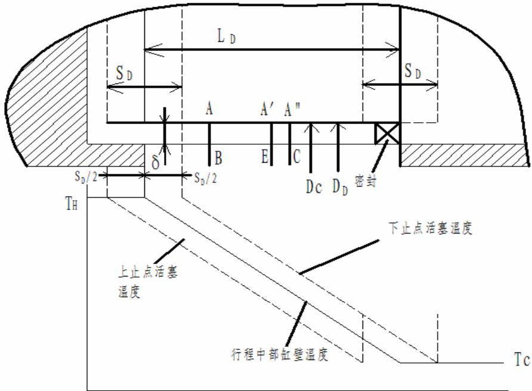  
图 3.4 活塞往复热损失示意图

设在活塞中央的壁上有一点A，当活塞在上止点附近时，由于缸壁温度高于活塞温度，在点A相应的点B处，将向A传热，设传热量为 $Q _ { s h }$ 。当活塞向下运动时，在行程 $S _ { D }$ 的二分之一处，活塞壁和气缸壁的温度一致，此时他们之间无热交换。当活塞继续运动到下止点时，点A处的温度高于缸壁邻近点C的温度，热量 $Q _ { s h }$ 由活塞壁传至气缸。这样，由于活塞的往复运动，热量从气缸热端通过气隙，径向地传给活塞壁，然后又通过气隙从活塞径向地传给气缸壁的冷端。显然可以发现，传热的最大轴向距离BC就是活塞的行程 $S _ { D }$ 。如果活塞长度是$L _ { D }$ ，缸壁和活塞的温差为 $\Delta T = ( T _ { h } - T _ { k } ) / L _ { D }$ 。在这一温差下，每半个循环通过工质的径向传热量为： $Q _ { s h } = K _ { g } \cdot A \cdot { \frac { \Delta T } { \delta } } \cdot \Delta t$ ，式中， $A = \pi \cdot D _ { c } \cdot L _ { D } \quad , \ D _ { c }$ 是活塞直径， $K _ { g }$ 是工质的导热率 $K _ { g } = \exp ( A + B \ln T _ { r } )$ $T _ { r }$ 是回热器平均温度，本章采用工质是氢气，A=-11.004，B=0.8130， $\delta$ 是气隙长度，Δt是循环时间的一半， $\Delta t = 1 / ( 2 f r e q )$ $f r e q$ 是循环频率。化简后可得：

$$
\mathcal { Q } _ { s h } = K _ { g } \cdot \pi \cdot D _ { c } \cdot S _ { D } \cdot \frac { T _ { h } - T _ { k } } { 4 \cdot f r e q \cdot \delta }\tag{3-16}
$$

于是可得一个循环的活塞往复热损失： $ { Q _ { s H } } = 2  { Q _ { s h } } \qquad ^ { [ 3 0 ] }$

### 3.2.3 压缩损失

在施密特循环和理想绝热循环模型中都认为发动机内部各处瞬时循环压力相等，实际情况下，由于流体的粘性而产生的流动摩擦阻力会导致发动机内部存在压力降。这种压力降将使发动机输出功降低。

热交换器中的压力降和其中工质的流动阻力有关，本文分析采用的发动机模型假设工质流体始终是一维流动。可是牛顿粘性定律认为流体不同层面间的剪切力与这些层面上垂直于流动方向的速度梯度（du/dz）成比例（如图3.5示）。这显然和一维流动假设相矛盾，因为由图3.5中公式可知要想维持剪切力，流体必须是二维的。为了解决这个矛盾，假设斯特林发动机中流体不是严格的一维流动但是可以用其平均质量流量来分析计算。

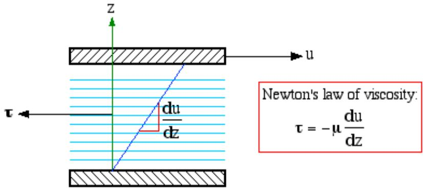  
图 3.5 牛顿粘性定律示意

在热交换器中，流动摩擦阻力和流动剪切力之间的关系是：

$$
F = \tau \cdot A w g\tag{3-17}
$$

这里Awg是热交换器中的湿面积。

为了分析压降损失，引入水力直径（hydraulic diameter）的概念：$d = 4 V / A w g$ ，这里V是热交换器的落空容积。这样，流动摩擦力就可以表示为：

$$
F = 4 \tau V \mathrm { ~ / ~ } d\tag{3-18}
$$

再定义摩擦阻力系数 $c _ { f }$ ，它表示工质流动剪切力和流动动能（dynamichead）的商： $C f \equiv \frac { \tau } { \frac { 1 } { 2 } \rho u ^ { 2 } }$ ，这样就可以把摩擦力表示为：

$$
F = 2 \cdot C f \cdot \rho \cdot u ^ { 2 } \cdot V / d\tag{3-19}
$$

根据前面所述的准稳态流动假设，流动中不受任何其他外力，流动摩擦力只和压力降有关，且方向和压力降相反，即： $F + \Delta p \cdot A = 0$ ，其中A是流通面积。

再带入以上得到的摩擦力表达式，就得到：

$$
\Delta p + 2 \cdot C f \cdot \rho \cdot u ^ { 2 } \cdot V / ( d \cdot A ) = 0\tag{3-20}
$$

这个式子里 $\Delta p$ 根据工质流向可正可负，但是第二项永远是正的，这样对于逆向流动就无法满足。为了解决这个矛盾，定义“雷诺摩擦系数（ReynoldsFrictionCoefficient）”（Cref）。它等于雷诺数和摩擦阻力系数的乘积：$C r e f = \mathbf { R e } { \cdot } C f$ 。其中雷诺数 Re 为： $\mathrm { R e } = \rho u d / \mu$ 与流向无关。于是得到：

$$
\Delta p = \frac { - 2 \cdot C r e f \cdot \mu \cdot u \cdot V } { d ^ { 2 } \cdot A }\tag{3-21}
$$

其中，雷诺摩擦系数Cref与雷诺数的关系是：

若 Re<=2000 则：

$$
\begin{array} { r l } { C r e f { = } 1 6 } & { { } ~ ( ~ \sqrt { \frac { 1 } { { \sum } } } \sqrt { \frac { 2 } { { \mathcal { \mu } } _ { \mathrm { L } } } } ) } \end{array}\tag{3-22}
$$

若2000<Re<=4000 则：

$$
C r e f = 7 . 3 4 3 \times 1 0 ^ { - 4 } ~ \mathrm { R e } ^ { 1 . 3 1 4 2 } ( \mathrm { i } \pm \infty / \hbar ^ { \pm } ) / \hbar \stackrel {  } { \Omega ^ { \pm } } )\tag{3-23}
$$

若 Re>4000 则：

$$
\begin{array} { r l r } { C r e f = 0 . 0 7 9 1 \mathrm { { R e } } ^ { 0 . 7 5 } } & { { } } & { ( \it { \dot { \eta } } _ { \mathrm { { i f f l } } } ^ { \mathrm { { a H } } } \dot { \ y } _ { \mathrm { { I L } } } ^ { \mathrm { { 2 } } } ) } \end{array}\tag{3-24}
$$

$\mu$ 是工质的粘性系数， $\mu = [ 8 8 . 7 3 + 0 . 2 0 0 \times ( T _ { r } - 2 9 3 ) + 0 . 1 1 8 p _ { m } ] \times 1 0 ^ { - 7 } \quad \mathrm { k g / ( m . s ) } )$ O这里 $T _ { r }$ 是回热器平均有效温度， $p _ { m }$ 是循环平均压力（Mpa）。

u是工质流速， $u = m / ( \rho A )$ ，A是流通面积， $\rho = p / ( R T )$ 是工质的密度，R是气体常数。

热交换器内由于压降引起的做功损失可计算为：

$$
W _ { _ { \Delta p } } = \frac { \omega } { 2 \pi } \oint \Delta P d V _ { c }\tag{3-25}
$$

其中，ω—角速度； $d V _ { c }$ —压缩腔体积变化[30]。

### 3.2.4 回热器损失

#### 3.2.4.1 回热器效率和发动机循环效率的关系

用回热器效率来衡量回热器的质量优劣，一般回热器效率定义为：

ε=实际情况下单次流动中工质和回热器之间的焓交换/在理想回热器中单次 流动中工质和回热器之间的焓交换。

不过这种定义在斯特林发动机的使用中并不适用，斯特林发动机的回热器效率定义为：

ε=实际情况下单次流动中工质和回热网阵之间的热量交换/在理想回热器中 单次流动中工质和回热网阵之间的热量交换。

基于这样的定义，回热器的效率ε为1时表示理想绝热模型的理想回热器，为0表示没有回热活动。

理想绝热循环可以表示为： $\eta _ { i } = W _ { i } / \mathcal { Q } _ { h i } = ( \mathcal { Q } _ { k i } + \mathcal { Q } _ { h i } ) / \mathcal { Q } _ { h i }$ 这里的 i表示理想状况， $Q _ { k i }$ 是负值。如果用 $Q _ { r i 1 }$ 表示单次流动中回热器中的热量交换，考虑回热器的传热损失后，实际在加热器中的热量交换就是： $Q _ { h } = Q _ { h i } + Q _ { r i 1 } ( 1 - \varepsilon )$ ，相似的可以得到在冷却器中的热量交换为： $Q _ { k } = Q _ { k i } - Q _ { r i 1 } ( 1 - \varepsilon )$

实际的循环效率是： $\eta = W / \mathcal { Q } _ { h } = ( \mathcal { Q } _ { h } + \mathcal { Q } _ { k } ) / \mathcal { Q } _ { h }$ ，带入以上得到的热量交换，得到：

$$
\eta = \frac { \eta _ { i } } { 1 + ( \displaystyle \frac { Q _ { r i 1 } } { Q _ { h i } } ) ( 1 - \varepsilon ) }\tag{3-26}
$$

经过实际分析可以知道，对于高效率的回热器，1%的回热器效率下降将造成超过5%的热效率下降，如果回热器的效率为0.8则循环热效率将下降到30%左右。回热器效率对发动机热效率影响十分明显，因此需要仔细对其衡量。

#### 3.2.4.2 回热器效率分析

从通过回热器的工质的温度考虑来计算回热器效率，假设回热器中温度成线性变化，而且在高温端和低温端温度差ΔT是相同的，这样就可以得到图3.6中所示的回热器效率计算公式。整理后可得：

$$
\varepsilon = \frac { 1 } { 1 + \displaystyle \frac { 2 \Delta T } { T _ { h 1 } - T _ { h 2 } } }\tag{3-27}
$$

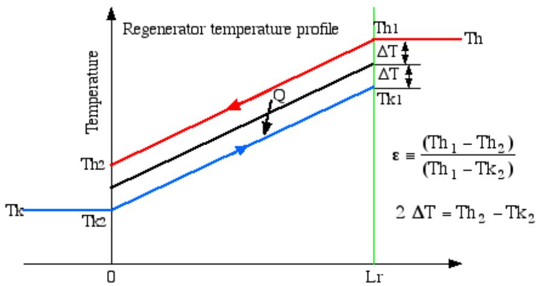  
图 3.6 回热器温度分布

在回热器中热量由回热网阵传递给工质导致工质的内能增加，表示如下：

$$
\overset { \bullet } { Q } = C p \cdot \dot { m } \cdot ( T _ { h 1 } - T _ { h 2 } ) = 2 \cdot h \cdot A w g \cdot \Delta T\tag{3-28}
$$

这里 $\dot { Q }$ 是热量的传输功率，h是平均换热系数，Awg是回热器湿面积， $\mathrm { C _ { p } }$ 是

定压比热容， $\dot { \mathbf { \Omega } _ { m } }$ 是工质在回热器中的质量流量。这样回热器效率就可以表示为：

$$
\varepsilon = { \cfrac { 1 } { 1 + { \cfrac { C p \cdot { \dot { m } } } { h \cdot A w g } } } }\tag{3-29}
$$

引入在热交换器效率计算中常用的参数“传输单位数（Number ofTransferUnits ) "NTU :

$$
N T U \equiv \frac { h \cdot A w g } { C p \cdot \dot { m } }\tag{3-30}
$$

于是回热器效率就表示成：

$$
\varepsilon = { \frac { N T U } { 1 + N T U } }\tag{3-31}
$$

为了计算NTU数，利用无量纲数斯坦顿数St， $S t = \boldsymbol { h } / ( \boldsymbol { \rho } \cdot \boldsymbol { u } \cdot \boldsymbol { C p } )$ ，其中， $\rho$ 是工质密度，u是工质流速，可以通过质量流量求得： $u = m / ( \rho A )$ 。这样就有：

$$
N T U = \frac { S t \cdot A w g } { 2 A }\tag{3-32}
$$

由于斯坦顿数St通常表示单从工质传给回热网阵的热量，而NTU表示从高温工质气体传给回热网阵的热量和从回热网阵传给低温工质的热量之和，因此上式中加了常数2[30]。

### 3.2.5 本章小结

本章主要讨论斯特林发动机性能模型优化方法—理想绝热模型分析法。并且考虑到实际工况，将斯特林发动机的实际循环存在的损失主要分为两大类：压缩损失和热量损失。本章只分析其中影响最大的压缩损失、回热器热量损失、活塞往复热损失这三种损失，通过分析计算的解析式可以看出这些损失与工作环境中的温度和压力是密不可分的。

# 第4章 斯特林发动机热力循环绝热分析法建模方程的求解方法

本章对斯特林发动机热力循环绝热分析数学模型中列出的微分方程，采用四阶龙格—库塔（Runge-Kutta）法对绝热模型的分析方程组进行求解。通过编VB程序，运用计算机可以快速而准确的计算出发动机的相关性能参数。

## 4.1 方程的求解

### 4.1.1 Runge-Kutta 法求解

由于上一章理想绝热模型分析方程组是非线性的微分方程组，因此需要根据发动机具体的组成结构和工作条件，通过输入具体参数在VB环境下解出具体的数值解并绘制相关性能参数的曲线图。在“准稳态流动”（quasi steady-flow）的假设条件下，方程组中的四个质量流量变量在其各自的积分区域保持不变且没有加速度的影响，可以把方程组作为七个相互关联的普通微分方程组成的方程组来求解。

$$
\begin{array} { r l } & { d T _ { c } = T _ { c } \cdot ( d p \ / p + d V _ { c } \ / { V } _ { c } - d m _ { c } \ / { m } _ { c } ) } \\ & { d T _ { e } = T _ { e } \cdot ( d p \ / p + d V _ { e } \ / { V } _ { e } - d m _ { e } \ / { m } _ { e } ) } \\ & { d Q _ { k } = V _ { k } \cdot d p \cdot C \nu \ / { R } - C p \cdot ( T _ { c k } \cdot m _ { c k } \ \cdot { T } _ { k } \cdot m _ { k r } \ \cdot ) } \\ & { d Q _ { r } = V _ { r } \cdot d p \cdot C \nu \ / { R } - C p \cdot ( T _ { k } \cdot m _ { k r } \cdot { T } _ { k } \cdot m _ { r k } \ ^ { \circ } ) } \\ & { d Q _ { h } = V _ { h } \cdot d p \cdot C \nu \ / { R } - C p \cdot ( T _ { h } \cdot m _ { r h } \cdot { T } _ { h e } \cdot m _ { h e } \ \cdot ) } \\ & { d W _ { c } = p \cdot d V _ { c } } \\ & { d W _ { e } = p \cdot d V _ { e } } \end{array}\tag{4-1}
$$

微分方程组可作为一个初值问题来求解，本文采用的是四阶龙格-库塔（Runge-Kutta）法[31]\~[36]。

作为初值问题，已知自变量 $x = x _ { n }$ 时因变量 $y _ { n } = y ( x _ { n } )$ 的值，同时已知y对x 的导数 $y ^ { \prime } { = } f ( x , y )$ 的表达式，求 $x = x _ { n + N }$ 时y的值 $y _ { n + N }$ 。迭代公式如下：

$$
y _ { n + 1 } = y _ { n } + { \frac { 1 } { 6 } } ( k _ { 1 } + 2 k _ { 2 } + 2 k _ { 3 } + k _ { 4 } ) ,
$$

$$
k _ { 1 } = h f ( x _ { n } , y _ { n } ) ,
$$

$$
k _ { 2 } = h f ( x _ { n } + \frac { 1 } { 2 } h , y _ { n } + \frac { 1 } { 2 } k _ { 1 } ) ,
$$

$$
\begin{array} { l } { { \displaystyle k _ { 3 } = h f ( x _ { n } + \frac { 1 } { 2 } h , y _ { n } + \frac { 1 } { 2 } k _ { 2 } ) , } } \\ { { \displaystyle k _ { 4 } = h f ( x _ { n } + h , y _ { n } + k _ { 3 } ) . } } \end{array}\tag{4-2}
$$

### 4.1.2 初始条件

给出计算初始条件如下：

$$
T _ { \mathit { c k } } = T _ { \mathit { c } } = T _ { \mathit { w k } } , T _ { \mathit { h e } } = T _ { \mathit { e } } = T _ { \mathit { w h } } , T _ { \mathit { k } } = T _ { \mathit { w k } } , T _ { \mathit { h } } = T _ { \mathit { w h } }
$$

这里 $T _ { w k }$ 和 $T _ { w h }$ 是冷却器和加热器的壁面温度， $T _ { c k }$ 和 $T _ { h e }$ 分别是压缩腔和冷却器、加热器和膨胀腔交接面上的流通温度。类似于发动机的起动过程，从以上初始条件开始计算，每计算一个循环修正一次 $T _ { c } , T _ { e } , T _ { c k } , T _ { h e }$ 的值，直至这些值收敛，认为循环达到稳态。

### 4.1.3 斯特林发动机稳态循环计算过程

工程中很多的地方用到龙格库塔法求解微分方程的数值解，龙格库塔是很重要的一种方法，尤其是四阶的，精确度相当的高。本章编写VB程序用龙格库塔法来实现解微分方程组，快速、准确的计算出发动机的相关性能参数。如下图4.1是斯特林发动机稳态循环的计算过程。

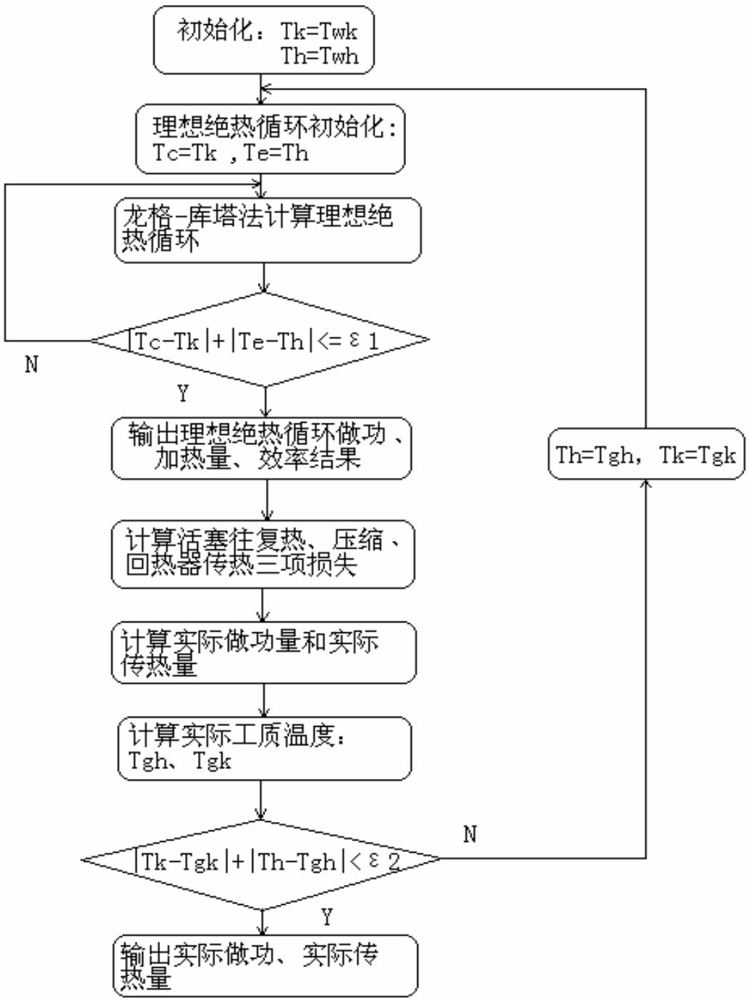  
图4.1 斯特林发动机稳态循环计算程序框图

斯特林发动机稳态循环的分析过程是，首先利用施密特循环对斯特林发动机做简单分析，然后利用理想绝热模型分析法分析斯特林发动机理想循环，最后在理想绝热模型基础上计算发动机损失，在此基础上，计算发动机相关性能参数。发动机各部分的温度分布如图4.2所示：

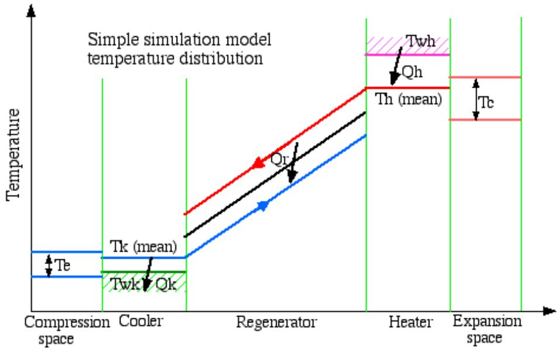  
图4.2 发动机各部分的温度分布

可以看到，实际加热器中的工质平均温度比加热器壁面温度低，而实际冷却器中的工质温度比冷却器壁面温度高。这对于发动机的性能有很明显的影响。本文采用的方法是：假设加热器和冷却器中的工质温度分别等于壁温，计算加热器和冷却器中的热量传递 $Q _ { h }$ 和 $\mathcal { Q } _ { k }$ ，再计算加热器和冷却器中的工质温度。

实际循环中加热器和冷却器中的热量传递是：

$$
\begin{array} { l } { { Q _ { h } = Q _ { h i } + Q _ { s H } + Q _ { s r } - N _ { p h } - \displaystyle \frac { 1 } { 2 } N _ { p r } } } \\ { { \ } } \\ { { Q _ { k } = Q _ { k i } - Q _ { s H } - Q _ { s r } + N _ { p k } + \displaystyle \frac { 1 } { 2 } N _ { p r } } } \end{array} \mathrm { ~ , ~ }\tag{4-3}
$$

其中， $Q _ { h i }$ 和 $Q _ { k i }$ 分别是加热器和冷却器理想传热量； $Q _ { s H }$ 和 $Q _ { s r }$ 分别是活塞往复热损失和回热器热量损失； $N _ { p k }$ $N _ { p h }$ $N _ { p r }$ 分别是冷却器、加热器和回热器中的压缩损失。

再根据对流换热公式

$$
\begin{array} { l l } { { Q _ { h } = h _ { h } \cdot A w g _ { h } \cdot ( T _ { w h } - T _ { g h } ) } } & { { \mathrm { , } } } \\ { { } } & { { } } \\ { { Q _ { k } = h _ { k } \cdot A w g _ { h } \cdot ( T _ { w k } - T _ { g k } ) } } \end{array}\tag{4-4}
$$

变换可得：

$$
\begin{array} { l } { { T _ { g h } = T _ { w h } - Q _ { h } \mathrm { \Omega } / \left( h _ { h } \cdot A w g _ { h } \right) } } \\ { { \ } } \\ { { T _ { g h } = T _ { w k } - Q _ { k } \mathrm { \Omega } / \left( h _ { k } \cdot A w g _ { k } \right) } } \\ { { \ } } \\ { { T _ { g k } = T _ { w k } - Q _ { k } \mathrm { \Omega } / \left( h _ { k } \cdot A w g _ { k } \right) } } \end{array} ,\tag{4-5}
$$

用求得的工质温度 $T _ { g h }$ 和 $T _ { g k }$ 作为原工质温度的修正，再次计算热量传递，

如此循环直至结果收敛，认为达到稳态循环且结果合理。

## 4.2 发动机参数

公司研制的4缸双作用斯特林发动机的基本参数如下。

### 4.2.1 循环参数

1. 循环最大压力， $\begin{array} { r l r } { P _ { \mathrm { m a x } } } & { { } : } & { 2 0 \mathrm { M P a } ; } \end{array}$

2. 热腔工作温度 T1 ：1073K

3. 冷腔工作温度 T2 ： 303K

4. 热腔活塞直径 De ：5.5cm

5. 冷腔活塞直径 Dc ：5.5cm

6. 热腔活塞行程Se：4cm

7. 冷腔活塞行程Sc：4cm

8. 活塞杆直径d：1.2cm

9. 热腔容积变化相对冷腔容积变化的提前角 $\alpha$ $9 0 ^ { \circ }$

10. 频率：30.35Hz。

### 4.2.2 结构参数

1、膨胀腔：膨胀腔最大体积 $V _ { e }$

$$
V _ { e } = \pi S _ { e } \left( \frac { D _ { e } } { 2 } \right) ^ { 2 } = 3 . 1 4 1 6 \times 4 \times \left( \frac { 5 . 5 } { 2 } \right) ^ { 2 } = 9 5 \bigl ( c m ^ { 3 } \bigr )
$$

2、压缩腔：压缩腔最大体积 $V _ { c }$

$$
\begin{array} { l } { { \displaystyle { V _ { c } = \pi S _ { c } \bigg ( \frac { D _ { c } } { 2 } \bigg ) ^ { 2 } - \pi S _ { c } \bigg ( \frac { d } { 2 } \bigg ) ^ { 2 } = \pi S _ { c } \bigg [ \bigg ( \frac { D _ { c } } { 2 } \bigg ) ^ { 2 } - \bigg ( \frac { d } { 2 } \bigg ) ^ { 2 } \bigg ] } } } \\ { { \displaystyle ~ = 3 . 1 4 1 6 \times 4 \bigg [ \bigg ( \frac { 5 . 5 } { 2 } \bigg ) ^ { 2 } - \bigg ( \frac { 1 . 2 } { 2 } \bigg ) ^ { 2 } \bigg ] } } \\ { { \displaystyle ~ = 9 0 . 5 \big ( c m ^ { 3 } \big ) } } \end{array}
$$

3、加热器：

加热管内径 $d _ { \mathrm { h } }$ :0.3cm，长度 $L _ { \mathrm { h } }$ :60cm，根数 i:18

加热器容积：

$$
V _ { h } = \pi L _ { h } \left( { \frac { d _ { h } } { 2 } } \right) ^ { 2 } . i = 3 . 1 4 1 6 \times 6 0 \times \left( { \frac { 0 . 3 } { 2 } } \right) ^ { 2 } \times 1 8 = 7 6 . 3 4 { \left( c m ^ { 3 } \right) }
$$

4、回热器：

直径 $d _ { r }$ ：4.5cm，回热器的高度 $h _ { { _ r } }$ ：6.2cm，网丝直径0.005cm，回热

器芯孔隙度 $\varepsilon$ ：0.67，回热器个数 $n _ { \scriptscriptstyle r }$ ：两个，

滤网丝层数：694层，

回热器容积：

$$
V _ { r } = \pi h _ { r } \left( { \frac { d _ { r } } { 2 } } \right) ^ { 2 } . \varepsilon . n _ { r } = 3 . 1 4 1 6 \times 6 . 2 \times \left( { \frac { 4 . 5 } { 2 } } \right) ^ { 2 } \times 0 . 6 7 \times 2 = 1 3 2 . 3 4 { \left( c m ^ { 3 } \right) }
$$

5、冷却器：

冷却管内径 $d _ { k }$ ：0.1cm，管长 $L _ { k } \quad : 8 \mathrm { c m }$ ，根数 $i _ { k }$ :199 ,

冷却器个数 $n _ { k }$ ：两个

冷却器容积：

$$
V _ { \mathrm { * } } = \pi . L _ { k } \left( { \frac { d _ { k } } { 2 } } \right) ^ { 2 } . i _ { k } . n _ { k } = 3 . 1 4 1 6 \times 8 \times \left( { \frac { 0 . 1 } { 2 } } \right) ^ { 2 } \times 1 9 9 \times 2 = 2 5 { \left( c m ^ { 3 } \right) }
$$

6、热腔余隙容积： $V _ { e o }$

$$
V _ { e o } = 0 . 0 5 \frac { V _ { e } } { S _ { e } } = 0 . 0 5 \times \frac { 9 5 } { 4 } = 1 . 1 8 \big ( c m ^ { 3 } \big )
$$

7、冷腔余隙容积： $V _ { c o }$

$$
V _ { _ { c o } } = 0 . 0 5 \frac { V _ { c } } { S _ { c } } = 0 . 0 5 \times \frac { 9 0 . 5 } { 4 } = 1 . 1 3 \AA \big ( c m ^ { 3 } \big )
$$

8、热腔与加热器之间的连通道容积： $V _ { e h }$

$$
V _ { e h } = 0
$$

9、加热器与回热器之间的连通通道容积： $V _ { h r }$

$$
V _ { _ { h r } } = 2 c m ^ { 3 }
$$

10、回热器与冷却器之间的连通道容积： $V _ { r k }$

$$
V _ { r k } = 2 c m ^ { 3 }
$$

11、冷却器与冷腔之间的连通道容积： $V _ { k c }$

$$
V _ { _ { k c } } = 4 c m ^ { 3 }
$$

12、系统总无益容积： $V _ { D }$

$$
\begin{array} { c } { { V _ { _ D } = V _ { _ { e o } } + V _ { _ { e h } } + V _ { _ { h } } + V _ { _ { h r } } + V _ { _ { r } } + V _ { _ { r k } } + V _ { _ { k } } + V _ { _ { e o } } } } \\ { { = 1 . 1 8 + 0 + 7 6 . 3 4 + 2 + 1 3 2 . 3 4 + 2 + 2 5 + 4 + 1 . 1 3 } } \\ { { = 2 4 3 . 9 9 \big ( c m ^ { 3 } \big ) } } \end{array}
$$

13、发动机转速n：1500RPM

14、连杆比 $\lambda : \frac { 1 } { 5 }$

15、死容积比： $X = V _ { D } / V _ { e } = 2 4 3 . 9 9 / 9 5 \approx 2 . 6$ O

16、活塞系统：活塞直径55mm，活塞杆直径12mm，活塞行程40mm，活 塞和气缸的间隙0.45mm。

17、温度比：τ

$$
\tau = T _ { 2 } / T _ { 1 } = 3 5 0 \div 1 0 7 3 = 0 . 3 2 6
$$

18、扫气容积比：K

$$
K = V _ { c } / V _ { e } = 9 0 . 5 / 9 5 = 0 . 9 5 3
$$

19、气缸数：4个

### 4.2.3 工质参数

1、工质类型：氢气。

2、气体常数： $4 1 2 4 \mathrm { J / k g / K }$

3、比热比：1.405。

## 4.3 理想绝热循环计算结果分析

表 1 20Kw 斯特林发动机的尺寸
<table><tr><td rowspan=1 colspan=1>活塞与气缸</td><td rowspan=1 colspan=5>4套</td></tr><tr><td rowspan=2 colspan=1>发动机循环参数</td><td rowspan=1 colspan=1>频率</td><td rowspan=1 colspan=1>平均压力</td><td rowspan=1 colspan=1>活塞相位差</td><td rowspan=1 colspan=1>加热器温度</td><td rowspan=1 colspan=1>冷却器温度</td></tr><tr><td rowspan=1 colspan=1>30.35Hz</td><td rowspan=1 colspan=1>15.5Mpa</td><td rowspan=1 colspan=1>90°</td><td rowspan=1 colspan=1>1073K</td><td rowspan=1 colspan=1>303K</td></tr><tr><td rowspan=2 colspan=1>容积</td><td rowspan=1 colspan=1>膨胀腔余隙容积(m³)</td><td rowspan=1 colspan=1>压缩腔余隙容积(m³)</td><td rowspan=1 colspan=1>总死容积(m³)</td><td rowspan=1 colspan=2>气缸直径（m）</td></tr><tr><td rowspan=1 colspan=1>0.00000118</td><td rowspan=1 colspan=1>0.00000113</td><td rowspan=1 colspan=1>0.00024399</td><td rowspan=1 colspan=2>0.055</td></tr><tr><td rowspan=2 colspan=1>加热器参数</td><td rowspan=1 colspan=1>加热器数目</td><td rowspan=1 colspan=1>加热管数目</td><td rowspan=1 colspan=1>加热管长度</td><td rowspan=1 colspan=2>加热管内径（m）</td></tr><tr><td rowspan=1 colspan=1>1</td><td rowspan=1 colspan=1>18</td><td rowspan=1 colspan=1>0.6m</td><td rowspan=1 colspan=2>0.003</td></tr><tr><td rowspan=2 colspan=1>冷却器参数</td><td rowspan=1 colspan=1>冷却器数目</td><td rowspan=1 colspan=1>冷却管数目</td><td rowspan=1 colspan=1>冷却管长度</td><td rowspan=1 colspan=2>冷却管内径（m）</td></tr><tr><td rowspan=1 colspan=1>2</td><td rowspan=1 colspan=1>199</td><td rowspan=1 colspan=1>0.08m</td><td rowspan=1 colspan=2>0.001</td></tr><tr><td rowspan=4 colspan=1>回热器参数</td><td rowspan=1 colspan=1>回热器数目</td><td rowspan=1 colspan=1>回热器内径(m)</td><td rowspan=1 colspan=1>回热器外径(m)</td><td rowspan=1 colspan=2>钢丝直径（m）</td></tr><tr><td rowspan=1 colspan=1>2</td><td rowspan=1 colspan=1>0.045</td><td rowspan=1 colspan=1>0.0451</td><td rowspan=1 colspan=2>0.00005</td></tr><tr><td rowspan=1 colspan=1>回热器长度(m)</td><td rowspan=1 colspan=1>回热器规格(根/m)</td><td rowspan=1 colspan=1>孔隙率</td><td rowspan=1 colspan=2>网片层数</td></tr><tr><td rowspan=1 colspan=1>0.062</td><td rowspan=1 colspan=1>80</td><td rowspan=1 colspan=1>0.67</td><td rowspan=1 colspan=2>694</td></tr><tr><td rowspan=4 colspan=1>活塞和曲柄</td><td rowspan=1 colspan=1>配气活塞外径（m）</td><td rowspan=1 colspan=1>配气活塞内径（m）</td><td rowspan=1 colspan=1>活塞行程(m)</td><td rowspan=1 colspan=2>配气活塞长度(m)</td></tr><tr><td rowspan=1 colspan=1>0.055</td><td rowspan=1 colspan=1>0.051</td><td rowspan=1 colspan=1>0.04</td><td rowspan=1 colspan=2>0.124</td></tr><tr><td rowspan=1 colspan=1>动力活塞杆直径（m）</td><td rowspan=1 colspan=1>连杆长度(m)</td><td rowspan=1 colspan=1>曲柄半径(m)</td><td rowspan=1 colspan=2>气隙长度（m）</td></tr><tr><td rowspan=1 colspan=1>0.012</td><td rowspan=1 colspan=1>0.10</td><td rowspan=1 colspan=1>0.020</td><td rowspan=1 colspan=2>0.0007</td></tr></table>

### 4.3.1 绝热循环下的性能分析

绝热循环中热膨胀腔和冷压缩腔的瞬时容积的变化Ve-θ和Vc-θ图如图4.3 所示，热膨胀腔和冷压缩腔的瞬时容积曲线成正弦规律变化。

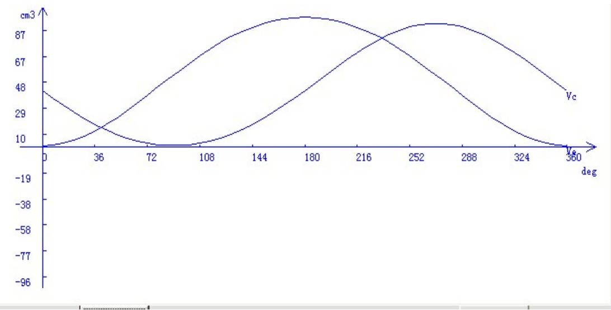  
图 4.3 绝热循环下 Ve-θ 和 Vc-θ 图

绝热循环下，发动机热膨胀腔和冷压缩腔循环温度变化如图4.4所示，热膨胀腔和冷压缩腔循环温度较稳定，趋于等温变化。

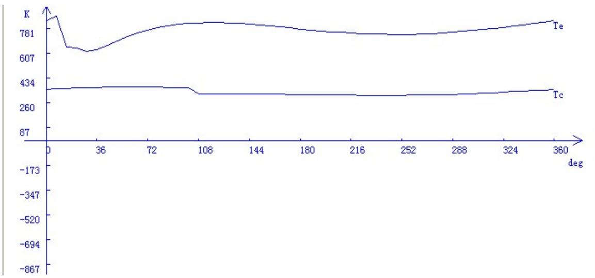  
图 4.4 绝热循环下 Te-θ 和 Tc-θ 图

绝热循环下，斯特林发动机在工作过程中的瞬时压力P随曲轴转角θ变化如图4.5所示，瞬时压力P随曲轴转角θ成正弦规律变化。

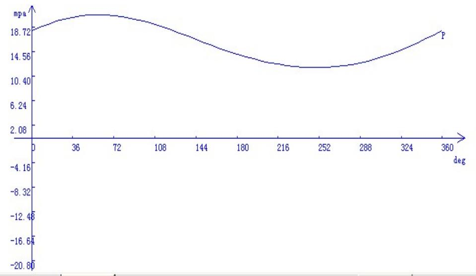  
图 4.5 绝热循环下的 P- θ图

在绝热循环中，发动机活塞的运动实际上是连续的，不可能间断运动，因此它明显的偏离理想状态。这样就导致斯特林发动机实际循环的四个过程没有明确的界限，即P-V图是一条光滑的封闭曲线。

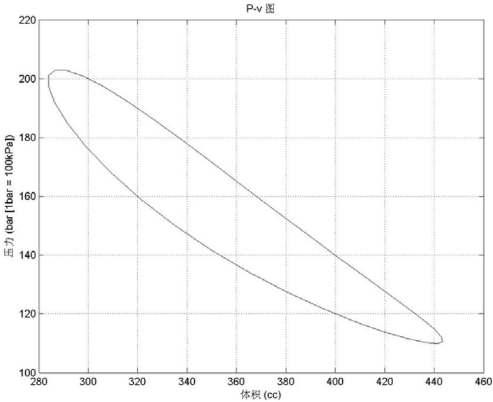  
图 4.6 绝热循环下的 p-V 图

绝热循环下，斯特林发动机做功W和换热量Q随曲轴转角θ变化如图4.7所示。

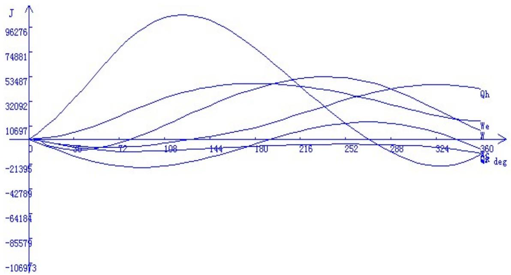  
图 4.7 绝热循环下的 W-θ 和 Q-θ 图

从图4.3中可以看到，理想绝热循环中，由于发动机的工作容积也是随着曲轴转角以正弦规律变化，且循环初始和循环末尾工作容积是相等的，所以可以看到图4.6的 p-V图是一个封闭的曲线。从图 4.7 可以看到，热腔换热量 Qh、冷腔换热量 Qk和回热器换热量 QR 传递以及压缩腔和膨胀腔中的做功量 Wc，We和循环净功W大致按正弦规律变化。在循环的末尾，回热器总的传热量为零；加热器积累的传热量和膨胀腔积累的做功量为正值且它们的值相等；压缩腔积累的做功量和冷却器积累的传热量为负值且它们的值相等；出现这一现象的原因是发动机的工作必须满足理想绝热循环的能量守恒条件。

在具体的传热量方面，循环过程中，加热器和冷却器的传热量与回热器的传热量相比要小很多。循环净功量为压缩腔和膨胀腔在循环末尾的做功之和。由此可以看出，回热器的性能对于整个斯特林发动机的性能有很大影响 [37]\~ [40]

### 4.3.2 考虑损失变工况性能分析

上一章对发动机的损失进行了计算，得到了发动机实际性能，表2表示了理想绝热循环与实际循环的输出功和循环效率。

表2西安斯特林发动机理想绝热循环与计及损失循环参数比较
<table><tr><td rowspan=1 colspan=1>加热温度(K)</td><td rowspan=1 colspan=1>绝热输出功(W)</td><td rowspan=1 colspan=1>计及损失输出功(W)</td><td rowspan=1 colspan=1>理想绝热效率[%]</td><td rowspan=1 colspan=1>计及损失效率[%]</td></tr><tr><td rowspan=1 colspan=1>1123.0</td><td rowspan=1 colspan=1>10857.08</td><td rowspan=1 colspan=1>10747.3</td><td rowspan=1 colspan=1>68.0</td><td rowspan=1 colspan=1>40.8</td></tr><tr><td rowspan=1 colspan=1>1118.0</td><td rowspan=1 colspan=1>10795.28</td><td rowspan=1 colspan=1>10685.0</td><td rowspan=1 colspan=1>67.8</td><td rowspan=1 colspan=1>40.9</td></tr><tr><td rowspan=1 colspan=1>1113.0</td><td rowspan=1 colspan=1>10732.59</td><td rowspan=1 colspan=1>10622.2</td><td rowspan=1 colspan=1>67.7</td><td rowspan=1 colspan=1>40.8</td></tr><tr><td rowspan=1 colspan=1>1108.0</td><td rowspan=1 colspan=1>10669.78</td><td rowspan=1 colspan=1>10559.1</td><td rowspan=1 colspan=1>67.6</td><td rowspan=1 colspan=1>40.9</td></tr><tr><td rowspan=1 colspan=1>1103.0</td><td rowspan=1 colspan=1>10606.85</td><td rowspan=1 colspan=1>10495.8</td><td rowspan=1 colspan=1>67.4</td><td rowspan=1 colspan=1>40.9</td></tr><tr><td rowspan=1 colspan=1>1098.0</td><td rowspan=1 colspan=1>10543.81</td><td rowspan=1 colspan=1>10432.5</td><td rowspan=1 colspan=1>67.3</td><td rowspan=1 colspan=1>40.9</td></tr><tr><td rowspan=1 colspan=1>1093.0</td><td rowspan=1 colspan=1>10480.66</td><td rowspan=1 colspan=1>10369.1</td><td rowspan=1 colspan=1>67.2</td><td rowspan=1 colspan=1>40.9</td></tr><tr><td rowspan=1 colspan=1>1088.0</td><td rowspan=1 colspan=1>10417.39</td><td rowspan=1 colspan=1>10305.5</td><td rowspan=1 colspan=1>67.0</td><td rowspan=1 colspan=1>40.9</td></tr><tr><td rowspan=1 colspan=1>1083.0</td><td rowspan=1 colspan=1>10354.01</td><td rowspan=1 colspan=1>10241.8</td><td rowspan=1 colspan=1>66.9</td><td rowspan=1 colspan=1>40.9</td></tr><tr><td rowspan=1 colspan=1>1078.0</td><td rowspan=1 colspan=1>10290.52</td><td rowspan=1 colspan=1>10178.0</td><td rowspan=1 colspan=1>66.7</td><td rowspan=1 colspan=1>41.0</td></tr><tr><td rowspan=1 colspan=1>1073.0</td><td rowspan=1 colspan=1>10226.92</td><td rowspan=1 colspan=1>10114.1</td><td rowspan=1 colspan=1>66.6</td><td rowspan=1 colspan=1>41.0</td></tr></table>

为了分析不同温度范围下斯特林发动机的性能参数变化，改变了加热器的壁面温度，使其在 $1 0 7 3 \pm 5 0 \mathrm { ~ K ~ }$ 的范围内变化，得到发动机输出净功 $W _ { t }$ 和循环效率η，随温度限的变化情况如图4.8所示。

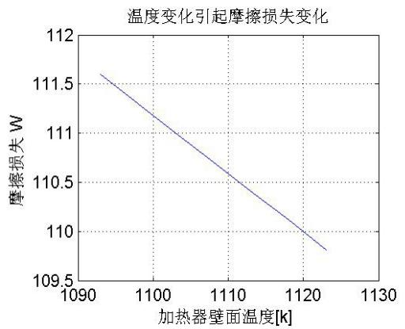

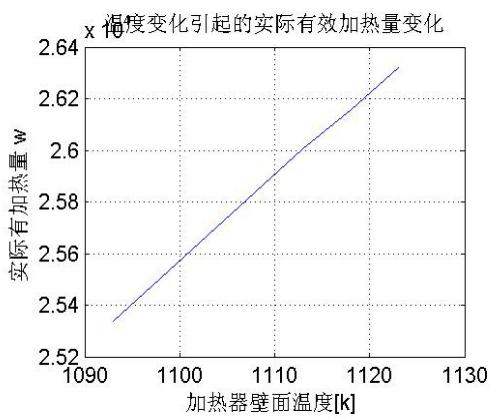

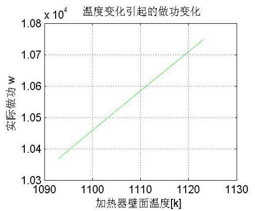

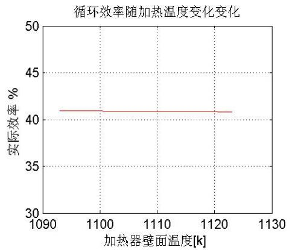  
图 4.8 发动机性能参数随加热温度变化曲线

从图中可以看出，随着加热温度的增加，实际的加热量和发动机做功量都有所增加，而且摩擦损失也随之有所减少。但发动机的实际效率并没有出现相应的增加，这主要是由于随着加热温度的增加，发动机相关损失也随之增加。具体如下图4.9所示，给出了发动机相关损失随加热温度增加的变化曲线，从中我们可以更直观的发现这个问题。

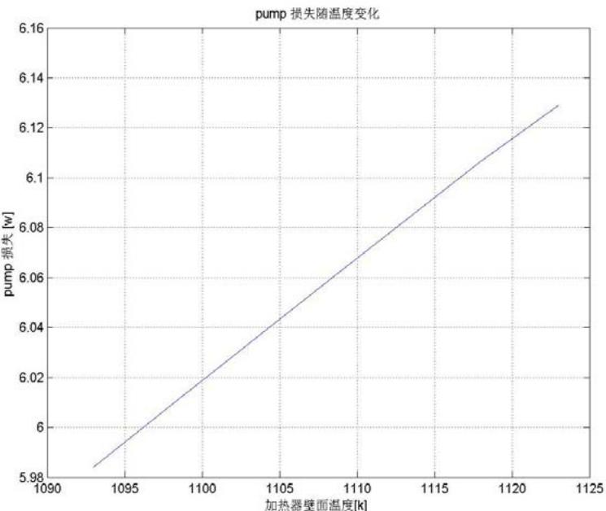  
图4.9(a) 发动机压力损失随加热温度变化曲线

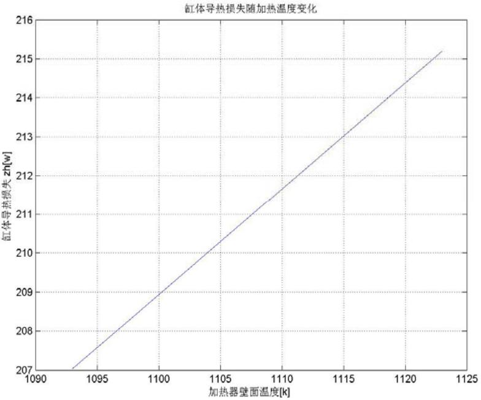  
图4.9(b) 发动机缸体导热损失随加热温度变化曲线

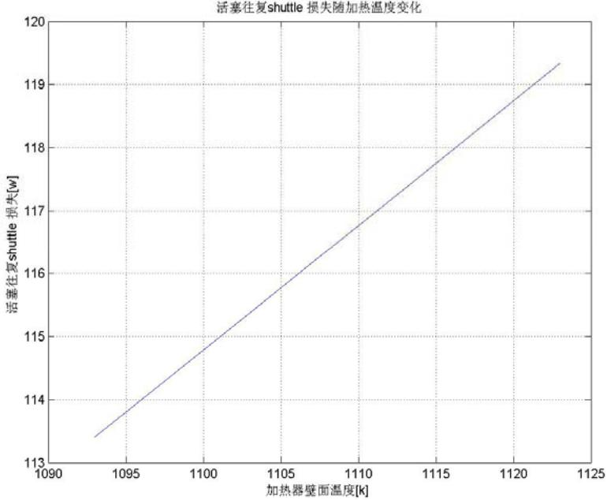  
图4.9(c) 发动机活塞往复损失随加热温度变化曲线

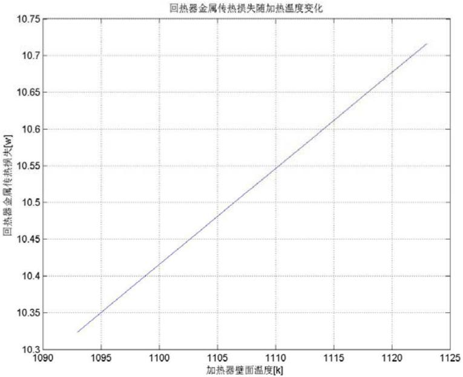  
图4.9(d) 发动机回热器金属传热损失随加热温度变化曲线

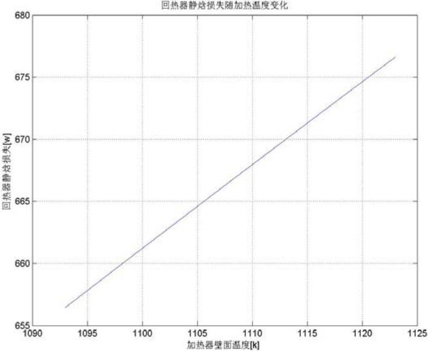  
图4.9(e) 发动机回热器静焓损失随加热温度变化曲线  
图4.9发动机相关损失随加热温度变化曲线

## 4.4 本章小结

通过计算分析发动机的损失可以得到以下几个结论：

1.回热器效率对发动机热效率的影响很明显。根据计算斯特林发动机回热器效率在0.98左右，而实际循环效率下降到0.5左右，通过和其他损失比较可知回热器的热量损失是总损失的一大组成部分。因为回热器具有特殊的结构，在循环过程中，回热器单次流动的传热量与循环功相比十分巨大。这样即使对于一个高效的回热器，其循环热量和循环功相比仍然十分明显。因此实际循环热效率对于回热器效率的变化十分敏感。

2.通过计算压降损失可以发现，加热器和冷却器的压力降较小，从而使得压降损失较小。而回热器的压缩损失则较大，是总的压缩损失的主要部分，这也是因为回热器的结构决定回热器必须有很小的水力直径和很大的湿面积引起的。

3.活塞往复热损失也是循环损失的一个较明显的组成部分，应当加以注意。

4.加热器温度在（1073～1123K）范围内变化，发动机性能变化较小，温度增加时理想绝热效率略有增加，但是计及损失的效率略有下降。最大变化量在1%之内。

5.发动机损失和做功量随温度变化呈线性关系变化。

# 第5章 STY1 型斯特林发动机性能试验

## 5.1 任务来源与目的

任务来源：实习公司与北京航空航天大学关于斯特林发动机研究。

研究目的：为验证不同工况发动机的性能参数，评估发动机设计指标，提高发动机的发电效率，竭力达到我们预期的20Kw稳态发电状态。在上一章给出的发动机的循环参数和结构参数的基础上，特建立斯特林发动机性能试验。除了可以直观的获得发动机的性能参数，还可以对理论分析方法加以验证，并修正理论模型，为STY2型斯特林发动机的研制提供依据。

## 5.2 实验技术要求及条件

### 5.2.1 发动机电加热系统

发动机性能试验需要提供加热功率为130Kw的电加热炉来模拟实际中的太阳能聚光器的热头加热器部分，并要求达到一定的加热速率，电加热炉加热后炉内的温度要能达到 $1 4 0 0 ^ { \circ } \mathrm { C }$ ，且加热温度由低到高可以控制。

目前采用的硅碳棒加热炉在达到加热温度后不能保证传热功率，为强化加热炉与发动机热端传热，本次试验另外制作了外循环的旋流回路。经计算分析，当发动机热端温度在1000K左右时，电加热系统与发动机热端总传热量能达到60Kw左右，满足发动机的实验要求。

### 5.2.2 发动机试验热保护装置

由于发动机要在很高的加热温度下进行试验，因此必须设计安装发动机试验系统—热保护装置。本试验中，分别对电加热炉外循环管路与循环风机、电加热炉与发动机热头间以及发动机冷却散热系统设计了热保护与通风循环装置，该装置有效地减小了热损失并确保了试验的安全性。

### 5.2.3 发动机测试与数据采集系统

发动机试验中，需要对发动机内各热力参数与发动机性能进行数据采集与分析，并实时显示与监控发动机的实验状态。北航和中航614所的发动机试验测试与数据采集系统很好的实现了对发动机试验状态的实时监控，对发动机执行机构进行了控制与操作，记录测量数据并实时显示。

图5.1 所示即为发动机数控系统实时监控界面  
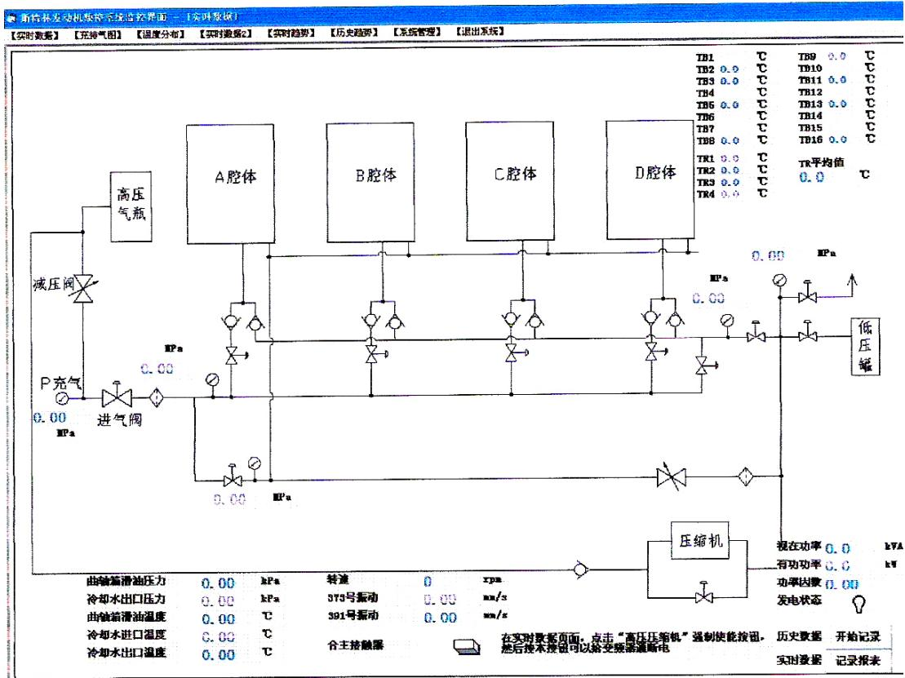  
图 5.1 发动机数控系统实时监控界面

### 5.2.4 试验人员

发动机试验中，各试验系统需有专人进行操作，并熟练掌握操作方法。各系统操作人员需相互协调，统一进行，确保发动机试验安全有序的进行。

## 5.3 试验方法

本实验采用电加热炉作为热源模拟太阳能给发动机加热进行试验。发动机工况由两部分决定，一是热端温度，二是充气压力。发动机试验中，通过给电热炉设定不同的加热温度，以及给发动机内设置不同的充气压力来改变发动机工况，以达到不同试验状态下的试验。

## 5.4 试验过程

### 5.4.1 试验前准备

1.检查水、电、实验室通风情况，确保试验环境符合要求；

2. 检查电热炉准备情况，确保热源安全可用；

3.检查发动机各系统情况，确保发动机运行正常；

4. 检查各种实验保护装置，确保试验安全；

5.检查测试和数据采集系统，确保系统可靠运行。

### 5.4.2 发动机试验

1.打开发动机检测程序并与发动机控制系统连接；

2. 给发动机加入工质，并调节减压阀，使系统压力达到 5Mpa；

3. 启动发动机冷却系统；

4.打开电加热炉，设置预热温度，给发动机预热；

5.启动电机，并提高加热炉加热温度使发动机达到发电状态：

6. 进行数据测试并记录；

7.逐步调节系统压力、加热温度，记录不同试验状态发动机测试数据

### 5.4.3 发动机停车

1.关闭电加热炉，确保加热炉散热降温至安全范围；

2. 关闭发动机；

3. 关闭发动机冷却系统。

### 5.4.4 试验结束

1. 检查各部件使用情况并记录；

2.关闭发动机控制柜内所有开关；

3. 拷贝保存实验数据；

4. 整理现场，关闭操作电脑；

5. 切断水、电；

6. 试验结束。

## 5.5 发动机试验过程分析

### 5.5.1 Tecplot 软件介绍

Tecplot系列软件是由美国Tecplot公司推出的功能强大的数据分析和可视化处理软件。它包含数值模拟和CFD结果可视化软件Tecplot 360，工程绘图软件Tecplot Focus，以及油藏数值模拟可视化分析软件Tecplot RS。它提供了丰富的绘图格式，包括 x-y曲线图，多种格式的的 2-D 和 3-D 面绘图，和 3-D 体绘图格式。而且针对于Fluent软件有专门的数据接口，可以直接读入\*.cas和\*.dat文件，也可以在 Fluent 软件中选择输出的面和变量，然后直接输出 tecplot 格式文档。

Tecplot Focus是一款工程绘图软件，它使用户可以随心所欲的绘制所有工程数据图和测试数据图。具有齐备的 XY、2D 和 3D 绘图功能，Tecplot Focus专为现场数据的测量、测试数据的绘制、数学分析、以及工程总体策划而设计。Tecplot是绘图和数据分析的通用软件，对于进行数值模拟、数据分析和测试是理想的工具。作为功能强大的数据显示工具，Tecplot通过绘制XY，2-D和3-D数据图以显示工程和科学数据 [46]\~ [47]

### 5.5.2 发动机试验数据动态分析

发动机试验过程是一个动态过程，其中包含了调节加热温度和调节系统压力两个过程，且这两个过程在试验中是相辅相成的。在系统压力较低时，通过调节加热温度能够很快使得热端管壁温度升至设定安全温度，此时就需要增加系统压力，即增加系统的吸热量，使得热端管壁温度降低。经过反复几次调节加热温度和系统压力的过程，直至达到发动机最大工作状态。下面将分析这一过程中，发动机热端温度、系统压力以及发电功率的变化情况。

**1. 发动机热端温度变化**

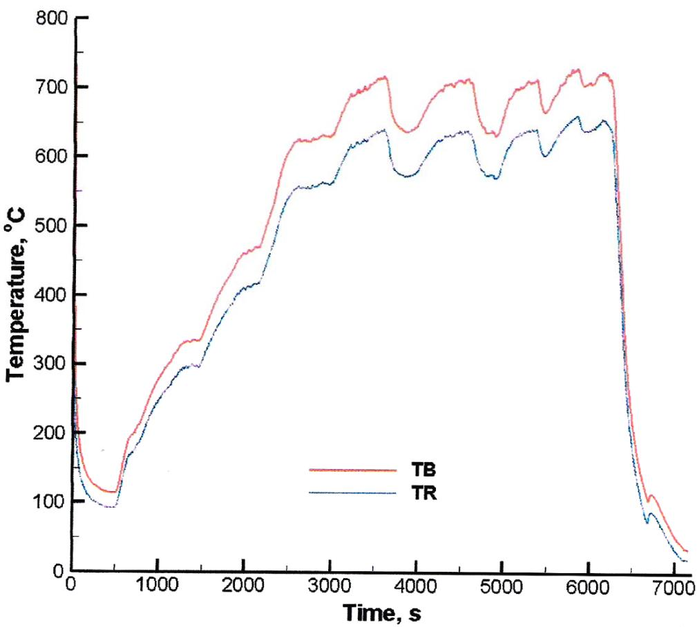  
图 5.2 发动机热端温度变化曲线图

如图5.2所示，为发动机热端加热管管壁温度TB和气缸内工质温度TR在发动机试验过程中的变化曲线图。其中，TB为加热管壁各温度测点的算术平均值，TR为各气缸内工质温度算术平均值。

从图中可以看出，在试验开始阶段，TB、TR与发动机热端预热温度一致，当发动机开启后，发电机热端温度急剧下降，且TB与TR间出现一定的温差。随着加热温度的进一步提高，TB、TR也随之增加。当温度升至最高值后，又急剧下降，并反复几次，这是由于加热管壁温度升高至一定温度后，需往发动机系统内补充工质，即提高了系统压力，此时发动机吸热量增加，温度降低，此后继续提高加热温度，管壁温度又会上升。最后，当加热炉关闭，停止给发动机供热后，TB、TR值又会急剧下降，直至发动机停机。

**2. 发动机系统压力调节**

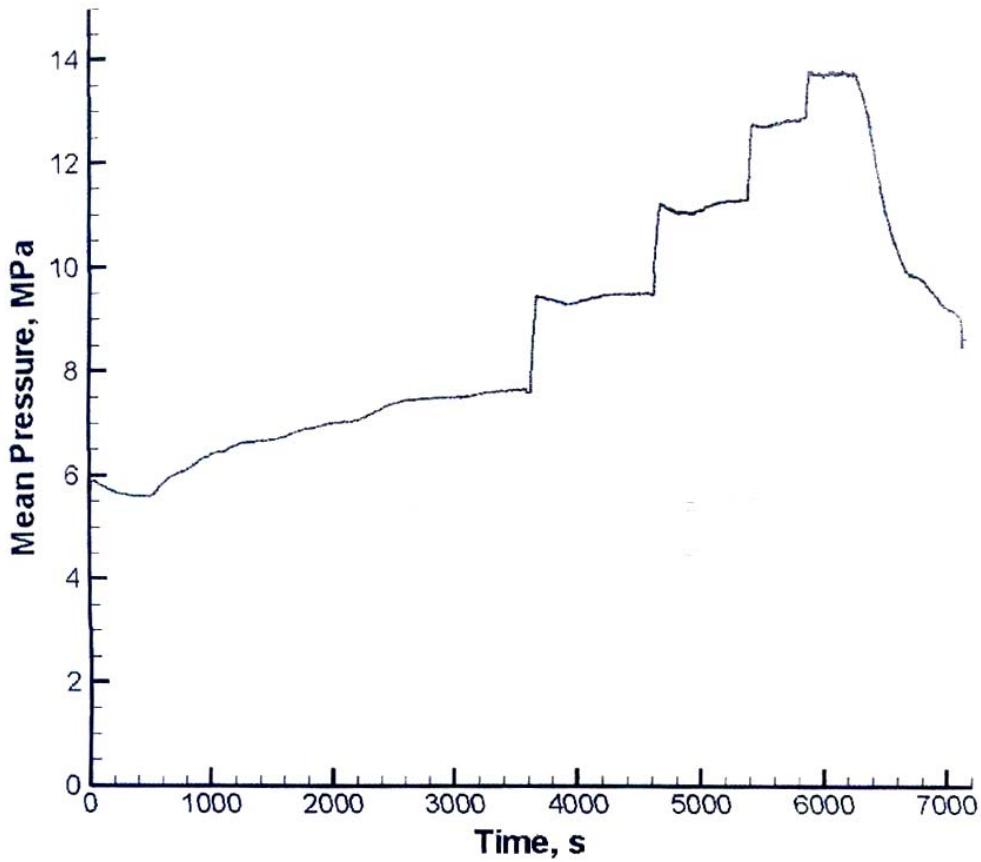  
图5.3 发动机系统压力变化曲线图

如图5.3所示，为发动机系统平均压力在试验过程中变化曲线图。从图中可以看出，发动机初始充入一定工质达到给定压力后，随着加热温度的增加，压力缓慢增加。经过一段时间后，通过继续向发动机内补充工质来提高系统压力，且发动机系统内压力并不是一次提高到最高设定压力，而是缓慢增加，直至达到最高压力。这一方面增强了系统的稳定性，另一方面也是为了试验系统的安全性。当发动机停止加热后，系统压力也不是一次降至环境压力，而是保持一定的系统压力。

**3. 发电功率温度特性**

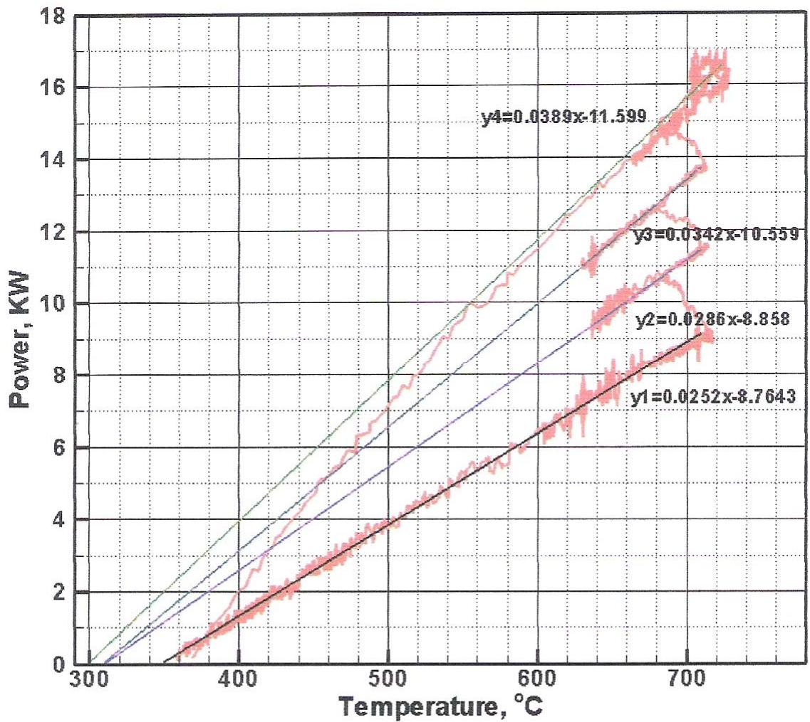  
图5.4 发动机发电功率与温度变化关系图

如图5.4所示，为发动机发电功率随加热温度变化关系曲线。从图中可以看出，发动机初始充入一定工质后，随着加热温度的提高，发电机发电功率也随之增加。随后出现温度降低且功率增加是由于在发动机补气过程中系统压力增加，从而使得系统吸热量增加，发电功率也随之增大。当系统调压完成，由于热源温度限制，出现温度降低且功率减小。随着继续增加热源加热温度，管壁温度又开始增加且发动机发电功率增大。之后随着继续调压且增加热源温度，发动机的功率同样出现先减小后增大的情况，直至系统压力达到设定最大值，发电功率也达到最大值17Kw左右。之后电热炉关闭，发电机热端温度下降，发电功率也随之减小直至0.

**4. 发电功率压力特性**

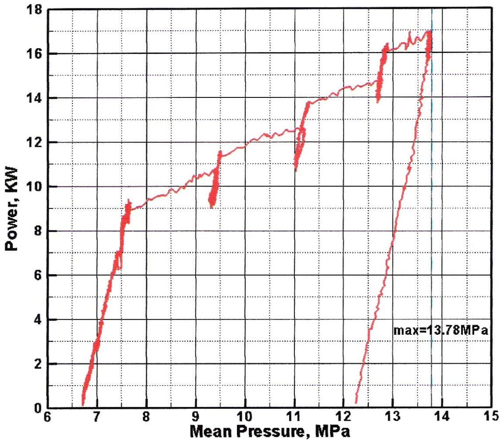  
图 5.5 发动机发电功率与压力变化关系图

如图5.5所示，为发电机发电功率随系统的平均压力变化曲线。从图中可以看出，系统在初始压力的基础上，随着压力缓慢增加发电功率增大，这是由于加热温度的提高，使得系统内工质温度增加而引起的压力上升。随后经过几次人工调压，使得系统压力慢慢升高到最大设定压力，发动机发电功率也随之增加到最大功率。最后，由于关闭发动机热源，系统压力随着工质温度的降低而减小，直至发电机发电功率为0.

## 5.6 本章小结

为验证不同工况发动机的性能参数，评估发动机设计指标，提高发动机的发电效率，竭力达到我们预期的20Kw稳态发电状态。本章模拟了发动机工作的一个动态过程，其中包含了调节加热温度和调节系统压力两个过程，且这两个过程在试验中是相辅相成的。试验过程当中，经过反复几次调节加热温度和系统压力的过程，直至达到发动机最大工作状态。

# 结论

## 对研究工作的总结

碟式太阳能热发电系统是太阳能热利用中最有发展前途的技术。斯特林发动机是碟式太阳能热发电技术中最为关键的组成部分。本课题以碟式太阳能热发电技术为研究对象，以四缸双作用斯特林发动机为研究重点，对系统进行了全面的分析。主要得到了以下几方面结果：

1.以理想绝热法为基础，建立了四缸双作用斯特林发动机模型。该模型在理想模型的基础上，结合实际工况，考虑到了四缸双作用斯特林发动机试车整个动态过程中伴随有各种损失。因此，该模型更加接近实际。

2．用VB软件编写了用于模拟的绝热法计算程序，程序中用四阶龙格一库塔法对建模中的微分方程组进行求解，模拟计算了斯特林发动机的输出功率曲线和效率曲线的变化。

3．对实习公司设计出的斯特林发动机样机的试验结果进行分析表明，一方面模型的计算是基本有效的，另一方面对斯特林整个动态发电过程进行了性能分析，确定出了加热温度和系统的平均压力是影响斯特林发动机发电功率和效率的主要因素。用Tecplot软件对试验值进行模拟和分析。

本文对于进一步认识斯特林发动机和碟式太阳能热发电系统具有积极意义，基本掌握了碟式太阳能热发电系统，尤其是四缸双作用斯特林发动机的性能变化规律，对后期斯特林的改型设计和进一步的试验分析提供了必要的理论基础。同时，利用本文编写的程序可以方便地设计和优化相近的机型和系统。

## 对研究工作的展望

由于时间和精力的限制，本课题仍有很大的发展空间，对斯特林发动机和碟式太阳能热发电系统的研究仍有很多有意义的工作需要去做：

1．发动机试验中需要通过往系统内充气与补气以调节系统的压力，而这一过程目前采用的是手动操作。在手动操作过程中，一是操作时间长，响应慢；二是发动机系统内为高温高压气体，操作过程存在一定的安全隐患。因此，可以设计自动充、补气系统来调节发动机的系统压力。

2．发动机试验中最大压力还不到15Mpa，当压力继续增加时，发电功率和效率会有所增加。所以，要提高发电功率和效率，最主要的一个环节就是系统内的压力要达到一定水平。但是斯特林发动机由于充气介质是高温高压气体，因此只要设计出一套性能较好的密封装置，这样就可以保证系统内的平均压力达到我们所需要的状态，从而实现预期发电20Kw的稳态发电状态。

3.由于年日照量不均匀，所以，考虑研究储热装置。在太阳光充足的情下，考虑很好的储热，以便在下雨或是太阳光不足的情况下，斯特林发动机人仍可以用来发电。

4．伴随着未来生产加工工艺的进步和工业批量化生产，碟式太阳能斯特林系统成本会大幅度降低，其发电成本也会大幅度下降。

5．结合我国的国情，碟式太阳能斯特林系统不仅可以改善我国一些偏远地区以及其他一些供电系统不易架到的地区的用电系统，而且还可以联网发电，并且发电输送给电网。

6．我国西部有很多沙漠地带，常年降雨量很少，太阳日照充足，一年中有太阳照射时间也很长，这对我国建设太阳能发电系统提供了一个很有利的条件和场所。

# 参考文献

[1]罗运俊，何梓年，王长贵．太阳能利用技术[M].化学工业出版社.2005.

[2]高峰，孙成权，刘全根．太阳能开发利用的现状和发展趋势[J]. 科技前沿和学术评论，2001，23(4)：35～39.

[3]金东寒著．斯特林发动机技术[M].哈尔滨工程大学出版社.2009.

[4] L.Berrin Erbay, Hadbi Yavuz. Analysis of the Stirling Heat Engine at Maximum Power Conditions Energy. Vol 22,No 7 645\~ 650.

[5] Zhao Lin Gu, Haruki Sato, Xiao Feng. Using Supercritical Heat Recovery Process in Stirling Engines for High Thermal Efficiency.Applied Thermal Engineering .Issue 21(2001)，1621\~ 1630.

[6] R.Impero Abenavoli, We Dong, L.Fedele, A.Sciahoni. Design of a New Type of Rotary Stirling Engine. IEEE,1996.

[7] Stig Kildegard Andersen, Henrik Carlsen,Per Grove Thomsen.Numerical Study on Optimal Stirling Engine Regenerator Matrix Designs Taking into Account the Effects of Matrix Temperature Oscillations.Energy Conversion and Management,Issue 47,(2006):894\~908.

[8] S.C.Kaushik, S.Kumar. Finite Time Thermodynamic Evaluation of Irreversible Ericsson and Stirling Heat Engines. Energy Conversion & Management, Issue 42(2001):295\~ 312.

[9] Shahrir Abdullah,Belal F.Yousif,Kamaruzzaman Sopian.Design Consideration of Llow Temperature Differential Double-acting Stirling Engine for Solar Application. Renewable Energy, Issue 30,(2005):1923\~ 1941.

[10]李修宝，徐让书，蒲宁，吴超．一维斯特林发动机数值分析方法研究[J].沈阳航空工业学院学报 ,2009,2.

[11]谢英柏，徐周璇，论立勇，刘迎福．小型斯特林机回热器热损分析[J].低温工程，2008，3.

[12]吴锋，陈林根，孙丰瑞．回热式斯特林发动机输出功率的优化[J].电站系统工程,13 (4):43～46.

[13]顾根香，金东寒，阎珽．斯特林发动机动态特性的研究[J]. 内燃机学报,2000, 18 (3) : 305～ 307.

[14]顾根香，王芝秋．双作用斯特林发动机循环均匀性研究[J].哈尔滨工程大学学报, 21 (3):42 ～ 44.

[15]顾根香，金东寒，张熹．双作用斯特林发动机活塞环性能分散性的研究[J].

舰船科学技术,1998,2:32～34.

[16]胡学光，董金钟，王明昆．斯特林发动机绝热分析法研究[J].应用能源技术,2009,8.

[17]姚睿，吴克启．斯特林发动机在空间太阳能发电中的应用[J].太阳能学报，22 (1) : 111 \~ 114.

[18]蔡保华，王幼纯，陈焕倬．斯特林发动机中回热器性能分析[J]. 工程热物理学报，8(3):260～263.

[19]张志国．一维斯特林发动机的数值模型[J].华中科技大学学报（自然科学版), 34(3):71～ 75.

[20]吴锋，孙丰瑞，陈林根．太阳能驱动斯特林热机的最优性能[J].电站系统工程，13(5):43～45.

[21]胡亚联，吴锋．有限速率过程对活塞式斯特林发动机性能的影响[J]. 热能动力工程,6(4): 241～245.

[22]邹隆清，刘洪硕，邓十洲．斯特林发动机[M].湖南大学出版社．长沙，1985：143

[23] Rodger W. Dyson, Scott D. Wilson, Roy C.Tew. Review of Computational Stirling Analysis Methods[R]. AIAA 2004-5582 ;

[24] Roy Tew, Kent Jefferies, David Miao. A Stirling Engine Computer Model for Performance Calculations[R]. NASA TM-78884;

[25] W.R.Martini,Validation of Published Stirling Engine Design Methods Using Engine Characteristics from the Literature.1980 IECEEC Record, pp: 2245～ 2250.

[26] R.Shoureshi,Analysis and Design of Stirling Engines or Waste-He-at Recovery. Ph. D. Thesis,M.I.T.,1981.

[27] R.Shoureshi,General Method for Optimization of Stirling Engines.1982 IECEC Record,NO.829279.

[28] Schmidt.Gustav.Theory of Lehmanns Heat Machine.Journal of the German Engineers Union.Vol.XV,Vo.1:1-12;No.2: 98～ 112.

[29] Israel Urieli. Stirling Engine Simple Analysis[R]. America : Ohio University, Department of Mechanical Engineering , 1992 ;

[30]G.沃克．热气机[M].机械工业出版社．北京:1987:

[31]马东升，雷勇军．数值计算方法[M].北京：机械工业出版社.2006.

[32]颜庆津．数值分析[M].北京：北京航空航天大学出版社.2006.

[33]余德浩，汤华中.微分方程数值解法[M].科学出版社.2003.

[34]约翰D，安德森．计算流体力学基础及其应用[M].北京：机械工业出版社.2007.

[35]邓建中，刘之行．计算方法[M].西安交通大学出版社.2001.

[36]丁丽娟，程杞元．数值计算方法[M].北京：北京理工大学出版社.2005.

[37]刘炳文 .Visual Basic 程序设计教程[M]. 北京：清华大学出版社 .2006.

[38]王天华，万缨.Visual Basic程序设计实用教程[M]. 北京：清华大学出版社.2006.

[39] 谭浩强 .Visual Basic 程序设计[M]. 北京：清华大学出版社 .2004.

[40] 于建海．中文 Visual Basic 6.0 案例教程[M]. 北京：人民邮电出版社.2006.

[41]钱国柱．热气机[M].国防工业出版社,1982：103～104,186

[42]黄护林．太阳能斯特林发动机的性能模拟．太阳能学报,25(5):657～662.

[43]高瑶.5kW 点聚焦太阳能斯特林发电系统的性能分析[D]. 南京航空航天大学硕士论文．南京：南京航空航天大学能源与动力学院，2006.

[44] Kaushika N,D.Viability Aspects of Paraboloidal Dish Solar Collector Systems. Renewable Energy, (3) : 787-793.

[45 杨征．斯特林发动机及碟式太阳能热发电系统的模拟和优化[D].北京工业大学硕士学位论文．北京：北京工业大学热能工程，2008

[46]王瑞金，张凯，王刚.Fluent技术基础与应用实例[M].北京：清华大学出版社.2007.

[47]张凯，王瑞金，王刚.Fluent技术基础与应用实例[M].北京：清华大学出版社.2010.

[48] Research and Development Advances in Concentrating Solar Power.[R]Sun Lab Report. 2001.

[49] Martini,W.R.,and Ross,B.A.An Isothermal Second Order Stirling Engine Calculation Method.Joint Center For Graduate Study.1979 IECEC Record:1091\~ 1097.

[50] R.G.Tew,etal.,“A Stirling Engine Computer Model for Performance Calculation", DOE/NASA/1011-78/24.

[51] Chen L, Yan Z.The effect of heat-transfer law on performance of a two-heat-source endoreversible cycle[J]. J.Chem Phys1989,90(7) : 3 740\~ 3 743.

[52] 何济洲，两类回热器热力学循环性能的研究[D]. 厦门大学博士论文,2003.

[53]杨惠山，热阻和回热损失对铁电斯特林制冷机的经济优化性能的影响[J]. 低温工程，2004，137（1 )：49～51.

[54]王长贵，中国光伏发电产业与市场．太阳能学报，1999特刊:75～84.

[55]王野平，徐岩松，梁伟延，从可持续发展战略高度审视太阳能热力发电．科学管理研究，2002，3：92～95.

[56] Bejan A.Theory of heat transfer irreversible refrigeration plants [J]. Int.J.Heat Mass Transfer, 1989, 32(9): 1 631\~ 1 639.

[57]吴丹妮，斯特林发动机的循环分析和计算[J]. 湛江海洋大学学报，1997,17:36\~ 40,.

# 致谢

值此论文完成之际，首先要感谢学校，感谢学校和学院领导及其各位老师为我们提供了良好的学习氛围。接下来我要忠心感谢我的导师龚俊教授，在本论文的写作过程中，龚老师倾注了大量的心血，从选题到开题报告，从论文的研究方向到重点都给了我细心的指导，正是有了龚老师的耐心、高层次的辅导和教诲，才使我的论文写作顺利完成。龚老师渊博的学识、活跃的学术思想、敏锐的洞察力、严谨的治学态度、忘我的工作精神给我留下了深刻的印象。他严谨细致、一丝不苟的作风一直是我工作、学习中的榜样；他循循善诱的教导和不拘一格的思路给予我无尽的启迪。在此谨向尊敬的导师—龚俊教授致以崇高的敬意和深深的谢意。

感谢吴建中老师，在攻读硕士期间，给我提供了实习这个平台，让我可以更直观的接触到我的课题。同时，吴建中老师在论文的指导上也给与了我很大的帮助。吴老师认真求实的治学思想，积极进取的科研精神，诲人不倦的育人态度，正直诚恳的处世方式，对我今后的人生历程大有裨益。

感谢在我实习期间，和我一起在公司工作的师傅们，在他们的热情帮助和细心指导下，让我学会了好多实际和现场的经验知识，这对我论文的完成和以后的工作帮助都很大。

感谢在一起愉快度过研究生生活的各位同门，正是由于你们的帮助和支持，我才能克服一个一个的困难和疑惑，直至本文的顺利完成。

值此论文完成之际，我还要感谢我的家人和各位亲朋好友在我攻读学位期间给予的支持和帮助，他们是我挫折后永远的避风港。

感谢本文的各位评审专家。谢谢你们能抽出宝贵的时间，帮助我审阅论文并提出宝贵意见，以利于我今后的提高和进步。

最后衷心感谢所有给予我帮助的人。

# 附录A攻读硕士研究生期间发表的论文

[1] 龚俊，田文静．斯特林发动机气缸与活塞间隙密封的泄漏量分析[J]. 机械制造.2010,第48卷（10），第554期:37-39