# 用于海上钻井平台的小型钠冷快堆核电源概念设计方案

侯斌¹，吕田²，周科源¹，余华金¹，周培德¹

(1.中国原子能科学研究院反应堆工程技术研究部，北京102413;2.上海齐耀动力技术有限公司，上海 201203)

摘要：根据海上石油钻井平台用户电力需求的特点，介绍了一种基于斯特林热气机发电技术的小型钠冷快堆核电源设计方案，研究了小型钠冷快堆核电源的总体技术方案、主回路冷却系统以及关键设备设计方案，并给出小型钠冷快堆核电源的初步布置方案。研究结果表明：小型钠冷快堆核电源概念设计方案符合海上石油钻井平台用户需求的长周期换料、空间限制等特点。

关键词：小型钠冷快堆；斯特林机；石油钻井平台

中图分类号：TL37

文献标志码：A

文章编号:1000-6931(2018)03-0494-08

doi:10.7538/yzk.2017.youxian.0337

# Concept Design Scheme of Small Sodium Cooled Fast Reactor Nuclear Power Used for Offshore Oil Drilling Platform

HOU Bin¹ , LYU Tian2 , ZHOU Keyuan¹ , YU Huajin¹ , ZHOU Peide¹ (1. China Institute of Atomic Energy, P. O. Box 275-33, Beijing 102413, China; 2. Shanghai Micropowers Co., Ltd., Shanghai 201203, China)

Abstract: Based on the characteristics about user's demand for electricity of offshore oil drilling platform, a kind of design scheme about small sodium cooled fast reactor nuclear power based on Stirling engine power generation technology was introduced, and the overall technical solution of small sodium cooled fast reactor nuclear power and the design schemes of the primary loop cooling system and the key equipment were studied. The preliminary layout plan of small sodium cooled fast reactor nuclear power was proposed. The results show that the concept design scheme of small sodium cooled fast reactor nuclear power can meet the user's demand of offshore oil drilling platform for a long refueling period, space limitations, etc.

Key words: small sodium cooled fast reactor; Stirling engine; oil drilling platform

海上石油钻井平台是海洋工程的核心装备，耗电量巨大，发电成本很高。因此，从节约作业平台发电成本和减小环境污染的角度出发，应开发适用于目标海域海洋环境的海上核电平台。

小型核电源是指使用紧凑型设计，由动力转换装置将核反应堆提供的能量转换为电力的装置。20世纪50年代末，美国提出了以压水堆技术为基础的“军用封装动力堆”的概念，并在橡树岭国家实验室临界试验装置上搭建了零功率台架，随后在弗吉尼亚州以18个月的建设周期完成2 MW的训练堆 SM-1的建设，于1957年达到首次临界，随后被转化为首个民用电力设施。

本文提出一种小型钠冷快堆核电源设计方案，用以解决海上石油钻井平台的供电问题。

## 1 总体技术方案

### 1.1 发电原理

用于海上石油钻井平台的小型快堆核电源主要由两大核心部分组成：一体化的小型钠冷快堆和新型斯特林热电转换模块。基本发电原理是由小型快堆提供热源，一回路冷却剂钠获得反应堆发出的热量，通过热交换器传给二回路主冷却系统的载热剂，再由二回路系统通过热电转换模块将热量传给采用氦气为工作介质的新型斯特林热电转换装置，进行发电，即采用钠-钠-氦气的三回路设计。主工艺系统原理如图1所示，图1中箭头所示方向为一回路、二回路主冷却剂液态钠流动方向。

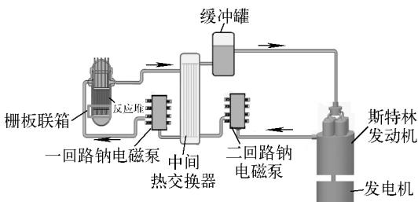  
图1 主工艺系统原理  
Fig. 1 Principle of main process system

### 1.2 技术方案

依托中国实验快堆(CEFR)[1-5]，在技术方案上借鉴利用已有的成熟技术路线，沿用快堆的安全设计思想，发挥快堆的固有安全特征和采用非能动安全系统，并实现小型化、模块化设计。根据应用于海洋环境中的技术特点和要求，选择结构系统相对简单的模块化的回路式布置方式。

小型快堆核电源选择的总体技术方案如下：冷却剂采用液态金属钠；一回路采用回路式结构[6]；选择完全掌握技术的 $\mathrm { U O _ { 2 } }$ 燃料；设置非能动停堆系统；设置非能动余热排出系统；小型快堆核电源主要由一回路冷却剂系统[7]、二回路冷却剂系统、斯特林发电系统、余热排出系统、辅助系统组成；反应堆寿期内不用换料。

系统设计基于自然循环的原理，在系统和设备设计上实现模块化设计，尽量减小体积和减轻质量，达到工厂制造、现场组装、便于运输等要求[8-11]。采用部分临时的可拆卸的系统和设备，这些系统和设备可重复用于其他小型反应堆。小型快堆核电源的总体技术指标列于表1。

表1 总体技术指标  
Table 1 General technical specification
<table><tr><td>参数</td><td>数值</td></tr><tr><td>热功率</td><td>40MW</td></tr><tr><td>电功率</td><td>≥10 MW</td></tr><tr><td>冷却剂</td><td>钠</td></tr><tr><td>覆盖气体</td><td>氩气</td></tr><tr><td>型式</td><td>回路式</td></tr><tr><td>燃料</td><td>UO2</td></tr><tr><td>主泵</td><td>电磁泵</td></tr><tr><td>中间热交换器(IHX)</td><td>4台</td></tr><tr><td>旋塞</td><td>单顶盖</td></tr><tr><td>堆内、外换料系统</td><td>无</td></tr><tr><td>钠在线净化系统</td><td>无</td></tr><tr><td>乏燃料贮存</td><td>无堆内贮存井、整体卸料</td></tr><tr><td>堆芯寿期</td><td>10 a 不换料</td></tr><tr><td>堆芯进/出口温度</td><td>400℃/550℃</td></tr><tr><td>空间尺寸</td><td>高度≤12 m，直径≤20 m</td></tr><tr><td>废热利用方案</td><td>海水淡化</td></tr></table>

### 1.3 堆芯设计方案

堆芯设计采用CEFR的成熟技术，电功率为10MW，10a不换料。为防止堆芯熔化事故，堆芯设计成负温度系数和负功率系数，设置非能动停堆系统。堆芯中布置1根价值足够大的居里点非能动停堆棒，保证紧急情况下的安全停堆。为了限制放射性产物释放，采用多层屏蔽，包括燃料包壳、堆容器、屏蔽组件、安全壳顶盖和保护容器。

堆芯的主要设计参数列于表2，堆芯径向布置方案如图2所示，燃料组件轴向布置方案如图3所示。

超长换料周期(10a不换料)设计需尽量降低燃耗反应性损失，小型快堆核电源堆芯设计增加了内生段，采用了径向三区燃料布置，富集度由内向外逐渐增大。内、中区燃料轴向采用三区布置，中间区富集度比上、下端低10%，组件长约2.65 m。

表2 堆芯主要设计参数  
Table 2 Core main design parameter
<table><tr><td>参数</td><td>数值</td></tr><tr><td>热功率，MW</td><td>40</td></tr><tr><td>电功率，MW</td><td>10</td></tr><tr><td>转换效率，%</td><td>25</td></tr><tr><td>燃料类型</td><td>UO2</td></tr><tr><td>燃料235U平均富集度</td><td>60</td></tr><tr><td>(内/中/外区)，%</td><td></td></tr><tr><td>冷却剂类型</td><td>Na</td></tr><tr><td>燃料换料周期，EFPD</td><td>3000</td></tr><tr><td>堆芯进/出口温度，℃</td><td>400/550(∆T=150)</td></tr><tr><td>堆芯流量，kg/s</td><td>210.6</td></tr><tr><td>燃料组件对边距(20℃)，mm</td><td>59</td></tr><tr><td>燃料活性区高度(20℃)，mm</td><td>1100</td></tr><tr><td>堆芯尺寸，mm</td><td>φ800×1100</td></tr><tr><td>UO2装料量，kg</td><td>2 360</td></tr><tr><td>堆芯布置</td><td></td></tr><tr><td>燃料组件组数</td><td>139</td></tr><tr><td>元件棒根数</td><td>61</td></tr><tr><td>平均线功率，kW/m</td><td>约4.3</td></tr><tr><td>控制棒组数</td><td>6/3/3/2</td></tr><tr><td>控制棒成分</td><td>B4C</td></tr></table>

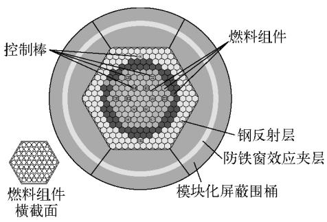  
图2 堆芯径向布置方案  
Fig. 2 Core radial layout scheme

经设计分析，该堆芯方案实际装载铀质量为2 076.7 kg，二氧化铀燃料芯块质量为2 360 kg，燃料和结构材料的限值主要由燃耗决定，根据美国EBR-Ⅱ设计经验12]，燃耗设计可达66 MW·d/kgHM，该堆芯采用长换料周期堆芯，即各燃料区换料时间相同，且不存在转换区和乏燃料储存阱，燃料只在堆芯位置释热，故平均燃耗公式可简化为：

$$
\overline { { B } } = T Q _ { \mathrm { c } } / M
$$

其中：B为平均燃耗，MW·d/kgHM；T为换料周期， $\cdot \mathrm { d } { \sf { s } } Q _ { \mathrm { c } }$ 为堆芯释热功率，MW;M为重金属装载量，kg。

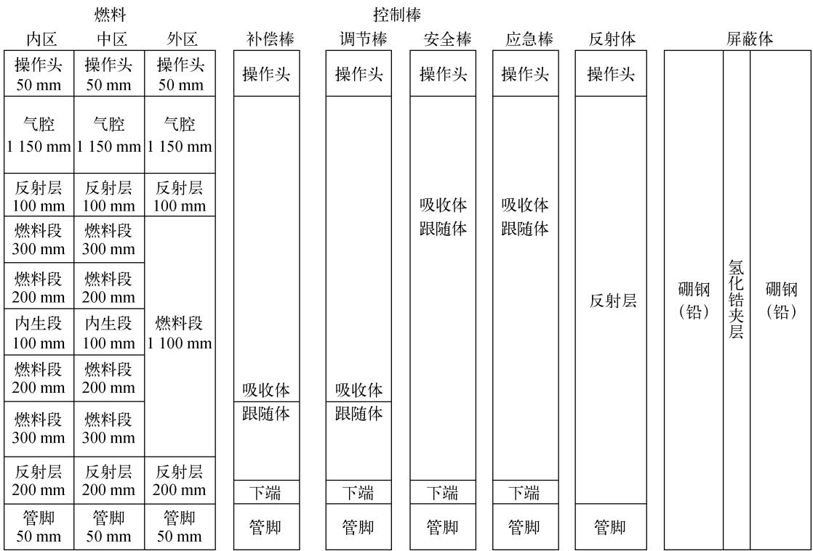  
图3 燃料组件轴向布置方案  
Fig. 3 Fuel assembly axial layout scheme

由此可推定设计中满功率天上限为34266 d。

模型建立时按各圈组件为单元进行燃耗分析，分别计算了经历各满功率运行100d后的有效增殖因数及燃耗反应性损失。结果表明，满功率运行3000d后，总的燃耗反应性损失为7.79%∆k/k，与控制棒后备反应性基本平衡。需要说明的是，初步方案未考虑运行所需功率反应性补偿。

如图2所示，从组件内圈到外圈按照各圈 中子与光子耦合建模，统计了循环初期各圈组 件的总沉积能量，结果列于表3。

表3 堆芯各圈组件功率  
Table 3 Core assembly power of each coil
<table><tr><td>圈号</td><td>组件数</td><td>圈功率/kW</td><td>组件平均功率/kW</td></tr><tr><td>1</td><td>1</td><td>256.59</td><td>256.59</td></tr><tr><td>2</td><td>6</td><td>1628.64</td><td>271.44</td></tr><tr><td>3</td><td>12</td><td>2 657.76</td><td>221.48</td></tr><tr><td>4</td><td>18</td><td>4405.32</td><td>244.74</td></tr><tr><td>5</td><td>24</td><td>5 779.46</td><td>240.81</td></tr><tr><td>6</td><td>30</td><td>8027.97</td><td>267.6</td></tr><tr><td>7</td><td>36</td><td>9610.05</td><td>266.95</td></tr><tr><td>8</td><td>24</td><td>7634.21</td><td>318.09</td></tr><tr><td>全堆</td><td>151</td><td>40 000.00</td><td>260.96</td></tr></table>

根据每根组件平均功率粗略估计径向功率不均匀因子最大为1.22，该值出现在最外圈，原因是设计方案采用了具有较大(n，2n)反应截面的轻核素铍为反射层。

本文长寿期堆芯设计方案采用了增加燃料组件、控制棒组件、铍反射层等措施增长换料周期。设计方案中，燃料平均燃耗为66MW·d/kgHM，符合国际现有快堆燃料和材料研究水平；循环周期总的燃耗反应性损失为7.79%∆k/k，换料期间反应性基本平衡，可满足运行要求。

反应性控制方案为控制棒3组共15根，其中6根为补偿棒，确保堆芯在寿期内的后备反应性，同时兼具停堆安全的控制要求；2根功率调节棒用于细的反应性调节，调节棒与补偿棒组合成第1套停堆系统；考虑到安全的可靠性，3根能动安全棒和3根非能动应急停堆棒采用居里点非能动控制，为反应堆的第2套停堆系统。

## 2 主回路冷却剂系统方案

### 2.1 一回路冷却剂系统

一回路冷却剂系统将反应堆堆芯核裂变产生的热量带出，通过IHX将热量传输给二回路主冷却系统，使容器壁温度低于420℃。一回路冷却剂系统由两个环路组成，每个环路由堆本体、电磁泵、IHX以及管道阀门等组成。一回路冷却剂系统主要工艺参数为：一回路冷管段温度为400℃，一回路热管段温度为550℃，单环路热负荷为 20 MWt，系统压力为 0.5～0.7 MPa。

一回路冷却剂系统的流程如图4所示。一回路钠电磁泵将堆芯出口的钠经IHX、一回路压力管送入栅板联箱，通过流量分配，分别用来冷却堆芯、其他各类堆内组件、主容器壁，然后热钠从IHX入口流入，沿IHX一次侧（壳侧）自上而下流经换热管束外壁，将热量传给在传热管内自下而上流动的二回路钠，然后再流入堆芯底部，完成一回路冷却剂系统的循环。连接堆容器出口至IHX入口的冷却剂管道输送的是温度较高的冷却剂，通常称为热管段，连接电磁泵出口至堆容器入口的主管道输送的是温度较低的冷却剂，通常称为冷管段，一回路主管道热管段和冷管段均设有闸阀。一回路冷却剂系统正常运行时，一回路主管道闸阀均处于全开状态，两台一回路电磁泵投入运行。一回路钠在电磁泵的驱动下，流经堆容器吸收反应堆释放的热量，钠温度升高，在流经IHX时将热量传递给二回路钠，一回路钠经IHX后温度降低，返回至电磁泵入口，开始下一循环。

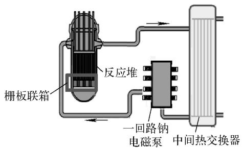  
图4一回路冷却剂系统流程  
Fig. 4 Flow of primary circuit coolant system

### 2.2 二回路冷却剂系统

二回路冷却剂系统将二回路主冷却系统的热量通过斯特林机传给斯特林发动机系统，驱动发电机发电。二回路冷却剂系统包括2个并联的环路，每个环路均包括1台IHX、2台斯特林机、1台电磁泵、1台钠缓冲罐、钠阀门、管件、管道和用于热工测量的仪表。

二回路冷却剂系统的流程如图5所示。在电磁泵的驱动下，二回路钠进入IHX，自下而上地流经传热管内部，被一回路钠加热后从IHX上部流出，进入斯特林机内部加热器，将斯特林机内部的气体加热推动活塞运动，二回路钠再由斯特林机内部加热器流入钠缓冲罐返回IHX，完成二回路钠冷却剂系统的循环。

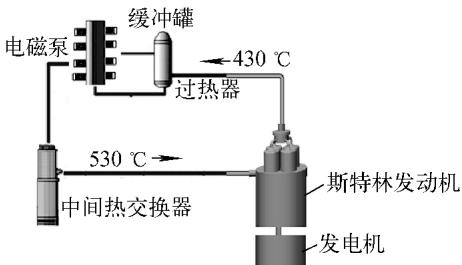  
图 5 二回路冷却剂系统流程  
Fig. 5 Flow of second circuit coolant system

### 2.3 余热排出系统

余热排出系统在事故工况下为堆芯提供冷却条件，确保堆芯的安全。小型钠冷快堆核电源技术方案的热功率为40MW，根据快堆余热排出系统设计准则，余热排出系统设计容量一般为反应堆额定功率的3%，则小型钠冷快堆核电源的余热为1.2MW。非能动余热排出系统原理如图6所示。反应堆紧急停堆后，衰变热通过堆容器外部换热管内的钠传递到空冷塔，最终排向大气。此方案的关键是确定钠管根数、规格、排列方式以及空冷塔的高度。

非能动余热排出系统的原理是在停堆事故工况下，堆芯热量由反应堆内的液态钠传给敷设在反应堆保护容器外侧的665mm×25mm换热管内的液态钠，换热管内的钠携带的热量由空冷塔排到大气中。换热管内钠的流动方向如图6中箭头所示。余热排出系统的总推动力由空冷塔与反应堆高度差提供，高度差约为10m。

### 2.4 斯特林电力转换系统

斯特林电力转换系统将二回路主冷却系统内的热量通过斯特林机内部加热器模块传给换热管内工质氦气，加热后的氦气在发动机热腔中膨胀做功，在压缩过程中，工质的压缩热由冷却器传给外界，通过传动系统将氦气在腔室内所做的循环功输出，驱动发电机组发电。

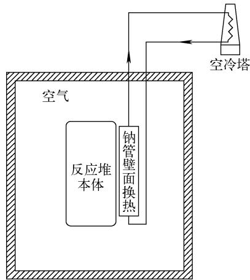  
图6 非能动余热排出系统示意图  
Fig. 6 Schematic diagram of passive residual heat removal system

根据平台电力需求，结合目前技术成熟度，拟考虑采用10台电功率为1MW的斯特林发电模块作为快堆热电转化装置。斯特林电力转换系统构成如图7所示，该系统主要由热气机、液钠系统、淡水系统、工质系统、发电机及监控系统6部分组成[13-14]。液钠系统由反应堆提供热源，将热量传递给热气机内氦气工质，氦气受热膨胀做功，再由淡水系统冷却，完成斯特林循环，带动发电机，向负载输出电能，完成热能向电能的转换。工质系统通过控制氦气工质的压力，用以实现对斯特林循环的控制。

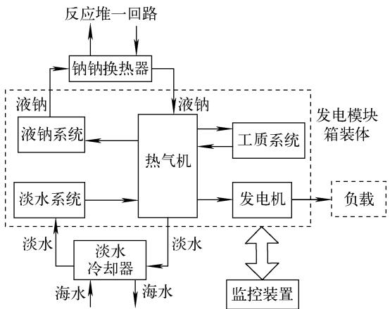  
图7 斯特林电力转换系统构成  
Fig. 7 Composition of Stirling power conversion system

## 3 关键设备方案

### 3.1 堆本体

小型钠冷快堆核电源堆本体采用一体化设计方案，燃料组件、堆芯测量及轴向屏蔽装置、控制棒驱动机构等均集成在反应堆容器内。与传统商业池式钠冷快堆堆本体方案相比，旋塞采用了单顶盖设计，无堆内贮存井，无堆内对外换料系统，无机械钠泵、IHX等堆内支撑结构，堆本体结构大为简化，体积减小。堆本体结构如图8所示，堆本体压力保护容器外径为4m，堆本体总高为7m。

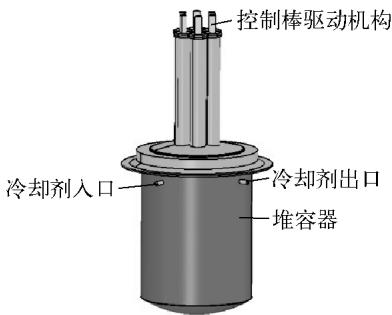  
图8 堆本体示意图  
Fig. 8 Schematic diagram of reactor

### 3.2 中间热交换器

IHX采取立式布置、管壳型。一回路系统的放射性钠在壳程流动，二回路系统的冷却剂钠在管程流动，管侧压力高于壳侧压力，在换热管破裂时，二回路侧钠向一回路侧泄漏，阻止带放射性的一回路钠外逸。

小型钠冷快堆核电源设计4台IHX，采用回路式的一体化IHX设计，将二回路电磁泵集成在IHX中心下降管上部，如图9所示。一体化IHX的参数和尺寸列于表4。

### 3.3 电磁泵

小型钠冷快堆核电源主回路中所用电磁泵主要由内铁芯、感应器、泵沟、电磁绕组、散热器以及相关的仪控电系统等组成。其中，泵沟由内铁芯、泵沟肋、泵沟外壁组成，主要作为流体流通的通道，同时，泵沟内的流体也是感应电流的载体。散热器作为电磁泵的辅助部件，主要用于加快感应线圈散热，防止感应线圈超温。电磁泵示意图如图10所示，主要设计参数列于表5。

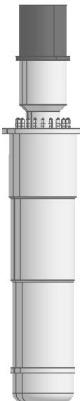  
图 9 一体化 IHX 示意图  
Fig. 9 Schematic diagram of integrated IHX

表4 一体化 IHX的主要参数和尺寸  
Table 4 Main parameter and dimension of integrated IHX
<table><tr><td>参数</td><td>数值</td></tr><tr><td>IHX 台数</td><td>4</td></tr><tr><td>单台功率，MW</td><td>10</td></tr><tr><td>一次侧进/出口温度，℃</td><td>516/353</td></tr><tr><td>二次侧进/出口温度，℃</td><td>310/495</td></tr><tr><td>中心下降管内径，mm</td><td>100</td></tr><tr><td>换热管规格，mm</td><td>φ16×1.2</td></tr><tr><td>换热管根数</td><td>360</td></tr><tr><td>IHX外套筒内径，mm</td><td>450</td></tr><tr><td>换热管长度，m</td><td>2</td></tr></table>

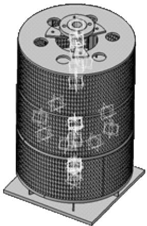  
图10 电磁泵示意图  
Fig. 10 Schematic diagram of electromagnetic pump

表 5 电磁泵主要设计参数  
Table 5 Main design parameter of electromagnetic pump
<table><tr><td>参数</td><td>数值</td></tr><tr><td>介质</td><td>钠</td></tr><tr><td>流量(钠温420℃），m³/h</td><td>452</td></tr><tr><td>扬程，MPa</td><td>0.25</td></tr><tr><td>介质温度，℃</td><td>500</td></tr><tr><td>介质温度为500℃泵沟最大允许压力，MPa</td><td>0.5</td></tr><tr><td>额定压力下唧送介质最高温度，℃</td><td>550</td></tr><tr><td>升温速率，℃/min</td><td>15</td></tr><tr><td>效率，%</td><td>&gt;30</td></tr><tr><td>安全等级(泵沟 ASME)</td><td>二级</td></tr><tr><td>安全等级(感应器 ASME)</td><td>1E级</td></tr><tr><td>抗震等级</td><td>Ⅰ类</td></tr><tr><td>真空要求</td><td>泵沟可在20℃</td></tr><tr><td></td><td>抽真空至 100 Pa</td></tr><tr><td>冷却方式</td><td>空气自然冷却</td></tr></table>

如图12所示，采用8拐曲轴、并列连杆结构，一、二次往复惯性力及力矩均为0，由4组四缸双作用斯特林循环组成。发火次序为(11、21)-(31、41)-(12、22)-(32、42)-(13、23)-(33、43)-(14、24)-(34、44)。初步结构参数列于表7。

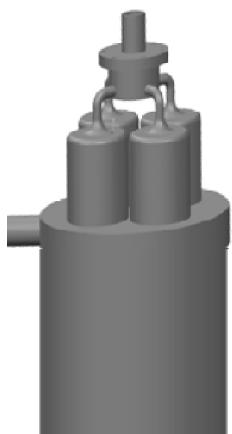  
图11 斯特林热气机示意图  
Fig. 11 Schematic diagram of Stirling heat engine

### 3.4 斯特林热气机

单个斯特林热气机示意图如图11所示，主要设计参数列于表6。

综合权衡动平衡性、扭矩特性、各缸联通管长度及均匀性、总体尺寸、单缸输出功率等因素，大功率热气机总体设计为 ${ \mathrm { V 1 6 - 4 5 } } ^ { \circ }$ 方案，

表6 斯特林热气机主要设计参数  
Table 6 Main design parameter of Stirling heat engine
<table><tr><td>参数</td><td>数值</td></tr><tr><td>斯特林机台数</td><td>10</td></tr><tr><td>单台功率，MW</td><td>1</td></tr><tr><td>钠侧进/出口温度，℃</td><td>530/430</td></tr><tr><td>氦气工质温度，℃</td><td>400</td></tr></table>

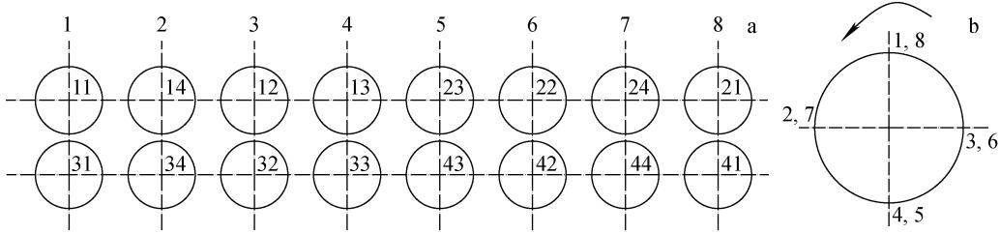  
a 各缸布置；b—一级曲柄图  
图 12 V16-45°方案  
Fig. 12 Scheme of V16-45°

经初步估算，小型钠冷快堆核电源反应堆核岛系统布置在直径为5m、高为8m的空间内，1MW的斯特林发电模块尺寸约为6m×2m×2.8m，热电转换效率约为25%。斯特林发电模块可采用双层布置，每层布置5个斯特林发电模块，总占地面积在 $1 5 ~ \mathrm { m } \times 1 2 \mathrm { ~ m ~ }$ 以内，发电系统可通过模块组装在6m×2m×8m的空间内。

综合以上分析，小型钠冷快堆核电源发电系统可布置在直径为20m、高度为12m的空间内，反应堆堆芯达到10a不换料。

表 7 1 MW 热气机结构参数  
Table 7 Structural parameter of 1 MW heat engine
<table><tr><td>参数</td><td>数值</td><td>参数</td><td>数值</td></tr><tr><td>缸数</td><td>16</td><td>工质</td><td>He(纯度≥99.99%)</td></tr><tr><td>结构特征</td><td>双作用</td><td>工质最高压力，MPa</td><td>20</td></tr><tr><td>气缸布置</td><td>V型 45°</td><td>外形尺寸(长×宽×高)，mm</td><td>3000×1500×2000</td></tr><tr><td>缸径，mm</td><td>160</td><td>干重，t</td><td>约7</td></tr><tr><td>活塞行程，mm</td><td>50</td><td>加热器</td><td>加热管内径为4.0mm，管数为80，加热管长度为500mm</td></tr><tr><td>缸心距，mm</td><td>310</td><td>回热器</td><td>环形结构，内径为165mm，外径为255mm，高度为90mm</td></tr><tr><td>加热管最高温度，℃</td><td>400</td><td>冷却器</td><td>环形结构，冷却管内径为1mm，数量为1750，高度为120mm</td></tr></table>

## 4 结论

本文提出了一种用来解决海上石油钻井平台供电问题的小型钠冷快堆核电源技术方案，并重点对堆芯设计方案、主回路冷却剂系统方案、关键设备方案进行了计算分析。堆芯计算结果表明，本文提出的反应堆堆芯设计方案可达到10a不换料。通过对主冷却系统方案设计、主要设备的计算分析，本文提出的小型钠冷快堆核电源方案热电转换效率可达到25%，整个反应堆发电系统可布置在直径为20m、高度为12m的空间内，完全满足海上钻井平台电力需求及空间要求。

## 参考文献：

[1]中国实验快堆.中国实验快堆最终安全分析报告R.北京：中国原子能科学研究院，2008.

[2] 赵仁恺.中国快堆技术发展[R]. 北京：“八六三”计划能源领域专家委员会，1995.

[3]徐銖.快堆主热传输系统及辅助系统[M]. 北京：中国原子能出版社，2011.

[4]《快堆研究》编辑部.快堆工程设计总论[M]. 北京：中国原子能科学研究院，1986.

[5]苏著亭，叶长源，阎凤文，等.钠冷快堆增殖堆

[M]. 北京：原子能出版社，1991.

[6] 杜铭海. SVBR——俄罗斯模块式铅铋快堆[R].海盐：浙江海盐核电，2007.

[7]赵仁恺，阮可强，石定寰．八六三计划能源技术领域研究工作进展：第1篇：快中子反应堆，1986—2003[M]. 北京：原子能出版社，2001.

[8] IAEA. Innovative small and medium sized reactors: Design features[R]. Vienna: IAEA, 2004.

[9] IAEA. Status of small reactor designs without on-site refuelling, IAEA-TECDOC-1536[R]. Vienna: IAEA, 2007.

[10] Innovative small and medium sized reactors design features, TECDOC-1451[R]. Vienna: IAEA, 2005.

[11] IAEA. Comparative assessment of thermophysical and thermohydraulic characteristics of lead bismuth and sodium coolants for fast reactors, IAEA-TECDOC-1289[R]. Vienna: IAEA, 2002.

[12] IAEA. Fast reactor database-2005[R]. Vienna: IAEA, 2005.

[13]金东寒．斯特林发动机技术[M]. 哈尔滨：哈尔滨工程大学出版社，2009.

[14]钱国柱.热气机[M]. 北京：国防工业出版社，1982.